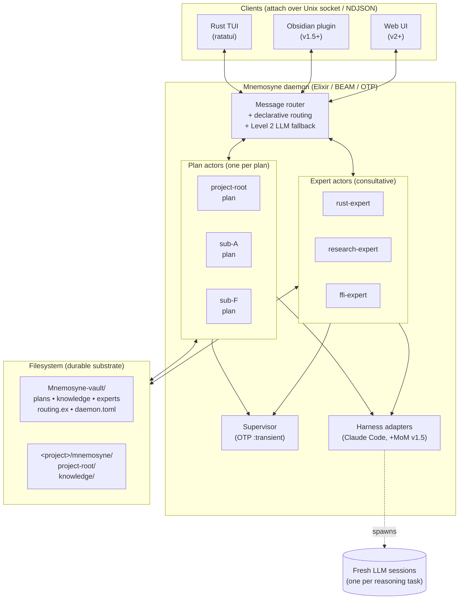
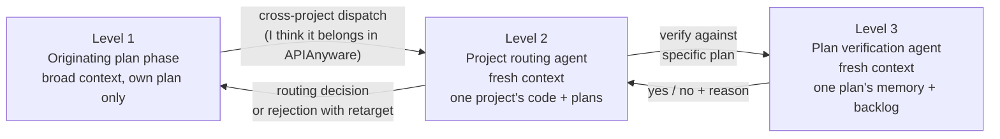

# Mnemosyne

> A persistent actor daemon for AI-assisted development.
> Plans, phases, knowledge, and fresh-context reasoning, unified.

A [Linkuistics](https://github.com/Linkuistics) project.

---

## The problem

AI coding assistants start every session from scratch. Even within a single session they accumulate context until it rots. Knowledge from yesterday vanishes by tomorrow. Cross-project learning is impossible. Long-running development — the kind that actually matters on real projects — drowns in the mismatch between the way developers think (continuous, hierarchical, specialist-consulting) and the way stateless LLM sessions work.

Senior developers are effective because they carry expertise across projects, ask each other questions, bring different perspectives to shared problems, and reflect on what they've learned over years. AI assistants today have none of that. **Mnemosyne gives them the architectural primitives to build it.**

## The vision

Mnemosyne is a persistent orchestration daemon built around three convictions:

### 1. Fresh context is first-class

Every reasoning task runs in a short, focused LLM session with exactly the context it needs — nothing more. Long accumulating sessions aren't a thing to manage; they're architected away. Context rot is a failure mode to eliminate, not tolerate.

The unit of work is one fresh session. Between sessions, state flows through durable files. The orchestrator's job is to make sure every session gets exactly the right starting context and no more.

### 2. Plans and knowledge are actors

Each plan you're working on — a feature, investigation, refactor, experiment — is a long-lived **actor** with its own state, mailbox, and phase cycle. Each domain of knowledge (Rust, distributed systems, FFI, architecture, research) is an **expert actor** you consult like a co-worker.

Actors communicate by message passing. Plans dispatch tasks to each other. Plans query experts. Experts bring different perspectives — the same question to three experts produces three genuinely different answers, because each is reasoning from its own persona and knowledge scope in its own fresh context.

### 3. The unit of orchestration is the actor

One daemon per machine hosts many actors, each backed by filesystem state that survives daemon restarts. Clients — a Rust TUI, an Obsidian plugin, a web UI — attach to actors over a local Unix socket to observe or drive them. Multiple humans and multiple AI harnesses can work simultaneously without conflicting. The daemon handles supervision, fault isolation, routing, and — eventually — distribution to other machines for team-mode work.

## Architecture at a glance



## Two actor types

### PlanActor

A plan represents an ongoing work effort: a feature, investigation, refactor, experimental direction. Each plan is an actor with:

- A **backlog** of tasks and received dispatches from other plans
- A **memory** of distilled architectural decisions and learnings
- A **session log** of phase-cycle history
- A **phase cycle** (work → reflect → compact → triage)
- A **mailbox** for incoming dispatches and queries

Plans **nest**. A project has a single root plan. That root may have sub-plans, which may have sub-sub-plans, at arbitrary depth. The hierarchy lives on the filesystem — a directory is a plan if and only if it contains `plan-state.md`. This lets Mnemosyne host dozens of fine-grained, tightly-scoped plans across many projects without any single plan's context exploding.

```
<project>/mnemosyne/
├── knowledge/                            # Tier 1 per-project
└── project-root/                         # always exactly one root plan
    ├── plan-state.md                     # marker + phase state
    ├── backlog.md
    ├── memory.md
    ├── session-log.md
    └── sub-F-hierarchy/                  # nested child plan
        ├── plan-state.md
        └── ...
```

### ExpertActor

An expert represents a domain of knowledge. Each expert is an actor with:

- A **persona** (how they think and how they respond)
- A **knowledge scope** (which files under `<vault>/knowledge/` they can read)
- A **retrieval strategy** (how they find relevant entries for a question)
- A **mailbox** for incoming queries

When a plan has a question, it asks an expert. The expert spawns a fresh-context session with just the relevant knowledge entries, its persona, and the question. It answers, and the answer flows back to the originating session inline — the originating session **never loads the expert's knowledge into its own context**. Fresh context preserved at both ends.

Expert declarations live at `<vault>/experts/<expert-id>.md` and are user-editable. Default experts ship with Mnemosyne (Rust, research, distributed systems, architecture, FFI, Obsidian); users add their own by dropping in new declaration files.

## Two message types

### Dispatch — "here's a task you should do"

Fire-and-forget delivery from one actor to another's backlog. Used for cross-cutting concerns ("this decision affects sub-A"), cross-project work ("investigate this in APIAnyware-MacOS"), and routing tasks to the right specialist plan.

### Query — "here's a question, please answer"

Request-response, handled in the target actor's fresh context, returned to the originating session via the harness tool-call boundary. Used for consulting experts, asking a sibling plan for status, verifying a design decision against another plan's memory.

Both types support three **target variants**: same-project plan (named directly), cross-project project (routed by a fresh-context Level 2 agent that reads target project code to pick the right specific plan), or expert (consultative).

## Hierarchical reasoning with fresh context

The deepest insight in Mnemosyne's architecture: **reasoning depth should scale with decision specificity, not accumulate**.



Each level has **fresh context** and takes on a **more specific question** than the level above. Level 1 reasons about its own plan with a tiny bit of vault awareness. Level 2 reasons about one target project — including its source code — without polluting Level 1's context. Level 3, if spawned, reasons about one specific plan's internals. At every level, the context budget is refocused rather than accumulated.

**This is the opposite of the "pile more context onto one session" anti-pattern that defeats fresh-context discipline.** Each agent is dedicated to exactly the question it has enough context to answer, nothing more.

## Declarative, user-visible routing

Routing decisions are **user-visible and user-editable**. When a plan dispatches a task, Mnemosyne consults a routing module at `<vault>/routing.ex` — an Elixir module with pattern-matched `route/2` clauses:

```elixir
defmodule Mnemosyne.UserRouting do
  def route(:query, facts) do
    cond do
      "rust" in facts           -> {:target_expert, "rust-expert"}
      "ffi" in facts            -> {:target_expert, "ffi-expert"}
      "callback_registration" in facts and "gc_protect" in facts ->
        {:target_plan, "APIAnyware-MacOS/project-root/sub-ffi-callbacks"}
      true                      -> :no_route
    end
  end
end
```

Concerns are extracted from message bodies by a small, cheap LLM pass (ideal for local models when [mixture-of-models](#whats-shipping-and-when) lands). Rules fire deterministically. BEAM's native hot code reload makes rule edits take effect without a daemon restart.

When rules don't decide, a **Level 2 routing agent** takes over — a fresh-context LLM session scoped to the target project's code and plans, with authority to pick a specific target or reject with reasoning. Level 2 can propose new rules for the user to accept into `routing.ex`, closing a learning loop: novel cases train the deterministic path.

## Vault and filesystem layout

```
<dev-root>/
├── Mnemosyne-vault/                      # dedicated Obsidian-native vault, git-backed
│   ├── mnemosyne.toml                    # vault identity marker
│   ├── daemon.toml                       # daemon config
│   ├── routing.ex                        # user-editable routing rules
│   ├── plan-catalog.md                   # auto-generated vault catalog
│   ├── knowledge/                        # Tier 2 global knowledge
│   ├── experts/                          # expert declarations
│   ├── projects/                         # symlinks into project repos
│   │   ├── Mnemosyne -> .../Mnemosyne/mnemosyne/
│   │   └── APIAnyware-MacOS -> .../APIAnyware-MacOS/mnemosyne/
│   └── runtime/                          # ephemeral state
│       ├── daemon.sock
│       ├── mailboxes/
│       ├── staging/
│       └── ...
└── <project>/
    ├── .git/
    └── mnemosyne/
        ├── knowledge/                    # Tier 1 per-project
        └── project-root/                 # root plan (always)
```

- **Mnemosyne-vault** is a dedicated Obsidian-native vault with its own git history. Hosts cross-project knowledge, expert declarations, routing rules, and runtime state. Accesses per-project content via symlinks so plans live in project repos under sovereign git ownership, but are visible in one place for Obsidian and Dataview.
- **Per-project `mnemosyne/`** contains that project's Tier 1 knowledge and its plan tree. Symlinked from the vault so Obsidian sees it.
- **Filesystem is the durable substrate.** Everything non-transient lives as files. The daemon is an orchestrator over filesystem state, not a state owner. Daemon restart rebuilds everything from files; no data can be lost by a crash.

## Obsidian-native

Every file format decision targets Obsidian-first browsing:

- Markdown with YAML frontmatter everywhere
- Dataview-friendly kebab-case field names
- Wikilinks for cross-references between plans, knowledge entries, and session logs
- Tags as first-class metadata
- A `.obsidian/` template that ships with Mnemosyne (Dataview required, Templater optional)
- Auto-generated `plan-catalog.md` as a "what's in my vault" dashboard

Humans browse, review, edit, and audit everything Mnemosyne writes through a full-featured explorer that Mnemosyne doesn't have to build. This is the accountability substrate that makes post-session auto-ingestion safe: every knowledge entry Mnemosyne creates can be reviewed, edited, or rejected by a human using tools they already know.

## Mixture of experts + mixture of models

Expert actors have narrow scope. A Rust expert answering "does this lifetime annotation compile?" doesn't need the most capable model. A research expert synthesizing across a corpus of papers does. The economic profile becomes:

- **Expensive models** → plan actors for heavy orchestration, cross-project routing, brainstorming
- **Cheap API models or local models** → experts for narrow consultation
- **Local models** → bulk routine queries where latency and privacy matter

For power users with capable local models, most queries stay on-device. API spend concentrates where capability genuinely matters. This is a first-class capability, not a workaround.

(Mixture of models is **v1.5+** — the actor declaration format reserves the `model:` field and the daemon config reserves the `[harnesses]` section, but v1 ships a single adapter.)

## Team mode

Multiple Mnemosyne daemons on different machines communicate via BEAM's native distribution or a custom TCP transport. Actors address each other with qualified IDs prefixed by peer name. Cross-daemon dispatch is a **transport change, not an architectural change** — the message routing, actor model, and semantics are unchanged. Team mode is where "co-workers asking each other questions" becomes literal: different team members' plan actors and expert actors all reachable from a single catalog.

(Team mode is **v2+** — the daemon config reserves the `[peers]` section and qualified IDs reserve the `<peer>@<id>` syntax, but v1 is strictly single-vault-per-machine.)

## What's shipping and when

### V1 — foundation

- Persistent Elixir daemon with OTP supervision
- PlanActor (wraps sub-B's four-phase cycle)
- ExpertActor stub (real implementation from sub-N)
- Dispatch + Query message types, full audit trail
- Plan hierarchy with `project-root` convention and path-based qualified IDs
- Declarative routing (pattern-matched Elixir + hot reload) with Level 2 LLM fallback
- User-editable `routing.ex` with rule suggestion learning loop
- Vault discovery, identity marker, adopt-project command
- Claude Code harness adapter (sub-C)
- Post-session knowledge ingestion pipeline (sub-E)
- Rust TUI client (ratatui) over Unix socket NDJSON protocol
- Obsidian-native vault format with plan catalog
- Observability via `:telemetry` + typed Elixir struct events (sub-M)

### V1.5 — richer experts, more models

- **Sub-N (domain experts)**: full ExpertActor implementation with personas, retrieval strategies, curation integration, default expert set
- **Sub-O (mixture of models)**: multi-adapter harness layer, per-actor model selection, local-model adapters, cost telemetry
- **Sub-K (Obsidian plugin)**: alternative daemon client with first-class Obsidian integration

### V2+ — collaboration and scale

- **Sub-P (team mode)**: multi-daemon transport, peer discovery, cross-daemon auth, shared-vault conflict resolution, distributed experts
- **Joint brainstorm sessions**: multi-actor shared-context reasoning for architectural discussions
- **Gleam migration** (if needed): static typing for invariant preservation, new sub-projects written alongside Elixir core

## Runtime

| Component | Language | Framework |
|---|---|---|
| **Daemon** | Elixir | OTP / GenServer / Supervisor / `:telemetry` |
| **TUI client** | Rust | `ratatui` + `tokio` + `serde_json` |
| **Knowledge format** | — | Markdown + YAML frontmatter (Obsidian-native) |
| **Vault** | — | Git-backed Obsidian vault |
| **Rule engine** | Elixir | pattern-matched `defp` + hot code reload |
| **Harness adapter** | Elixir | `erlexec` for PTY (sub-C, pending BEAM spike) |
| **Integration boundary** | — | Unix socket + NDJSON (protocol frozen early) |

### Why Elixir on BEAM?

The architecture is literally OTP. Actor model, supervision, message passing, hot code reload, distribution transparency — every single one is a BEAM primitive we would otherwise hand-roll. When a design process independently arrives at OTP's design decisions, that's the universe telling you which runtime to use.

Gleam (statically typed BEAM language) is reserved as a migration target if Elixir's dynamic typing proves painful for Mnemosyne's invariant-heavy design discipline. The two interop cleanly on BEAM — new sub-projects could be written in Gleam without disrupting the Elixir daemon core.

### Why Rust for the TUI?

The TUI needs first-class terminal rendering, which Rust's `ratatui` provides in a way no BEAM library currently matches. Running it as a separate binary over a local socket (rather than embedding via Rustler) gives independent deployment, no ABI coupling, and natural multi-client support — the same protocol accepts the Rust TUI, a future Obsidian plugin, a web UI, or a headless scripting client.

## Philosophy

### Fresh context is a first-class architectural goal

Context rot, drift, and noise are primary failure modes for long LLM sessions. Mnemosyne designs for many short fresh sessions with explicit state handoff through files, rather than monolithic accumulating sessions. Every phase boundary, every harness spawn, every expert consultation, every routing agent invocation is a deliberate fresh-context opportunity.

### Integration over reinvention

Scope overlap with mature tools is a reason to adopt, not to reinvent. This applies to Obsidian (explorer UI), OTP (actor model), `ratatui` (terminal rendering), `erlexec` (PTY management), `ascent`/Erlog (declarative rules), `:telemetry` (observability). Every sub-project brainstorm surfaces "what existing tool covers this ground, and why not use it?" — and answers that question in its design doc.

### Files as the durable substrate

Everything non-transient is a file. The daemon is an orchestrator, not a state store. Daemon restart rebuilds from files. Individual actor crashes don't destroy state. Team mode becomes "multiple daemons over the same filesystem, syncing through git." Files-as-substrate is the discipline that makes every other architectural choice compose.

### Hard errors by default

Unexpected conditions, invariant violations, I/O failures, and ambiguous states fail hard with clear diagnostics. Soft fallbacks require explicit written rationale. This is load-bearing for correctness in a system with many moving parts — silent degradation is how accumulated drift destroys reliability.

### Obsidian-native explorer

The human is the final accountability substrate for auto-ingestion, dispatch correctness, routing decisions, and knowledge curation. Mnemosyne cannot validate its own LLM outputs — but a human browsing a well-organized vault with Dataview queries, wikilinks, and file history can review, edit, reject, and audit everything. This is what makes Mnemosyne trustworthy despite running autonomous LLM sessions continuously.

### Human and LLM are co-equal actors

Every workflow must work with a human driver or an LLM driver. Phase cycles support human-mode and LLM-mode execution. Triage, reflection, and curation can all be done by humans when preferred. The TUI is designed for human use as well as LLM observation. The architecture does not privilege LLMs over humans — they are interchangeable drivers of the same underlying state.

## Status

**Currently in architectural design phase.** Nine sub-project brainstorms are substantially complete. Implementation has not started on the daemon; a previous v0.1.0 existed as a Rust CLI but has been subsumed by this pivot to the actor-daemon architecture.

Sub-project design docs are in [`docs/superpowers/specs/`](docs/superpowers/specs/):

| Sub-project | Status | Design doc |
|---|---|---|
| A (global store) | design complete | `2026-04-13-sub-A-global-store-design.md` |
| B (phase cycle) | design complete (pending F amendment) | `2026-04-12-sub-B-phase-cycle-design.md` |
| C (harness adapters) | design complete (pending F amendment + BEAM spike) | `2026-04-13-sub-C-adapters-design.md` |
| E (knowledge ingestion) | design complete (pending F amendment) | `2026-04-12-sub-E-ingestion-design.md` |
| F (hierarchy, actor model, routing) | design complete | `2026-04-14-sub-F-hierarchy-design.md` |
| M (observability) | design complete (pending F amendment) | `2026-04-13-sub-M-observability-design.md` |
| D (concurrency) | design pending (scope collapsed by F) | — |
| G (migration) | design pending | — |
| H (skill fold) | design pending | — |
| I (Obsidian coverage) | design pending | — |
| L (terminal spike) | design pending | — |
| N (domain experts) | **new** — added by F's brainstorm | — |
| O (mixture of models) | **new** — reserved for v1.5+ | — |
| P (team mode) | **new** — reserved for v2+ | — |

The comprehensive architectural overview is in [`docs/architecture.md`](docs/architecture.md). Research sources grounding the design are in [`docs/research-sources.md`](docs/research-sources.md).

## Related projects

Mnemosyne accumulates knowledge from and supports AI-assisted work on all Linkuistics projects:

- **[APIAnyware-MacOS](https://github.com/Linkuistics/APIAnyware-MacOS)** — macOS API surface code generator; FFI-heavy
- **[GUIVisionVMDriver](https://github.com/Linkuistics)** — VM orchestration CLI for GUI testing
- **[Modaliser-Racket](https://github.com/Linkuistics)** — Racket-based modal logic toolkit
- **[RacketPro](https://github.com/Linkuistics)** — Racket IDE enhancements
- **[TestAnyware](https://github.com/Linkuistics/TestAnyware)** — VM management and GUI testing strategies
- **[*Pro IDEs](https://github.com/Linkuistics)** — language-specific IDE enhancements

## License

[Apache-2.0](LICENSE) — Copyright 2026 Linkuistics
