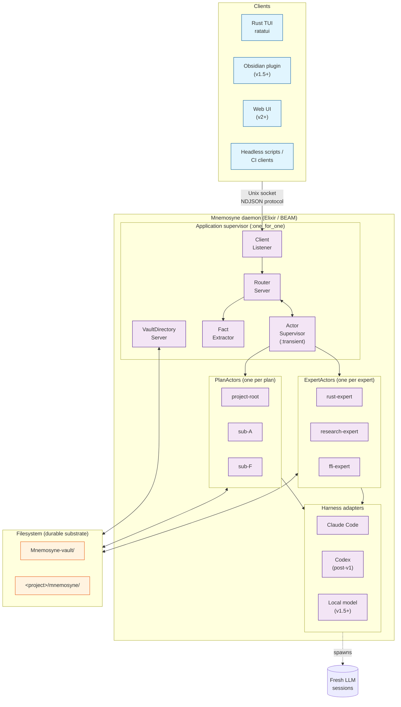
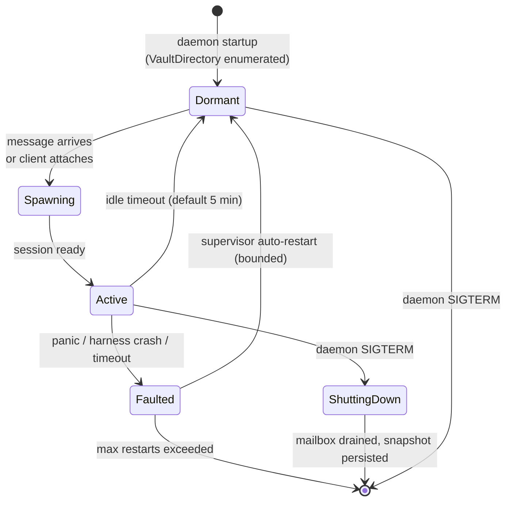
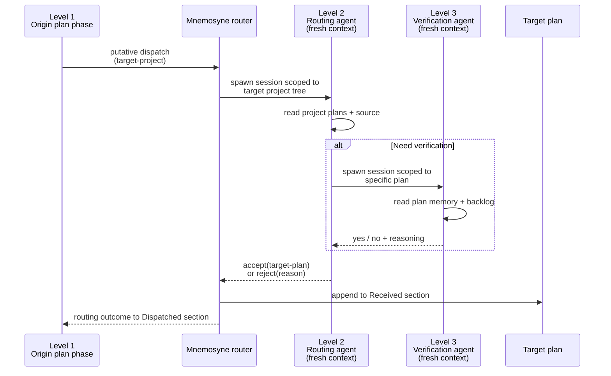
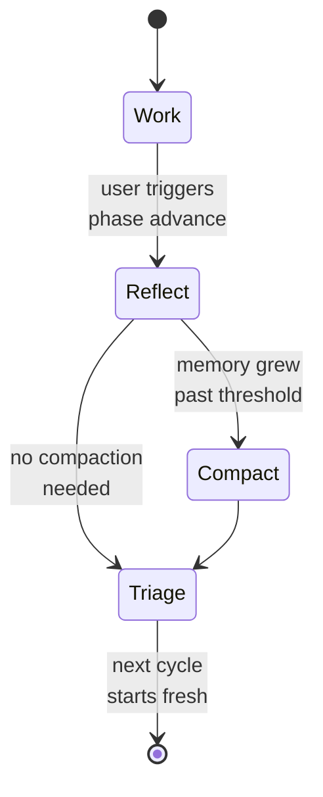
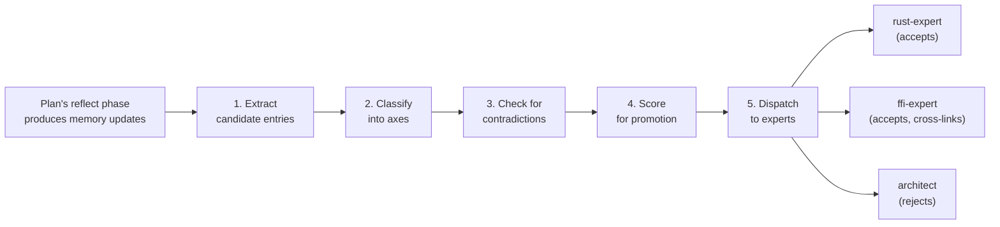

# Mnemosyne Architecture

A comprehensive overview of Mnemosyne's architecture, synthesized from nine sub-project design documents and the April 2026 F-brainstorm that pivoted the project to an actor-daemon model on BEAM.

> This document is the authoritative architectural overview. Individual sub-project design docs in [`superpowers/specs/`](superpowers/specs/) go deeper on each component. The top-level [README](../README.md) is a shorter pitch for sharing.

---

## Table of contents

1. [Principles](#principles)
2. [System shape](#system-shape)
3. [The actor model](#the-actor-model)
4. [Plan hierarchy](#plan-hierarchy)
5. [Messages and routing](#messages-and-routing)
6. [Phase cycle](#phase-cycle)
7. [Knowledge and experts](#knowledge-and-experts)
8. [Ingestion pipeline](#ingestion-pipeline)
9. [Harness adapter layer](#harness-adapter-layer)
10. [Vault and filesystem layout](#vault-and-filesystem-layout)
11. [Client-daemon protocol](#client-daemon-protocol)
12. [Observability](#observability)
13. [Evolution roadmap](#evolution-roadmap)
14. [Glossary](#glossary)

---

## Principles

These are the load-bearing convictions behind every architectural choice. They compound — each one makes the others easier to uphold.

### Fresh context is first-class

Context rot (drift, noise, stale assumptions, accumulated irrelevance) is the primary failure mode of long LLM sessions. Mnemosyne is designed around **many short fresh sessions** rather than one long accumulating session.

Every phase boundary, every expert consultation, every routing decision, every ingestion analysis is a **fresh-context opportunity**. State flows between sessions through durable files, not through context accumulation. The orchestrator's core job is to ensure each session receives exactly the context it needs — nothing more, nothing less.

This is not an optimization. It is the architectural starting point from which every other decision follows.

### Plans and knowledge are actors

The unit of orchestration is the actor. An actor has long-lived state (its mailbox, its phase progress, its current attachment list), but it spawns **fresh-context LLM sessions** whenever it needs to reason. Actors persist across days, weeks, months. Their reasoning does not.

Two actor types live in the daemon:

- **PlanActor** — progressive, phase-driven, goal-oriented. Wraps a plan in a project repo.
- **ExpertActor** — consultative, query-driven, persona-flavored. Wraps a domain of curated knowledge.

This distinction lets knowledge become *something you consult* rather than *something you load into your own context*. The difference is load-bearing for fresh-context discipline.

### Files are the durable substrate

Everything non-transient lives as a file in the filesystem. The daemon is an orchestrator, not a state store. Daemon crash → rebuild state from files. Individual actor crash → rebuild state from files via OTP supervision. Team mode → multiple daemons sharing files via git.

The discipline: **if it survives daemon restart, it's a file**. If it's ephemeral, it's in memory or in `<vault>/runtime/`. Never in between.

### Hierarchy is a fresh-context budget

Deep architectural decisions (where should this task go?) reason about **the whole vault**. Shallow decisions (what should I do next inside my own plan?) reason about **only this plan**. Context depth scales with decision specificity, not with accumulated history.

The cross-project routing mechanism makes this concrete: Level 1 (the originating plan phase) reasons about its own plan with a tiny bit of vault awareness. Level 2 (the project routing agent, spawned fresh) reasons about one target project — including its source code. Level 3 (optional, for verification) reasons about one specific plan. Each level has fresh context and takes on a more specific question than the level above.

### Integration over reinvention

Scope overlap with mature tools is a reason to adopt, not to reinvent.

- **OTP** → actor model, supervision, message passing, distribution
- **Obsidian** → explorer UI, Dataview queries, graph view
- **ratatui** → Rust terminal rendering
- **erlexec** → PTY management for harness adapters
- **`:telemetry`** → observability
- **Markdown + YAML frontmatter** → knowledge format
- **Git** → knowledge versioning and eventual team sync

Every sub-project brainstorm surfaces "what existing tool covers this ground, and why not use it?" and answers it in the design doc. Silent reinvention is not allowed.

### Hard errors by default

Unexpected conditions, invariant violations, I/O failures, and ambiguous states fail hard with actionable diagnostics. Soft fallbacks require explicit written rationale in the design doc of whichever sub-project ships them. Documented exceptions are OK; silent degradation is not.

### Human and LLM are co-equal actors

Every workflow must work with either a human or an LLM as the driver. Phase cycles support both modes. Triage, reflection, curation — all can be done by humans when preferred. The TUI is designed for human use as well as LLM observation. The architecture does not privilege LLMs over humans; they are interchangeable drivers of the same underlying state.

### Obsidian-native explorer is the accountability substrate

The human is the final accountability substrate for auto-ingestion, dispatch correctness, routing decisions, and knowledge curation. Mnemosyne cannot validate its own LLM outputs — but a human browsing a well-organized vault with Dataview queries, wikilinks, and file history can review, edit, reject, and audit everything. Obsidian delivers this experience out of the box. Mnemosyne's file-format decisions are chosen to make Obsidian maximally useful.

---

## System shape



**Three physical layers**:

1. **Clients** — external processes that connect to the daemon. Rust TUI (v1), Obsidian plugin (v1.5+), future web UI, headless scripts.
2. **Daemon** — a single long-running Elixir application hosting all actors, message routing, supervision, harness adapters, and fact extraction.
3. **Filesystem** — the durable substrate. Vault git repo + project git repos.

**Integration boundaries**:

- Clients ↔ daemon: Unix socket + NDJSON protocol at `<vault>/runtime/daemon.sock`
- Daemon ↔ LLMs: harness adapters using `erlexec` / PTY for Claude Code and similar
- Daemon ↔ filesystem: direct file I/O, atomic writes, hard-error-on-corruption

---

## The actor model

Mnemosyne's actor model is pragmatic OTP: one `GenServer` per active actor, supervised by a `DynamicSupervisor`, with mailboxes backed by NDJSON files for crash recovery.

### Actor trait

```elixir
defmodule Mnemosyne.Actor do
  @type message ::
    {:dispatch, DispatchMessage.t()} |
    {:query, QueryMessage.t()}

  @type response ::
    :ack |
    {:answer, QueryAnswer.t()} |
    {:rejected, RejectionReason.t()}

  @callback actor_id(state :: term()) :: ActorId.t()
  @callback actor_type(state :: term()) :: :plan | :expert
  @callback handle_actor_message(msg :: message(), state :: term()) ::
    {:reply, response(), new_state :: term()} |
    {:noreply, new_state :: term()}
  @callback snapshot(state :: term()) :: ActorSnapshot.t()
  @callback restore(snapshot :: ActorSnapshot.t()) :: {:ok, state :: term()}
end
```

Two sealed implementations: `Mnemosyne.PlanActor` and `Mnemosyne.ExpertActor`. The set is closed for v1 — adding a third type is a code change, not a plugin mechanism. Extensibility to a third type is a v3+ conversation.

### Lifecycle



- **Dormant**: no Erlang process, no memory overhead beyond the child spec in the supervisor. Messages queued to disk.
- **Spawning**: supervisor starting the GenServer. Transient.
- **Active**: GenServer processing messages, attached clients seeing events.
- **Faulted**: crashed; supervisor applying its restart strategy.
- **ShuttingDown**: daemon-level shutdown in progress. Actor drains mailbox, snapshots, exits.

### Supervision

Standard OTP supervision, no custom supervisor logic:

```
Mnemosyne.Application
└── Mnemosyne.Supervisor (:one_for_one)
    ├── Mnemosyne.VaultDirectory.Server       (gen_server)
    ├── Mnemosyne.Router.Server               (gen_server)
    ├── Mnemosyne.ClientListener              (task)
    ├── Mnemosyne.ClientConnection.Supervisor (dynamic_supervisor)
    ├── Mnemosyne.ActorSupervisor             (dynamic_supervisor, :transient)
    └── Mnemosyne.FactExtractor.Server        (gen_server)
```

- `:one_for_one` at the top level — independent restart of singletons.
- `:transient` for actors — panic 3 times in 60 seconds → stopped permanently (user intervention required).
- Dynamic supervisors allow actors to come and go as plans are created and deleted.

### Mailbox persistence

Each actor has a mailbox file at `<vault>/runtime/mailboxes/<qualified-id>.jsonl` (NDJSON format, one message per line) and a cursor file `<qualified-id>.cursor` holding the index of the last successfully processed message.

**Write-before-deliver protocol**:

1. Router receives a message.
2. Appends NDJSON line to the mailbox file and `fsync`s.
3. Only after fsync success, sends `GenServer.cast` to the actor.
4. Actor processes, updates its in-memory state.
5. Actor updates the cursor file.

Crash anywhere in this flow is recoverable — replay from cursor+1 on next startup reprocesses any in-flight message.

**Compaction**: when the cursor lags far behind the file end (default threshold 1000 entries), the daemon rewrites the file keeping only entries after the cursor and resets it. Atomic rename for safety.

---

## Plan hierarchy

A **plan** is a directory containing `plan-state.md`. That marker file is the *only* thing that makes a directory a plan.

### Layout

```
<project>/mnemosyne/
├── knowledge/                    # Tier 1 per-project knowledge (not a plan)
└── project-root/                 # always exactly one; reserved name
    ├── plan-state.md             # required marker with phase state
    ├── backlog.md                # tasks + Dispatched / Received sections
    ├── memory.md                 # distilled architectural decisions
    ├── session-log.md            # phase-cycle history
    ├── dispatches.yaml           # transient; cleared after processing
    ├── queries.yaml              # transient; cleared after processing
    └── sub-F-hierarchy/          # nested child plan
        ├── plan-state.md
        ├── backlog.md
        ├── memory.md
        └── sub-F-dispatch/       # arbitrarily deep nesting
            └── plan-state.md
```

### Qualified IDs

A plan's **qualified ID** is a pure function of its filesystem path:

```
qualified_id = strip_prefix(plan_path, "<vault>/projects/")
```

Examples:

- `Mnemosyne/project-root`
- `Mnemosyne/project-root/sub-F-hierarchy`
- `APIAnyware-MacOS/project-root/sub-ffi-callbacks/sub-ffi-gc-protect`

**Never stored in frontmatter** — storing it would be a duplicate source of truth that could drift. The filesystem is authoritative; qualified IDs are computed at read time.

### Invariants

Every invariant below is checked by `verify_vault` on every daemon startup and every `mnemosyne rescan`:

| # | Invariant |
|---|---|
| 1 | A directory is a plan iff it contains `plan-state.md`. |
| 2 | `StagingDirectory::render` refuses descent into subdirectories containing `plan-state.md`. |
| 3 | Every adopted project has exactly one `project-root/` directory as a direct child of `<project>/mnemosyne/`. |
| 4 | No plan directory at any depth is named `project-root` except the single reserved root. |
| 5 | Every plan has exactly one host project. |
| 6 | `<project>/mnemosyne/knowledge/` is never a plan and never contains `plan-state.md`. |
| 7 | Every plan has a non-empty, non-placeholder `description:` ≤120 characters. |
| 8 | `project-root` appears only at the single reserved location (no nested roots). |

Any violation is a hard error with an actionable diagnostic naming the offending plan by qualified ID.

### Description discipline

Every plan's `description:` frontmatter field is capped at 120 characters, enforced at load time. The short cap is load-bearing: it forces LLM-skimmable rhythm in the vault catalog and prevents drift into verbose framings. Style guide: noun-phrase-led, keyword-dense, no self-reference, no placeholders.

Descriptions are the plan's **permanent scope**, not its current state. They change only when the plan's domain genuinely widens or narrows — not every reflect cycle. Writing an adequate description is a brainstorm exit criterion.

---

## Messages and routing

Two message types. Three target variants. Declarative routing with LLM fallback and a learning loop.

### Two message types

| | **Dispatch** | **Query** |
|---|---|---|
| **Semantics** | Fire-and-forget task | Request-response question |
| **Durable form** | `<origin>/dispatches.yaml` | `<origin>/queries.yaml` |
| **Lands at** | Target's `backlog.md` Received section | Target's fresh-context session |
| **Response** | None (Ack only) | Answer routes back to origin session |
| **Common use** | PlanActor → PlanActor | PlanActor → ExpertActor |

### Three target variants

Mutually exclusive. Validated at parse time.

| Variant | When | Constraint |
|---|---|---|
| `target-plan: <qualified-id>` | Same-project targeting — origin knows the specific plan | Must be in origin's project |
| `target-project: <name>` | Cross-project targeting — origin names the project only | Must differ from origin's project; Level 2 routing agent picks the plan |
| `target-expert: <expert-id>` | Consulting an expert (almost always a Query) | Resolves to a local ExpertActor |

Optional `suggested-target-plan:` accompanies `target-project:` entries as a hint the routing agent may override.

### Same-project dispatch

The origin knows enough about its own project to name a specific target plan. Mnemosyne writes to that target's `Received` section directly — no Level 2 agent, no LLM in the loop. The decision was made during the origin's phase.

```yaml
dispatches:
  - target-plan: Mnemosyne/project-root/sub-A-global-store
    reason: Lock directory pinning question belongs to sub-A's scope.
    body: |
      The D concurrency brainstorm needs to know whether the lock
      directory is at vault-runtime or per-project scope.
```

### Cross-project routed dispatch

The origin cannot reason well about a foreign project's internals. It names only the target project; a fresh-context Level 2 routing agent handles the plan-level decision:

```yaml
dispatches:
  - target-project: APIAnyware-MacOS
    suggested-target-plan: APIAnyware-MacOS/project-root/sub-ffi-callbacks
    reason: Catalog description matches this concern exactly.
    body: |
      Investigate whether gc-protect wrappers need to be applied to
      all callback registration sites in the FFI layer.
```

The Level 2 agent receives a fresh session with **read access to the target project's filesystem subtree** (source code, plan descriptions, memories). It makes a routing decision or rejects with reasoning. The response flows back to the origin's `Dispatched` section.

### Hierarchical reasoning



Each level has a more specific context budget. Level 1's broad vault awareness suffices for "I think this belongs in project X." Level 2's project-scoped context suffices for "within project X, this belongs in plan Y." Level 3, if spawned, narrowly verifies "does plan Y's memory confirm this?" Context depth matches decision specificity at every step.

### Declarative routing

The daemon consults `<vault>/routing.ex`, a user-editable Elixir module with pattern-matched `route/2` clauses, **before** spawning a Level 2 agent. If rules fire unambiguously, the dispatch routes deterministically — no LLM in the loop.

```elixir
defmodule Mnemosyne.UserRouting do
  def route(:query, facts) do
    cond do
      "rust" in facts or "cargo" in facts ->
        {:target_expert, "rust-expert"}

      "ffi" in facts and "callback_registration" in facts ->
        {:target_project, "APIAnyware-MacOS"}

      "obsidian" in facts ->
        {:target_expert, "obsidian-expert"}

      true ->
        :no_route
    end
  end

  def route(:dispatch, facts) do
    cond do
      "migration" in facts ->
        {:target_plan, "Mnemosyne/project-root/sub-G-migration"}

      "ffi" in facts ->
        {:target_project, "APIAnyware-MacOS"}

      true ->
        :no_route
    end
  end
end
```

**Facts** are extracted from message bodies by a small cheap LLM pass — currently Claude Haiku via the Claude Code adapter, eventually a local model (sub-O). Users can override in `daemon.toml`:

```toml
[fact_extraction]
harness = "claude-code"
model = "claude-haiku-4-5"
max_topics = 5
timeout_ms = 5000
```

**Hot reload**: BEAM's native code reload means edits to `routing.ex` take effect without daemon restart. Users watch their rules, tweak them, see the effect immediately.

**Learning loop**: when rules don't fire (or fire ambiguously), the Level 2 agent handles the case AND its response may include a `suggested-rule:` field proposing a new `route/2` clause. Mnemosyne captures the suggestion in the TUI as "Rule suggestion pending review." The user accepts → the rule is appended to `routing.ex` and committed to vault git. Novel cases train the deterministic path over time.

---

## Phase cycle

Phase cycle is owned by **sub-B**, embedded inside each PlanActor per **sub-F**'s actor-hosted framing.

### Four phases



- **Work** — the plan actually does stuff. Code, design, investigation, implementation. Long-running LLM session, streaming output, tool calls.
- **Reflect** — lossy distillation of work-phase output into `memory.md` updates. Can prune. Can restructure. Can identify cross-plan concerns and write dispatches.
- **Compact** — strictly lossless rewriting of `memory.md` to remove redundancy and accumulation. Triggered only when `memory.md` exceeds a word-count threshold against its baseline. Cannot drop information.
- **Triage** — plan a little ahead. Update backlog priorities. Identify the next work phase's starting point. Process any incoming Dispatched items from other plans.

### Phase cycle inside PlanActor

Sub-B's `PhaseRunner` runs inside a PlanActor. Phase transitions are driven by messages (`{:run_phase, :work}`) from attached clients. Between phases, the actor is Dormant unless a message arrives. Phase-exit hooks are where sub-F's `DispatchProcessor` and `QueryProcessor` run, parsing any `dispatches.yaml` / `queries.yaml` the phase produced and routing their contents.

### Staging directory

Each phase renders a **staging directory** at `<vault>/runtime/staging/<qualified-id>/<phase>-<ts>/` containing:

- The plan's files (`backlog.md`, `memory.md`, `session-log.md`, `plan-state.md`) with `{{PROJECT}}` / `{{PLAN}}` / `{{VAULT_CATALOG}}` placeholders substituted
- Vendored embedded prompts from `prompts/phases/` materialized into `<staging>/prompts/`
- Phase-specific prompt overrides if the plan defines them (`prompt-reflect.md`, `prompt-triage.md`, `prompt-compact.md`)

The LLM session reads and writes the staging directory. On clean phase exit, `StagingDirectory::copy_back` propagates changes back to the plan directory. On interrupt, the staging directory is preserved under `<vault>/runtime/interrupted/` for forensic review.

### Descent invariant

`StagingDirectory::render` recursively walks the plan directory to build the staging tree, **but refuses to descend into subdirectories containing their own `plan-state.md`**. This enforces "one plan per rendered staging" even in deeply nested plan hierarchies. Child plans are visible as their own actors; their file contents are not accessible to their parent's phase.

---

## Knowledge and experts

Knowledge in Mnemosyne is **consultative**, not loaded. The two-tier structure (per-project Tier 1 and global Tier 2) persists, but every read happens through an ExpertActor that runs in its own fresh context.

### Two tiers

- **Tier 1** — per-project knowledge at `<project>/mnemosyne/knowledge/`. Observations specific to one codebase: patterns discovered, decisions made, techniques that worked.
- **Tier 2** — cross-project knowledge at `<vault>/knowledge/`, organized along five axes: `languages/`, `domains/`, `tools/`, `techniques/`, `projects/`. Promoted from Tier 1 when an insight proves useful across projects.

### ExpertActor

An expert represents a **curated domain** of knowledge. Each expert has:

- **persona** — a text describing how the expert thinks and responds (e.g., "You are a Rust expert with systems programming experience. Prefer practical answers grounded in actual documentation. Push back on questionable abstractions.")
- **knowledge scope** — a list of filesystem subsets under `<vault>/knowledge/` the expert can read
- **retrieval strategy** — how the expert finds relevant entries for a given question (keyword in v1, semantic in v1.5+)
- **mailbox** — the actor's incoming queue

Expert declarations live at `<vault>/experts/<expert-id>.md` as markdown with YAML frontmatter:

```markdown
---
actor-type: expert
expert-id: rust-expert
description: Memory model, async runtimes, FFI, systems-programming idioms.
persona: |
  You are a Rust expert with deep systems-programming experience.
  Prefer practical answers grounded in actual standard-library or
  crate documentation. Push back on questionable abstractions.
  Cite specific crates or RFCs when claims are load-bearing.
knowledge-scope:
  - knowledge/languages/rust/
  - knowledge/techniques/memory-management/
  - knowledge/techniques/async-patterns/
retrieval:
  strategy: keyword
  max-entries: 10
---

# Rust Expert

Human-readable notes on when to consult this expert.
```

### Query flow

When a plan has a question, it sends a Query to an expert. The expert:

1. Runs its retrieval strategy against its knowledge scope, pulling the top N relevant entries.
2. Spawns a fresh-context LLM session with: persona text + retrieved entries + the question. **No other context.**
3. Lets the session reason and return an answer.
4. Routes the answer back through the daemon to the originating session via the harness tool-call boundary.

The originating session **never loads the expert's knowledge into its own context**. It asks a question and gets back prose. Fresh context preserved at both ends.

### Default experts (sub-N)

Mnemosyne ships a starter set:

- `rust-expert` — Rust systems programming
- `research-expert` — Cognitive science + LLM memory research (Mnemosyne's grounding)
- `distributed-systems-expert` — CAP, consensus, durability, concurrency patterns
- `software-architect` — Component boundaries, dependency flow, evolution over time
- `obsidian-expert` — Vault conventions, Dataview query patterns, plugin ecosystem
- `ffi-expert` — Cross-language boundaries, lifetime management, callback safety

Users add their own by dropping new declaration files into `<vault>/experts/`. `mnemosyne rescan` picks them up; the daemon bootstraps the corresponding actors on next startup.

**Expert internals are sub-N's scope.** F defines the actor interface and reserves the declaration file location; sub-N designs personas, retrieval strategies, curation workflows, and the default set.

---

## Ingestion pipeline

Knowledge ingestion (sub-E) turns plan outputs into promoted knowledge entries. Every reflect phase potentially produces candidate knowledge entries; sub-E processes them in a five-stage pipeline triggered by the phase exit hook.



### Stage 5: dispatch-to-experts (the F-amendment)

Before the F brainstorm, Stage 5 was a direct write to the knowledge store. After F, Stage 5 **dispatches candidate entries as Queries to the relevant experts**, and each expert decides whether to absorb the entry, reject it, or cross-link it into its domain.

This has several properties:

- **Expert-curated knowledge**: each domain's entries are reviewed by that domain's actor before being added.
- **Multi-expert absorption**: a single entry can land in multiple experts' scopes (cross-language patterns, for example), with cross-references.
- **Conflict surfaces**: if two experts disagree on framing, the disagreement goes to the ingestion event log for human review during curation.
- **Fresh context at each curation decision**: each expert reasons about each entry in its own fresh session, not in an accumulated ingestion session.

The pipeline's other stages (extract, classify, contradict, score) are unchanged.

---

## Harness adapter layer

Sub-C's harness adapter layer is Mnemosyne's boundary with the outside world of LLM harnesses (Claude Code, Codex, local models). Each adapter encapsulates spawn, PTY lifecycle, stream-json protocol, sentinel detection, and process-group termination.

### V1 ships one adapter

Only the Claude Code adapter ships in v1. Codex and other adapters are post-v1. Local-model adapters come with sub-O (mixture of models).

### BEAM PTY story

The F brainstorm's pivot to BEAM introduces one real ecosystem unknown: **can `erlexec` cleanly spawn Claude Code with PTY I/O and process-group management?** This is Q1 in sub-F's open questions and the subject of a dedicated BEAM spike task on the orchestrator backlog.

If `erlexec` works, sub-C's amendment is straightforward. If it doesn't, the fallback is a small Rust PTY-wrapper binary that the Elixir daemon invokes as an Erlang Port, communicating over a line protocol. Either way, the harness adapter abstraction is preserved — only its implementation differs.

### Internal reasoning sessions

C's adapter serves two kinds of sessions:

- **Plan sessions** — long-running LLM sessions attached to a plan's phase cycle. Visible to users via the TUI.
- **Internal sessions** — short-lived, fresh-context sessions spawned by Mnemosyne itself for internal reasoning: fact extraction, Level 2 routing, expert consultations, ingestion analysis.

Both use the same adapter. Internal sessions have configurable tool profiles at spawn time (read-only vs read-write, restricted filesystem scope, etc.) so they can be sandboxed.

### Instrumentation

Every adapter emits a `SpawnLatencyReport` via sub-M's observability framework on every spawn. This is always-on instrumentation — no debug flag, no env var. Spawn latency is the primary C1 dogfood envelope metric; it must be observable at all times.

---

## Vault and filesystem layout

### Mnemosyne-vault

```
<dev-root>/Mnemosyne-vault/
├── .git/                                 # vault git history
├── .obsidian/                            # shipped template
├── mnemosyne.toml                        # vault identity marker (schema version + overrides)
├── daemon.toml                           # daemon config
├── routing.ex                            # user-editable routing rules
├── plan-catalog.md                       # auto-generated catalog of plans and experts
├── knowledge/                            # Tier 2 global knowledge
│   ├── languages/
│   ├── domains/
│   ├── tools/
│   ├── techniques/
│   └── projects/
├── experts/                              # expert declarations (sub-N)
│   ├── rust-expert.md
│   ├── research-expert.md
│   └── ...
├── projects/                             # symlinks into project repos
│   ├── Mnemosyne -> .../Mnemosyne/mnemosyne/
│   └── APIAnyware-MacOS -> .../APIAnyware-MacOS/mnemosyne/
└── runtime/                              # ephemeral, gitignored
    ├── daemon.sock                       # client attach point
    ├── daemon.lock                       # singleton daemon lock
    ├── mailboxes/                        # actor NDJSON mailboxes
    ├── staging/                          # phase staging directories
    ├── interrupted/                      # phase forensics after interrupt
    ├── ingestion-events/                 # sub-E event log
    └── snapshots/                        # actor state snapshots
```

### Per-project

```
<project>/
├── .git/                                 # project-owned git history
└── mnemosyne/                            # Mnemosyne's per-project footprint
    ├── knowledge/                        # Tier 1 per-project knowledge
    └── project-root/                     # always exactly one; F-reserved name
        ├── plan-state.md
        ├── backlog.md
        ├── memory.md
        ├── session-log.md
        └── <nested-plans>/               # arbitrary depth
```

### Git boundaries

Two git repos are touched by Mnemosyne:

- **Mnemosyne-vault** — vault-owned. Mnemosyne writes freely: knowledge/, experts/, routing.ex, plan-catalog.md, daemon.toml, mnemosyne.toml. Runtime state is gitignored.
- **`<project>`** — project-owned. Mnemosyne only writes inside `<project>/mnemosyne/` (the plans tree + Tier 1 knowledge). Never touches `<project>/.git` or source code outside the mnemosyne/ directory.

Vault symlinks point at `<project>/mnemosyne/` from `<vault>/projects/<name>`. Symlinks themselves are gitignored (per-machine absolute paths); a vault clone rebuilds them on first startup via `mnemosyne rescan`.

### Bootstrap

First run of `mnemosyne daemon` against a non-existent vault triggers bootstrap:

1. Create `<vault>/` directory tree.
2. Write `mnemosyne.toml` with current schema version.
3. Write `.obsidian/` template (required plugins list, default graph settings).
4. Write empty `daemon.toml` with commented examples.
5. Write empty `routing.ex` with a single `:no_route` fallback clause.
6. Create empty `knowledge/`, `experts/`, `projects/`, `runtime/` subdirectories.
7. Prompt the user to adopt their first project via `mnemosyne adopt-project <path>`.

Subsequent runs verify the vault via `verify_vault` — hard-error on schema mismatch, broken symlinks, or invariant violations.

---

## Client-daemon protocol

Local Unix socket at `<vault>/runtime/daemon.sock`. Stream-oriented NDJSON: one JSON object per line, UTF-8.

### Command set

Deliberately minimal for v1. All commands carry a `request_id` for correlation. Unknown fields are ignored by both ends (forward compatibility). Extension fields use the `x-` prefix.

**Client → Daemon**:

| Command | Purpose |
|---|---|
| `attach` | Start observing an actor (events stream back to this client) |
| `detach` | Stop observing an actor |
| `send` | Deliver a Dispatch or Query to an actor |
| `list` | List actors matching a filter |
| `status` | Get current state of an actor or the daemon |
| `run_phase` | Trigger a phase run on an attached PlanActor |
| `rescan` | Force a vault rescan and catalog rebuild |
| `shutdown` | Request graceful daemon shutdown |

**Daemon → Client**:

| Message type | When |
|---|---|
| `attached` | Confirmation of a successful attach |
| `detached` | Confirmation of a successful detach |
| `response` | Correlated response to a client command |
| `event` | Async event (phase transition, rule fired, actor state change, etc.) |
| `message` | Inbound message for an attached actor (client sees what the actor sees) |
| `error` | Protocol or semantic error |

### Multi-client semantics

Multiple clients can attach to different actors concurrently. Multiple clients can attach to the **same** actor concurrently (e.g., Rust TUI + Obsidian plugin both showing live view of sub-F). Events broadcast to all attached clients via the daemon's router.

### Forward compatibility

- Unknown fields are silently ignored.
- Unknown commands return `{"type": "error", "code": "unknown_command", ...}`.
- Unknown event types pass through to clients; clients may ignore.
- Wire format version negotiation via an initial `hello` exchange is reserved for v2.
- Non-prefixed new fields are reserved for future versioned protocol extensions; user-space extensions use `x-` prefix.

---

## Observability

Sub-M's hybrid `:telemetry` + typed struct event architecture.

### Two complementary mechanisms

1. **`:telemetry`** — handles async transport, span propagation, third-party integration. Open-schema events emitted at fine granularity throughout the daemon. Used by metrics exporters, tracing backends, and log aggregators.

2. **Typed Elixir struct events** — exhaustive sealed set of `Mnemosyne.Event.*` structs. Emitted at semantic boundaries (phase transitions, dispatches processed, routing decisions, actor state changes, ingestion events). Exhaustive-match safety for CLI display, Obsidian ingestion, and TUI event rendering.

The typed events are the **boundary** between the daemon and its consumers (TUI, Obsidian, potential future Web UI). The `:telemetry` stream is the **transport** underneath.

### Event surfaces

- `Mnemosyne.Event.PhaseTransition` — an actor moved from one phase to another
- `Mnemosyne.Event.MessageRouted` — a message was routed to a target
- `Mnemosyne.Event.RuleFired` — a declarative rule matched and routed
- `Mnemosyne.Event.RuleSuggestion` — Level 2 proposed a new rule
- `Mnemosyne.Event.ActorStateChange` — Dormant/Spawning/Active/Faulted transition
- `Mnemosyne.Event.HarnessOutput` — streaming output from a session
- `Mnemosyne.Event.DispatchProcessed` — a dispatch was routed and written
- `Mnemosyne.Event.QueryAnswered` — a query returned
- `Mnemosyne.Event.Ingestion.*` — sub-E pipeline events
- `Mnemosyne.Event.SpawnLatencyReport` — always-on C adapter metrics

All events are immutable structs; consumers pattern-match on them. The set is closed — adding an event is a code change.

### Metrics

Standard `:telemetry.execute/3` calls with `metrics-exporter-prometheus` (via the existing `prom_ex` library) for Prometheus-compatible metrics export. V1 dashboards are ad-hoc Grafana or direct Prometheus queries; v2+ may ship a curated dashboard template.

### Debug and production parity

The same instrumentation runs in dev and production. No conditional compilation, no debug flags. If it's measurable, it's measured.

---

## Evolution roadmap

### V1 — foundation

- Persistent Elixir daemon (F + B + C + E + M scopes)
- PlanActor with four-phase cycle
- ExpertActor stub (real implementation from sub-N)
- Dispatch + Query message types
- Plan hierarchy with `project-root`
- Declarative routing with Level 2 fallback + learning loop
- Vault discovery, identity marker, adopt-project (sub-A)
- Claude Code harness adapter (sub-C, pending BEAM spike)
- Post-session knowledge ingestion (sub-E)
- Rust TUI client (ratatui, over Unix socket)
- Obsidian-native vault format
- `:telemetry` + typed Elixir struct events (sub-M)

### V1.5 — richer experts, more models

- **Sub-N (domain experts)**: full ExpertActor implementation, persona handling, retrieval strategies, curation integration, default expert set
- **Sub-O (mixture of models)**: multi-adapter harness layer, per-actor model selection, local-model adapters, cost telemetry
- **Sub-K (Obsidian plugin)**: alternative daemon client via NDJSON protocol
- **Semantic retrieval** for expert knowledge scopes (embedding-based)
- **Horizon-scanning `explore` mode** with web search integration

### V2+ — collaboration and scale

- **Sub-P (team mode)**: multi-daemon transport via BEAM distribution or TCP, peer discovery, cross-daemon auth, shared-vault conflict resolution
- **Joint brainstorm sessions**: multi-actor shared-context reasoning
- **Per-actor permissions** (schema reserved in v1)
- **Evaluation Phase 3/4**: multi-session simulation, controlled impact experiments
- **Gleam migration** (optional): static typing for invariant-heavy sub-projects

---

## Glossary

- **Actor** — a long-lived unit of orchestration with its own state, mailbox, and message handler. Implements `Mnemosyne.Actor` behavior.
- **PlanActor** — an actor that progresses through phases of work toward a goal. Backed by a plan directory containing `plan-state.md`.
- **ExpertActor** — an actor that consults on a domain using curated knowledge and a persona. Backed by a declaration file at `<vault>/experts/<id>.md`.
- **Qualified ID** — a path-derived stable identifier of the form `<project>/project-root/<nested-path>` for plans or `expert:<id>` for experts.
- **Dispatch** — a fire-and-forget task delivery from one actor to another, recorded durably in both sides' backlog sections.
- **Query** — a request-response question from one actor to another, handled in the target's fresh context, returned to the originating session inline.
- **Mailbox** — an actor's durable message queue, persisted as NDJSON at `<vault>/runtime/mailboxes/<qualified-id>.jsonl`.
- **Vault catalog** — the auto-generated listing of every plan and expert in the vault, substituted into phase prompts as `{{VAULT_CATALOG}}`.
- **Level 2 routing agent** — a fresh-context LLM session spawned when declarative rules don't decide a cross-project dispatch. Reads target project code and plans.
- **Daemon** — the persistent BEAM process hosting all actors and routing messages. One per vault per machine.
- **Client** — an external process attached to the daemon over the Unix socket protocol.
- **Routing module** — the user-editable Elixir module at `<vault>/routing.ex` containing pattern-matched dispatch rules.
- **Facts** — concern keywords extracted from a message body by the fact-extraction LLM pass, passed as input to routing rules.
- **Tier 1 knowledge** — per-project knowledge at `<project>/mnemosyne/knowledge/`.
- **Tier 2 knowledge** — cross-project knowledge at `<vault>/knowledge/`.
- **Staging directory** — the pre-rendered plan file tree at `<vault>/runtime/staging/<qualified-id>/<phase>-<ts>/` used by a phase's LLM session.
- **Fresh context** — an LLM session that starts empty and receives only task-specific input. The opposite of accumulated context.

---

## Further reading

- **Sub-project design docs** — [`superpowers/specs/`](superpowers/specs/) contains the full design document for each sub-project (A, B, C, E, F, M complete).
- **Research sources** — [`research-sources.md`](research-sources.md) documents the cognitive science underpinning the fresh-context and memory-evolution decisions.
- **Knowledge format** — [`knowledge-format.md`](knowledge-format.md) specifies the Markdown + YAML frontmatter conventions for knowledge entries.
- **Evolution guide** — [`evolution-guide.md`](evolution-guide.md) explains the philosophy and mechanics of knowledge evolution (contradiction, supersession, confidence).
- **Configuration** — [`configuration.md`](configuration.md) documents `daemon.toml`, `mnemosyne.toml`, and related config files.
- **User guide** — [`user-guide.md`](user-guide.md) walks through daily workflow with the daemon + TUI.

---

*This document is regenerated as architectural decisions evolve. Last major revision: 2026-04-14 (F brainstorm + BEAM commitment).*
