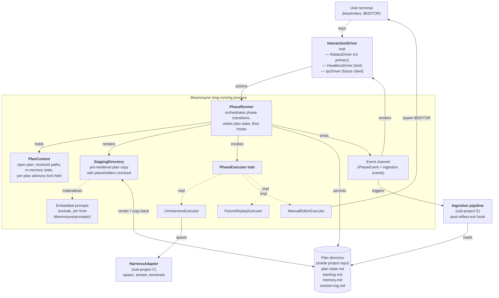
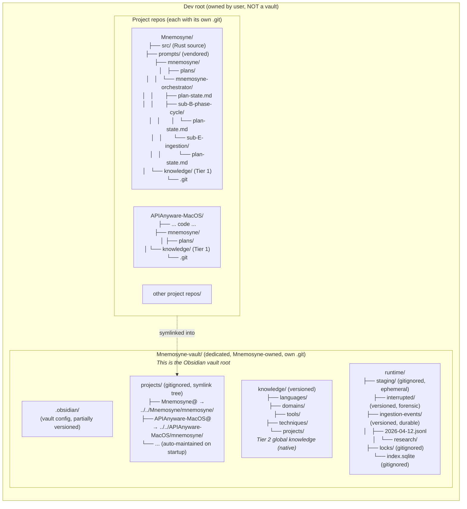
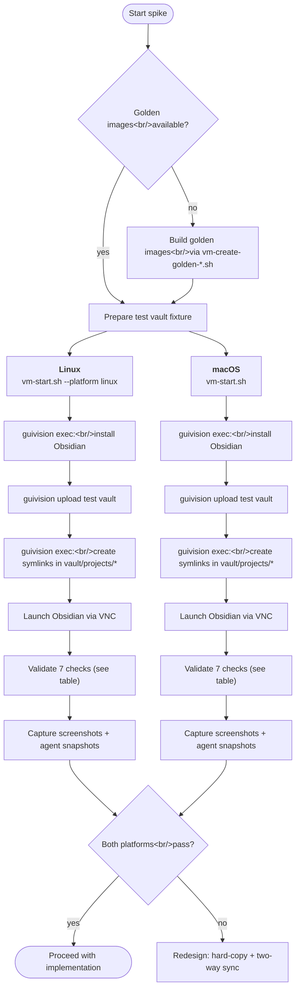

# Sub-project B — Phase Cycle Reimplementation in Rust

> Brainstormed 2026-04-12 via the `superpowers:brainstorming` skill. Every
> architectural decision recorded here was presented to the user and approved
> at a decision point during that session. The full trail is in Appendix A.

---

## Overview

Sub-project B designs the **long-running process model**, **phase cycle state
machine**, **executor abstractions**, **placeholder substitution mechanism**,
and **plan-state file format** that together replace
`{{DEV_ROOT}}/LLM_CONTEXT/run-backlog-plan.sh` with Rust code owned by
Mnemosyne. It is the sub-project through which the parent-process inversion
becomes real: after B ships, the user runs `mnemosyne` and Mnemosyne becomes
the parent process that spawns Claude Code (or other harnesses) as child
sessions via sub-project C's adapter layer.

The design is:

- A **long-running Mnemosyne process** that the user starts once per work
  session. Mnemosyne holds an open plan, hosts every phase execution, and
  drives the harness as a pure worker. The user never types at the harness
  directly; all commands flow through Mnemosyne's TUI.
- A **pluggable `PhaseExecutor` trait** with three concrete implementors in
  v1 — `LlmHarnessExecutor`, `ManualEditorExecutor`, `FixtureReplayExecutor`.
  Every phase execution, LLM- or human-driven, flows through the same
  `PhaseRunner::run_phase()` chokepoint, making the co-equal-actors principle
  a type-level guarantee rather than a documentation promise.
- A **staging directory mechanism** that pre-renders plan files with
  `{{DEV_ROOT}}`, `{{PROJECT}}`, `{{PLAN}}`, and `{{PROMPTS}}` placeholders
  resolved to absolute paths before the harness sees them. This closes the
  substitution gap recorded in the seed plan's memory as "the explicit v1
  failure mode to design out."
- A **plan-state file** (`plan-state.md`, markdown with YAML frontmatter)
  that replaces `phase.md` and carries enough state for crash recovery,
  exactly-once ingestion firing, and Dataview-backed multi-plan dashboards.
- A **Ratatui TUI** as the v1 user interface, with a stable
  `InteractionDriver` boundary that a future Obsidian plugin client
  (sub-project K) can attach to without core rework.
- A **dedicated Mnemosyne-vault** under the dev root, holding global
  knowledge natively, hosting runtime state natively, and referencing
  per-project plan directories via symlinks. The vault is an Obsidian vault
  by committed design — every file format, directory layout, and
  cross-reference decision targets Obsidian specifically.

The design assumes: sub-project E's post-session ingestion pipeline (already
complete, design at `{{PROJECT}}/docs/superpowers/specs/2026-04-12-sub-E-ingestion-design.md`),
sub-project C's harness adapter interface (consumed by name, implementation
designed separately), sub-project D's advisory lock primitive (consumed by
name), and the architectural inversions recorded in
`{{PROJECT}}/mnemosyne/plans/mnemosyne-orchestrator/memory.md`
(currently at `{{PROJECT}}/LLM_STATE/mnemosyne-orchestrator/memory.md`
pending sub-project G's migration).

---

## Table of Contents

1. [Scope and Goals](#1-scope-and-goals)
2. [Architecture](#2-architecture)
3. [Runtime Lifecycle](#3-runtime-lifecycle)
4. [External Interfaces](#4-external-interfaces)
5. [Testing, Risks, Integration, Open Questions](#5-testing-risks-integration-open-questions)
6. [Cross-sub-project Requirements](#6-cross-sub-project-requirements)
7. [Appendix A — Decision Trail](#appendix-a--decision-trail)

---

## 1. Scope and Goals

### 1.1 In scope

- The **long-running Mnemosyne process lifecycle**: startup, plan opening,
  event loop, phase transitions, interrupt handling, takeover flow,
  shutdown, and crash recovery.
- The **phase cycle state machine** covering work → reflect → triage → work
  transitions, interrupted-state semantics, and the preconditions for
  sub-project E's reflect-exit hook firing.
- The **`PhaseRunner`, `PhaseExecutor` trait, and three concrete
  executors**: `LlmHarnessExecutor`, `ManualEditorExecutor`,
  `FixtureReplayExecutor`.
- The **`StagingDirectory` mechanism** for pre-rendering plan files with
  all four placeholders substituted to absolute paths, plus the copy-back
  flow that propagates executor-driven edits back to the canonical plan
  directory.
- The **`plan-state.md` file format** (markdown with YAML frontmatter),
  its schema versioning rules, and its role as the crash-recovery durable
  state and the Dataview-facing public interface.
- The **Mnemosyne-vault layout** inside the dev root: dedicated vault
  directory, `knowledge/` subdirectory holding Tier 2 global knowledge
  natively, `runtime/` subdirectory holding staging + interrupts +
  ingestion events + locks, `projects/` subdirectory populated by
  symlinks into per-project `<project>/mnemosyne/` directories.
- The **symlink rescan lifecycle** that maintains the `projects/`
  symlink tree on Mnemosyne startup.
- The **`InteractionDriver` trait** and its three v1 implementors
  (`RatatuiDriver`, `HeadlessDriver`, `IpcDriver`), with the IPC boundary
  hardened to a future-Obsidian-plugin-ready JSON protocol shape even in
  v1.
- The **Ratatui TUI** as the primary user interface: main event loop,
  pane layout, keybindings, notification feed, takeover prompt modality.
- The **vendored prompt-reference content** location (`Mnemosyne/prompts/`),
  its `include_str!` embedding into the binary, and the `{{PROMPTS}}`
  placeholder that surfaces embedded content to phase prompts during
  staging render.
- The **external interface contracts** B exposes to sibling sub-projects:
  reflect-exit hook (to E), harness adapter contract (from C), TUI action
  extension points (to H).

### 1.2 Deliberately out of scope

- **Harness child session spawning, PTY handling, tool-profile enforcement,
  fixture replay of harness sessions** — sub-project C. B consumes C's
  adapter interface by name.
- **Post-session knowledge ingestion pipeline** — sub-project E (already
  complete). B specifies only the reflect-exit hook contract E subscribes
  to.
- **Multi-instance concurrency, the shared-store lock primitive, and
  contention semantics** — sub-project D. B calls `plan_lock.acquire()`
  and releases on drop; implementation is D's.
- **Plan hierarchy, nested plans, and cross-plan promotion** — sub-project F.
  B's plan-discovery model assumes flat plans identified by leaf directories
  containing a `plan-state.md` marker.
- **Migration of existing plans from `phase.md` to `plan-state.md`** —
  sub-project G. B's design establishes the target format; G designs the
  one-shot migration.
- **Global knowledge store physical location and subpath naming** —
  sub-project A. B tentatively proposes `<dev-root>/Mnemosyne-vault/` but
  final naming and any consolidation under a single Mnemosyne-owned dev-root
  directory is A's call.
- **Knowledge store content schema** (entries, tags, axes, the wiki-of-
  markdown vision) — sub-project A. B's use of markdown with YAML
  frontmatter for plan files is consistent with, but does not constrain,
  A's format choices.
- **Explorer/maintenance UI framework** — delegated in its entirety to
  Obsidian per the 2026-04-12 "Obsidian is the committed explorer"
  decision. Mnemosyne produces Obsidian-native files; Obsidian renders
  them. Special Obsidian plugin tooling (sub-project K) extends the base
  experience in v1.5+.
- **Integration of the 7 legacy Mnemosyne Claude Code skills** —
  sub-project H. B provides the TUI action extension points; H decides
  which legacy skills map to which actions and which are eliminated.
- **Slash commands inside the Claude Code harness** — explicitly forbidden
  in v1. The harness runs as a pure worker with no user-facing command
  surface. All user commands flow through Mnemosyne's TUI.
- **Obsidian plugin client** — sub-project K, a new backlog candidate
  surfaced during this brainstorm. Plugin work depends on B's IPC boundary
  landing in v1 and the terminal plugin evaluation from sub-project L.
- **Obsidian terminal plugin integration** — sub-project L, a new backlog
  candidate. Prerequisite for K; evaluates existing Obsidian terminal
  plugins for harness session hosting.

### 1.3 Goals, in priority order

1. **Close the substitution gap.** The LLM must never see a raw
   `{{PROJECT}}`, `{{PLAN}}`, `{{DEV_ROOT}}`, or `{{PROMPTS}}` placeholder
   in any file it reads during a phase. This is the explicit v1 acceptance
   criterion surfaced during the LLM_CONTEXT punch-list stop-gap. The
   staging directory mechanism (§2.2 `StagingDirectory`) is how B meets
   this goal structurally rather than through prompt-time LLM discipline.

2. **Honour the parent-process inversion, including command authority.**
   Mnemosyne is the only thing the user types at. The harness has no
   user-facing command surface in v1 — no Mnemosyne-provided slash
   commands, no `/begin-work`-style affordances, no callback channels
   from harness to Mnemosyne. Every user action flows through Mnemosyne's
   TUI, and Mnemosyne drives the harness through prompts and lifecycle
   signals only.

3. **Type-level guarantee of the co-equal-actors principle.** LLM-driven
   and human-driven phase executions must flow through exactly the same
   state-transition machinery, hitting the same hooks and emitting the
   same events. The only permissible difference between an LLM-mode and
   a human-mode phase execution is the `source` field on emitted events.
   B achieves this by making `PhaseExecutor` a trait with the phase
   runner invoking every executor through a single chokepoint — co-equal
   is enforced by the type system, not documentation.

4. **Crash-survivable plan state.** Mnemosyne crashing mid-phase must
   leave enough durable state on disk for a restart to resume cleanly
   without double-firing or missing sub-project E's ingestion pipeline.
   The `ingestion-fired` boolean in `plan-state.md`'s frontmatter is the
   crash-recovery linchpin: it flips from `false` to `true` at the start
   of sub-E's Stage 5 (before any store writes), so restart after a
   crash between reflect's clean exit and ingestion's completion fires
   ingestion exactly once on the stale plan outputs.

5. **Dogfood-ready v1.** V1 must be good enough to host the orchestrator
   seed plan and sub-project E's sibling plan — retiring
   `run-backlog-plan.sh` for these two plans is what validates that
   Mnemosyne works. Migration of the four legacy LLM_CONTEXT projects
   (APIAnyware-MacOS, GUIVisionVMDriver, Modaliser-Racket, RacketPro) is
   sub-project G's concern, not B's.

6. **Obsidian-native file formats by committed design.** Every file
   Mnemosyne writes in a plan directory or in the vault is markdown with
   YAML frontmatter where machine-readable metadata is needed; wikilinks
   are used instead of filesystem paths where cross-references exist;
   tags are first-class metadata; Dataview can query any plan or
   knowledge surface with a single table. The file formats Mnemosyne
   produces are stable public interfaces, not incidental internal
   representations.

7. **Self-contained from `LLM_CONTEXT/`.** The running Mnemosyne binary
   has zero runtime dependency on a sibling `LLM_CONTEXT/` directory
   existing. The vendored copies of `backlog-plan.md`,
   `create-a-multi-session-plan.md`, `coding-style.md`, and
   `coding-style-rust.md` live inside Mnemosyne's source tree at
   `{{PROJECT}}/prompts/`, are embedded into the binary at compile time
   via `include_str!`, and are surfaced to phase prompts through the
   `{{PROMPTS}}` placeholder.

### 1.4 Non-goals

- **Bidirectional LLM session suspend/resume.** Once an LLM phase is
  interrupted, the session is terminated; takeover is a new executor
  invocation (human or LLM) on the same plan state. Not losing in-flight
  LLM reasoning is actively a feature per the fresh-context principle,
  not a cost to engineer around.
- **Mid-phase harness swapping.** The executor is chosen at
  phase-invocation time and held until the phase exits. No
  `LlmHarnessExecutor` → `ManualEditorExecutor` transition inside a
  running `execute()` call.
- **Cross-plan multiplexing within one Mnemosyne instance.** One
  Mnemosyne process hosts exactly one open plan. Multi-plan work uses
  multiple Mnemosyne processes multiplexed by the user's terminal
  multiplexer (tmux, terminal tabs, IDE terminal panes). This is
  unchanged from the seed plan's existing "no TUI multiplexer in v1"
  decision.
- **Continuous filesystem watching for vault changes.** Mnemosyne does
  not watch the dev root for new project repos or new plans appearing.
  The user runs `mnemosyne rescan` (or quits and restarts) to refresh
  the symlink tree. This is a deliberate simplification —
  cross-platform file-watching is a surprising source of portability
  issues and v1 does not need it.
- **Customisable embedded prompts in v1.** The vendored prompt-reference
  content at `{{PROJECT}}/prompts/` is embedded into the binary at
  compile time and cannot be overridden at runtime. V2 may add a
  config-driven prompt-path override; v1 enforces "use what ships with
  the binary."
- **Windows as a v1 target.** V1 targets macOS and Linux. Windows
  support is deferred to sub-project K's portability work or a future
  portability sub-project. Symlink creation on Windows requires
  Developer Mode or elevated permissions, which is out of scope for v1.

---

## 2. Architecture

### 2.1 High-level diagram



Solid lines are runtime data flow; dashed lines are type-level
"implements" or "materialises-from." The critical architectural property:
nothing on the right-hand side (the TUI) holds a reference to anything on
the left-hand side (the harness adapter) except through the event
channel. `PhaseRunner` is the only component that holds references to
both, and it is the component that makes the co-equal-actors principle a
type-level invariant.

### 2.2 The six core abstractions

Six types do the load-bearing work. Everything else in B's implementation
is wiring.

#### 2.2.1 `PlanContext`

Represents one open plan. Held in memory for the lifetime of the
Mnemosyne process. Materialised once at startup from a plan directory.

```rust
pub struct PlanContext {
    pub plan_id: PlanId,            // leaf dir name, e.g. "sub-B-phase-cycle"
    pub plan_dir: PathBuf,          // canonical path (inside project repo, not symlinked)
    pub host_project: ProjectId,    // git project root containing the plan
    pub dev_root: PathBuf,          // parent of host_project
    pub vault_root: PathBuf,        // resolved Mnemosyne vault
    pub resolved: ResolvedPaths,    // all four placeholders pre-resolved
    pub state: PlanState,           // parsed plan-state.md contents
    pub plan_lock: PlanLockGuard,   // per-plan advisory lock held for session
}

pub struct ResolvedPaths {
    pub dev_root: PathBuf,
    pub project: PathBuf,
    pub plan: PathBuf,
    pub prompts: PathBuf,           // staging-root-relative at render time
}
```

`PlanContext::open(plan_dir)` walks up from the plan dir to find `.git`
(= host project root), resolves the dev root as its parent, locates the
Mnemosyne vault, acquires the per-plan advisory lock at
`<vault>/runtime/locks/<plan-id>.lock`, reads or creates `plan-state.md`,
and returns the populated context. Every step that can fail fails hard
with a clear diagnostic — no silent fallbacks.

The `resolved.prompts` field is populated only during phase execution,
when `StagingDirectory::render()` has materialised the embedded prompts
into a concrete staging-relative path. Outside a phase run it holds a
sentinel value; any code that reads it outside `PhaseRunner::run_phase()`
is a hard error.

#### 2.2.2 `PlanState` and `plan-state.md`

`plan-state.md` is a markdown file with YAML frontmatter. Frontmatter
holds all machine-readable state; the body is a short human-readable
description Mnemosyne writes on plan creation and otherwise leaves alone.
Dataview queries against the frontmatter produce multi-plan dashboards
spanning every plan across every project in the vault.

Example file (`<project>/mnemosyne/plans/mnemosyne-orchestrator/sub-B-phase-cycle/plan-state.md`
under the target layout; nested under its parent `mnemosyne-orchestrator`
plan):

```markdown
---
plan-id: sub-B-phase-cycle
host-project: Mnemosyne
dev-root: /Users/antony/Development
schema-version: 1
current-phase: reflect
started-at: 2026-04-12T14:22:18Z
harness-session-id: reflect-sub-B-phase-cycle-Mnemosyne
mnemosyne-pid: 48291
interrupted: false
tags:
  - mnemosyne-plan
  - phase-reflect
last-exit:
  phase: work
  exited-at: 2026-04-12T14:10:02Z
  clean-exit: true
  ingestion-fired: false
---

# Plan state for [[sub-B-phase-cycle]]

Auto-managed by Mnemosyne. Do not edit directly except for crash
recovery. Parent plan: [[mnemosyne-orchestrator]].
```

Parsed into:

```rust
pub struct PlanState {
    pub plan_id: String,
    pub host_project: String,
    pub dev_root: PathBuf,
    pub schema_version: u32,
    pub current_phase: Phase,
    pub started_at: Option<DateTime<Utc>>,
    pub harness_session_id: Option<String>,
    pub mnemosyne_pid: Option<u32>,
    pub interrupted: bool,
    pub tags: Vec<String>,
    pub last_exit: Option<LastExit>,
}

pub struct LastExit {
    pub phase: Phase,
    pub exited_at: DateTime<Utc>,
    pub clean_exit: bool,
    pub ingestion_fired: bool,
}

#[derive(Debug, Clone, Copy, PartialEq, Eq)]
pub enum Phase { Work, Reflect, Triage }
```

`PlanState::load(plan_dir)` reads and parses; `PlanState::persist(&self,
plan_dir)` serialises atomically via write-to-temp-then-rename.
`schema-version` starts at 1. When the format changes in a
non-backward-compatible way, the version is bumped and a migration
function is written; the parser rejects unknown higher versions as a
hard error on load.

**`ingestion-fired` is the exactly-once firing linchpin.** Sub-project E's
Stage 5 flips it from `false` to `true` as its very first action, before
any knowledge store writes. On Mnemosyne restart, if `last_exit.phase ==
Reflect && last_exit.clean_exit && !last_exit.ingestion_fired`, the
ingestion pipeline fires on the stale plan outputs one time. This is
exactly-once firing with file-backed durability and no database.

Dataview property naming uses kebab-case (`plan-id`, not `plan_id`)
because Dataview's query syntax is friendlier to kebab-case field names.
All YAML frontmatter in every file Mnemosyne writes follows this
convention consistently.

#### 2.2.3 `PhaseRunner`

The central orchestrator. Owns one `PlanContext` and knows how to
advance a phase.

```rust
pub struct PhaseRunner<'a> {
    ctx: &'a mut PlanContext,
    event_tx: mpsc::Sender<PhaseEvent>,
    vault_runtime_dir: PathBuf,     // <vault>/runtime/
    reflect_exit_hook: Arc<dyn ReflectExitHook>,
}

impl<'a> PhaseRunner<'a> {
    pub fn run_phase(
        &mut self,
        phase: Phase,
        executor: &dyn PhaseExecutor,
    ) -> Result<PhaseOutcome, PhaseError>;

    pub fn interrupt(&mut self) -> Result<(), PhaseError>;
}

pub enum PhaseOutcome {
    CleanExit { transitioned_to: Phase },
    Interrupted { forensics_dir: PathBuf },
    ExecutorFailed { error: String },
}

pub enum PhaseEvent {
    PhaseStarted {
        phase: Phase,
        executor_kind: ExecutorKind,
        at: DateTime<Utc>,
    },
    PhaseExited {
        phase: Phase,
        outcome: PhaseOutcome,
        at: DateTime<Utc>,
    },
    PhaseInterrupted {
        phase: Phase,
        forensics_dir: PathBuf,
        at: DateTime<Utc>,
    },
    HarnessOutputChunk {
        kind: OutputChunkKind,
        text: String,
    },
    IngestionEvent(IngestionEventPayload),  // forwarded from sub-E
}
```

`run_phase` is the single chokepoint through which every phase execution
— LLM, human, fixture replay, any future executor — must pass. It
performs, in strict order:

1. **Validate the phase transition is legal** from
   `ctx.state.current_phase`. Only `work → reflect`, `reflect → triage`,
   `triage → work` are legal forward transitions. Illegal transitions
   fail hard.
2. **Check the plan-scoped advisory lock is held** (it was acquired at
   `PlanContext::open`). Idempotent sanity check, not re-acquisition.
3. **Pre-render the staging directory** via
   `StagingDirectory::render(&ctx.vault_runtime_dir, &ctx.resolved,
   &ctx.plan_dir, phase)`.
4. **Update `ctx.state`**: set `current_phase` to the *incoming* phase
   (which is usually the same as the current phase, since phases are
   advanced on exit not entry), set `started_at` to now, set
   `harness_session_id` and `mnemosyne_pid`. Persist atomically.
5. **Emit `PhaseStarted`** to the event channel.
6. **Invoke `executor.execute(&PhaseContext { plan: ctx, staging:
   &staging, phase })`**, capturing streamed output into the event
   channel's `HarnessOutputChunk` variant. This call blocks until the
   executor exits cleanly, fails, or is interrupted.
7. **On clean executor exit**: run
   `StagingDirectory::copy_back(&staging, &ctx.plan_dir)` to propagate
   any edits the executor made back to the canonical plan directory.
   Reject any write-back outside the plan directory or the explicitly-
   staged project subtree as a hard error.
8. **Compute the next phase** (`work → reflect`, `reflect → triage`,
   `triage → work`).
9. **Update `ctx.state.last_exit`** with `phase: phase, exited_at: now,
   clean_exit: true, ingestion_fired: false`. Set `current_phase` to
   the next phase. Persist atomically.
10. **Emit `PhaseExited`** with `CleanExit { transitioned_to: next_phase }`.
11. **If the completed phase was `Reflect`**, call
    `self.reflect_exit_hook.on_reflect_exit(ReflectExitContext { ... })`.
    This is non-blocking; ingestion runs on a dedicated task and is not
    awaited.
12. **Clean up the staging directory** if it was cleanly consumed.
13. **Return** `PhaseOutcome::CleanExit { transitioned_to: next_phase }`.

On executor failure, steps 7–12 are skipped, and the outcome reports the
error with the staging dir preserved under
`<vault>/runtime/interrupted/<plan-id>/<phase>-<timestamp>/` for
forensics. On interrupt, the interrupted-state flow from §3.6 takes
over.

Every numbered step is a hard-error boundary. Any failure in steps 1–13
that is not explicitly handled (interrupt, executor failure) aborts the
phase with a hard error, preserving the staging directory and writing
a diagnostic to the interrupted forensics log.

#### 2.2.4 `PhaseExecutor` trait

```rust
pub trait PhaseExecutor {
    fn kind(&self) -> ExecutorKind;

    fn execute(
        &self,
        ctx: &PhaseContext,
        output_tx: &mpsc::Sender<String>,
    ) -> Result<(), ExecutorError>;

    fn interrupt(&self);
}

pub struct PhaseContext<'a> {
    pub plan: &'a PlanContext,
    pub staging: &'a StagingDirectory,
    pub phase: Phase,
}

pub enum ExecutorKind { Llm, Human, FixtureReplay }

#[derive(thiserror::Error, Debug)]
pub enum ExecutorError {
    #[error("harness adapter error: {0}")]
    Adapter(#[from] AdapterError),
    #[error("editor exited with non-zero status: {0}")]
    EditorFailed(i32),
    #[error("fixture replay error: {0}")]
    FixtureReplay(String),
    #[error("I/O error: {0}")]
    Io(#[from] std::io::Error),
}
```

Three concrete implementors ship in v1:

**`LlmHarnessExecutor`** — holds a `Box<dyn HarnessAdapter>` (sub-project
C). `execute()` reads the phase prompt file from the staging directory,
hands it to the adapter's `spawn()` method with tool profile
`ResearchBroad` (or `IngestionMinimal` for sub-project E's internal
reasoning sessions — selected per phase at executor construction time),
streams output chunks to `output_tx`, waits for child exit. `interrupt()`
signals the adapter to terminate; the actual termination completes
asynchronously and is observed via `next_chunk()` returning
`Ok(None)`.

**`ManualEditorExecutor`** — `execute()` writes the phase prompt content
to `<staging>/phase-prompt.readonly.md` as a reference sibling file,
determines the target file(s) for the phase (`work` → `backlog.md` +
`session-log.md`; `reflect` → `memory.md` + `session-log.md`; `triage` →
`backlog.md`), spawns `$EDITOR` blocking on them, waits for exit.
`interrupt()` is a no-op — the user closes their editor themselves. The
sibling read-only file is the manual executor's way of surfacing the
phase prompt without polluting the target file with scratch content.

**`FixtureReplayExecutor`** — `execute()` reads a captured output stream
from a JSON fixture file, pushes chunks to `output_tx` with simulated
pacing, returns. No process spawn, no `$EDITOR`, no harness adapter.
Used for end-to-end tests of `PhaseRunner` + `StagingDirectory` + event
channel + TUI rendering without a live harness.

The co-equal-actors principle is enforced by the type system: every
executor is called by `run_phase`, which fires hooks regardless of
executor kind. A test that exercises `run_phase` with
`ManualEditorExecutor` and a test that exercises it with
`LlmHarnessExecutor` both hit the same hook firing, the same state
transitions, the same event channel. The only permissible difference
between an LLM-mode and a human-mode phase execution is the `source`
field on emitted events (which includes `executor_kind` from
`PhaseStarted`).

#### 2.2.5 `StagingDirectory`

The substitution gap closer. Wraps a per-phase staging directory under
`<vault>/runtime/staging/<plan-id>/<phase>-<timestamp>/`.

```rust
pub struct StagingDirectory {
    pub root: PathBuf,
    pub source_plan_dir: PathBuf,
    pub source_project_dir: PathBuf,
    pub resolved: ResolvedPaths,
}

impl StagingDirectory {
    pub fn render(
        vault_runtime_dir: &Path,
        resolved: &ResolvedPaths,
        plan_dir: &Path,
        phase: Phase,
    ) -> Result<Self, StagingError>;

    pub fn copy_back(
        &self,
        target_plan_dir: &Path,
    ) -> Result<CopyBackReport, StagingError>;

    pub fn preserve_on_interrupt(
        &self,
        interrupted_root: &Path,
    ) -> Result<PathBuf, StagingError>;

    pub fn cleanup(&self) -> Result<(), StagingError>;

    pub fn path_in_staging(&self, name: &str) -> PathBuf;
}

pub struct CopyBackReport {
    pub files_updated: Vec<PathBuf>,
    pub files_unchanged: Vec<PathBuf>,
    pub files_added: Vec<PathBuf>,
    pub files_rejected: Vec<PathBuf>,
}
```

`render` walks the plan directory, copies every file to the staging
root with `{{DEV_ROOT}}`, `{{PROJECT}}`, `{{PLAN}}`, and `{{PROMPTS}}`
substituted in each file's content. It also:

1. **Writes the four-placeholder-substituted phase prompt** to
   `<staging>/phase-prompt.md`, ready for executors to read.
2. **Materialises the embedded prompt-reference content** (from
   `Mnemosyne/prompts/` via `include_str!`) into `<staging>/prompts/`
   as concrete files. The `{{PROMPTS}}` placeholder in the phase prompt
   and in any staged plan file resolves to `<staging>/prompts/`.
3. **Stages the narrow set of host-project files** referenced by the
   phase prompt. The staging allowlist is resolved at prompt-parse
   time: the phase prompt is scanned for `{{PROJECT}}/...` tokens, and
   exactly those files are staged. No blanket project-tree staging.
   A default allowlist covers `README.md` and any explicitly-referenced
   file under `<project>/docs/`.
4. **Never follows symlinks into project repos.** When walking the
   plan directory during staging, a symlink whose target is outside
   the plan directory is a hard error. This prevents accidental
   exfiltration of unrelated project content into the LLM's view.
5. **Refuses to descend into child plan directories.** When walking
   the plan directory, any subdirectory containing a `plan-state.md`
   marker is skipped entirely — the staging copy contains only the
   current plan's files, not any of its nested children's. This is
   the critical invariant that keeps "one plan per Mnemosyne process"
   intact against the nested filesystem hierarchy: opening the
   orchestrator plan must not stage sub-B-phase-cycle's files, and
   vice versa. Sub-plans are opened through their own Mnemosyne
   invocations with their own `PlanContext` and their own staging.

`copy_back` walks the staging root after executor exit, compares each
file against the canonical plan directory, and writes through the
changes. Files outside `{{PLAN}}` or the allowed project subtree are
rejected (not copied back) and reported as hard errors. The phase
outcome becomes `ExecutorFailed` and the staging directory is preserved
for forensics. This is B's equivalent of sub-project E's Rule 6
(file-write safety).

On clean phase exit, the staging directory is deleted by `cleanup()`.
On interrupt, it is moved to
`<vault>/runtime/interrupted/<plan-id>/<phase>-<timestamp>/staging/` by
`preserve_on_interrupt`. On hard-error abort, same preservation path
with a reason label.

#### 2.2.6 `InteractionDriver` trait

```rust
pub trait InteractionDriver {
    fn run(
        &mut self,
        plan: PlanContext,
        runner: PhaseRunner,
        events_rx: mpsc::Receiver<PhaseEvent>,
    ) -> Result<(), DriverError>;

    fn kind(&self) -> InteractionKind;
}

pub enum InteractionKind { Ratatui, Headless, Ipc }
```

The `InteractionDriver` is the UI boundary. V1 ships three implementors:

**`RatatuiDriver`** — the v1 primary UI. A full-screen terminal app
with three panes: backlog summary, streaming executor output, and
notification feed for phase and ingestion events. Constructed from the
`PlanContext` and the event channel receiver. Owns the `PhaseRunner`
for the session and invokes `runner.run_phase()` in response to user
actions. Renders all `PhaseEvent` variants as they arrive on the
channel. Described in detail in §3.4.

**`HeadlessDriver`** — reads user actions from a fixture script or
stdin and writes events to stdout as JSON lines. Enables full
end-to-end integration tests of the phase runner, staging, executors,
and event channel without a terminal emulator. Used by the Tier 2
test suite (§5.1).

**`IpcDriver`** — v1 forward compatibility. Reads user actions from
stdin as JSON lines and writes events to stdout as JSON lines, exposing
a stable IPC protocol that a future Obsidian plugin client (sub-project
K) can consume. Ships in v1 with no client attached — the purpose is
to force the `InteractionDriver` boundary to be serialisable at
compile time, so a later plugin client can attach without core rework.
If any new method added to `InteractionDriver` can't be implemented by
`IpcDriver`, it fails to compile. This is the enforcement mechanism
for the "IPC boundary hardening" decision.

All three implementors hold the same `PhaseRunner` and consume the
same event channel. Switching UIs is a runtime choice (CLI flag:
`--tui` is default, `--headless` for tests, `--ipc` for future
clients). No core code changes between them.

### 2.3 Dev-root layout and the Mnemosyne vault

Each project has one Mnemosyne-owned directory (`<project>/mnemosyne/`)
holding both plans and Tier 1 knowledge. The vault has one symlink per
project targeting that directory, so Obsidian accesses the full
per-project Mnemosyne surface through a single link.



**Content locations:**

| Content | Canonical location | Vault presence |
|---------|--------------------|----------------|
| Project source code | `<dev-root>/<project>/` | not in vault — Obsidian never sees it |
| Plan files (backlog/memory/session-log/plan-state) | `<dev-root>/<project>/mnemosyne/plans/<...nested plan path...>/` | accessible via symlink `Mnemosyne-vault/projects/<project>/plans/<...>/` |
| Tier 1 per-project knowledge | `<dev-root>/<project>/mnemosyne/knowledge/` | accessible via symlink `Mnemosyne-vault/projects/<project>/knowledge/` |
| Tier 2 global knowledge | `Mnemosyne-vault/knowledge/` | native — lives permanently in the vault |
| Embedded prompts (vendored) | `<dev-root>/Mnemosyne/prompts/` + binary | materialised into `<vault>/runtime/staging/<plan-id>/<phase>-<ts>/prompts/` during phase render |
| Staging directories | `Mnemosyne-vault/runtime/staging/<plan-id>/<phase>-<ts>/` | native, ephemeral, gitignored |
| Interrupted forensic logs | `Mnemosyne-vault/runtime/interrupted/<plan-id>/<phase>-<ts>/` | native, durable, versioned |
| Ingestion events (sub-E) | `Mnemosyne-vault/runtime/ingestion-events/<YYYY-MM-DD>.jsonl` | native, durable, versioned |
| Research session transcripts (sub-E) | `Mnemosyne-vault/runtime/ingestion-events/research/<session-id>.jsonl` | native, durable, versioned |
| Advisory locks (sub-D) | `Mnemosyne-vault/runtime/locks/<plan-id>.lock` | native, gitignored |

**Plan hierarchy support:** plans can nest arbitrarily inside
`<project>/mnemosyne/plans/`. A directory is a plan if and only if it
contains a `plan-state.md` file. Nested directories (child plans) are
themselves plans in their own right; intermediate directories without
the marker file are pure organisation. The exact hierarchy semantics
(whether a reserved root-plan location exists, how process-state
promotes upward, parent/child relationship tracking) are sub-project F's
scope. B's contract is: plans are identified by the `plan-state.md`
marker, and plan discovery is "walk up from cwd looking for the nearest
`plan-state.md`." This works naturally with both flat and deeply nested
layouts.

**Git boundaries:** project repos are sovereign — Mnemosyne only writes
files inside `<project>/mnemosyne/` and never touches `<project>/.git`.
The Mnemosyne-vault is its own git repo, versioning knowledge +
interrupted forensics + ingestion events, and gitignoring staging +
locks + symlinks + rebuildable indexes. Symlinks are gitignored because
their absolute paths are per-machine; a vault clone rebuilds them on
first startup via the rescan.

**Naming collision note:** inside the Mnemosyne project repo itself,
the layout reads as `<dev-root>/Mnemosyne/mnemosyne/`. Capitalisation
disambiguates: uppercase `Mnemosyne/` is the project repo (a proper
noun, matching other project names like `APIAnyware-MacOS`), lowercase
`mnemosyne/` is the per-project role directory. At the dev-root level,
three Mnemosyne-related names coexist without confusion:
`Mnemosyne/` (the project), `Mnemosyne-vault/` (the dedicated vault),
and any `<project>/mnemosyne/` (the per-project role directory).

**Vault location default:** `<dev-root>/Mnemosyne-vault/`. Configurable
via sub-project A's config mechanism. Multi-dev-root users can have
separate vaults per dev root; users wanting a single shared vault can
configure multiple Mnemosyne installations to point at the same path.

**First-run bootstrap:** if the vault doesn't exist on startup,
Mnemosyne creates it, including:
- `.obsidian/` stub directory with a recommended plugin list (Dataview
  required, Templater optional) and default graph-view settings
- `knowledge/`, `runtime/`, `projects/` subdirectories
- `.git` initialised
- `.gitignore` with `runtime/staging/`, `runtime/locks/`,
  `runtime/index.sqlite`, `projects/`
- `README.md` at the vault root explaining what the vault is and
  how to open it in Obsidian

### 2.4 Symlink maintenance lifecycle

Mnemosyne dynamically maintains the `projects/` symlink tree under the
vault on every startup (and on explicit `mnemosyne rescan`):

1. **Walk the dev root** looking for project repos (directories
   containing `.git`). Exclude `Mnemosyne-vault/` itself.
2. **For each project**, check for `<project>/mnemosyne/`. If present
   and not already symlinked into the vault, create a relative symlink
   at `Mnemosyne-vault/projects/<project-name>` targeting
   `../../<project>/mnemosyne/`. One symlink per project covers both
   plans and knowledge.
3. **Garbage-collect dangling symlinks.** Any symlink under `projects/`
   whose target no longer exists is removed.
4. **Cycle detection.** If walking encounters a symlink that would form
   a cycle (one-level-deep detection via `same-file`), the rescan
   aborts for that project only with a hard error, preserving the
   existing symlinks and logging the failure to the event channel for
   TUI display. Other projects continue.
5. **Symlinks use relative paths** (`../../Mnemosyne/mnemosyne`) so the
   vault can be moved as a unit without breaking resolution, as long
   as the vault and project repos stay at consistent relative positions
   under the dev root.

Rescan is not continuous. Mnemosyne does not watch the filesystem for
new projects appearing. Users run `mnemosyne rescan` (a TUI action) or
restart Mnemosyne to pick up changes. This is a deliberate v1
simplification — file watching is a known source of portability
surprises and v1 does not need it.

### 2.5 Self-containment from `LLM_CONTEXT/`

Mnemosyne's binary has zero runtime dependency on the sibling
`{{DEV_ROOT}}/LLM_CONTEXT/` directory. The vendored prompt-reference
content lives at `{{PROJECT}}/prompts/` in the Mnemosyne source tree
and is compiled into the binary via `include_str!`:

```rust
// In src/prompts.rs
pub const BACKLOG_PLAN_SPEC: &str =
    include_str!("../prompts/backlog-plan.md");
pub const CREATE_MULTI_SESSION_PLAN: &str =
    include_str!("../prompts/create-a-multi-session-plan.md");
pub const CODING_STYLE: &str =
    include_str!("../prompts/coding-style.md");
pub const CODING_STYLE_RUST: &str =
    include_str!("../prompts/coding-style-rust.md");

pub fn materialise_into(prompts_dir: &Path) -> Result<(), std::io::Error> {
    std::fs::create_dir_all(prompts_dir)?;
    std::fs::write(
        prompts_dir.join("backlog-plan.md"),
        BACKLOG_PLAN_SPEC,
    )?;
    std::fs::write(
        prompts_dir.join("create-a-multi-session-plan.md"),
        CREATE_MULTI_SESSION_PLAN,
    )?;
    std::fs::write(
        prompts_dir.join("coding-style.md"),
        CODING_STYLE,
    )?;
    std::fs::write(
        prompts_dir.join("coding-style-rust.md"),
        CODING_STYLE_RUST,
    )?;
    Ok(())
}
```

`StagingDirectory::render()` calls `prompts::materialise_into(&staging.root.join("prompts"))`
as part of its render sequence. Phase prompts reference the materialised
files via `{{PROMPTS}}/backlog-plan.md`, `{{PROMPTS}}/coding-style-rust.md`,
etc. After substitution, the LLM reads them through its normal Read tool
against concrete paths inside the staging directory.

Customisation of embedded prompts is a v2 feature. V1 enforces "use what
ships with the binary." The bootstrap discipline constraint in the seed
plan's memory specifically forbids customisation at v1 as a means of
forcing honest dogfooding against a shared prompt baseline.

---

## 3. Runtime Lifecycle

### 3.1 Process lifecycle state machine

```mermaid
stateDiagram-v2
    [*] --> Starting: mnemosyne &lt;plan-path&gt;

    Starting --> Idle: plan opened,&lt;br/&gt;state restored,&lt;br/&gt;TUI initialised
    Starting --> CrashRecovery: plan-state.md shows&lt;br/&gt;interrupted=true OR&lt;br/&gt;ingestion-fired=false
    CrashRecovery --> Idle: recovery actions complete

    Idle --> PhaseRunning: user triggers&lt;br/&gt;advance phase
    PhaseRunning --> Idle: executor exits cleanly,&lt;br/&gt;copy-back OK,&lt;br/&gt;state persisted
    PhaseRunning --> Interrupted: user Ctrl-C or&lt;br/&gt;Cancel Phase action
    Interrupted --> Idle: takeover=no,&lt;br/&gt;phase stays same,&lt;br/&gt;interrupted=true
    Interrupted --> PhaseRunning: takeover=yes,&lt;br/&gt;same phase,&lt;br/&gt;new executor
    PhaseRunning --> Stopping: executor hard error
    Idle --> Stopping: user quits

    Stopping --> [*]: lock released,&lt;br/&gt;state persisted,&lt;br/&gt;staging cleaned
```

### 3.2 Startup sequence

CLI surface is minimal:

```
mnemosyne                               # auto-discover a plan in cwd
mnemosyne <plan-dir>                    # open a specific plan
mnemosyne --replay <fixture-dir>        # fixture replay for tests
mnemosyne --headless --script <path>    # scripted actions for tests
mnemosyne --ipc                         # JSON IPC mode for future clients
mnemosyne rescan                        # refresh vault symlink tree and exit
mnemosyne --version | --help            # standard
```

Startup sequence, every step a hard-error boundary:

1. **Parse CLI and determine plan directory.** Either explicit argument
   or auto-discovery: walk up from cwd looking for a `plan-state.md`
   marker, or walk down into `mnemosyne/plans/` if cwd is a project
   root. Fail hard if no plan is found.
2. **Locate the host project** by walking up from the plan dir to find
   `.git`. Fail hard if no `.git` is found.
3. **Locate the dev root** as the parent of the host project. Fail hard
   if the parent doesn't exist.
4. **Locate or bootstrap the Mnemosyne vault.** Default location is
   `<dev-root>/Mnemosyne-vault/`; can be overridden by sub-project A's
   config mechanism. If the vault doesn't exist, bootstrap it (§2.3).
   Fail hard if bootstrap fails.
5. **Run the symlink rescan** (§2.4) to ensure the plan is reachable
   via `<vault>/projects/<project>/plans/<...>`. Verify the symlink
   exists post-rescan or fail hard.
6. **Acquire the per-plan advisory lock** via `flock` on
   `<vault>/runtime/locks/<plan-id>.lock`. Fail hard with a clear
   diagnostic naming the holding PID if contended. (Sub-project D's
   primitive.)
7. **Load `plan-state.md`**. If it doesn't exist (first Mnemosyne run
   on this plan, post-migration), write a new one with
   `current-phase: work`, `schema-version: 1`, and identity fields
   populated from the directory name and the resolved host project.
   If it exists but has a higher `schema-version` than this binary
   knows, fail hard with a version-mismatch diagnostic.
8. **Run crash recovery** (§3.3) if the loaded state indicates a
   prior non-clean exit.
9. **Construct `PlanContext`, `PhaseRunner`, event channel.** Initialise
   the `InteractionDriver` (`RatatuiDriver` by default, `HeadlessDriver`
   if `--headless`, `IpcDriver` if `--ipc`).
10. **Transition to Idle.** TUI renders the main view.

### 3.3 Crash recovery

Crash recovery runs at the `Starting → Idle` transition, reading the
just-loaded `plan-state.md` for signs of a prior non-clean exit.

**Scenario A — last phase was interrupted.** `plan-state.md` has
`interrupted: true`. The staging directory for that phase is preserved
under `<vault>/runtime/interrupted/<plan-id>/<phase>-<timestamp>/`.

Recovery: surface the prior interrupt to the user via the TUI's
notification feed on first render. The notification includes a wikilink
to the interrupted directory (Obsidian-native) and offers a "retry this
phase" action. No automatic re-execution — the user decides. The
`interrupted: true` flag stays set until the user either retries the
phase or explicitly dismisses it through a TUI action, which clears the
flag.

**Scenario B — last reflect exited cleanly but ingestion never fired.**
`plan-state.md` has `last-exit.phase: reflect`, `last-exit.clean-exit:
true`, `last-exit.ingestion-fired: false`. The prior Mnemosyne process
exited between reflect's clean end and ingestion's Stage 5 flipping the
flag. This is the exactly-once firing linchpin.

Recovery: fire the ingestion pipeline on the prior reflect's outputs
as the first post-Idle action. `ingestion-fired` flips to `true` at
the start of Stage 5 (sub-project E's responsibility). The user sees
ingestion events streaming in the TUI notification feed before they've
taken any action, which is correct — it is continuation of a phase
that had already completed from their perspective.

**Scenario C — everything is fine.** `plan-state.md` shows a clean
state. Recovery is a no-op.

Crash recovery itself is idempotent: running it twice on the same state
produces the same result, so a crash *during* recovery leads to the
same recovery on the next restart.

### 3.4 Idle and the TUI event loop

In Idle, `RatatuiDriver` renders the current plan state and waits for
user input. The main loop:

```rust
loop {
    tui.render(&plan_ctx, &notifications);

    select! {
        input = tui.next_input() => match input {
            TuiAction::AdvancePhase { mode } => {
                let next = compute_next_phase(plan_ctx.state.current_phase);
                let executor = build_executor(mode, &harness_adapter);
                runner.run_phase(next, &*executor)?;
            }
            TuiAction::InterruptPhase => runner.interrupt()?,
            TuiAction::Quit => break,
            TuiAction::OpenInEditor { file } => spawn_editor(file)?,
            TuiAction::RescanPlans => run_symlink_rescan(&vault)?,
            TuiAction::RetryInterruptedPhase => { ... }
            TuiAction::DismissInterrupt => {
                plan_ctx.state.interrupted = false;
                plan_ctx.persist()?;
            }
            TuiAction::TakeoverManual => { /* §3.6 */ }
            TuiAction::TakeoverLlmRetry => { /* §3.6 */ }
            // Extended by sub-project H with skill-derived actions
        },
        event = events_rx.recv() => {
            notifications.push(event);
        }
    }
}
```

The TUI does not directly mutate `plan-state.md` — only
`PhaseRunner::run_phase` and a small set of explicit state operations
(dismiss interrupt, acknowledge notification) do. This keeps state
mutations funneled through a small, testable surface.

**Pane layout** (three panes, vertical split with status bar):

```
┌────────────────────────────┬──────────────────────────────────────┐
│ Backlog (top-left)         │ Executor output (right, full height) │
│ ── backlog.md summary      │ ── streaming harness / editor output │
│ ── current task highlight  │ ── scrollable, ansi-aware             │
│                            │                                       │
├────────────────────────────┤                                       │
│ Notifications (bottom-left)│                                       │
│ ── phase events             │                                       │
│ ── ingestion events         │                                       │
│ ── interrupt / takeover     │                                       │
│ ── crash recovery messages  │                                       │
└────────────────────────────┴──────────────────────────────────────┘
 Status: plan=sub-B-phase-cycle phase=reflect mode=llm pid=48291
```

**Keybindings** (defaults, configurable later):

| Key | Action |
|-----|--------|
| `a` | Advance phase (LLM mode) |
| `m` | Advance phase (manual mode) |
| `c` / `Ctrl-C` | Interrupt running phase |
| `r` | Retry interrupted phase |
| `d` | Dismiss interrupt |
| `e` | Open target file in `$EDITOR` |
| `s` | Run symlink rescan |
| `q` | Quit |
| `?` | Show help |
| Arrow keys / `hjkl` | Navigate within active pane |
| `Tab` | Switch active pane |

### 3.5 PhaseRunning

When the user triggers `AdvancePhase` from Idle, `PhaseRunner::run_phase`
begins executing through the 13-step sequence from §2.2.3. The TUI
continues to render in its own thread (or tokio task), displaying
streaming `HarnessOutputChunk` events in the output pane and
`PhaseEvent` variants in the notification feed. The user can still
interact with the TUI during PhaseRunning — specifically, `c` /
`Ctrl-C` / a menu action signals the runner to interrupt.

Two internal sub-states are worth naming:

- **ExecutorRunning** — the `executor.execute()` call is in progress.
  Interrupt signals propagate through the executor's `interrupt()`
  method (which forwards to the harness adapter's termination for
  `LlmHarnessExecutor`, no-op for `ManualEditorExecutor`).
- **CopyingBack** — `executor.execute()` has returned cleanly; the
  runner is running `copy_back()`. **Interrupts during CopyingBack
  are not honoured immediately.** The user's interrupt signal is
  recorded in a pending-interrupt flag; copy-back runs to completion;
  then the runner checks the pending flag and, if set, transitions
  the phase to the Interrupted state immediately after copy-back
  finishes (with the phase having technically completed cleanly
  before the interrupt lands). This is a deliberate asymmetry:
  aborting mid-copy risks leaving the plan directory in an
  inconsistent state, which violates the "hard errors by default,
  state must always be consistent on disk" principle. Copy-back is
  short (typically well under a second) and mostly atomic; the user
  waiting a fraction of a second for the interrupt to take effect is
  a small cost for the consistency guarantee.

### 3.6 Interrupted and takeover

When PhaseRunning is interrupted, the runner:

1. **Signals `executor.interrupt()`.** `LlmHarnessExecutor` forwards to
   the harness adapter's `terminate()` (graceful stop → grace period →
   force kill). `ManualEditorExecutor` is a no-op.
2. **Captures any streamed output** into
   `<vault>/runtime/interrupted/<plan-id>/<phase>-<timestamp>/partial-output.log`.
3. **Preserves the staging directory** via
   `StagingDirectory::preserve_on_interrupt()`, moving it to
   `<vault>/runtime/interrupted/<plan-id>/<phase>-<timestamp>/staging/`.
4. **Updates `plan-state.md`**: `interrupted: true`,
   `last-exit.phase: <current>`, `last-exit.clean-exit: false`. Does
   **not** transition `current-phase` to the next phase — the plan
   stays on the interrupted phase.
5. **Emits `PhaseInterrupted { phase, forensics_dir, at }`** to the
   event channel.
6. **Surfaces a takeover prompt** in the TUI notification feed:

   > *"Phase `reflect` interrupted (32s captured → `[[reflect-2026-04-12T14-28-09]]`). Take over manually? [y / n / retry-llm]"*

   The prompt is non-modal — the user can keep interacting with the
   TUI while deciding. The wikilink syntax `[[...]]` is Obsidian-native
   so the notification is immediately actionable when the user opens
   the vault in Obsidian.

7. **On user response:**

   | Response | Action |
   |----------|--------|
   | **`y` (take over)** | Re-enter PhaseRunning with `ManualEditorExecutor` on the same phase, same plan state, fresh staging dir (re-rendered to discard partial edits). `interrupted` flag is cleared at the start of the manual phase. Hooks fire normally on manual exit. |
   | **`n` (dismiss)** | `interrupted` stays `true`. User will resolve it later or retry via the TUI's explicit "retry interrupted phase" action. |
   | **`retry-llm`** | Re-enter PhaseRunning with `LlmHarnessExecutor`, same phase, fresh staging dir. |

The three-option takeover prompt is a user-convenience refinement —
without `retry-llm`, a user who interrupted by mistake would have to
dismiss and then manually re-trigger `AdvancePhase`, which is two keys
where one would do.

### 3.7 Stopping

Two paths into Stopping: clean user quit from Idle, or a hard error
from PhaseRunning that the runner can't recover from (copy-back
rejection, unwritable plan-state, unrecoverable executor error).

Shutdown sequence:

1. **Stop accepting new user input.** TUI transitions to a "shutting
   down" render state.
2. **If PhaseRunning, force-interrupt** the executor. Capture partial
   output as in §3.6.
3. **Persist `plan-state.md`** with the final state. On clean quit
   from Idle this is a no-op (state is already persisted). On
   hard-error shutdown this captures the error context in a new
   `last-exit.error` field (free-form diagnostic string).
4. **Release the per-plan advisory lock.**
5. **Clean up the staging directory** on clean exit. On hard error,
   preserve it under `<vault>/runtime/interrupted/` with a reason
   label.
6. **Restore the terminal** (ratatui teardown).
7. **Exit with 0** on clean quit, **non-zero** on hard error, with a
   clear diagnostic on stderr summarising what went wrong and
   pointing at the preserved interrupted directory.

All hard-error paths exit through this same Stopping sequence. There
is no "emergency abort" that skips state persistence — the plan
state must always be consistent on disk after Mnemosyne exits,
because the next startup will read it.

---

## 4. External Interfaces

B touches three sibling sub-project boundaries through well-defined
interfaces. Each is a small, stable shape that B depends on *by name*
and sibling sub-projects implement.

### 4.1 `HarnessAdapter` — consumed from sub-project C

`LlmHarnessExecutor` holds a `Box<dyn HarnessAdapter>`. B defines the
trait shape; sub-project C fills in the implementations. V1 ships with
one concrete implementor: `ClaudeCodeAdapter`. Future harnesses are
added by C's future work.

```rust
pub trait HarnessAdapter: Send + Sync {
    fn kind(&self) -> HarnessKind;

    fn spawn(
        &self,
        prompt: &str,
        working_dir: &Path,
        tool_profile: ToolProfile,
        session_name: &str,
    ) -> Result<Box<dyn HarnessSession>, AdapterError>;
}

pub trait HarnessSession: Send {
    fn next_chunk(&mut self) -> Result<Option<OutputChunk>, AdapterError>;
    fn terminate(&mut self);
    fn wait(&mut self) -> Result<SessionExitStatus, AdapterError>;
    fn session_id(&self) -> &str;
}

pub enum HarnessKind {
    ClaudeCode,
    FixtureReplay,
}

pub enum ToolProfile {
    ResearchBroad,      // full tools: read/write/shell/web/knowledge-query
    IngestionMinimal,   // no tools (sub-E's Stage 3/4 sessions)
}

pub struct OutputChunk {
    pub text: String,
    pub kind: OutputChunkKind,
    pub at: DateTime<Utc>,
}

pub enum OutputChunkKind { Stdout, Stderr, ToolUse, InternalMessage }

pub enum SessionExitStatus {
    CleanExit { exit_code: i32 },
    Terminated { signal: Option<i32> },
    CrashedBeforeReady,
}

#[derive(thiserror::Error, Debug)]
pub enum AdapterError {
    #[error("harness binary not found on PATH: {0}")]
    HarnessNotFound(String),
    #[error("harness spawn failed: {0}")]
    SpawnFailed(String),
    #[error("tool profile {profile:?} not supported by harness {harness:?}")]
    UnsupportedToolProfile { profile: ToolProfile, harness: HarnessKind },
    #[error("session terminated abnormally: {0}")]
    AbnormalTermination(String),
    #[error("harness adapter I/O error: {0}")]
    Io(#[from] std::io::Error),
}
```

**Contract requirements on sub-project C** (recorded as cross-sub-project
requirements in §6):

1. **`spawn()` is cheap.** Cold-spawn latency target: < 3 seconds per
   session. Warm-pool reuse is C's implementation problem, not B's.
2. **Tool profile enforcement is C's responsibility.** A harness that
   attempts a disallowed tool must fail the session at the adapter
   level, not be permitted via prompt discipline.
3. **`terminate()` is non-blocking and idempotent.** Called from
   interrupt handlers that must return immediately. Actual termination
   happens asynchronously and is observed via `next_chunk()` returning
   `Ok(None)`.
4. **`next_chunk()` is a blocking streaming read.** Not polled, not
   async. B runs each executor on its own thread (or tokio task) so
   blocking reads don't starve the TUI event loop.
5. **`HarnessKind::FixtureReplay` is a first-class variant.** The
   fixture-replay adapter reads a captured JSON stream and emits it
   as `OutputChunk`s through the normal `HarnessSession` trait. Used
   by B's end-to-end tests and by sub-project E's pipeline tests.
6. **Working directory is the staging root**, not the plan dir or
   project root. The harness session starts with cwd set to the
   staging directory so file reads via tools land on pre-substituted
   copies.
7. **Session name is passed to the harness's session-tracking id.**
   Claude Code uses `-n <name>`; other harnesses adapt. B passes
   `<phase>-<plan-id>-<project>`.
8. **No callback channel from harness to Mnemosyne.** Per the "no
   slash commands in the harness" decision, output streams are
   one-way (harness → adapter → B). Mnemosyne's reactions happen
   entirely on the Mnemosyne side, after the session exits, via
   sub-project E's ingestion pipeline.

### 4.2 `ReflectExitHook` — exposed to sub-project E

After a reflect phase completes cleanly, `PhaseRunner::run_phase`
fires sub-project E's ingestion pipeline non-blockingly, before
transitioning to the triage phase. The hook is a method call, not a
channel subscription, because E runs in the same process as B.

```rust
pub trait ReflectExitHook: Send + Sync {
    fn on_reflect_exit(&self, ctx: ReflectExitContext);
}

pub struct ReflectExitContext {
    pub plan_id: String,
    pub host_project: String,
    pub plan_dir: PathBuf,
    pub vault_runtime_dir: PathBuf,
    pub session_log_latest_entry: String,
    pub ingestion_fired_setter: Box<dyn Fn() + Send + Sync>,
}
```

**Contract semantics:**

1. **Called by `PhaseRunner`** between steps 9 (persist new
   `plan-state.md`) and step 12 (clean up staging), only on clean
   reflect exit and only when `last-exit.ingestion-fired` was `false`
   before B ran. The `ingestion_fired_setter` closure is called by
   E's Stage 5 at the start of Stage 5, flipping the flag. B does not
   flip it.
2. **Non-blocking.** B returns control to the TUI and transitions to
   the next phase immediately. Ingestion runs on a dedicated tokio
   task.
3. **Non-blocking error handling.** If the ingestion pipeline crashes,
   sub-E's own event log records the failure. B does not observe
   ingestion failures — they're E's responsibility and surface via E's
   event stream (forwarded through the shared `PhaseEvent` channel as
   `IngestionEvent` variants) to the TUI's notification feed. B's
   phase cycle continues either way.
4. **Exactly-once firing is the joint responsibility** of B (only
   calls the hook under the right preconditions) and E (flips
   `ingestion-fired` to `true` before any Stage 5 writes). If E
   crashes after flipping the flag but before writing, the missed
   cycle is not retried automatically — the user can manually trigger
   re-ingestion for that plan via a TUI action if they notice the
   gap.
5. **No callback from E back to B.** E does not tell B "ingestion
   done." E emits events to the shared channel; B and the TUI observe
   them like any other event.

### 4.3 `InteractionDriver` — the hardened UI boundary

The `InteractionDriver` trait (§2.2.6) is the UI boundary and the
hardening point for Path 1's staging approach. Its design constraint:

> Every call across the `InteractionDriver` boundary must be
> serialisable to JSON. No raw Rust references crossing the trait.
> No callbacks into core state. No held pointers. Only value-typed
> messages.

This is enforced by the existence of `IpcDriver`, which implements the
full trait by serialising every interaction as JSON lines on stdin/stdout.
If any new method added to `InteractionDriver` can't be implemented by
`IpcDriver`, it fails to compile. This makes a future Obsidian plugin
client (sub-project K) a pure-additive feature — the plugin speaks the
same JSON protocol `IpcDriver` already ships.

The JSON protocol surface for v1 is minimal. Only the message shapes
currently in use by the TUI and by `HeadlessDriver` are exposed; the
protocol version is explicitly `1` in every message. Future protocol
extensions bump the version; `IpcDriver` rejects unknown higher versions
as a hard error.

Concrete JSON shapes are drafted during implementation, not fixed at
spec time — the goal at spec time is the boundary discipline, not the
exact wire format. The implementation task ships both a draft protocol
and a `tests/fixtures/ipc-protocol/` directory with example message
sequences that the tests validate against.

### 4.4 `TuiAction` — extensible action surface for sub-project H

Sub-project H decides which of the 7 legacy Mnemosyne Claude Code
skills (`/begin-work`, `/reflect`, `/setup-knowledge`, `/create-plan`,
`/curate-global`, `/promote-global`, `/explore-knowledge`) become
Mnemosyne TUI actions. B provides a stable action-dispatch interface
that H can hook into:

```rust
pub enum TuiAction {
    AdvancePhase { mode: ExecutorMode },
    InterruptPhase,
    Quit,
    OpenInEditor { file: PathBuf },
    RescanPlans,
    RetryInterruptedPhase,
    DismissInterrupt,
    TakeoverManual,
    TakeoverLlmRetry,
    // H adds variants here for skill-derived actions.
    // Each new variant is implemented inside Mnemosyne core, not as
    // a harness slash command. The TUI binds a keystroke to each.
}

pub enum ExecutorMode { Llm, Human }
```

**B's only constraint on H:** no `TuiAction` variant may be implemented
as a harness callback. If a legacy skill needs LLM reasoning (e.g.,
`explore-knowledge` doing gap analysis), it becomes a Mnemosyne-internal
reasoning session spawned via the same `HarnessAdapter`, running as a
child just like any phase executor — not a slash command the user types
inside a running harness session.

### 4.5 Substitution and the `{{PROMPTS}}` placeholder

Four placeholders participate in substitution:

| Placeholder | Resolves to | Source |
|-------------|-------------|--------|
| `{{DEV_ROOT}}` | Absolute path of the dev root | Computed at `PlanContext::open` |
| `{{PROJECT}}` | Absolute path of the host project root | Computed at `PlanContext::open` |
| `{{PLAN}}` | Absolute path of the canonical plan directory | Computed at `PlanContext::open` |
| `{{PROMPTS}}` | Staging-relative path to materialised embedded prompts | Computed per-phase at `StagingDirectory::render` |

Substitution happens in two places:

1. **In the phase prompt text** (`<staging>/phase-prompt.md`). The
   phase prompt is read from the plan directory, substituted with all
   four placeholders, and written to the staging directory. Executors
   read the substituted version.
2. **In every file under the plan directory staged to staging.** Plan
   files (`backlog.md`, `memory.md`, `session-log.md`, `plan-state.md`)
   may contain references to `{{PROJECT}}/docs/...` or similar tokens
   that should resolve to absolute paths when the LLM reads them via
   its Read tool. `StagingDirectory::render()` substitutes these
   in-place in the staged copies.

`copy_back` does the **reverse substitution**: on each file being
copied back, Mnemosyne scans for literal occurrences of the resolved
absolute path strings for `{{DEV_ROOT}}`, `{{PROJECT}}`, and `{{PLAN}}`
and rewrites them back to the placeholder form before writing through
to the canonical plan directory. `{{PROMPTS}}` is not reverse-substituted
— its staging-relative value is per-phase and never appears in canonical
plan files. The substitution algorithm is:

```
for each line in file:
    1. longest-match first: replace resolved({{PLAN}}) → {{PLAN}}
    2. then: replace resolved({{PROJECT}}) → {{PROJECT}}
    3. then: replace resolved({{DEV_ROOT}}) → {{DEV_ROOT}}
```

Longest-match-first ordering matters because `resolved({{PLAN}})` is
a prefix-extended version of `resolved({{PROJECT}})` which is a
prefix-extended version of `resolved({{DEV_ROOT}})`. Substituting the
longest first means the shorter prefixes inside an already-substituted
line don't accidentally re-match. This keeps plan files portable across
machines — the canonical form uses placeholders; the staged form is
substituted for LLM consumption; reverse substitution on copy-back
preserves the canonical form on disk.

Reverse substitution is a source of subtle bugs if the same string
appears in both placeholder and literal form in a plan file (e.g., a
session log entry quoting an absolute path from a shell error). The
design mitigates this by:

- Only substituting in files with extension `.md` (not arbitrary file
  types that might have content looking like paths).
- Only substituting the specific well-known placeholder tokens, not
  any string that happens to match the resolved path.
- Logging every reverse substitution to the forensic log when the
  phase exits, so the user can audit if anything looks wrong.

---

## 5. Testing, Risks, Integration, Open Questions

### 5.1 Testing strategy

Three tiers:

**Tier 1 — Unit tests (pure Rust, no LLM, no filesystem beyond tempdir).**
Every type from §2.2 has dedicated unit tests with no external
dependencies:

| Type | Unit test coverage |
|------|---------------------|
| `PlanState` | YAML frontmatter parse/serialise round-trip, `schema-version` rejection, `ingestion-fired` flag semantics, atomic-write-via-rename, corrupted-file handling (hard error) |
| `StagingDirectory::render` | correct substitution across all four placeholders, correct project file allowlist, nested directory handling, binary file passthrough (don't substitute in non-text files), symlink handling (refuse to follow into project repos), `{{PROMPTS}}` materialisation |
| `StagingDirectory::copy_back` | clean write-through of edited files, rejection of writes outside allowed paths, unchanged-file detection via content hash, new-file propagation, reverse substitution correctness |
| `PhaseRunner` (with `FixtureReplayExecutor`) | phase transition legality, state-file persistence at each step, hook firing order, event channel emission, interrupt rejection during CopyingBack |
| `PlanState` transitions | legal vs. illegal transitions, `interrupted: true` blocking next-phase without explicit dismiss |
| Symlink rescan | correct creation, correct GC of dangling links, cycle detection (hard error), relative-path preservation |
| `RatatuiDriver` | keybind dispatch to `TuiAction`, event rendering, pane layout (via ratatui's snapshot testing) |

Unit tests run in milliseconds against tempdirs, zero external tooling.

**Tier 2 — Integration tests (end-to-end core, fixture-replay harness).**
The full `PhaseRunner` + `StagingDirectory` + executor pipeline
exercised against a small in-repo fixture plan. The executor is
`FixtureReplayExecutor` (reading captured output streams) or
`LlmHarnessExecutor` backed by a `FixtureReplayAdapter`. No live LLM.

Each integration test is a complete scripted run: fixture plan →
scripted user actions via `HeadlessDriver` → assertions against the
final plan state and emitted events. Test inputs are markdown fixture
directories committed into `tests/fixtures/plans/`. Test outputs are
JSON-serialised event streams committed into `tests/fixtures/expected/`.

The same fixture-replay adapter is used by sub-project E's ingestion
pipeline tests. Shared infrastructure.

**Tier 3 — Live smoke tests (real Claude Code, CI-gated).** Manual or
CI-scheduled runs against a real Claude Code installation with a real
fixture plan. Validates structural invariants only (phases complete,
no hard errors, lock acquired/released, staging cleaned up,
`plan-state.md` consistent, ingestion event log written). Not
validated against specific LLM output — that is inherently
non-deterministic.

Live smoke tests run on a clean-room dev-root layout created per test
run, torn down afterward. No test contaminates the user's real vault.

### 5.2 Obsidian + symlinks validation spike (cross-platform)

A pre-implementation blocker. The layout in §2.3 assumes Obsidian
follows symlinks natively for file tree rendering, graph view,
wikilink resolution, Dataview queries, and file-watcher updates on
macOS and Linux. This has not been personally verified against current
Obsidian releases, and Obsidian's release notes are sparse on symlink
behaviour. If the assumption is wrong, the entire symlink layout
collapses and requires redesign.

The validation spike uses GUIVisionVMDriver's golden images
(`guivision-golden-macos-tahoe` and `guivision-golden-linux-24.04`) to
run the same validation on both target platforms with reproducible
results.



**Validation checks (same list for both platforms):**

1. File tree rendering: symlinked plans appear in Obsidian's file tree
   with the same navigation as native files.
2. File opening: clicking a symlinked plan file opens it in Obsidian's
   editor; content renders correctly (markdown, frontmatter
   recognised).
3. Graph view: symlinked notes appear as nodes in the graph view,
   linked to their wikilink targets.
4. Wikilink resolution: `[[sub-B-phase-cycle]]` from inside a
   symlinked note resolves correctly to its target within or outside
   the symlink tree.
5. Dataview queries: a `TABLE` query filtering on frontmatter fields
   across the `plans/` subdirectory returns rows from symlinked
   content.
6. File-watcher behaviour: editing a symlinked file externally (via
   `guivision exec` writing to the canonical project path) is picked
   up by Obsidian's file watcher and the UI updates.
7. Backlinks: a note outside the symlink tree referencing
   `[[plan-name]]` inside the symlink tree appears in the target's
   backlinks pane.

Each check's result is captured via `guivision agent snapshot --mode
interact` (UI state) and `guivision screenshot` (visual evidence).
Captured outputs are committed to `tests/fixtures/obsidian-validation/`
so the spike is re-runnable and the evidence is version-controlled.

**Failure cascade:**

1. If only one platform fails: document the affected platform as a v1
   non-target, proceed on the supporting platform. Unacceptable for
   Linux (v1 target), so effectively only applies to the future Windows
   case.
2. If both platforms fail: switch to the hard-copy + two-way-sync
   fallback. `StagingDirectory` and `PhaseRunner` abstractions are
   unchanged; only the vault's `projects/` subdirectory changes from
   a symlink tree to a mirrored copy tree with Mnemosyne handling
   bi-directional sync on each plan-state write.
3. If specific Obsidian plugins fail but core features work (e.g.,
   Dataview has a symlink bug but file tree + wikilinks + graph view
   work): document the failing plugin as a known limitation, offer
   a workaround, do not block Path 1.

**Windows is v2.** GUIVisionVMDriver has a `guivision-golden-windows-11`
image and the spike could run on Windows, but Windows symlink creation
requires Developer Mode or elevated permissions and Mnemosyne v1 does
not target Windows. Deferred to sub-project K's portability work.

### 5.3 Integration-over-reinvention table

Per the cross-cutting decision in the seed plan's memory, every
sub-project brainstorm must surface at least one "what existing tool
covers this ground?" question. B's answers:

| Layer | Existing tool / crate considered | Decision | Rationale |
|-------|----------------------------------|----------|-----------|
| Phase state machine | `statig`, `rust-fsm`, `sm`, `typestate` | **Hand-roll** (~50 lines of match) | 3 phases, linear transitions, minimal guard logic. FSM crates are right for richer state (nested states, history, fan-out). Not worth the dependency here. Reassess in v2 if the state machine grows. |
| Placeholder substitution | `tera`, `handlebars`, `minijinja`, `regex::Regex::replace_all` | **`regex` crate with a static precompiled pattern** | 4 placeholders. Templating engines are overkill. `regex` is already a transitive dependency. |
| Plan-state file format | `toml`, `serde_yaml`, `serde_yaml` + `gray_matter` | **`serde_yaml` + `gray_matter`** for markdown-with-frontmatter parsing | Obsidian-native format dictates YAML frontmatter in markdown. `gray_matter` is the canonical Obsidian-compatible Rust crate. |
| Terminal UI | `ratatui` + `crossterm`, `cursive`, `termion`, `tui-rs` (deprecated) | **`ratatui` + `crossterm`** | Most actively maintained fork of mature tui-rs. Cross-platform. Standard choice. |
| Symlink creation and traversal | `std::os::unix::fs::symlink`, `same-file` for cycle detection | **stdlib + `same-file`** | Stdlib handles the primitive; `same-file` handles the cycle invariant. No higher-level crate adds value. |
| Atomic file writes | `atomicwrites` crate, hand-rolled `tempfile` + `rename` | **Hand-roll with stdlib `tempfile` + `std::fs::rename`** | Atomic rename is a one-liner on Unix; `tempfile` is already a dependency. The `atomicwrites` crate adds a Windows fsync story v1 doesn't need. Explicit silent-reinvention-risk justification: the alternative is a 15-line dependency for a 3-line primitive; Windows robustness is v2. |
| File watching | `notify`, `watchexec` | **Not used in v1** | Explicit symlink rescan is simpler and predictable. File watching adds cross-platform flakiness and surprise. Reassess in v2 if a "notify Mnemosyne when Obsidian creates a new plan" workflow emerges. |
| JSON lines for IPC protocol | `serde_json` + manual line framing, `serde_jsonlines` | **`serde_json` + manual newline framing** | Trivial enough that a dedicated crate is overkill; `serde_json` is already used elsewhere. |
| Process spawning + PTY | (sub-project C concern) | **Deferred to C** | B calls C's adapter; B does not pick the PTY crate. |
| Advisory file locking | `fs2::FileExt::lock_exclusive`, `fd-lock`, `flock` via libc | **(sub-project D concern)** | D picks. B's contract is "call `plan_lock.acquire()` on startup; release on drop." |
| Obsidian integration | Dataview, Templater, Canvas, obsidian-terminal, obsidian-execute-code | **Committed target, integrated via file format conventions** | Obsidian is the committed explorer (decision trail #7). B's contribution is producing Obsidian-native files Dataview can query. Deeper integration (plugin client) is sub-project K. |
| LLM wiki / knowledge graph tooling | Karpathy's LLM Wiki concept, Infonodus-style network analysis | **Obsidian is the consuming tool, v1; enhanced graph/network analysis via Obsidian's native graph view + plugins** | The Obsidian-as-committed-explorer decision subsumes this. Future sub-project K may surface richer graph/wiki features via a custom plugin, but v1 relies on Obsidian's built-in graph view and Dataview. |

No silent reinvention. Every decision to hand-roll is justified
against named alternatives.

### 5.4 Risks

Ranked by impact × likelihood. Each has a mitigation path.

**Risk 1 — Obsidian + symlinks behaviour is not what we think it is**
*(HIGH impact, MEDIUM likelihood).*

The §2.3 layout assumes Obsidian on macOS and Linux follows symlinks
natively for file tree, graph view, wikilinks, Dataview, and file
watching. Not personally verified against current Obsidian releases.
If wrong, the entire symlink layout collapses.

**Mitigation:** the §5.2 cross-platform validation spike runs before
any other sub-B implementation task. If the spike fails, the fallback
is hard-copy two-way-sync (more code, but B's abstractions hold).
B's design remains valid either way — the `StagingDirectory`
mechanism is independent of whether plans are symlinked or copied
into the vault.

**Risk 2 — Harness adapter cold-spawn latency**
*(MEDIUM impact, MEDIUM likelihood).*

Covered in sub-project E's design doc; B inherits it. Claude Code
cold-spawn takes 2–5 seconds in practice. Each full cycle fires ≥3
harness sessions plus N+1 from sub-project E's ingestion pipeline.

**Mitigation:** sub-project C addresses warm-pool reuse if cold-spawn
proves painful. B does not assume warm-pool — its design works with
cold-spawn.

**Risk 3 — Concurrent edits via two paths**
*(LOW impact, LOW likelihood).*

If a user edits `<project>/mnemosyne/plans/<plan>/memory.md` directly
in their editor while Mnemosyne is running a phase on the same file
via the vault symlink, there's a race. Mnemosyne holds the per-plan
advisory lock, but the user isn't participating in the locking.

**Mitigation:** document the "don't edit plan files outside Mnemosyne
while a phase is running" rule. Consider (v2) a file-modification-time
check in `copy_back` that detects "file was modified on disk after
Mnemosyne's staging render" and raises a hard error with a reconcile
prompt.

**Risk 4 — IPC boundary design drift**
*(LOW impact, MEDIUM likelihood).*

If the `InteractionDriver` boundary is drawn wrong (e.g., passes a
`&mut` reference across the trait, leaks a Rust-specific type into a
method signature), future Obsidian plugin work (sub-project K) hits
rework despite the hardening intent.

**Mitigation:** `IpcDriver` shipped in v1 is the compile-time
enforcement mechanism. Any method added to `InteractionDriver` that
can't be implemented by `IpcDriver` fails to compile. This is the
value of shipping `IpcDriver` in v1 even with no client attached.

**Risk 5 — `schema-version` management discipline**
*(LOW impact, LOW likelihood).*

Every schema change requires a version bump, a migration function,
and parser rejection of unknown higher versions. Process risk, not
technical.

**Mitigation:** mechanical discipline enforced by a dedicated test
(`parser rejects schema-version 99 as a hard error`) and by the
"hard errors by default" principle applied at load time.

**Risk 6 — Reverse substitution collisions**
*(LOW impact, LOW likelihood).*

§4.5's reverse-substitution step on `copy_back` could misbehave if
the same absolute path string appears in both placeholder form and
literal form inside a plan file.

**Mitigation:** substitute only in `.md` files; substitute only the
specific well-known placeholder tokens; log every reverse substitution
to the forensic log for user audit. Revisit if real plans hit the
collision.

### 5.5 Open implementation questions

Not blocking the brainstorm — decisions to be made during
implementation, with safe defaults noted.

1. **Exact YAML frontmatter field names for `plan-state.md`** beyond
   the ones listed in §2.2.2. Draft during implementation; refine
   with user review once Dataview queries are being written against
   it.
2. **Staging allowlist for project-level files.** Default: `README.md`
   plus files under `<project>/docs/` explicitly referenced by the
   phase prompt (resolved at prompt-parse time). Refine during
   implementation if real prompts reveal this is too narrow.
3. **Keybindings for the Ratatui TUI.** Draft: arrow keys primary,
   vim bindings as alternates, configurable later.
4. **IPC protocol message shapes for `IpcDriver`.** Specified during
   implementation, not at spec time. Safe default: JSON lines, one
   message per line, every message carries an explicit
   `protocol-version: 1` field. Concrete message shapes are committed
   as example fixtures in `tests/fixtures/ipc-protocol/` as they are
   introduced. The spec-time commitment is the boundary discipline
   (§4.3), not the wire format.
5. **Error diagnostic formatting** for TUI display vs. stderr startup
   messages. Draft during implementation.
6. **`phase-prompt.readonly.md` content for manual mode.** Draft: raw
   prompt text; extend with current-plan-state summary and recent
   session-log entries if the bare prompt proves too sparse.
7. **Relative vs. absolute symlink targets** in the vault. Design
   says relative; implementation should verify relative paths work
   correctly with Obsidian across vault moves.

---

## 6. Cross-sub-project Requirements

Requirements B imposes on sibling sub-projects. These must be
recorded in each sibling's `memory.md` when their brainstorms run.

### On sub-project A — global knowledge store location

- **Dev-root layout includes a dedicated `Mnemosyne-vault/`** (or
  whatever A chooses to name it). The vault is Mnemosyne-owned and
  distinct from any project repo. It hosts Tier 2 knowledge natively
  and runtime state (staging, interrupts, ingestion events) natively;
  it accesses plan files and Tier 1 per-project knowledge via
  per-project symlinks into `<project>/mnemosyne/`.
- **Per-project Mnemosyne role directory is `<project>/mnemosyne/`**
  (lowercase, visible) with `plans/` and `knowledge/` subdirectories.
  This replaces the legacy v0.1.0 `<project>/LLM_STATE/` (plans only)
  and `<project>/knowledge/` (Tier 1 only) split. B proposes this
  naming; A confirms or revises during its own brainstorm.
- **Sub-project A decides:** exact name of the vault directory,
  whether any consolidation under a single Mnemosyne-owned dev-root
  dir is preferred over separate locations for knowledge and runtime,
  whether the vault is a git repo (B assumes yes), the default
  location (B tentatively proposes `<dev-root>/Mnemosyne-vault/`),
  and the config mechanism for overriding it. A may revise the
  per-project directory name if a better one emerges from its own
  naming analysis — B's abstractions are layout-agnostic and accept
  whatever A chooses.
- **B assumes:** Tier 1 and Tier 2 roots are independently
  addressable and exposed as config at Mnemosyne startup.
- **Obsidian commitment:** A's knowledge store format should be
  Obsidian-native (markdown + YAML frontmatter + wikilinks +
  Dataview-friendly property naming) to maintain a unified vault
  aesthetic with B's plan files.

### On sub-project C — harness adapter layer

- **`HarnessAdapter` trait shape** as specified in §4.1. B consumes
  this by name; C fills in the implementations.
- **Cold-spawn latency budget:** < 3 seconds per session. Warm-pool
  reuse is C's implementation strategy if cold-spawn proves painful.
- **Tool profile enforcement at the adapter level**, not via prompt
  discipline. `ToolProfile::IngestionMinimal` and
  `ToolProfile::ResearchBroad` are v1 minimum set. Adapters reject
  disallowed tool invocations at runtime.
- **`FixtureReplayAdapter` as a first-class variant** of
  `HarnessKind`, used by B's end-to-end tests and by sub-project E's
  pipeline tests.
- **Working directory on spawn is the staging root**, not the plan
  dir or project root.
- **Session termination is non-blocking and idempotent.** `terminate()`
  returns immediately; actual termination completes asynchronously
  and is observed via `next_chunk()` returning `Ok(None)`.
- **No callback channel from harness to Mnemosyne.** Per the "no
  slash commands in the harness" decision.

### On sub-project D — multi-instance concurrency

- **Advisory lock primitive** exposed as `PlanLockGuard` with
  `acquire(path)` returning a guard dropped on scope exit.
- **Lock location:** `<vault>/runtime/locks/<plan-id>.lock`. Per-plan
  scope, vault-scoped.
- **Whole-store lock on the Tier 2 knowledge store** (as already
  required by sub-project E). Acquired by E's Stage 5.
- **Lock acquisition failure is a hard error** with a clear diagnostic
  naming the holding PID.
- **Cleanup of abandoned locks:** D's decision whether stale lock
  files left by crashed Mnemosyne instances are auto-cleaned on next
  startup (with a confirmation prompt?) or require manual
  intervention. Not B's scope.

### On sub-project E — post-session ingestion (already complete)

- **No structural changes to E's design.** Path resolution for
  ingestion events becomes `<vault>/runtime/ingestion-events/` under
  the new layout; E's existing path assumption
  `{{mnemosyne_data}}/ingestion-log/` resolves to this.
- **E's `ReflectExitHook` trait** is implemented on E's side per
  §4.2 of this document. B calls the hook non-blockingly and does
  not observe its outcomes.
- **E's ingestion events are forwarded through the shared `PhaseEvent`
  channel** as `IngestionEvent` variants, so the TUI notification
  feed displays them alongside phase events.

### On sub-project F — plan hierarchy

- **Plan hierarchy is contained within single project repos** in v1.
  A plan's parent plan must be in the same project repo as the child.
  Cross-project plan hierarchies are out of scope.
- **The `plan-state.md` marker is the B-imposed invariant** F must
  respect: a directory is a plan if and only if it contains
  `plan-state.md`. F may decide the semantics of hierarchy (reserved
  root plan locations, parent/child tracking, promotion semantics,
  whether intermediate organisational directories are allowed) but
  cannot change the marker rule.
- **Plan discovery walks use the canonical plan directory inside
  project repos**, not vault-symlinked paths. The vault is a view,
  not the source of truth.
- **`StagingDirectory::render` refuses to descend into subdirectories
  containing `plan-state.md`** — this is non-negotiable because it
  prevents cross-plan content leakage. F's hierarchy model must be
  compatible with this rule; a hierarchy model that requires a parent
  plan's staging to include child plan content is incompatible with B
  and must be redesigned.
- **If F decides cross-project hierarchies are necessary**, it must
  re-examine plan state propagation across git repo boundaries and
  surface the requirements to B.

### On sub-project G — migration

- **Create the vault on first Mnemosyne run** if it doesn't exist,
  including directory structure, `.git`, `.gitignore`, and initial
  `.obsidian/` stub.
- **Per-project directory rename and fold**: migrate
  `<project>/LLM_STATE/` to `<project>/mnemosyne/plans/` and
  `<project>/knowledge/` to `<project>/mnemosyne/knowledge/`.
  Preserve existing nested plan structure (if any) inside the new
  `plans/` subdirectory. For v1 dogfood, the orchestrator seed plan
  and sub-project E's sibling plan both need this rename applied.
- **One-shot migration from `phase.md` to `plan-state.md`** for
  existing plans. Read legacy `phase.md`, write new `plan-state.md`
  with inferred `plan-id`, `host-project`, `dev-root`, `current-phase`
  (from the legacy single-word file), and `schema-version: 1`.
  Delete the legacy `phase.md`.
- **Migrate `~/.mnemosyne/` → `<vault>/knowledge/`** for existing
  v0.1.0 users. Copy contents, preserve `~/.mnemosyne-legacy/` as a
  backup, do not auto-delete.
- **Initial symlink rescan** on first vault run.
- **Migration ordering**: per-project directory rename must happen
  before `plan-state.md` creation (so the new file lands in the new
  location) and before vault symlink rescan (so the vault symlinks
  target the renamed directories).
- **Rollback story:** document how a user can revert to v0.1.0 +
  `run-backlog-plan.sh` if v1 proves unusable. B's design is
  non-destructive on the user's project repos in the sense that
  migration is a rename+move operation, not a delete; a `git revert`
  on the migration commit restores the v0.1.0 layout. G's brainstorm
  details the exact rollback steps.

### On sub-project H — skills fold-in

- **Every legacy Claude Code skill** (`/begin-work`, `/reflect`,
  `/setup-knowledge`, `/create-plan`, `/curate-global`,
  `/promote-global`, `/explore-knowledge`) that is preserved in v1
  becomes a Mnemosyne TUI action (a `TuiAction` variant) or a phase
  prompt, not a harness slash command. No Mnemosyne-provided plugin
  ships with v1.
- **Human-driven counterparts** for every skill preserved per the
  co-equal-actors principle. Where an LLM-mode variant requires
  reasoning, the human-mode variant opens the relevant file(s) in
  `$EDITOR` or provides a direct CRUD action via the TUI (or the
  Obsidian vault directly, per the "Obsidian is the committed
  explorer" decision).
- **Sub-project H's design must fold cleanly into sub-project J's
  territory**: human-mode phase affordances. B's `PhaseExecutor`
  trait with `ManualEditorExecutor` is the mechanism; H specifies the
  skill-to-executor mappings.

### On sub-project K (new) — Obsidian plugin client

- **New backlog candidate** surfaced during this brainstorm. V1.5+
  scope. Builds on B's IPC boundary hardening (§4.3) and on the
  terminal plugin evaluation from sub-project L.
- **Speaks the IPC protocol** defined during B's implementation. Does
  not require changes to the Rust core beyond additive `PhaseEvent`
  and `TuiAction` variants.
- **Covers:** Mnemosyne command palette inside Obsidian, phase-state
  panel querying the IPC, terminal-plugin integration for hosting
  harness sessions visibly inside Obsidian, streaming output rendered
  to an Obsidian view, Dataview integration for multi-plan
  dashboards that cross-reference live phase state with historical
  plan data.

### On sub-project L (new) — Obsidian terminal plugin spike

- **New backlog candidate.** Prerequisite for K. Small investigation
  task.
- **Scope:** evaluate existing Obsidian terminal plugins
  (obsidian-terminal, obsidian-execute-code, others) for PTY control,
  streamed output capture, clean termination. If existing plugins
  don't support enough, K forks or builds a Mnemosyne-specific
  terminal plugin.

---

## Appendix A — Decision Trail

Every major decision in B's design was made collaboratively during
the 2026-04-12 brainstorm session and approved at a specific point.
Listed in approximate order of resolution.

1. **Placeholder substitution strategy: pre-render to staging
   directory** (Option A of Q1). Selected after comparing pre-render,
   virtual filesystem (FUSE), MCP custom Read tool, and the
   "never use placeholders at all" option. Pre-render wins on build
   surface, harness-independence, testability, and the
   "reverse-projection is a feature, not a cost" property (the
   copy-back step is a natural interception point).

2. **Phase state richness: replace `phase.md` with `plan-state.md`
   (markdown with YAML frontmatter).** Initially scoped as
   `plan-state.toml` during the richness discussion, then revised
   to markdown-with-frontmatter after the Obsidian lock-in made
   Obsidian-native format mandatory. Selected over flat-and-
   in-memory and SQLite-backed options. The richer structured file
   is required because sub-project E's `ingestion-fired` flag needs
   to survive Mnemosyne crashes; YAML frontmatter in markdown is
   chosen over TOML because it keeps `plan-state.md` format-
   consistent with the rest of the vault's wiki aesthetic and is
   queryable via Obsidian's Dataview plugin without a separate
   TOML parser.

3. **Vendored `LLM_CONTEXT/` files live at `Mnemosyne/prompts/`**
   (not `Mnemosyne/docs/`), embedded into the binary via
   `include_str!`, materialised into staging dirs via a new
   `{{PROMPTS}}` placeholder. Corrected from initial "docs" framing
   after user pointed out the files are prompts, not documentation.

4. **Human/LLM entry relationship: pluggable `PhaseExecutor` trait**
   (Option C of Q3). Selected after comparing unified-command-with-
   mode-flag, distinct-commands-per-kind, and pluggable-executor-trait.
   The executor trait is what makes co-equal-actors a type-level
   guarantee; it also collapses sub-project J into B as "implement
   one executor."

5. **Migration of existing plans and the runtime state layout**
   owned by sub-project G. Cross-sub-project requirement, not a B
   decision.

6. **Pause/takeover: hard cancel + takeover prompt** (Option B of
   Q4), extended with a third `retry-llm` option. Selected after
   comparing hard-cancel-only, hard-cancel-with-takeover-prompt, and
   suspend-resume (ruled out as not viable). The takeover prompt
   is a TUI-level interaction, not a shell prompt.

7. **Obsidian is the committed maintenance/explorer UI for Mnemosyne.**
   Corrected from "Interpretation A: generic integration stance"
   after user committed to Obsidian explicitly. Every file format,
   directory layout, and cross-reference decision is made with
   Obsidian specifically as the consuming tool. Special Obsidian
   tooling (sub-project K) can enhance the experience later, but v1
   must ship a maximally Obsidian-native baseline.

8. **Long-running process model (not CLI-per-phase).** Mnemosyne
   starts once, holds the plan for the session, exits at user quit.
   TUI drives phase advancement. No `mnemosyne phase run <phase>`
   subcommand structure.

9. **UI: Ratatui TUI from v1** (Option B of Q5). Selected after
   comparing stdin/stdout prompt loop, ratatui TUI, and headless
   daemon + CLI client. Subsequently reinforced by the IDE
   integration and multi-Mnemosyne arguments in favour of a terminal
   UI.

10. **No slash commands inside the harness.** Cross-cutting
    architectural decision surfaced during the brainstorm. The
    harness is a pure worker with no user-facing command surface.
    All user commands flow through Mnemosyne's TUI. Retroactively
    affects sub-project H's scope (legacy skills become TUI
    actions, not harness commands) and sub-project C (no callback
    channel from harness to Mnemosyne).

11. **Obsidian locked in as the data format target.** Wiki of
    markdown files with YAML frontmatter, stored in an Obsidian
    vault. This subsumes sub-project A's format question for
    Tier 2 knowledge and makes B's plan files format-consistent
    with the rest of the vault.

12. **Dev-root layout: dedicated `Mnemosyne-vault/` with symlinked
    plans + native knowledge + native runtime.** Plans stay in
    project repos; vault references them via symlinks. Corrected
    from an earlier "Obsidian vault = dev root" proposal after user
    pointed out that made Obsidian index every source file, `.git`
    dir, and build artifact across every project. The dedicated
    vault with symlinks keeps Obsidian focused and project repos
    sovereign.

13. **Hard errors by default.** Cross-cutting architectural decision.
    Soft fallbacks require explicit written rationale. Applied
    throughout B: illegal phase transitions, lock contention,
    schema version mismatches, copy-back rejections, symlink cycles,
    and many other paths all fail hard with diagnostics.

14. **Path 1 (stage it): ratatui v1, Obsidian plugin v2.** Selected
    after comparing Path 1 (stage it) and Path 2 (flip v1 to
    Obsidian-primary). Three reasons: V1's acceptance test is
    dogfooding the orchestrator plan, which Path 2 delays significantly;
    the IPC hardening is a near-free upgrade that unlocks both
    paths; the workflow-in-Obsidian risk deserves a spike before a
    full commitment. Reinforced by the user's points about IDE
    integration (ratatui runs inside any embedded terminal) and
    multi-Mnemosyne architecture (multiple ratatui instances in
    terminal tabs is zero-friction, multiple Obsidian windows
    fighting over vault access is painful).

15. **Pre-implementation blocker: Obsidian + symlinks validation
    spike on macOS and Linux.** Not an abstract risk entry — a
    concrete first task in sub-B's implementation backlog, using
    GUIVisionVMDriver's golden images to run reproducible
    validation across both target platforms. Failure mode has a
    documented fallback (hard-copy two-way sync) that keeps B's
    abstractions valid either way.

16. **Fold `<project>/knowledge/` under the same top-level directory
    as plans, and rename that directory to `<project>/mnemosyne/`
    (lowercase).** Previously two sibling top-level directories in
    project repos: `LLM_STATE/` for plans and `knowledge/` for Tier 1
    knowledge. Consolidated into `<project>/mnemosyne/` with `plans/`
    and `knowledge/` subdirectories. Chosen over `llm-state/`,
    `.mnemosyne/`, and keeping the original two-directory split. The
    lowercase `mnemosyne/` name connects per-project directories to
    the Mnemosyne tool explicitly (`llm-state/` carried no Mnemosyne
    connotation); the lowercase vs. uppercase distinction
    disambiguates from the `Mnemosyne/` project repo name and from
    `Mnemosyne-vault/` at the dev-root level. Collapses the vault
    symlink tree from two subtrees (`plans/` + `project-knowledge/`)
    to one (`projects/`), with one symlink per project targeting
    `<project>/mnemosyne/` and covering both plans and knowledge
    through that single link.

17. **Plan hierarchy accommodated via `plan-state.md` marker-based
    discovery plus the `StagingDirectory::render` descent rule.**
    A directory is a plan if and only if it contains `plan-state.md`.
    Plans can nest arbitrarily inside `<project>/mnemosyne/plans/`.
    `PhaseRunner` holds exactly one `PlanContext` at a time;
    `StagingDirectory::render` refuses to descend into subdirectories
    containing `plan-state.md`, so staging a parent plan never
    includes child plan content (and vice versa). This keeps "one
    plan per Mnemosyne process" intact against a hierarchical
    layout. Exact hierarchy semantics (reserved root plan locations,
    parent/child tracking, promotion upward) are deferred to
    sub-project F's brainstorm; B only provides the marker rule and
    the descent invariant.
