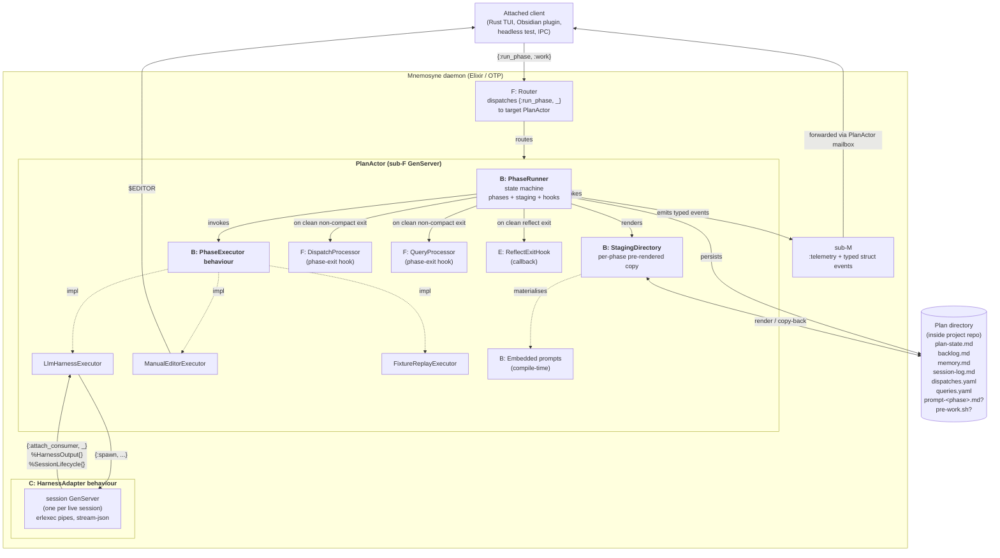
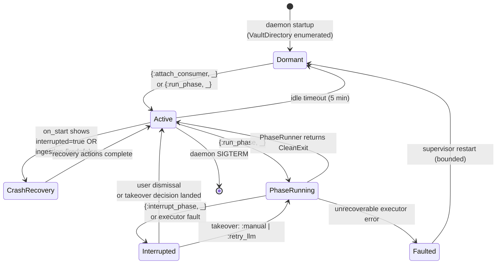

# Sub-project B — Phase Cycle Reimplementation in Elixir

> Brainstormed 2026-04-12 via the `superpowers:brainstorming` skill. Design
> rewritten inline in Session 12 (2026-04-15) of the `mnemosyne-orchestrator`
> plan to absorb three upstream shifts:
> (a) LLM_CONTEXT's 2026-04 four-phase overhaul,
> (b) sub-F's persistent BEAM daemon + actor commitment (Session 9),
> (c) the BEAM PTY spike findings (Session 10) that validate pipes-only
> `erlexec` and the sliding-buffer sentinel matcher.
> The original Rust framing has been replaced wholesale; history is
> preserved in Appendix A's Decision Trail, not as a supersede layer.

---

## Overview

Sub-project B designs the **four-phase cycle state machine**, **executor
behaviour**, **staging directory mechanism**, **placeholder substitution**,
and **`plan-state.md` file format** that together replace
`LLM_CONTEXT/run-plan.sh` with Elixir code owned by the Mnemosyne daemon.

B's code runs **inside a `PlanActor` GenServer** (sub-project F). The
daemon's OTP supervision tree spawns one PlanActor per opened plan; B's
`PhaseRunner` state machine is the actor's core phase-transition logic.
Attached clients (the Rust TUI, the Obsidian plugin in v1.5+, test
harnesses) send `{:run_phase, next_phase}` messages over the client
socket protocol; the PlanActor routes them to `PhaseRunner`, which
executes the full phase and emits typed `%Mnemosyne.Event.*{}` events
back across the mailbox to every attached consumer.

The design is:

- A **four-phase cycle**: `work → reflect → compact → triage → work`.
  Compact is **conditionally skipped** when `wc -w memory.md <=
  compact-baseline + HEADROOM` (global constant, initially 1500 words).
  Reflect always writes `compact` as its nominal next phase; the runner
  decides at compact-entry whether to invoke the compact executor or
  transition directly to triage. The LLM never decides "is compaction
  needed." Compact is **strictly lossless** — only reflect may prune
  memory.md content.
- A **`PhaseRunner` state machine** embedded in the PlanActor. Phase
  transitions arrive as `{:run_phase, _}` messages; the runner performs
  its 13-step `run_phase/4` flow (validate, render staging, update
  state, emit events, invoke executor, copy back, compute next,
  persist, emit exit, fire reflect hook, run dispatch/query processors,
  cleanup).
- A **pluggable `PhaseExecutor` behaviour** with three concrete
  implementors in v1 — `LlmHarnessExecutor`, `ManualEditorExecutor`,
  `FixtureReplayExecutor`. Every phase execution flows through the same
  runner chokepoint, making the co-equal-actors principle a type-level
  guarantee rather than a documentation promise.
- A **staging directory mechanism** that pre-renders plan files with
  `{{DEV_ROOT}}`, `{{PROJECT}}`, `{{PLAN}}`, `{{PROMPTS}}`, and
  `{{VAULT_CATALOG}}` placeholders substituted to absolute paths (or, for
  the catalog, to the vault catalog's current content) before the
  executor sees them. Copy-back on clean exit propagates edits back to
  the canonical plan directory with reverse substitution on `.md` files.
- A **`plan-state.md` file** (markdown with YAML frontmatter) that
  replaces the legacy `phase.md` single-word format. Schema is pruned
  per sub-F's coordination requirement — fields derivable from the
  filesystem path (`plan-id`, `host-project`, `dev-root`) are **not**
  stored; `description:` (≤120 characters, hard-capped) is required;
  `mnemosyne-pid` is renamed `daemon-pid` to reflect the BEAM runtime.
- **Phase composition** via shared phase files + optional per-plan
  overrides: a phase prompt is produced by taking the embedded
  `phases/<phase>.md` and appending the plan's optional
  `prompt-<phase>.md`, then substituting placeholders. Overrides are
  **additive only** — plans cannot replace the shared phase content.
- An **optional `pre-work.sh` executable hook** at `<plan>/pre-work.sh`.
  Invoked from the project root before every work phase (never before
  reflect, compact, or triage), after the defensive
  `rm -f latest-session.md` cleanup. Non-zero exit aborts the whole
  cycle as a hard error.
- **Phase-exit hooks owned by sub-F**: `DispatchProcessor` and
  `QueryProcessor` run after `work`, `reflect`, and `triage`
  (**not** after `compact` — compact is strictly lossless memory
  rewriting, and files outside `memory.md` are out of its scope). Both
  processors read `<plan>/dispatches.yaml` and `<plan>/queries.yaml`
  respectively, route entries via F's router, and delete the files on
  full success.
- **A post-reflect ingestion hook** for sub-project E. B fires E's
  pipeline non-blockingly on clean reflect exit, with exactly-once
  semantics via the `ingestion-fired` frontmatter flag.
- **ISO 8601 UTC-with-seconds session-log timestamps**. `latest-session.md`
  is written by the LLM during the work phase; the runner appends it to
  `session-log.md` after a clean work exit; the defensive
  `rm -f latest-session.md` at work-entry ensures no stale content
  poisons the next cycle. No LLM phase ever reads `session-log.md`.
- **Embedded prompts** vendored from LLM_CONTEXT's current upstream
  shape at `Mnemosyne/prompts/`: `phases/{work,reflect,compact,triage}.md`
  plus `fixed-memory/{coding-style,coding-style-rust,memory-style}.md`
  plus `create-plan.md`. Compiled into the daemon's beam files at
  compile time via Elixir's `@external_resource` + `File.read!/1`
  pattern. The `{{PROMPTS}}` placeholder materialises the embedded
  content into the per-phase staging directory, preserving the
  upstream `phases/` and `fixed-memory/` subdirectory layout.
- **No B-owned TUI.** The TUI is a separate Rust client binary (sub-F)
  that connects to the daemon over `<vault>/runtime/daemon.sock` and
  speaks NDJSON. B's responsibility ends at the PlanActor's message
  contract; the TUI consumes typed events and issues action messages
  entirely across the socket. B ships zero rendering code.

The design assumes: sub-F's actor model, client socket protocol,
vault catalog, and dispatch/query message types (design complete,
`2026-04-14-sub-F-hierarchy-design.md`); sub-C's Elixir harness
adapter contracts (rewritten inline in Session 11,
`2026-04-13-sub-C-adapters-design.md`); sub-E's ingestion pipeline
(pending F amendment to re-cast Stage 5 as dispatch-to-experts);
sub-A's vault discovery + `mnemosyne.toml` identity marker (design
complete); and sub-M's hybrid `:telemetry` + typed struct events
pattern (pending F amendment).

---

## Table of Contents

1. [Scope and Goals](#1-scope-and-goals)
2. [Architecture](#2-architecture)
3. [Runtime Lifecycle](#3-runtime-lifecycle)
4. [External Interfaces](#4-external-interfaces)
5. [Testing, Risks, Integration, Open Questions](#5-testing-risks-integration-open-questions)
6. [Cross-sub-project Requirements](#6-cross-sub-project-requirements)
7. [Appendix A — Decision Trail](#appendix-a--decision-trail)
8. [Appendix B — Dependency footprint (`mix.exs`)](#appendix-b--dependency-footprint-mixexs)
9. [Appendix C — Glossary](#appendix-c--glossary)

---

## 1. Scope and Goals

### 1.1 In scope

- The **`PhaseRunner` state machine** and its 13-step `run_phase/4` flow,
  embedded inside a `PlanActor` GenServer.
- The **four-phase cycle** covering
  `work → reflect → compact → triage → work` transitions, the
  conditional compact-trigger check, and the preconditions for
  sub-project E's reflect-exit hook firing.
- The **`PhaseExecutor` behaviour and three concrete implementors**:
  `LlmHarnessExecutor`, `ManualEditorExecutor`, `FixtureReplayExecutor`.
- The **`StagingDirectory` module** for pre-rendering plan files with
  all five placeholders substituted, plus the copy-back flow that
  propagates executor-driven edits back to the canonical plan directory
  with reverse substitution.
- **Forward and reverse placeholder substitution** for the placeholder
  set: `{{DEV_ROOT}}`, `{{PROJECT}}`, `{{PLAN}}`, `{{PROMPTS}}`,
  `{{VAULT_CATALOG}}`.
- The **`plan-state.md` file format** (markdown with YAML frontmatter),
  schema versioning, and its role as the crash-recovery linchpin and
  Dataview-facing public interface.
- **Phase composition**: embedded `phases/<phase>.md` + optional per-plan
  `prompt-<phase>.md` override. Overrides are additive; plans cannot
  replace the shared phase content.
- The **optional `pre-work.sh` executable hook**: contract, invocation
  point, and abort semantics.
- The **interrupted and takeover flow**: signal propagation, staging
  preservation, three-option user prompt (`y`/`n`/`retry-llm`).
- **Crash recovery** at daemon startup for three scenarios: interrupted
  phase, clean reflect without ingestion, clean state.
- The **consumption contracts with sub-C** (§11.1 of the Session-11
  rewrite): `%Mnemosyne.Event.SessionLifecycle{}` pattern-matching as
  protocol-level signals, and a sliding-buffer sentinel matcher over
  `%HarnessOutput{kind: :stdout}` events as the task-level completion
  detector. The sentinel matcher lives in B because sentinels are
  coupled to phase prompts.
- The **consumption contracts with sub-F**: B runs inside a PlanActor;
  `DispatchProcessor` and `QueryProcessor` are invoked as phase-exit
  hooks after work, reflect, and triage (not compact).
- The **post-reflect ingestion hook** (for sub-project E): the
  behaviour callback, exactly-once semantics, and non-blocking
  invocation.
- **ISO 8601 UTC-with-seconds session-log timestamps** and the
  latest-session.md write-then-append pattern.
- The **embedded prompts module**: compile-time embedding of the
  LLM_CONTEXT vendor list, `materialise_into/1` helper,
  `phases/` + `fixed-memory/` subdirectory preservation.
- The **vault runtime directory** entries B owns: staging dirs,
  interrupted forensics, per-plan state files. (The socket,
  mailboxes, routing module, and catalog are sub-F's territory; B
  consumes them by reference, not by writing them.)

### 1.2 Deliberately out of scope

- **Harness child session spawning, pipes-based `erlexec` lifecycle,
  tool profile enforcement, sentinel matcher transport, fixture replay
  adapter internals** — sub-project C (rewritten for Elixir in
  Session 11). B consumes C's session GenServer via
  `attach_consumer/2` and `handle_info/2` pattern matching; B owns the
  sentinel matcher logic, C owns the transport.
- **Post-session knowledge ingestion pipeline** — sub-project E. B
  exposes only the reflect-exit hook contract (§4.2) that E
  subscribes to. B does not observe ingestion failures or cache
  absorption outcomes.
- **Plan hierarchy, path-based qualified IDs, vault catalog content,
  dispatch/query file formats, declarative routing, Level 2 agents** —
  sub-project F. B provides the `plan-state.md` marker rule and the
  descent invariant; F owns everything else about plan structure,
  inter-plan messaging, and cross-plan reasoning.
- **Per-actor mailboxes, supervision tree, daemon lifecycle
  (start/stop/shutdown), client socket protocol, client connection
  management** — sub-project F.
- **Daemon singleton lock, external-tool concurrency** —
  sub-project D (scope collapsed by F's daemon commitment from
  per-plan locks to a single daemon-wide lock plus advisory
  coordination with external editors and git).
- **Vault location, discovery chain, identity marker,
  `mnemosyne.toml` schema** — sub-project A. B consumes the vault
  root by reference from the daemon's startup configuration.
- **TUI implementation, terminal rendering, keybindings** — sub-F's
  separate Rust TUI client binary. B is not in the rendering loop;
  B emits typed events and receives action messages through the
  PlanActor's message interface.
- **Plan migration from `phase.md` + `LLM_STATE/` layout to
  `plan-state.md` + `mnemosyne/project-root/`** — sub-project G.
- **Knowledge store format, Tier 1/2 organization, expert
  declarations** — sub-projects A (store) and N (experts).
- **Obsidian plugin client, terminal plugin spike** — sub-projects
  K and L (v1.5+).
- **Integration of legacy Claude Code skills** — sub-project H.
- **Mixture of models, per-actor model selection, local model
  adapters** — sub-project O (v1.5+).
- **Team mode, multi-daemon transport, cross-daemon auth** —
  sub-project P (v2+).
- **Slash commands or any harness-side user-facing control surface** —
  explicitly forbidden (see Appendix A Q10).

### 1.3 Goals, in priority order

1. **Close the substitution gap.** The LLM must never see a raw
   `{{PROJECT}}`, `{{PLAN}}`, `{{DEV_ROOT}}`, `{{PROMPTS}}`, or
   `{{VAULT_CATALOG}}` placeholder in any file it reads during a
   phase. The staging directory mechanism (§2.3 `StagingDirectory`) is
   how B meets this goal structurally rather than through prompt-time
   LLM discipline.

2. **Four-phase cycle as first-class state.** `compact` is not a
   retrofit — it is part of the cycle enum and part of the
   `PhaseRunner` state machine. The conditional trigger runs at
   compact-entry (not inside the phase executor) so the LLM never has
   to decide "is compaction needed" — the runner decides and either
   invokes the compact executor or transitions directly to triage.
   Compact is strictly lossless; reflect is the only phase that may
   prune memory.md content.

3. **Type-level co-equal-actors.** LLM-driven and human-driven phase
   executions flow through exactly the same `run_phase/4` chokepoint,
   hitting the same hooks and emitting the same typed events. The only
   permissible difference between an LLM-mode and a human-mode phase
   execution is the `executor_kind:` field on emitted events. The
   `PhaseExecutor` behaviour is what makes this a type-level
   invariant, not a documentation promise.

4. **PlanActor-hosted phase cycle.** `PhaseRunner` runs **inside** the
   PlanActor GenServer; phase transitions arrive as `{:run_phase, _}`
   messages. The runner does not spawn its own processes, own its own
   event channels, or manage its own supervision. The PlanActor is the
   owner; B is the state machine embedded in it. Fault isolation,
   mailbox serialization, and attach-consumer semantics all come from
   the PlanActor and OTP, not from B.

5. **Crash-survivable plan state.** Daemon crashing mid-phase must
   leave enough durable state on disk for a restart to resume cleanly
   without double-firing or missing sub-project E's ingestion pipeline.
   The `ingestion-fired` boolean in `plan-state.md`'s frontmatter is
   the crash-recovery linchpin: it flips from `false` to `true` at
   the start of E's Stage 5 (before any store writes), so restart
   after a crash between reflect's clean exit and ingestion's
   completion fires the pipeline exactly once on the stale plan
   outputs.

6. **Dogfood-ready v1.** V1 must be good enough to host the
   orchestrator seed plan and sub-project E's sibling plan — retiring
   `run-plan.sh` for these two plans is what validates that the
   daemon works. Migration of the four legacy LLM_CONTEXT projects
   (APIAnyware-MacOS, GUIVisionVMDriver, Modaliser-Racket, RacketPro)
   is sub-project G's concern, not B's.

7. **Obsidian-native file formats by committed design.** Every file
   B writes in a plan directory or in the vault runtime is markdown
   with YAML frontmatter where machine-readable metadata is needed;
   wikilinks are used instead of filesystem paths where
   cross-references exist; tags are first-class metadata; Dataview
   can query any plan or runtime surface with a single table. The
   file formats B produces are stable public interfaces, not
   incidental internal representations.

8. **Self-contained from `LLM_CONTEXT/`.** The running Mnemosyne
   daemon has zero runtime dependency on a sibling `LLM_CONTEXT/`
   directory existing. The vendored copies of the upstream phase
   files, fixed-memory files, and `create-plan.md` live inside the
   Mnemosyne source tree at `Mnemosyne/prompts/`, are embedded into
   the daemon's beam files at compile time via `@external_resource`
   + `File.read!/1`, and are surfaced to phase prompts through the
   `{{PROMPTS}}` placeholder.

9. **Hard errors by default.** Every unexpected condition, invariant
   violation, I/O failure, and ambiguous state fails hard with a
   clear diagnostic. Illegal phase transitions, schema version
   mismatches, copy-back rejections, `pre-work.sh` non-zero exits,
   sentinel matcher overflows, and hook-level failures all raise
   with a forensic context captured under
   `<vault>/runtime/interrupted/`.

### 1.4 Non-goals

- **Bidirectional LLM session suspend/resume.** Once a phase is
  interrupted, the session is terminated; takeover is a new executor
  invocation (human or LLM) on the same plan state. Not losing
  in-flight LLM reasoning is actively a feature per the fresh-context
  principle, not a cost to engineer around.
- **Mid-phase executor swapping.** The executor is chosen at
  phase-invocation time and held until the phase exits.
- **Cross-plan multiplexing within one PlanActor.** One PlanActor
  hosts exactly one plan. Sibling plans are sibling PlanActors under
  F's `ActorSupervisor`.
- **Continuous filesystem watching for vault changes.** The daemon
  does not watch the dev root for new project repos or new plans
  appearing. Users run the daemon's rescan command or restart the
  daemon to refresh.
- **Customisable embedded prompts in v1.** The vendored
  prompt-reference content at `Mnemosyne/prompts/` is embedded at
  compile time and cannot be overridden at runtime. V2 may add a
  config-driven override; v1 enforces "use what ships with the
  daemon binary."
- **Windows as a v1 target.** V1 targets macOS and Linux. Windows
  is deferred to a future portability sub-project. Symlink creation
  on Windows requires Developer Mode or elevated permissions and is
  out of scope.

---

## 2. Architecture

### 2.1 High-level diagram



Solid lines are runtime data flow; dashed lines are type-level
"implements" or "materialises-from." The critical architectural
property: B does not hold references to harness-adapter internals or to
clients. The PlanActor owns those references. B's `PhaseRunner` issues
intent (`invoke executor`, `emit event`, `fire hook`) and the PlanActor
fulfils it through its own mailbox and consumer-attachment lifecycle.

### 2.2 Modules and responsibilities

| Module | Responsibility |
|---|---|
| `Mnemosyne.PhaseRunner` | State machine: 13-step `run_phase/4` + `interrupt/1`. Pure logic; no process spawning. Called from inside `Mnemosyne.PlanActor`. |
| `Mnemosyne.PlanState` | Load/persist `plan-state.md` (markdown with YAML frontmatter). Atomic write-to-temp-then-rename. Hard-error rejection for unknown `schema-version` and for `description:` overflow. |
| `Mnemosyne.StagingDirectory` | `render/4`, `copy_back/2`, `preserve_on_interrupt/2`, `cleanup/1`. Enforces the descent invariant and the symlink-into-project-repo rejection. |
| `Mnemosyne.PhaseExecutor` | `@behaviour` with three concrete implementors below. |
| `Mnemosyne.PhaseExecutor.LlmHarness` | Builds a `%Mnemosyne.Event.HarnessOutput{}` consumer via `attach_consumer/2`, runs the sliding-buffer sentinel matcher, emits `{:phase_completion_detected, sentinel}` to the runner, consumes `%SessionLifecycle{transition: {:exited, _}}` as the protocol-level terminal signal. |
| `Mnemosyne.PhaseExecutor.ManualEditor` | Writes `phase-prompt.readonly.md`, resolves target files per phase, spawns `$EDITOR` synchronously. No sentinel matcher (editor exit is the signal). |
| `Mnemosyne.PhaseExecutor.FixtureReplay` | Walks a JSON-Lines fixture, emits `%HarnessOutput{}` events via the same consumer-attachment contract the LLM executor uses. Dev/test only. |
| `Mnemosyne.Prompts` | Compile-time embedding of vendored phase files, fixed-memory files, and `create-plan.md`. Exposes per-file binaries and `materialise_into/1`. |
| `Mnemosyne.Substitution` | Pure forward/reverse substitution functions against the five placeholders. Longest-match-first reverse ordering. |
| `Mnemosyne.Sentinel.SlidingBuffer` | The task-level completion matcher validated by the BEAM PTY spike. Window bounded to `sentinel_size - 1` bytes. |
| `Mnemosyne.PreWorkHook` | Executable-file probe + invocation + exit-code check for `<plan>/pre-work.sh`. Only before work. |

Plan hierarchy discovery, the vault catalog, `Mnemosyne.Router`,
`Mnemosyne.PlanActor`, `Mnemosyne.Event.*` definitions, the
`DispatchProcessor`, the `QueryProcessor`, the client socket
protocol, and the Rust TUI client all live under sub-project F's
scope. B references them by name.

### 2.3 The core types

All types are Elixir structs. None of them are GenServers; none of
them own processes. They are values passed through `PhaseRunner` and
persisted via `PlanState.persist/2`.

#### 2.3.1 `PlanContext`

Represents one open plan. Held in the PlanActor's GenServer state for
the lifetime of the actor. Materialised once when the actor starts
from the filesystem.

```elixir
defmodule Mnemosyne.PlanContext do
  @enforce_keys [:plan_dir, :vault_root, :resolved, :state]
  defstruct [
    :plan_dir,        # canonical path inside project repo (never symlinked)
    :vault_root,      # resolved Mnemosyne vault root (from sub-A)
    :resolved,        # %ResolvedPaths{} — all five placeholders pre-resolved
    :state,           # %PlanState{} — parsed plan-state.md contents
    :compact_baseline # integer word count (sticky, updated on successful compact)
  ]
end

defmodule Mnemosyne.ResolvedPaths do
  @enforce_keys [:dev_root, :project, :plan, :prompts, :vault_catalog]
  defstruct [
    :dev_root,      # absolute path, string
    :project,       # absolute path of host project, string
    :plan,          # absolute path of canonical plan directory, string
    :prompts,       # staging-root-relative, string (populated per-phase)
    :vault_catalog  # absolute path to <vault>/plan-catalog.md (from F)
  ]
end
```

Notes on what is **not** in this struct:

- No `plan_id` — the qualified ID is a pure function of `plan_dir`
  relative to `<vault>/projects/` and is computed on demand by F's
  helpers, not cached here.
- No `host_project` — derivable from the path. Stored values drift;
  the filesystem is authoritative.
- No `dev_root` beyond `resolved.dev_root` — the substitution value is
  the only use case.
- No per-plan lock handle — F collapses per-plan locks into a single
  daemon-wide singleton lock (see sub-D's collapsed scope).
- No `daemon_pid` — the actor's own PID is managed by the PlanActor
  GenServer; the frontmatter `daemon-pid` field is written by the
  runner at phase start from `self()`.

The `resolved.prompts` field is populated by
`StagingDirectory.render/4` during phase execution and cleared on
phase exit. Any code that reads it outside `PhaseRunner.run_phase/4`
is a hard error. `resolved.vault_catalog` is stable for the actor's
lifetime and refreshes when the catalog file's mtime changes
(detected by F's `CatalogRenderer` at phase-prompt render time).

#### 2.3.2 `PlanState` and `plan-state.md`

`plan-state.md` is a markdown file with YAML frontmatter. Frontmatter
holds all machine-readable state; the body is a short human-readable
description B writes at plan creation and otherwise leaves alone.
Dataview queries against the frontmatter produce multi-plan dashboards
spanning every plan across every project in the vault.

Example file:

```markdown
---
schema-version: 1
description: Four-phase cycle in Elixir — PhaseRunner, StagingDirectory, embedded prompts.
current-phase: reflect
started-at: 2026-04-15T14:22:18Z
harness-session-id: reflect-sub-B-phase-cycle-Mnemosyne
daemon-pid: 48291
interrupted: false
compact-baseline: 2840
tags:
  - mnemosyne-plan
  - phase-reflect
last-exit:
  phase: work
  exited-at: 2026-04-15T14:10:02Z
  clean-exit: true
  ingestion-fired: false
---

# Plan state for [[sub-B-phase-cycle]]

Auto-managed by Mnemosyne. Do not edit directly except for crash
recovery. Parent plan: [[mnemosyne-orchestrator]].
```

Parsed into:

```elixir
defmodule Mnemosyne.PlanState do
  @enforce_keys [:schema_version, :description, :current_phase]
  defstruct [
    :schema_version,      # integer, must be 1 for v1 binary
    :description,         # string, ≤120 chars, non-placeholder, hard-capped
    :current_phase,       # :work | :reflect | :compact | :triage
    :started_at,          # DateTime, ISO 8601 UTC
    :harness_session_id,  # string or nil
    :daemon_pid,          # integer or nil
    :interrupted,         # boolean, default false
    :compact_baseline,    # integer word count, updated post-compact
    :tags,                # list of strings
    :last_exit            # %LastExit{} or nil
  ]
end

defmodule Mnemosyne.LastExit do
  @enforce_keys [:phase, :exited_at, :clean_exit, :ingestion_fired]
  defstruct [
    :phase,              # :work | :reflect | :compact | :triage
    :exited_at,          # DateTime, ISO 8601 UTC
    :clean_exit,         # boolean
    :ingestion_fired     # boolean
  ]
end
```

The `current_phase` enum is the full four-phase set. `PlanState.load/1`
reads and parses via a YAML library (`yaml_elixir` or equivalent);
`PlanState.persist/2` serialises atomically via write-to-temp-then-rename.

**Load-time invariants (hard errors on violation):**

| Invariant | Hard error message |
|---|---|
| `schema-version` is a known integer | `{:error, :unknown_schema_version, seen}` |
| `description` is present | `{:error, :missing_description}` |
| `description` is ≤120 characters | `{:error, :description_too_long, seen, cap}` |
| `description` is not a placeholder (`TODO`, `FIXME`, `tbd`, `...`) | `{:error, :placeholder_description}` |
| `current-phase` is one of `work | reflect | compact | triage` | `{:error, :invalid_current_phase, seen}` |
| `last-exit.phase`, if present, is in the same enum | `{:error, :invalid_last_exit_phase, seen}` |

Field names use kebab-case in the YAML (Dataview-friendly) and snake_case
in the Elixir struct. Conversion happens in `PlanState.load/1` and
`PlanState.persist/2`.

**`ingestion-fired` is the exactly-once firing linchpin.** Sub-project
E's Stage 5 flips it from `false` to `true` as its very first action,
before any knowledge store writes. On daemon restart, if
`last_exit.phase == :reflect and last_exit.clean_exit and not
last_exit.ingestion_fired`, the ingestion pipeline fires on the stale
plan outputs one time. This is exactly-once firing with file-backed
durability and no database.

**`compact-baseline` is sticky.** It tracks the `wc -w memory.md`
value at the end of the most recent successful compact. The runner's
compact-trigger check (`wc -w memory.md > compact_baseline + HEADROOM`)
uses it to decide whether to invoke the compact executor or skip to
triage. `HEADROOM` is a global constant (`1500`) compiled into the
daemon. On successful compact exit, the runner writes the new
word count back to `compact-baseline`.

#### 2.3.3 `PhaseRunner`

The central state machine. Holds no process state; it is a pure
module invoked from inside `PlanActor`'s `handle_info/2` clause for
`{:run_phase, _}` messages.

```elixir
defmodule Mnemosyne.PhaseRunner do
  @type outcome ::
          {:ok, {:transitioned, next_phase :: Mnemosyne.Phase.t()}}
          | {:interrupted, forensics_dir :: String.t()}
          | {:executor_failed, reason :: term()}

  @spec run_phase(
          ctx :: Mnemosyne.PlanContext.t(),
          phase :: Mnemosyne.Phase.t(),
          executor :: module(),
          parent :: pid()
        ) :: outcome()

  @spec interrupt(runner_state :: map()) :: :ok
end
```

`run_phase/4` is the single chokepoint through which every phase
execution — LLM, human, fixture replay, any future executor — must
pass. It performs, in strict order:

1. **Validate the phase transition is legal** from
   `ctx.state.current_phase`. Legal forward transitions are
   `work → reflect`, `reflect → compact`, `compact → triage`,
   `triage → work`. Illegal transitions fail hard.
   **Exception**: when entering compact, the runner checks the
   compact-trigger condition and, if the trigger is not met, skips
   directly to triage without invoking any compact executor. The
   triage transition is still subject to the legality check
   (compact → triage) so the skip path preserves the state machine's
   forward direction.
2. **Check `pre-work.sh` hook** (only for `:work` phase). Probe
   `<plan>/pre-work.sh` for executability; if present and executable,
   first delete any stale `latest-session.md` (defensive cleanup),
   then invoke the hook synchronously from the project root. Non-zero
   exit or any I/O failure is a hard error; the phase aborts before
   staging is rendered. This matches LLM_CONTEXT's upstream contract.
3. **Render the staging directory** via
   `StagingDirectory.render(ctx.vault_runtime_dir, ctx.resolved,
   ctx.plan_dir, phase)`. The render call materialises embedded
   prompts, composes the phase prompt (shared phase file + optional
   per-plan override), substitutes all five placeholders, and stages
   the explicit project file allowlist.
4. **Update `ctx.state`**: set `current_phase` to the *incoming*
   phase, set `started_at` to now (ISO 8601 UTC), set
   `harness_session_id` (from the executor or nil) and `daemon_pid`
   (from `self()`). Persist atomically.
5. **Emit `%PhaseLifecycle{kind: :started, phase, executor_kind, at}`**
   as a typed `Mnemosyne.Event.*` struct via sub-M's `:telemetry`
   boundary. The PlanActor forwards it to every attached consumer.
6. **Invoke `executor.execute/3`** with `(ctx, staging, emit_fn)`,
   where `emit_fn` is a closure the runner provides so the executor
   can push streamed events without holding a direct reference to
   the event bus. The call blocks until the executor returns one of
   `:ok | {:interrupted, reason} | {:error, reason}`.
7. **On clean executor exit**: run
   `StagingDirectory.copy_back(staging, ctx.plan_dir)` to propagate
   any edits the executor made back to the canonical plan directory.
   Reject any write-back outside `{{PLAN}}` or the explicitly-staged
   project subtree as a hard error (the outcome becomes
   `:executor_failed` and staging is preserved for forensics).
8. **Compute the next phase.** For `work → reflect`,
   `reflect → compact`, `triage → work`, the mapping is unambiguous.
   For `compact → triage`, the runner writes the new `compact-baseline`
   from `wc -w memory.md` before transitioning. For the
   compact-skipped branch, next is `triage` directly (the compact
   phase is elided, not counted in `last-exit`).
9. **Post-work session-log append.** If the completed phase was
   `:work`, append the contents of `<plan>/latest-session.md` to
   `<plan>/session-log.md` via a write-to-temp-then-rename. If
   `latest-session.md` does not exist (the work phase wrote nothing),
   that is a soft warning, not a hard error, and the append is
   skipped. `latest-session.md` is deleted either way.
10. **Update `ctx.state.last_exit`** with the phase that just ran,
    `exited_at: now`, `clean_exit: true`, `ingestion_fired: false`.
    Set `current_phase` to the computed next phase. Persist
    atomically.
11. **Emit `%PhaseLifecycle{kind: :exited_clean, phase, transitioned_to, at}`**.
12. **If the completed phase was `:reflect`**, call
    `reflect_exit_hook.on_reflect_exit/1` (from sub-E). Non-blocking
    — the PlanActor dispatches it to a task under its own supervision
    so the runner can return control immediately.
13. **Run phase-exit hooks from sub-F** for non-compact phases
    (`:work`, `:reflect`, `:triage`):
    - `Mnemosyne.DispatchProcessor.process(ctx.plan_dir, emit_fn)`
    - `Mnemosyne.QueryProcessor.process(ctx.plan_dir, emit_fn)`
    Both are synchronous from the runner's perspective but are internally
    bounded by F's timeout config. Compact is skipped because compact's
    contract is "strictly lossless memory rewriting" and the phase
    never produces new dispatches or queries.
14. **Clean up the staging directory** if it was cleanly consumed.
15. **Return** `{:ok, {:transitioned, next_phase}}`.

On executor failure, steps 7–14 are skipped, and the outcome reports
the error with the staging dir preserved under
`<vault>/runtime/interrupted/<qualified-id>/<phase>-<timestamp>/` for
forensics. On interrupt, the interrupted-state flow from §3.4 takes
over. Every numbered step is a hard-error boundary: any unhandled
failure raises into the PlanActor, which catches the exit via its
supervisor and reports through sub-M's typed event pipeline.

#### 2.3.4 `PhaseExecutor` behaviour

```elixir
defmodule Mnemosyne.PhaseExecutor do
  @type phase_ctx :: %{
          plan: Mnemosyne.PlanContext.t(),
          staging: Mnemosyne.StagingDirectory.t(),
          phase: Mnemosyne.Phase.t()
        }

  @callback kind() :: :llm | :human | :fixture_replay

  @callback execute(
              phase_ctx(),
              emit_fn :: (Mnemosyne.Event.t() -> :ok)
            ) :: :ok | {:interrupted, reason :: term()} | {:error, reason :: term()}

  @callback interrupt(state :: term()) :: :ok
end
```

Three concrete implementors ship in v1:

**`LlmHarnessExecutor`** — consumes a `Mnemosyne.HarnessAdapter` (sub-C)
session GenServer. Its `execute/2`:

1. Reads the composed phase prompt from
   `<staging>/phase-prompt.md`.
2. Calls `adapter.spawn(spawn_args)` where `spawn_args` includes the
   tool profile (`:research_broad` for work/reflect/compact/triage,
   `:ingestion_minimal` for sub-E's internal reasoning sessions
   when B invokes them) plus the cmux-noise-mitigation flags
   mandated by sub-C (`--setting-sources project,local
   --no-session-persistence`).
3. Attaches as a consumer via `attach_consumer(session_pid, self())`.
4. Sends the phase prompt as a user-message envelope via
   `send_user_message(session_pid, prompt)`.
5. Enters a `receive` loop consuming:
   - `{:event, %Mnemosyne.Event.HarnessOutput{kind: :stdout} = ev}` —
     push to the runner's `emit_fn` **and** feed the sliding-buffer
     sentinel matcher. If the matcher fires, emit
     `{:phase_completion_detected, sentinel}` to the runner's own
     message queue (via `send(parent, ...)`) and proceed to
     graceful shutdown.
   - `{:event, %Mnemosyne.Event.SessionLifecycle{transition: :ready} = ev}`
     — forward unchanged.
   - `{:event, %Mnemosyne.Event.SessionLifecycle{transition:
     {:turn_complete, _}} = ev}` — forward unchanged. **Not** treated
     as end-of-phase; `result` is a protocol-level signal, not a
     task-level one.
   - `{:event, %Mnemosyne.Event.SessionLifecycle{transition:
     {:exited, reason}} = ev}` — forward, then return from `execute/2`
     with `:ok | {:error, reason}` depending on `reason`.
   - `{:interrupt, reason}` (from the runner in response to user
     action) — call `adapter.kill(session_pid, reason)` and await
     the `{:exited, _}` lifecycle event.
6. **The sentinel matcher is B's responsibility.** It reads the
   concrete sentinel for the current phase from the phase prompt's
   tail (the shared prompt files end with a phrase like "when
   finished say READY FOR THE NEXT PHASE") and runs a sliding-buffer
   match with window bounded to `sentinel_size - 1` bytes across
   every `%HarnessOutput{kind: :stdout}` event. The matcher is
   validated by the BEAM PTY spike against single-chunk, split,
   drip, false-prefix, and false-overlap cases.

**`ManualEditorExecutor`** — `execute/2`:

1. Writes the composed phase prompt to
   `<staging>/phase-prompt.readonly.md` as a reference file.
2. Determines the target file(s) for the phase:
   - `:work` → `backlog.md` plus creates an empty
     `latest-session.md` for the human to fill in.
   - `:reflect` → `memory.md` (reads `latest-session.md` as input
     via the phase prompt's `{{PLAN}}/latest-session.md` reference).
   - `:compact` → `memory.md` (lossless rewrite; the phase prompt
     carries the lossless-rewrite contract from
     `fixed-memory/memory-style.md`).
   - `:triage` → `backlog.md`.
3. Reads `$EDITOR` from the environment; hard-errors if unset.
4. Spawns `$EDITOR` synchronously on the target file(s) via
   `System.cmd/3` (bound to the controlling terminal via the
   PlanActor's io context). Awaits exit.
5. Returns `:ok` on clean exit, `{:error, {:editor_failed, code}}`
   on non-zero. `interrupt/1` is a no-op — the human closes the
   editor themselves.

No sentinel matcher. Editor exit is the signal.

**`FixtureReplayExecutor`** — `execute/2` reads a JSON-Lines fixture
file specified at executor construction time and emits
`%HarnessOutput{}` events through `emit_fn` with simulated pacing.
Used for deterministic end-to-end tests of `PhaseRunner` +
`StagingDirectory` + event plumbing without a live harness. Fixture
format is shared with sub-C's fixture-replay adapter.

The co-equal-actors principle is enforced by the behaviour: every
executor is called by `run_phase/4`, which fires hooks regardless of
executor kind. A test that exercises `run_phase/4` with
`ManualEditorExecutor` and a test that exercises it with
`LlmHarnessExecutor` both hit the same hook firing, the same state
transitions, the same event emission. The only permissible difference
between LLM mode and human mode is the `executor_kind:` field on
emitted events.

#### 2.3.5 `StagingDirectory`

The substitution gap closer. Wraps a per-phase staging directory
under `<vault>/runtime/staging/<qualified-id>/<phase>-<timestamp>/`.

```elixir
defmodule Mnemosyne.StagingDirectory do
  @enforce_keys [:root, :source_plan_dir, :source_project_dir, :resolved]
  defstruct [:root, :source_plan_dir, :source_project_dir, :resolved]

  @spec render(
          vault_runtime_dir :: String.t(),
          resolved :: Mnemosyne.ResolvedPaths.t(),
          plan_dir :: String.t(),
          phase :: Mnemosyne.Phase.t()
        ) :: {:ok, t()} | {:error, term()}

  @spec copy_back(
          t(),
          target_plan_dir :: String.t()
        ) :: {:ok, Mnemosyne.CopyBackReport.t()} | {:error, term()}

  @spec preserve_on_interrupt(
          t(),
          interrupted_root :: String.t()
        ) :: {:ok, String.t()} | {:error, term()}

  @spec cleanup(t()) :: :ok
end

defmodule Mnemosyne.CopyBackReport do
  defstruct files_updated: [], files_unchanged: [], files_added: [], files_rejected: []
end
```

`render/4` walks the plan directory, copies every file to the
staging root with **forward substitution** applied to `.md` files.
It also:

1. **Composes the phase prompt.** Reads the shared phase file
   (`Mnemosyne.Prompts.phase(phase)` — see §2.5) and appends the
   plan's optional `prompt-<phase>.md` override if present. The
   result is four-placeholder-substituted (`{{DEV_ROOT}}`,
   `{{PROJECT}}`, `{{PLAN}}`, `{{PROMPTS}}`) plus
   `{{VAULT_CATALOG}}`-substituted with the current vault catalog
   content (resolved via F's `CatalogRenderer`). The composed
   prompt is written to `<staging>/phase-prompt.md`, ready for
   executors to read.
2. **Materialises the embedded prompt-reference content** (via
   `Mnemosyne.Prompts.materialise_into/1`) into `<staging>/prompts/`
   as concrete files, preserving the `phases/` and `fixed-memory/`
   subdirectory layout. The `{{PROMPTS}}` placeholder resolves to
   `<staging>/prompts/`.
3. **Stages the narrow set of host-project files** referenced by
   the phase prompt. The staging allowlist is resolved at
   prompt-parse time by scanning the composed phase prompt for
   `{{PROJECT}}/...` tokens; exactly those files are staged. A
   default allowlist covers `README.md` and any explicitly-referenced
   file under `<project>/docs/`. No blanket project-tree staging.
4. **Never follows symlinks into project repos.** A symlink whose
   target is outside the plan directory is a hard error. This
   prevents accidental exfiltration of unrelated project content
   into the LLM's view.
5. **Refuses to descend into child plan directories.** Any
   subdirectory containing a `plan-state.md` marker is skipped
   entirely. The staging copy contains only the current plan's
   files, not any of its nested children's. This is the critical
   invariant that keeps "one plan per PlanActor" intact against the
   nested filesystem hierarchy. Sub-plans are opened through their
   own PlanActor instances (each with its own `PlanContext` and
   its own staging).
6. **Refuses to descend into the `knowledge/` sibling** at
   `<project>/mnemosyne/knowledge/`. This is covered by the
   marker-based invariant (knowledge/ never contains
   `plan-state.md`) but is called out explicitly because the walker
   starts at `<project>/mnemosyne/project-root/` for root plans and
   would otherwise be confused by the sibling directory structure.

`copy_back/2` walks the staging root after executor exit, compares
each file against the canonical plan directory via content hash,
applies **reverse substitution** on `.md` files only, and writes
through changed files atomically. Files outside `{{PLAN}}` or the
allowed project subtree are rejected (not copied back) and reported
as hard errors. The phase outcome becomes `:executor_failed` and the
staging directory is preserved for forensics.

`preserve_on_interrupt/2` moves the staging directory to
`<vault>/runtime/interrupted/<qualified-id>/<phase>-<timestamp>/staging/`
via a rename-based move. `cleanup/1` deletes the staging directory on
clean phase exit via a recursive delete; both operations are idempotent.

### 2.4 Placeholder substitution

Five placeholders participate in substitution:

| Placeholder | Resolves to | Source |
|-------------|-------------|--------|
| `{{DEV_ROOT}}` | Absolute path of the dev root | Computed at PlanActor start from the vault location |
| `{{PROJECT}}` | Absolute path of the host project root | Computed at PlanActor start from `plan_dir` |
| `{{PLAN}}` | Absolute path of the canonical plan directory | Known at PlanActor start |
| `{{PROMPTS}}` | Staging-relative path to materialised embedded prompts (e.g. `<staging>/prompts`) | Computed per-phase at `StagingDirectory.render/4` |
| `{{VAULT_CATALOG}}` | Full content of `<vault>/plan-catalog.md` at render time | Read via F's `CatalogRenderer` at `StagingDirectory.render/4` |

**Forward substitution** happens in two places:

1. **In the composed phase prompt** (`<staging>/phase-prompt.md`).
   The composed prompt is substituted with all five placeholders
   before being written.
2. **In every `.md` file under the plan directory staged to
   staging.** Plan files (`backlog.md`, `memory.md`,
   `session-log.md`, `plan-state.md`) may contain references to
   `{{PROJECT}}/docs/...` or similar tokens; these are substituted
   in-place in the staged copies.

**Reverse substitution** on copy-back rewrites resolved absolute
paths back to placeholder form so the canonical files stay portable
across machines. Longest-match-first ordering is load-bearing:

```
for each .md file in staging:
    1. longest-match first: replace resolved({{PLAN}}) → {{PLAN}}
    2. then: replace resolved({{PROJECT}}) → {{PROJECT}}
    3. then: replace resolved({{DEV_ROOT}}) → {{DEV_ROOT}}
```

`{{PROMPTS}}` and `{{VAULT_CATALOG}}` are **forward-only**. Their
resolved values are per-phase or per-render and never appear in
canonical plan files, so reverse substitution does not touch them.

**Mitigation for substring collisions:** substitute only in `.md`
files; substitute only the specific well-known placeholder tokens,
not any string that happens to match a resolved path; log every
reverse substitution to the staging-directory forensic log so users
can audit if anything looks wrong.

### 2.5 Embedded prompts

The daemon has zero runtime dependency on a sibling `LLM_CONTEXT/`
directory. The vendored prompt-reference content lives at
`Mnemosyne/prompts/` and is compiled into the daemon's beam files
at compile time.

Vendored files (this is the **forward-compatibility chokepoint** for
LLM_CONTEXT evolution — every upstream change that adds a shared file
must either land here or be explicitly scoped out):

```
Mnemosyne/prompts/
├── phases/
│   ├── work.md
│   ├── reflect.md
│   ├── compact.md
│   └── triage.md
├── fixed-memory/
│   ├── coding-style.md
│   ├── coding-style-rust.md
│   └── memory-style.md
└── create-plan.md
```

The pre-overhaul filenames `backlog-plan.md` and
`create-a-multi-session-plan.md` are **deleted/renamed upstream** and
must not appear in the vendor list or in `Mnemosyne.Prompts`.

Elixir compile-time embedding pattern:

```elixir
defmodule Mnemosyne.Prompts do
  # Tell the compiler to track these files so `mix compile` rebuilds
  # the module when they change.
  @external_resource Path.join(__DIR__, "../../prompts/phases/work.md")
  @external_resource Path.join(__DIR__, "../../prompts/phases/reflect.md")
  @external_resource Path.join(__DIR__, "../../prompts/phases/compact.md")
  @external_resource Path.join(__DIR__, "../../prompts/phases/triage.md")
  @external_resource Path.join(__DIR__, "../../prompts/fixed-memory/coding-style.md")
  @external_resource Path.join(__DIR__, "../../prompts/fixed-memory/coding-style-rust.md")
  @external_resource Path.join(__DIR__, "../../prompts/fixed-memory/memory-style.md")
  @external_resource Path.join(__DIR__, "../../prompts/create-plan.md")

  # Read once at compile time; baked into the beam file as literal binaries.
  @phase_work         File.read!(Path.join(__DIR__, "../../prompts/phases/work.md"))
  @phase_reflect      File.read!(Path.join(__DIR__, "../../prompts/phases/reflect.md"))
  @phase_compact      File.read!(Path.join(__DIR__, "../../prompts/phases/compact.md"))
  @phase_triage       File.read!(Path.join(__DIR__, "../../prompts/phases/triage.md"))
  @coding_style       File.read!(Path.join(__DIR__, "../../prompts/fixed-memory/coding-style.md"))
  @coding_style_rust  File.read!(Path.join(__DIR__, "../../prompts/fixed-memory/coding-style-rust.md"))
  @memory_style       File.read!(Path.join(__DIR__, "../../prompts/fixed-memory/memory-style.md"))
  @create_plan        File.read!(Path.join(__DIR__, "../../prompts/create-plan.md"))

  def phase(:work),    do: @phase_work
  def phase(:reflect), do: @phase_reflect
  def phase(:compact), do: @phase_compact
  def phase(:triage),  do: @phase_triage

  @spec materialise_into(prompts_dir :: String.t()) :: :ok
  def materialise_into(prompts_dir) do
    File.mkdir_p!(Path.join(prompts_dir, "phases"))
    File.mkdir_p!(Path.join(prompts_dir, "fixed-memory"))

    File.write!(Path.join(prompts_dir, "phases/work.md"), @phase_work)
    File.write!(Path.join(prompts_dir, "phases/reflect.md"), @phase_reflect)
    File.write!(Path.join(prompts_dir, "phases/compact.md"), @phase_compact)
    File.write!(Path.join(prompts_dir, "phases/triage.md"), @phase_triage)
    File.write!(Path.join(prompts_dir, "fixed-memory/coding-style.md"), @coding_style)
    File.write!(Path.join(prompts_dir, "fixed-memory/coding-style-rust.md"), @coding_style_rust)
    File.write!(Path.join(prompts_dir, "fixed-memory/memory-style.md"), @memory_style)
    File.write!(Path.join(prompts_dir, "create-plan.md"), @create_plan)

    :ok
  end
end
```

`StagingDirectory.render/4` calls
`Mnemosyne.Prompts.materialise_into(Path.join(staging.root, "prompts"))`
as part of its render sequence. Phase prompts reference the
materialised files via `{{PROMPTS}}/phases/reflect.md`,
`{{PROMPTS}}/fixed-memory/memory-style.md`, etc.

**`memory-style.md` is read by both reflect and compact.** Reflect is
lossy-pruning; compact is strictly lossless rewriting. Both read the
same `memory-style.md` so the rules stay consistent across phases.
This is a core LLM_CONTEXT design invariant and must be preserved in
B's phase prompt authoring.

**Customisation is v2.** V1 enforces "use what ships with the daemon
binary." The bootstrap discipline constraint specifically forbids
customisation at v1 as a means of forcing honest dogfooding against
a shared prompt baseline.

### 2.6 Dev-root layout and the Mnemosyne vault

Each project has one Mnemosyne-owned directory (`<project>/mnemosyne/`)
holding both the plan tree (rooted at `project-root/`) and Tier 1
knowledge (as a sibling directory). The vault has one symlink per
project targeting `<project>/mnemosyne/`.

```
<dev-root>/
├── Mnemosyne-vault/                       # sub-A owns; B references
│   ├── .git/
│   ├── .obsidian/                         # shipped template
│   ├── mnemosyne.toml                     # sub-A identity marker
│   ├── daemon.toml                        # sub-F daemon config
│   ├── routing.ex                         # sub-F declarative routing module
│   ├── plan-catalog.md                    # sub-F auto-generated catalog
│   ├── knowledge/                         # Tier 2 global knowledge (sub-A)
│   ├── experts/                           # sub-N expert declarations
│   ├── projects/                          # sub-F symlinks
│   │   ├── Mnemosyne → ../../Mnemosyne/mnemosyne/
│   │   └── APIAnyware-MacOS → ../../APIAnyware-MacOS/mnemosyne/
│   └── runtime/
│       ├── daemon.sock                    # sub-F client socket
│       ├── daemon.lock                    # sub-D singleton lock
│       ├── mailboxes/                     # sub-F persisted messages
│       ├── staging/<qualified-id>/        # B staging dirs (ephemeral)
│       ├── interrupted/<qualified-id>/    # B forensics (versioned)
│       ├── ingestion-events/              # sub-E events
│       └── snapshots/                     # sub-F actor snapshots
└── <project>/
    ├── .git/
    └── mnemosyne/                         # per-project role directory
        ├── knowledge/                     # Tier 1 per-project
        └── project-root/                  # sub-F reserved root plan
            ├── plan-state.md              # required marker (B format)
            ├── backlog.md
            ├── memory.md
            ├── session-log.md
            ├── latest-session.md          # transient, work-phase only
            ├── dispatches.yaml            # sub-F transient
            ├── queries.yaml               # sub-F transient
            ├── pre-work.sh                # optional, B hook
            ├── prompt-work.md             # optional per-plan override
            └── sub-B-phase-cycle/         # nested child plan
                ├── plan-state.md
                └── ...
```

**B's runtime footprint** is narrow:

- `runtime/staging/<qualified-id>/<phase>-<ts>/` (ephemeral, gitignored)
- `runtime/interrupted/<qualified-id>/<phase>-<ts>/` (versioned, forensic)
- `plan-state.md` writes at `<project>/mnemosyne/.../<plan>/`
- `backlog.md`, `memory.md`, `session-log.md`, `latest-session.md`
  writes inside the plan directory (via copy-back from staging,
  except the session-log append and latest-session deletion which
  are direct writes from the runner)

Everything else in `runtime/` belongs to F, D, E, or A.

**Git boundaries:** project repos are sovereign — B only writes files
inside `<project>/mnemosyne/` and never touches `<project>/.git`. The
Mnemosyne vault is its own git repo (managed by sub-A), versioning
knowledge + interrupted forensics + ingestion events, and gitignoring
staging + locks + socket + mailboxes + snapshots + symlinks.

### 2.7 Session log and `latest-session.md`

`session-log.md` is the audit trail of past cycles, one entry per
completed session. Entries use ISO 8601 UTC-with-seconds timestamps:

```markdown
### Session 12 (2026-04-15T14:22:18Z) — sub-B amendment rewrite

- Attempted: rewrite §1–§6 for Elixir/BEAM + four-phase cycle + F pivot.
- ...
```

The timestamp is the wall-clock moment the work phase exited, obtained
via `date -u '+%Y-%m-%dT%H:%M:%SZ'` or Elixir's `DateTime.utc_now/0`
formatted with `:second` precision.

**`latest-session.md` lifecycle:**

1. Work-phase entry: `PhaseRunner` (step 2 of `run_phase/4`) deletes
   any stale `latest-session.md` via
   `File.rm(Path.join(plan_dir, "latest-session.md"))` before the
   `pre-work.sh` hook runs. This is the defensive cleanup.
2. During work: the LLM (or human) writes the session entry into
   `latest-session.md`. The file is transient and is **never read by
   reflect, compact, or triage phases**.
3. Work-phase exit: the runner (step 9) appends `latest-session.md`'s
   contents to `session-log.md` via a write-to-temp-then-rename,
   then deletes `latest-session.md`. If the work phase wrote nothing,
   the append is skipped (soft warning, not a hard error — the user
   may have interrupted before writing).
4. **No LLM phase ever reads `session-log.md`.** This is a
   `memory-style.md` invariant: the session log is purely a human
   audit trail.

---

## 3. Runtime Lifecycle

### 3.1 PlanActor state inside the daemon



**PlanActor lifecycle is sub-F's scope.** The actor states
(`Dormant`, `Active`, `PhaseRunning`, `Interrupted`, `Faulted`,
`ShuttingDown`) are defined in F's design doc §4.4; B's
`PhaseRunner` only runs while the actor is in `PhaseRunning`, and
the transitions into and out of that state are driven by F's
mailbox handling and B's `run_phase/4` return value respectively.

### 3.2 Crash recovery at PlanActor start

Crash recovery runs once, immediately after a PlanActor is spawned
and reads its `plan-state.md`. The actor inspects the loaded state
for signs of a prior non-clean exit.

**Scenario A — last phase was interrupted.** `plan-state.md` has
`interrupted: true`. The staging directory for that phase is preserved
under `<vault>/runtime/interrupted/<qualified-id>/<phase>-<timestamp>/`.

Recovery: the actor emits a
`%PhaseLifecycle{kind: :prior_interrupt_surfaced, forensics_dir, ...}`
typed event on its next attached-consumer attach, offering the user
a "retry this phase" action. No automatic re-execution — the user
decides. The `interrupted: true` flag stays set until the user
retries the phase or explicitly dismisses it via the
`{:dismiss_interrupt}` message, which clears the flag.

**Scenario B — last reflect exited cleanly but ingestion never fired.**
`plan-state.md` has `last-exit.phase: reflect`, `last-exit.clean-exit:
true`, `last-exit.ingestion-fired: false`. The prior daemon crashed
between reflect's clean end and ingestion's Stage 5 flipping the flag.
This is the exactly-once firing linchpin.

Recovery: the actor fires the ingestion pipeline on the prior reflect's
outputs as the first post-Active action. `ingestion-fired` flips to
`true` at the start of Stage 5 (E's responsibility). Attached
consumers see ingestion events streaming in before they've taken any
action, which is correct — it is continuation of a phase that had
already completed from their perspective.

**Scenario C — everything is fine.** `plan-state.md` shows a clean
state. Recovery is a no-op.

Crash recovery itself is idempotent: running it twice on the same
state produces the same result, so a crash *during* recovery leads
to the same recovery on the next restart.

### 3.3 PhaseRunning — the 13-step flow

When the PlanActor receives a `{:run_phase, next}` message while in
`Active`, it transitions to `PhaseRunning` and invokes
`PhaseRunner.run_phase/4` with the stored `PlanContext`, the requested
phase, the executor module, and `self()` as the parent. The runner
executes the 13 steps described in §2.3.3. During the call, the
PlanActor remains in `PhaseRunning`; attached consumers continue to
receive events because the executor's `emit_fn` closure forwards
through the actor's mailbox.

Two internal sub-states of PhaseRunning are worth naming for
interrupt semantics:

- **ExecutorRunning** — `executor.execute/2` is in progress.
  Interrupts (from `{:interrupt_phase}` messages) propagate through
  the executor's `interrupt/1` callback (which forwards to the
  harness adapter's `kill/2` for `LlmHarnessExecutor`, no-op for
  `ManualEditorExecutor`).
- **CopyingBack** — `executor.execute/2` has returned cleanly; the
  runner is running `copy_back/2`. **Interrupts during CopyingBack
  are not honoured immediately.** The user's interrupt signal is
  recorded in a pending-interrupt flag in the runner's local map;
  copy-back runs to completion; then the runner checks the pending
  flag and, if set, transitions the phase to the Interrupted state
  immediately after copy-back finishes. This is a deliberate
  asymmetry — aborting mid-copy risks leaving the plan directory
  in an inconsistent state, which violates the "hard errors by
  default, state must always be consistent on disk" principle.
  Copy-back is short (typically well under a second) and the
  atomicity guarantee justifies the small wait.

### 3.4 Interrupted and takeover

When PhaseRunning is interrupted, the runner:

1. **Signals `executor.interrupt/1`.** `LlmHarnessExecutor` forwards
   to the harness adapter's `kill/2` (graceful stop → grace period →
   force kill via sub-C's two-phase termination). `ManualEditorExecutor`
   is a no-op.
2. **Captures any streamed output** into
   `<vault>/runtime/interrupted/<qualified-id>/<phase>-<ts>/partial-output.log`.
   The executor's event stream up to the interrupt point is
   flushed as JSON-Lines records.
3. **Preserves the staging directory** via
   `StagingDirectory.preserve_on_interrupt/2`, moving it to
   `<vault>/runtime/interrupted/<qualified-id>/<phase>-<ts>/staging/`.
4. **Updates `plan-state.md`**: `interrupted: true`,
   `last-exit.phase: <current>`, `last-exit.clean-exit: false`. Does
   **not** transition `current-phase` to the next phase — the plan
   stays on the interrupted phase.
5. **Emits `%PhaseLifecycle{kind: :interrupted, phase, forensics_dir, at}`**
   as a typed event.
6. **Emits `%PhaseLifecycle{kind: :takeover_offered, phase,
   forensics_dir, options: [:manual, :retry_llm, :dismiss]}`** — the
   PlanActor forwards this to attached consumers, which render it as
   a takeover prompt. The wikilink syntax `[[...]]` in the forensics
   dir path is Obsidian-native so the notification is immediately
   actionable when the user opens the vault in Obsidian.

7. **On the PlanActor receiving the user's takeover decision:**

   | Message | Action |
   |---|---|
   | `{:takeover, :manual}` | Re-enter PhaseRunning with `ManualEditorExecutor` on the same phase, same plan state, fresh staging dir (re-rendered to discard partial edits). `interrupted` flag cleared at the start of the manual phase. Hooks fire normally on manual exit. |
   | `{:takeover, :dismiss}` | `interrupted` stays `true`. User will resolve it later or retry via an explicit `{:retry_interrupted_phase}` action. |
   | `{:takeover, :retry_llm}` | Re-enter PhaseRunning with `LlmHarnessExecutor`, same phase, fresh staging dir. |

The three-option takeover is a user-convenience refinement — without
`:retry_llm`, a user who interrupted by mistake would have to dismiss
and then manually re-trigger `{:run_phase, _}`, which is two round
trips where one would do.

### 3.5 Phase-exit hooks

B runs three kinds of hooks at phase exit, depending on phase and
outcome:

| Hook | Owner | When |
|---|---|---|
| Sub-E reflect-exit ingestion | sub-E | Clean reflect exit only; non-blocking; exactly-once via `ingestion-fired` flag |
| Sub-F `DispatchProcessor.process/2` | sub-F | Clean work, reflect, or triage exit (**not** compact) |
| Sub-F `QueryProcessor.process/2` | sub-F | Clean work, reflect, or triage exit (**not** compact) |

All three are invoked from inside `run_phase/4` as module-function
calls on the hook modules. They are synchronous from the runner's
perspective (for hook-ordering determinism) but F's processors have
their own internal bounded-time contracts. The ingestion hook is
**non-blocking** — B dispatches it to a task under the PlanActor's
supervision so `run_phase/4` can return control to the PlanActor
immediately.

**Compact is strictly lossless.** The compact executor does not
emit dispatches or queries, and its only permitted file mutation is
a rewrite of `memory.md`. Running dispatch/query processors after
compact would be a waste of cycles at best and a correctness risk
at worst. B skips both processors for compact.

---

## 4. External Interfaces

B touches four sibling sub-project boundaries through well-defined
interfaces. Each is a small, stable shape that B depends on *by name*
and sibling sub-projects implement.

### 4.1 `Mnemosyne.HarnessAdapter` — consumed from sub-C

`LlmHarnessExecutor` consumes a session GenServer spawned by a module
implementing `Mnemosyne.HarnessAdapter` (sub-C). B does not implement
the adapter itself; B's contract is entirely on the consumer side.

Sub-C's §11.1 (the rewritten Session-11 design) defines two surviving
requirements from B on C; B restates them here:

**Requirement 1 — `%Mnemosyne.Event.SessionLifecycle{}` is a consumed
typed event.** B's `LlmHarnessExecutor` pattern-matches on:

- `%SessionLifecycle{transition: :ready}` — C's session is initialized
  and has emitted its `system/init` event. B treats this as the
  "executor may now send the first user message" signal.
- `%SessionLifecycle{transition: {:turn_complete, subtype}}` —
  protocol-level "model finished emitting tokens" signal from C's
  `result` parser. B forwards this to sub-M but does **not** treat
  it as end-of-phase. Task-level completion is the sentinel matcher's
  responsibility (Requirement 2).
- `%SessionLifecycle{transition: {:exited, reason}}` — C's session
  has terminated. B treats this as the terminal signal and returns
  from `execute/2` with `:ok | {:error, reason}` depending on
  `reason`.

**Requirement 2 — sliding-buffer sentinel matcher over `%HarnessOutput{kind:
:stdout}` events.** B runs a matcher on every stdout event. Sentinels
are defined in the phase prompts; for v1 the shared phase files end
with `when finished say READY FOR THE NEXT PHASE`, so the sentinel
is the literal string `READY FOR THE NEXT PHASE`. The matcher is
sliding-buffer based with window bounded to `sentinel_size - 1`
bytes, validated against single-chunk, two-chunk split,
grapheme-by-grapheme drip, false-prefix, and false-overlap cases
(see the BEAM PTY spike at `spikes/beam_pty/`).

When the matcher fires, `LlmHarnessExecutor` emits
`{:phase_completion_detected, sentinel}` to its own message queue.
After the next `%HarnessOutput{}` event (or after a short grace
window), the executor calls `adapter.kill(session_pid, :task_complete)`
to gracefully shut down the session and returns `:ok` from `execute/2`.
The sentinel matcher lives in B (not C) because sentinels are coupled
to phase prompts (which B owns) and the mechanism is harness-agnostic.

**Amendments 1–3 from the original Session-6 brainstorm are eliminated.**
The Rust trait-object plumbing (`&mut self` → `&self`, `Box<dyn>` →
`Arc<dyn>`, `Send + Sync`) has no BEAM analogue. B consumes the
session GenServer via `attach_consumer/2` and `handle_info/2`; there
is no trait-object lifetime plumbing to amend.

**Adapter contract (restated from sub-C's design doc):**

```elixir
defmodule Mnemosyne.HarnessAdapter do
  @type spawn_args :: %{
          prompt: binary(),           # first user message as binary
          working_dir: String.t(),    # set to staging root
          tool_profile: :research_broad | :ingestion_minimal,
          session_name: String.t(),
          extra_flags: [String.t()]   # cmux mitigation + phase-specific
        }

  @callback kind() :: :claude_code | :fixture_replay
  @callback spawn(spawn_args()) :: {:ok, session_pid :: pid()} | {:error, term()}
end

# Session GenServer protocol (from sub-C §4.2):
#   GenServer.call(session_pid, {:attach_consumer, consumer_pid})
#   GenServer.call(session_pid, {:send_user_message, binary})
#   GenServer.call(session_pid, {:kill, reason})
#   send(consumer_pid, {:event, %Mnemosyne.Event.HarnessOutput{} | ...})
```

**Contract requirements B imposes on sub-C** (recorded as
cross-sub-project requirements in §6):

1. **`spawn/1` is cheap.** Cold-spawn latency target: p95 < 5 s per
   session across N≥10 dogfood cycles (C's C-1 gate). Warm-pool reuse
   is C's implementation problem, not B's.
2. **Tool profile enforcement is C's responsibility.** A harness that
   attempts a disallowed tool must fail the session at the adapter
   level (via `--disallowed-tools` spawn flags and defence-in-depth
   stream-side rejection), not be permitted via prompt discipline.
3. **`kill/2` is non-blocking and idempotent.** Actual termination
   completes asynchronously and is observed via the
   `%SessionLifecycle{transition: {:exited, _}}` event.
4. **`%HarnessOutput{kind: :stdout}` events are delivered as complete
   NDJSON lines**, one per event. Chunking is fine; the sentinel
   matcher handles that.
5. **`FixtureReplay` is a first-class adapter variant.** Used by
   B's integration tests and sub-E's pipeline tests. Implements the
   same behaviour and session GenServer protocol.
6. **Working directory is the staging root**, not the plan dir or
   project root. The harness session starts with cwd set to the
   staging directory so file reads via tools land on pre-substituted
   copies.
7. **Session name is passed to the harness's session-tracking id.**
   B passes `<phase>-<qualified-id-sanitised>`.
8. **`--setting-sources project,local --no-session-persistence`**
   must be on every daemon-spawned Claude Code session. This is
   cmux-noise mitigation from the BEAM PTY spike.
9. **No harness-side control channel.** Observation is a different
   thing — Mnemosyne reading the harness's structured output and
   reacting on its own side is exactly what the stream-json +
   `SessionLifecycle` events enable. What is forbidden is *control*
   flowing from harness to Mnemosyne via slash commands or programmatic
   callbacks. The tool-call boundary (sub-C §4.5) is an *injection*
   mechanism, not a control channel.

### 4.2 `Mnemosyne.ReflectExitHook` — exposed to sub-E

After a reflect phase completes cleanly, `PhaseRunner.run_phase/4`
calls sub-E's ingestion pipeline non-blockingly, before transitioning
to compact (or skipping to triage if the compact trigger is not met).

```elixir
defmodule Mnemosyne.ReflectExitHook do
  @type context :: %{
          qualified_id: String.t(),
          plan_dir: String.t(),
          vault_runtime_dir: String.t(),
          session_log_latest_entry: binary(),
          ingestion_fired_setter: (-> :ok)
        }

  @callback on_reflect_exit(context()) :: :ok
end
```

**Contract semantics:**

1. **Called by `PhaseRunner`** between steps 10 (persist new
   `plan-state.md`) and step 13 (run F's phase-exit hooks), only on
   clean reflect exit and only when `last-exit.ingestion-fired` was
   `false` before B ran. The `ingestion_fired_setter` closure is
   called by E's Stage 5 at the start of Stage 5, flipping the flag.
   B does not flip it.
2. **Non-blocking.** B invokes the hook via
   `Task.Supervisor.start_child/3` under the PlanActor's task
   supervisor and returns control to the runner immediately. The
   task runs concurrently with the runner's subsequent steps.
3. **Non-blocking error handling.** If the ingestion pipeline
   crashes, sub-E's own event log records the failure. B does not
   observe ingestion failures — they are E's responsibility and
   surface via E's event stream (forwarded through sub-M's
   `:telemetry` boundary as `Mnemosyne.Event.Ingestion.*` variants)
   to attached consumers. B's phase cycle continues either way.
4. **Exactly-once firing is the joint responsibility** of B (only
   calls the hook under the right preconditions) and E (flips
   `ingestion-fired` to `true` before any Stage 5 writes). If E
   crashes after flipping the flag but before writing, the missed
   cycle is not retried automatically — the user can manually
   trigger re-ingestion via an explicit message to the PlanActor.
5. **No callback from E back to B.** E does not tell B "ingestion
   done." E emits typed events through sub-M's telemetry boundary;
   the PlanActor and its attached consumers observe them like any
   other event.

### 4.3 `DispatchProcessor` and `QueryProcessor` — owned by sub-F

B's `PhaseRunner` invokes F's two phase-exit processors after every
clean work, reflect, or triage phase (not compact). B calls them as
module functions and does not own their state.

```elixir
# Signatures restated from sub-F's design doc §5.2:
Mnemosyne.DispatchProcessor.process(ctx.plan_dir, emit_fn)
Mnemosyne.QueryProcessor.process(ctx.plan_dir, emit_fn)
```

**Contract semantics:**

1. **Synchronous from B's perspective.** The runner awaits each
   processor's return before proceeding. F's processors are
   internally time-bounded (daemon config default 5 minutes for
   Level 2 routing agents, per F's design).
2. **File-based I/O.** Each processor reads `<plan>/dispatches.yaml`
   or `<plan>/queries.yaml` if present, routes entries via F's
   router, writes outcomes to the relevant backlog sections, and
   deletes the source file on full success.
3. **Crash-recovery protocol.** F's processors use marker files
   (`.processing` suffix) and cursor-based resume. A daemon crash
   mid-processing leaves the marker; on restart, the processor
   picks up where it left off. This is F's scope; B only needs to
   invoke the processors at the right time.
4. **Compact is excluded.** Compact is strictly lossless memory
   rewriting and does not emit new dispatches or queries.
5. **Failure propagation.** A processor failure is a hard error at
   the runner level: the phase outcome becomes `:executor_failed`
   and the staging directory is preserved (if still present). The
   phase is not transitioned; the user must resolve the processing
   failure before advancing.

### 4.4 Typed event emission to sub-M

B emits typed events via sub-M's `:telemetry` + `Mnemosyne.Event.*`
struct boundary. The struct set B participates in:

| Struct | Emitted at | Fields |
|---|---|---|
| `%PhaseLifecycle{kind: :started, ...}` | `run_phase/4` step 5 | `phase, executor_kind, qualified_id, at` |
| `%PhaseLifecycle{kind: :exited_clean, ...}` | step 11 | `phase, transitioned_to, qualified_id, at` |
| `%PhaseLifecycle{kind: :reflect_hook_fired, ...}` | step 12 | `qualified_id, at` |
| `%PhaseLifecycle{kind: :interrupted, ...}` | §3.4 step 5 | `phase, forensics_dir, qualified_id, at` |
| `%PhaseLifecycle{kind: :executor_failed, ...}` | on error branches | `phase, error, qualified_id, at` |
| `%PhaseLifecycle{kind: :takeover_offered, ...}` | §3.4 step 6 | `phase, forensics_dir, options, qualified_id, at` |
| `%PhaseLifecycle{kind: :prior_interrupt_surfaced, ...}` | §3.2 Scenario A | `phase, forensics_dir, qualified_id, at` |
| `%HarnessOutput{}` (forwarded) | Every stdout/stderr event from C | consumed, not produced, but re-emitted via `emit_fn` |
| `%SessionLifecycle{}` (forwarded) | Every session lifecycle event from C | same — forwarded |

B does not define the structs (sub-M owns the sealed set). B is
responsible for emitting them at the right call sites.

### 4.5 PlanActor message contract (consumed from sub-F)

B does not define the PlanActor's full message contract — that is
sub-F's scope. B contributes the following messages F must accept:

| Message | B's semantics |
|---|---|
| `{:run_phase, phase}` | Runner invokes `run_phase/4` with `phase` as the target |
| `{:interrupt_phase, reason}` | Runner signals the executor's `interrupt/1` callback |
| `{:takeover, :manual \| :retry_llm \| :dismiss}` | After an interrupted phase, select the takeover path |
| `{:retry_interrupted_phase}` | Explicit retry (re-enter PhaseRunning with a fresh executor) |
| `{:dismiss_interrupt}` | Clear the `interrupted: true` flag without retrying |

F's PlanActor `handle_info/2` handles each of these and delegates to
the appropriate `PhaseRunner` or `PlanState` call.

---

## 5. Testing, Risks, Integration, Open Questions

### 5.1 Testing strategy

Three layers, mirroring sub-C's layered approach:

**Layer 1 — Unit tests (pure Elixir, no LLM, no filesystem beyond
tempdir).** Every module from §2.2 has dedicated unit tests with no
external dependencies:

| Module | Unit test coverage |
|---|---|
| `Mnemosyne.PlanState` | YAML frontmatter parse/serialise round-trip, `schema-version` rejection (hard error), `description` length cap + placeholder rejection, `ingestion-fired` flag semantics, atomic-write-via-rename, every frontmatter field's kebab-case/snake_case mapping |
| `Mnemosyne.Substitution` | All five placeholders substituted correctly; longest-match-first reverse ordering against prefix-collision inputs; forward-only semantics for `{{PROMPTS}}` and `{{VAULT_CATALOG}}`; round-trip for the three path placeholders; edge cases (empty file, no placeholders, repeated placeholders, binary file passthrough) |
| `Mnemosyne.StagingDirectory.render/4` | Correct forward substitution across all five placeholders; embedded-prompt materialisation preserving subdirectory layout; allowlist resolution; symlink rejection (hard error); child-plan-descent rejection (hard error); `knowledge/` sibling skip; binary file passthrough |
| `Mnemosyne.StagingDirectory.copy_back/2` | Clean write-through; rejection of writes outside allowed paths (hard error); unchanged-file detection via content hash; new-file propagation; reverse-substitution correctness; atomic-rename semantics |
| `Mnemosyne.Prompts` | `materialise_into/1` produces the expected files at the expected paths; binary-level byte equality with vendored sources; subdirectory layout preserved; the pre-overhaul filenames (`backlog-plan.md`, `create-a-multi-session-plan.md`) do not appear |
| `Mnemosyne.Sentinel.SlidingBuffer` | Single-chunk match; two-chunk split; grapheme drip; false prefix; false overlap; window bound = `sentinel_size - 1` |
| `Mnemosyne.PhaseRunner` (with `FixtureReplayExecutor`) | Full work → reflect → compact → triage → work round-trip; full work → reflect → (compact-skipped) → triage → work round-trip; illegal transition rejection; copy-back rejection aborts cleanly; reflect hook fires exactly once on reflect exit; reflect hook does NOT fire on work/compact/triage exit; F processors fire on work/reflect/triage, skip on compact; state persistence at every transition; event emission order |
| `Mnemosyne.PreWorkHook` | Present + executable → invoked; present + non-executable → skipped; absent → skipped; non-zero exit → hard error; invoked only before work (not reflect/compact/triage); invoked after `latest-session.md` cleanup |

Layer 1 runs in milliseconds against tempdirs, zero external tooling.

**Layer 2 — Integration tests (end-to-end PhaseRunner, `FixtureReplay`
adapter).** The full `PhaseRunner` + `StagingDirectory` + executor
pipeline exercised inside a minimal PlanActor stub against an in-repo
fixture plan. The executor is `FixtureReplayExecutor` or
`LlmHarnessExecutor` backed by a `FixtureReplay` adapter. No live LLM.

Each integration test is a complete scripted run: fixture plan →
scripted PlanActor messages → assertions against the final plan state
and emitted typed events. Test inputs are markdown fixture directories
committed into `test/fixtures/plans/`. Test outputs are serialised
event streams committed into `test/fixtures/expected/`.

The same `FixtureReplay` adapter is shared with sub-project E's
ingestion pipeline tests.

**Layer 3 — Live smoke tests (real Claude Code, CI-gated, tagged
`:live`).** Manual or CI-scheduled runs against a real Claude Code
installation with a real fixture plan. Validates structural invariants
only (phases complete, no hard errors, staging cleaned up,
`plan-state.md` consistent, ingestion event log written). Not
validated against specific LLM output — that is inherently
non-deterministic.

Live smoke tests run on a clean-room dev-root layout created per
test run, torn down afterward. No test contaminates the user's real
vault.

### 5.2 Obsidian + symlinks validation spike — DONE

The cross-platform validation spike **passed 6/6 on macOS and Linux**
in Session 5 (2026-04-13) of the orchestrator plan. Evidence at
`tests/fixtures/obsidian-validation/results/{macos,linux}/`. The
symlink-based vault layout stands; the hard-copy fallback is not
needed. Both platforms verified: file tree rendering, file opening,
graph view across symlinks, wikilink resolution, Dataview queries
across symlinked frontmatter, file watcher updates. This spike was
a pre-implementation blocker for B; it is now cleared.

### 5.3 Integration-over-reinvention table

Per the cross-cutting decision in the orchestrator memory, every
sub-project brainstorm must surface "what existing tool covers this
ground?" B's answers, re-cast for the Elixir runtime:

| Layer | Existing tool / library considered | Decision | Rationale |
|---|---|---|---|
| Phase state machine | `gen_statem`, custom pattern-matched state map | **Pattern-matched module** (~60 lines of clauses + `run_phase/4`) | 4 phases, linear transitions, minimal guard logic. `gen_statem` is right for richer state machines (nested, history, fan-out). Not worth it here. |
| Placeholder substitution | `EEx`, `Mustache`, custom `String.replace/3` with precompiled patterns | **Custom `String.replace/3` + precompiled regex** | 5 placeholders, well-known tokens. Templating engines add surface area we don't need. |
| Plan-state file format | `yaml_elixir`, `fast_yaml`, hand-rolled parser | **`yaml_elixir`** (new hex dep) | Obsidian-native frontmatter format dictates YAML. `yaml_elixir` is pure Elixir, no native deps. |
| Markdown + YAML frontmatter parsing | `earmark`, `nimble_parsec`, direct regex split | **Direct split at `---` boundaries + `yaml_elixir` for frontmatter** | We do not render markdown; we only need to round-trip the frontmatter. A two-line split is enough. |
| Atomic file writes | `File.write/3` + rename, `atomicwrites` ports | **`File.write/3` via temp file + `File.rename/2`** | Stdlib handles atomic rename on Unix. |
| Symlink creation and traversal | stdlib `File.ln_s/2` + path walking | **Stdlib** | Staging-time symlink rejection is a simple check: resolve, compare prefix, reject. |
| File watching | `file_system`, `inotify-tools` | **Not used in v1** | Explicit rescan is simpler and predictable. File watching adds cross-platform flakiness. |
| Harness adapter | sub-project C | **Deferred to C** | B consumes C's session GenServer via the `attach_consumer/2` contract. |
| Singleton lock | sub-project D | **Deferred to D** | D's daemon-wide flock at `<vault>/runtime/daemon.lock`. |
| Vault discovery | sub-project A | **Deferred to A** | A's `verify_vault` + `mnemosyne.toml` marker. |
| Actor model | OTP GenServer + DynamicSupervisor | **Stdlib OTP via sub-F's PlanActor** | B runs inside F's PlanActor; no custom actor framework. |
| Telemetry transport | sub-project M's `:telemetry` + typed structs | **Stdlib `:telemetry` via sub-M boundary** | B emits structs; M handles transport. |
| Obsidian integration | Obsidian as explorer (decision) | **Committed target, integrated via file-format conventions** | B produces Obsidian-native files; Dataview + wikilinks handle the rest. |

No silent reinvention. Every decision to hand-roll is justified
against named alternatives.

### 5.4 Risks

Ranked by impact × likelihood. Each has a mitigation path.

**Risk 1 — Compact-trigger heuristic misfires.** *(MEDIUM impact,
LOW likelihood)*. The `wc -w memory.md > compact-baseline + HEADROOM`
heuristic may skip compact when it should run, or invoke compact
when skipping would have sufficed. Cost of a false skip: memory.md
drifts; cost of a false invoke: a wasted phase invocation.

**Mitigation:** mirror LLM_CONTEXT's upstream algorithm exactly
(`wc -w` is the canonical measure; HEADROOM is the same constant
at 1500 words); port `run-plan.sh`'s logic line-by-line in the
first Layer-1 test. Revisit the heuristic if dogfood cycles reveal
recurring false positives or negatives.

**Risk 2 — Harness adapter cold-spawn latency.** *(MEDIUM impact,
MEDIUM likelihood)*. Claude Code cold-spawn takes 2–5 seconds in
practice. Each full cycle fires ≥3 harness sessions plus N+1 from
sub-E's ingestion pipeline. Sub-C's C-1 gate requires p95 < 5 s
across N≥10 cycles.

**Mitigation:** sub-C addresses warm-pool reuse (v1.5+) if cold-spawn
proves painful. B's design works with cold-spawn.

**Risk 3 — Sentinel matcher false positives.** *(MEDIUM impact,
LOW likelihood)*. The LLM might echo the sentinel text inside a
code block or quoted example, causing premature phase exit.

**Mitigation:** (a) phase prompts instruct the LLM to emit the
sentinel as a bare line, not inside any code block. (b) the matcher
uses the full sentinel text (≥20 characters) making accidental
matches very unlikely. (c) Layer-1 tests exercise the drip, split,
and false-overlap cases. (d) Layer-3 live smoke runs the full
cycle against real Claude Code with the real sentinel.

**Risk 4 — Concurrent edits via two paths.** *(LOW impact, LOW
likelihood)*. A user edits `<project>/mnemosyne/project-root/.../memory.md`
directly in Obsidian while the daemon is running a phase on the
same file via the vault symlink. The daemon holds the daemon-wide
singleton lock (sub-D) but the user isn't participating in the
locking.

**Mitigation:** document the "don't edit plan files outside the
daemon while a phase is running" rule. V2: a file-modification-time
check in `copy_back/2` that detects "file was modified on disk
after staging render" and raises a hard error with a reconcile
prompt. Sub-D's collapsed-scope brainstorm may surface a shared
mechanism.

**Risk 5 — `schema-version` management discipline.** *(LOW impact,
LOW likelihood)*. Every schema change requires a version bump, a
migration function, and parser rejection of unknown higher versions.
Process risk, not technical.

**Mitigation:** mechanical discipline enforced by a dedicated test
(`parser rejects schema-version 99 as a hard error`) and by the
"hard errors by default" principle applied at load time.

**Risk 6 — Reverse substitution collisions.** *(LOW impact, LOW
likelihood)*. Reverse substitution on `copy_back/2` could misbehave
if the same absolute path string appears in both placeholder form
and literal form inside a `.md` file.

**Mitigation:** substitute only in `.md` files; substitute only the
specific well-known placeholder tokens; log every reverse
substitution to the forensic log.

**Risk 7 — `description` field drift.** *(LOW impact, LOW
likelihood)*. Plans created before the description cap was enforced
may have descriptions that fail the new load-time check, blocking
the daemon from starting.

**Mitigation:** sub-G's migration script writes a placeholder-free
≤120-character description for every existing plan during the
migration run, derived from the plan's backlog top line or the
design doc title.

### 5.5 Open implementation questions

1. **Exact YAML frontmatter field layering in `plan-state.md`** —
   B's struct covers the required fields, but sub-F may add more
   (e.g., `attached-consumers: int` for telemetry) and sub-E may add
   more (e.g., `ingestion-window-closes-at: DateTime`). Coordinate
   during implementation.
2. **Staging allowlist for project-level files.** Safe default:
   `README.md` plus files under `<project>/docs/` explicitly
   referenced by the phase prompt. Refine if real prompts reveal
   the default is too narrow.
3. **`phase-prompt.readonly.md` content for manual mode.** Draft:
   raw composed prompt text. Extend with current-plan-state summary
   and recent session-log entries if the bare prompt proves too
   sparse in practice.
4. **Sentinel text customisation.** V1 uses the upstream shared
   phase files' `READY FOR THE NEXT PHASE` literal. V2 may allow
   per-phase or per-plan sentinel customisation via daemon config.
5. **Compact phase executor details.** The compact phase reads
   `memory.md` and rewrites it losslessly. The compact phase prompt
   (`phases/compact.md` upstream) defines the contract. B's role
   is to stage the phase and invoke the executor — the rewrite
   logic is the LLM's.
6. **Error diagnostic formatting** for typed event display. Draft
   during implementation once sub-M's struct surface stabilises.
7. **`yaml_elixir` vs `fast_yaml` vs hand-rolled parser.** Pick
   during implementation; `yaml_elixir` is the default choice
   unless load-time profiling reveals it as a bottleneck.

---

## 6. Cross-sub-project Requirements

Requirements B imposes on sibling sub-projects. These must be
recorded in each sibling's `memory.md` when their brainstorms run.

### On sub-project A — global knowledge store location

- **Vault root is resolved via A's discovery chain** (`--vault` →
  `MNEMOSYNE_VAULT` → config file → hard error). B consumes the
  resolved path from the daemon startup context.
- **`verify_vault` is called by the daemon at startup.** B does not
  re-verify; B trusts A's guarantee that the vault is well-formed.
- **Tier 1 per-project knowledge lives at
  `<project>/mnemosyne/knowledge/`** (sibling of `project-root/`,
  not inside it). This preserves B's descent invariant.
- **Obsidian-native format commitment.** A's knowledge store format
  should be Obsidian-native to maintain a unified vault aesthetic
  with B's plan files.

### On sub-project C — harness adapter layer (rewritten Session 11)

- **`@behaviour Mnemosyne.HarnessAdapter` shape** as specified in
  sub-C's §3 (Elixir behaviour definition).
- **Session GenServer contract**: `attach_consumer/2`,
  `send_user_message/2`, `kill/2`, `await_exit/1`. B consumes the
  session via these calls.
- **Typed events** (`%Mnemosyne.Event.HarnessOutput{}`,
  `%SessionLifecycle{}`, `%SessionExitStatus{}`, `%HarnessError{}`)
  are delivered to attached consumers as `{:event, struct}` messages
  in the consumer's mailbox.
- **Cold-spawn latency gate:** C-1 at p95 < 5 s, N≥10 cycles. Warm-pool
  reuse is C's implementation strategy if needed.
- **Tool profile enforcement at the adapter level** via spawn-time
  CLI flags plus defence-in-depth stream-side rejection. V1 profiles:
  `:ingestion_minimal`, `:research_broad`.
- **`FixtureReplay` adapter** as a first-class variant implementing
  the same behaviour. Used by B's Layer 2 integration tests and by
  sub-E's pipeline tests.
- **cmux-noise mitigation:** `--setting-sources project,local
  --no-session-persistence` mandatory on every daemon-spawned
  Claude Code session.
- **Working directory on spawn is the staging root**, not the plan
  dir or project root.
- **Termination is non-blocking and observed via
  `%SessionLifecycle{transition: {:exited, _}}`**.
- **No harness-side control channel.** Tool-call boundary for
  in-session Queries (sub-C §4.5) is an *injection* mechanism, not
  a control channel: the adapter injects Mnemosyne-owned tools
  (`ask_expert`, `dispatch_to_plan`, `read_vault_catalog`) into the
  session and intercepts their invocations for routing through F.
  This is not a slash-command surface.

### On sub-project D — daemon coordination (collapsed scope)

- **Daemon-wide singleton lock** at `<vault>/runtime/daemon.lock`
  via flock. B consumes this as a startup precondition; B does not
  acquire it directly.
- **External-tool coordination** for Obsidian or user-editor writes
  concurrent with daemon writes — D's brainstorm produces a
  detection + rollback + user-facing reconcile strategy. B's
  `copy_back/2` is the integration point for whatever D decides.
- **Vault git concurrency** for periodic daemon commits — D's
  brainstorm produces the strategy. B does not commit to vault git
  directly (that is F and E's territory).
- **Per-plan advisory locks are NOT required in v1.** OTP mailbox
  serialization at the PlanActor level replaces them. F's daemon
  is singleton, so inter-process per-plan contention is not a v1
  concern.

### On sub-project E — post-session knowledge ingestion

- **`Mnemosyne.ReflectExitHook` behaviour** (§4.2) implemented on
  E's side. B calls the hook non-blockingly and does not observe
  its outcomes.
- **Stage 5 becomes dispatch-to-experts** (F amendment to E pending).
  E sends candidate knowledge entries as Query messages to relevant
  experts; each expert reviews the candidate in its own fresh
  context, decides absorb/reject/cross-link. B is unaffected by
  this change — B only cares about the hook firing.
- **Path resolution for ingestion events:** `<vault>/runtime/ingestion-events/`
  under the new layout.
- **E's ingestion events are emitted through sub-M's telemetry
  boundary** as `Mnemosyne.Event.Ingestion.*` variants. B observes
  them only through sub-M, not through a direct subscription.

### On sub-project F — plan hierarchy + actor model + routing

- **`PhaseRunner` runs inside a PlanActor GenServer.** F owns the
  PlanActor shape, the `handle_info/2` dispatch, and the message
  set described in §4.5. B is invoked from F's `handle_info/2`.
- **`plan-state.md` schema pruning.** `plan-id`, `host-project`,
  `dev-root` are removed (derivable from path). `description` is
  added (required, ≤120 chars, non-placeholder, hard-capped).
  `mnemosyne-pid` renamed to `daemon-pid`.
- **`{{RELATED_PLANS}}` → `{{VAULT_CATALOG}}`.** The placeholder
  renames; the content changes to F's vault catalog
  (`<vault>/plan-catalog.md`). `related-plans.md` is **deleted
  entirely** — it has no successor.
- **`DispatchProcessor` and `QueryProcessor` are F-owned modules**
  invoked by B's runner as phase-exit hooks on non-compact phases.
- **Path-based qualified IDs.** B does not cache the qualified ID;
  F's helper functions compute it at read time from `plan_dir`
  relative to `<vault>/projects/`.
- **Descent invariant is non-negotiable.** `StagingDirectory.render/4`
  refuses to descend into subdirectories containing `plan-state.md`.
  F's hierarchy model must be compatible with this rule.
- **`project-root` is reserved.** F owns the reserved-name
  invariant. B treats `project-root/` as a plan like any other.

### On sub-project G — migration

- **Create the vault on first daemon run** if it doesn't exist
  (A's scope, but G orchestrates the startup step).
- **Rename `<project>/LLM_STATE/` → `<project>/mnemosyne/project-root/`**
  (the earlier `mnemosyne/plans/` container is collapsed by F). For
  v1 dogfood, the orchestrator seed plan and sub-E's sibling plan
  both need this rename applied.
- **`phase.md` → `plan-state.md`** one-shot migration. Read legacy
  `phase.md`, write new `plan-state.md` with inferred
  `current-phase` (from the legacy single-word file), `description`
  (from backlog top line or design-doc title, truncated to 120
  chars), `schema-version: 1`, empty `last-exit`.
- **`related-plans.md` deletion.** G deletes any existing
  `related-plans.md` files during migration; the successor is F's
  vault catalog, which has no per-plan counterpart.
- **Rust CLI retirement.** The previous v0.1.0 Rust CLI is retired
  entirely; daemon + Rust TUI split is the new shape. G's scope
  covers the retirement.
- **Session 8 carry-forward items** still apply: `pre-work.sh`
  invocation point, `prompt-<phase>.md` override pattern,
  `compact-baseline` file semantics.
- **Migration ordering**: directory renames before `plan-state.md`
  creation before vault symlink rescan.
- **Rollback story**: B's design is non-destructive on user project
  repos in the sense that migration is a rename+move operation,
  not a delete; `git revert` on the migration commit restores the
  v0.1.0 layout.

### On sub-project H — skills fold-in

- **Every legacy Claude Code skill** that is preserved in v1 becomes
  an **attached-client action** (a message from the TUI or Obsidian
  plugin to the PlanActor over the socket), not a harness slash
  command. No Mnemosyne-provided plugin ships with v1.
- **Human-driven counterparts** for every skill preserved per the
  co-equal-actors principle. Where an LLM-mode variant requires
  reasoning, the human-mode variant opens the relevant file(s) in
  `$EDITOR` or provides a direct CRUD action via the TUI or
  Obsidian vault.
- **Sub-H's mapping must go through the client-socket boundary**,
  not through harness slash commands or prompt tricks.

### On sub-project I — Obsidian coverage (re-scoped)

- **Obsidian is a concrete daemon client.** I documents which
  Obsidian features cover which data surfaces (Tier 1/2 knowledge,
  plan state, sessions, ingestion provenance, **vault catalog**,
  **routing module**, daemon event stream).
- **Vault catalog and routing module are user-visible surfaces.**
  `<vault>/plan-catalog.md` is the "what's in my vault" dashboard;
  `<vault>/routing.ex` is a syntax-highlighted Elixir file.

### On sub-project M — observability framework

- **Hybrid `:telemetry` + typed struct events** is the project-wide
  pattern. B emits `Mnemosyne.Event.*` structs; M provides the
  transport and the sealed struct set.
- **B's contributed structs** are listed in §4.4 above (the
  `%PhaseLifecycle{}` variants). M's design doc enumerates the
  full sealed set; B must be in it.
- **Parallel-emit + mechanical verification** is the adoption path
  for tactical seeds. B has no tactical seed to migrate (C's
  `SpawnLatencyReport` is C's; B only consumes it).

### On sub-project N — domain experts

- **ExpertActor is a Query target for E's Stage 5** (post-F
  amendment). N owns ExpertActor internals; B has no direct
  contract with N.

### On sub-projects K, L, O, P

- **Sub-K (Obsidian plugin client, v1.5+)** speaks F's NDJSON client
  protocol. B's PlanActor message contract is the extension point.
- **Sub-L (Obsidian terminal plugin spike)** has no direct coupling
  to B.
- **Sub-O (mixture of models, v1.5+)** may add per-actor model
  selection. B's executor builder reads the model from daemon config
  via F's PlanActor if needed; v1 ships a single adapter.
- **Sub-P (team mode, v2+)** has no direct coupling to B beyond
  the qualified-ID syntax (`<peer>@<qualified-id>`), which B never
  parses (F's helpers handle it).

---

## Appendix A — Decision Trail

Every major decision in B's design was made collaboratively during
the 2026-04-12 brainstorm session and the subsequent amendment
sessions. Listed in approximate order of resolution. Q1–Q17 are from
the original brainstorm (some corrected by later sessions); Q18–Q20
record the three upstream shifts that triggered the Session-12
inline rewrite.

### Q1 — Placeholder substitution strategy

Selected: **pre-render to staging directory** (Option A). Compared
against pre-render, virtual filesystem (FUSE), MCP custom Read tool,
and "never use placeholders at all." Pre-render wins on build surface,
harness-independence, testability, and the "reverse-projection is a
feature, not a cost" property — the copy-back step is a natural
interception point.

**Session 12 (F-pivot) addition:** the placeholder set grows from
four to five, with `{{RELATED_PLANS}}` renamed to `{{VAULT_CATALOG}}`
and pointed at F's vault catalog file. Substitution algorithm
unchanged; reverse substitution still runs on `.md` files only.

### Q2 — Phase state richness

Selected: **replace `phase.md` with `plan-state.md` (markdown with
YAML frontmatter)**. Initially scoped as `plan-state.toml` during
the richness discussion, then revised to markdown-with-frontmatter
after the Obsidian lock-in made Obsidian-native format mandatory.
Rejected flat-and-in-memory and SQLite-backed options.

**Session 12 (F-pivot) schema pruning:** remove `plan-id`,
`host-project`, `dev-root` (all derivable from filesystem path per
F's F-4 decision). Add `description:` (required, ≤120 characters,
non-placeholder, hard-capped). Rename `mnemosyne-pid` →
`daemon-pid` to reflect the BEAM daemon runtime.

**Session 12 (LLM_CONTEXT overhaul) addition:** the `current_phase`
enum grows from three phases to four (`work | reflect | compact |
triage`). A sticky `compact-baseline: integer` field is added to
track the `wc -w memory.md` checkpoint from the most recent
successful compact.

### Q3 — Where vendored LLM_CONTEXT files live

Selected: **`Mnemosyne/prompts/`** (not `Mnemosyne/docs/`), embedded
into the binary, materialised into staging dirs via a new
`{{PROMPTS}}` placeholder. Corrected from the initial "docs" framing
after user pointed out the files are prompts, not documentation.

**Session 12 (LLM_CONTEXT overhaul) vendor list refresh:** the
vendor list becomes `phases/{work,reflect,compact,triage}.md` +
`fixed-memory/{coding-style,coding-style-rust,memory-style}.md` +
`create-plan.md`. The pre-overhaul filenames `backlog-plan.md` and
`create-a-multi-session-plan.md` are deleted upstream and must
**not** appear in `Mnemosyne.Prompts` or in the vendored tree.

**Session 12 (BEAM pivot) rehousing:** the `include_str!` embedding
is re-cast to Elixir's `@external_resource` + `File.read!/1`
compile-time read pattern. `materialise_into/1` becomes a module
function preserving the `phases/` and `fixed-memory/` subdirectory
layout.

### Q4 — Human/LLM entry relationship

Selected: **pluggable `PhaseExecutor` trait** (Option C, re-cast as
a `@behaviour` in Session 12). Compared against
unified-command-with-mode-flag, distinct-commands-per-kind, and
pluggable-executor-trait. The executor behaviour is what makes
co-equal-actors a type-level guarantee; it also collapses
sub-project J into B as "implement one executor."

### Q5 — Migration of existing plans and the runtime state layout

Owned by sub-project G. Cross-sub-project requirement, not a B
decision. F amendment (Session 12) expanded G's scope to include
the Rust CLI retirement and the `related-plans.md` deletion.

### Q6 — Pause/takeover

Selected: **hard cancel + takeover prompt** (Option B), extended with
a third `retry-llm` option. Compared against hard-cancel-only,
hard-cancel-with-takeover-prompt, and suspend-resume (ruled out as
not viable). The takeover prompt is a client-interaction-level
concept, not a shell prompt.

**Session 12 re-cast:** the takeover prompt surfaces as a typed
`%PhaseLifecycle{kind: :takeover_offered, ...}` event forwarded to
attached consumers. The user's response returns through the PlanActor
as `{:takeover, :manual | :retry_llm | :dismiss}`.

### Q7 — Obsidian as committed maintenance/explorer UI

Committed during the original brainstorm. Every file format,
directory layout, and cross-reference decision targets Obsidian
specifically. Special Obsidian tooling (sub-K) can enhance the
experience later, but v1 ships a maximally Obsidian-native baseline.

### Q8 — Long-running process model

Selected: **long-running Mnemosyne process** (not CLI-per-phase).
The original framing was "Mnemosyne starts once, holds the plan for
the session, exits at user quit."

**Session 12 (sub-F pivot) re-cast:** the "long-running process" is
now the **persistent BEAM daemon**, not a per-plan main loop. The
phase cycle runs inside a PlanActor GenServer within the daemon; the
daemon outlives individual plan sessions.

### Q9 — UI: ratatui TUI from v1

Originally Option B of the brainstorm Q5. Selected in Session 4 as
"Path 1: ratatui v1, Obsidian plugin v2." The TUI would be the
process main loop and hold the PlanContext.

**Session 12 (sub-F pivot) re-cast:** the TUI is no longer the
process main loop. It is a separate Rust client binary that connects
to the daemon over `<vault>/runtime/daemon.sock` speaking NDJSON. B
contributes zero rendering code; B's responsibility ends at the
PlanActor's message contract. The TUI is still Rust + `ratatui`, but
it is not a B-owned artefact — it is sub-F's deliverable.

### Q10 — No slash commands inside the harness

Cross-cutting architectural decision surfaced during the brainstorm.
The harness is a pure worker with no user-facing command surface.
All user commands flow through the client socket. Retroactively
affects sub-project H (legacy skills become attached-client actions)
and sub-project C (no *control* callback channel; observation is
explicitly allowed and mandatory).

**Post-brainstorm user clarification (recorded against sub-C):** the
rule forbids *control* flowing from harness to Mnemosyne (slash
commands, programmatic callbacks, LLM-invoked Mnemosyne actions via
tool use), **not** *observation* of harness state by Mnemosyne.
Mnemosyne reading the harness's structured output and reacting on
its own side is exactly what the bidirectional stream-json design
enables. B's sentinel matcher (§4.1 Requirement 2) is a concrete
instance of this clarification.

**Session 11 (sub-C tool-call-boundary addition):** sub-C §4.5 adds
a *tool-call boundary* that injects Mnemosyne-owned tools
(`ask_expert`, `dispatch_to_plan`, `read_vault_catalog`) into the
harness session and intercepts their invocations for routing through
F. This is an injection mechanism, not a control surface — the
intercepted tool calls route through F's router, not back into the
harness's own control flow. The rule is preserved.

### Q11 — Obsidian locked in as the data format target

Wiki of markdown files with YAML frontmatter, stored in an Obsidian
vault. Subsumes sub-A's format question for Tier 2 knowledge and
makes B's plan files format-consistent with the rest of the vault.

### Q12 — Dev-root layout: dedicated Mnemosyne vault

Plans stay in project repos; vault references them via symlinks.
Corrected from an earlier "Obsidian vault = dev root" proposal after
user pointed out that made Obsidian index every source file, `.git`
dir, and build artifact across every project. The dedicated vault
with symlinks keeps Obsidian focused and project repos sovereign.

### Q13 — Hard errors by default

Cross-cutting architectural decision. Soft fallbacks require explicit
written rationale. Applied throughout B: illegal phase transitions,
schema version mismatches, copy-back rejections, symlink cycles,
description overflow, `pre-work.sh` non-zero exit, sentinel matcher
overflow — all fail hard with forensics preserved.

### Q14 — Path 1: ratatui v1, Obsidian plugin v2

Selected after comparing Path 1 (stage it) and Path 2 (flip v1 to
Obsidian-primary). The v1 acceptance test is dogfooding the
orchestrator plan, which Path 2 delays significantly; the IPC
hardening is a near-free upgrade that unlocks both paths.

**Session 12 (sub-F pivot) re-cast:** Path 1 still stands —
ratatui-first for v1, Obsidian plugin for v1.5+. The "IPC hardening"
is now the sub-F client socket protocol (NDJSON over Unix socket),
which is F's deliverable and not B's.

### Q15 — Pre-implementation blocker: Obsidian + symlinks validation

Concrete first task. **PASSED 6/6 on macOS and Linux** in Session 5
(2026-04-13). Hard-copy-fallback layout not needed. Canonical
guivision + OCR evidence pattern established. See §5.2.

### Q16 — Fold `<project>/knowledge/` under `<project>/mnemosyne/`

Consolidated into `<project>/mnemosyne/` with `knowledge/` and
(originally) `plans/` subdirectories.

**Session 12 (sub-F pivot) collapse:** the `plans/` subdirectory
collapses into `project-root/` (F's reserved root plan directory).
`knowledge/` stays as a sibling of `project-root/`, not inside it,
preserving B's descent invariant. Adoption check becomes
`<project>/mnemosyne/project-root/plan-state.md` exists.

### Q17 — Plan hierarchy via `plan-state.md` marker

A directory is a plan iff it contains `plan-state.md`. Plans can
nest arbitrarily. `StagingDirectory.render/4` refuses to descend
into subdirectories containing `plan-state.md`, so staging a parent
plan never includes child plan content (and vice versa). Exact
hierarchy semantics deferred to sub-project F.

**Session 9 (sub-F design complete):** F adopted the marker rule
and the descent invariant unchanged. F added the reserved-name
invariant (`project-root` cannot appear elsewhere in the tree) and
the knowledge-isolation invariant (`<project>/mnemosyne/knowledge/`
is never a plan).

### Q18 — LLM_CONTEXT 2026-04 overhaul absorption (Session 12)

LLM_CONTEXT's upstream shape shifted after B's 2026-04-12 brainstorm.
Seven concrete changes landed upstream and had to be absorbed into
B's design:

1. **Four-phase cycle** (work → reflect → compact → triage), with
   compact conditional on a wc-word-count trigger. Reflect always
   writes `compact` as its nominal next phase; the runner decides
   at compact-entry whether to invoke the executor or transition
   directly to triage. Compact is strictly lossless; only reflect
   may prune.
2. **Phase-file-factored composition**: shared `phases/<phase>.md`
   + optional per-plan `prompt-<phase>.md` override (additive only,
   never replacing).
3. **`fixed-memory/memory-style.md`** read by both reflect and
   compact. Single source of truth for memory entry rules.
4. **Optional `pre-work.sh` executable hook** invoked from the
   project root before every work phase. Non-zero exit aborts the
   whole cycle.
5. **`{{VAULT_CATALOG}}` synthesised placeholder** (renamed from
   `{{RELATED_PLANS}}` by F; content now the vault catalog).
6. **`related-plans.md` schema** (originally Parents/Children-only)
   **deleted entirely** by F. Successor is the vault catalog.
7. **ISO 8601 UTC-with-seconds timestamps** for session-log entries;
   `latest-session.md` is written by the work phase and appended to
   `session-log.md` post-hoc.

All seven were absorbed inline during the Session 12 rewrite rather
than appended as a supersede layer. Sub-G's migration scope covers
the user-facing rename and the `related-plans.md` deletion.

### Q19 — Sub-F actor model commitment (Session 9 via sub-F brainstorm)

Sub-F committed Mnemosyne to a persistent BEAM daemon with two
sealed actor types (`PlanActor`, `ExpertActor`) and two sealed
message types (`Dispatch`, `Query`). The commitment triggered four
concrete changes to B's design:

1. **`PhaseRunner` runs inside a PlanActor GenServer**, not as a
   standalone process main loop. Phase transitions arrive as
   `{:run_phase, _}` messages from attached clients.
2. **`plan-state.md` schema pruning** (see Q2 addition): remove
   `plan-id`, `host-project`, `dev-root`; add `description:`; rename
   `mnemosyne-pid` → `daemon-pid`.
3. **`{{RELATED_PLANS}}` → `{{VAULT_CATALOG}}`** with content change
   to F's vault catalog. `related-plans.md` deleted.
4. **Phase-exit hooks** for `DispatchProcessor` and `QueryProcessor`
   on work/reflect/triage (not compact). Sub-E's reflect-exit hook
   unchanged in semantics; now invoked non-blockingly via the
   PlanActor's task supervisor.

The re-cast was done inline during the Session 12 rewrite.

### Q20 — BEAM pivot and the BEAM PTY spike (Sessions 9–10)

Sub-F committed Mnemosyne to Elixir/OTP on BEAM. The entire Rust
runtime substrate (traits, `Arc<dyn>`, `tokio`, `ratatui`,
`include_str!`, `serde_yaml`, `fs2`, `crossbeam-channel`, `nix`)
had to be re-cast on OTP. B's design intent survived unchanged:
the phase cycle mechanics, the substitution gap closer, the
four-phase state machine, the co-equal-executor behaviour, the
descent invariant, the `ingestion-fired` crash-recovery linchpin,
the staging preserve-on-interrupt pattern. The *runtime substrate*
moved wholesale:

| Session 6 (Rust) | Current (BEAM) |
|---|---|
| `PhaseRunner` owning its own tokio runtime | `PhaseRunner` pure module called from inside a `PlanActor` GenServer |
| `Box<dyn PhaseExecutor>` | `@behaviour Mnemosyne.PhaseExecutor` |
| `Box<dyn HarnessAdapter>` + `Box<dyn HarnessSession>` | Session GenServer consumed via `attach_consumer/2` + `handle_info/2` |
| `tokio::sync::mpsc` event channel | PlanActor mailbox + `emit_fn` closure |
| `ratatui` TUI as process main loop | Separate Rust TUI client binary (sub-F) connecting over Unix socket NDJSON |
| `include_str!` embedding | `@external_resource` + `File.read!/1` at compile time |
| `serde_yaml` + `gray_matter` | `yaml_elixir` + direct frontmatter split |
| `fs2::FileExt::lock_exclusive` | Daemon singleton flock (sub-D, collapsed scope) |
| Process-group termination via `nix::killpg` | Sub-C's `erlexec` with `:kill_group` + two-phase SIGTERM/SIGKILL |
| `tracing::instrument` | Sub-M's `:telemetry` + typed struct events |

The BEAM PTY spike (Session 10, 2026-04-15; evidence at
`spikes/beam_pty/`) validated three material findings that B
depends on:

1. **Pipes-only `erlexec` is the v1 shape.** PTY is not only
   unnecessary for stream-json, it *actively breaks* the input
   path when combined with `erlexec`'s `:stdin` option. B's
   `LlmHarnessExecutor` consumes a session GenServer that wraps
   pipes-only `erlexec`, not a PTY-backed one.
2. **Sliding-buffer sentinel matcher is correct.** Window bounded
   to `sentinel_size - 1` bytes across single-chunk, split, drip,
   false-prefix, and false-overlap cases. B's sentinel detection
   depends on this result.
3. **Two completion signals are orthogonal.** `{"type":"result"}`
   is the protocol-level "turn over" signal; the phase-prompt
   sentinel is the task-level "I am done with the work" signal.
   B's `LlmHarnessExecutor` treats the `{:turn_complete, _}`
   variant as informational (forwarded to sub-M) and the sentinel
   match as the end-of-phase trigger.

The re-cast was done inline during the Session 12 rewrite, not as
a supersede layer. Every Rust idiom that appeared in the Session-6
brainstorm was translated to its BEAM equivalent (table above), and
the BEAM PTY spike findings were woven into §2.3.4 and §4.1.

### Post-write user clarifications

Two clarifications from earlier sessions that shaped the current
design and are worth preserving here:

1. **Disambiguation between control and observation (see Q10).** The
   "no slash commands" rule forbids control, not observation. B's
   sentinel matcher and the `%SessionLifecycle{}` consumption are
   observation, not control.
2. **Task-level vs protocol-level completion (see Q20 finding 3).**
   "When the LLM has finished" is a task-level signal detected via
   a prompt-instructed sentinel, not via the protocol-level
   `result` event. Sentinel strings are coupled to phase prompts,
   which is why B owns them. Validated by the BEAM PTY spike.

---

## Appendix B — Dependency footprint (`mix.exs`)

B adds one new hex dep to the daemon on top of sub-F's baseline:

```elixir
defp deps do
  [
    {:yaml_elixir, "~> 2.9"},   # NEW (sub-B) — YAML frontmatter parse/serialise
    {:jason,       "~> 1.4"},   # pre-existing — used by B for fixture replay JSON
    {:telemetry,   "~> 1.2"},   # pre-existing — sub-M transport
    {:erlexec,     "~> 2.2"},   # pre-existing — sub-C harness adapter
    # ... daemon deps (GenServer/DynamicSupervisor/Process are stdlib OTP)
  ]
end
```

B does **not** add `ratatui`, `tokio`, `fs2`, or any Rust-side
dependency. The TUI is sub-F's Rust client binary with its own
`Cargo.toml`; B's contribution there is zero.

`Mnemosyne.Prompts`'s embedding uses only stdlib:
`@external_resource`, `File.read!/1`, `File.write!/2`, and
`File.mkdir_p!/1`.

---

## Appendix C — Glossary

| Term | Definition |
|---|---|
| **Compact phase** | The third phase in the four-phase cycle. Strictly lossless rewrite of `memory.md`. Conditionally skipped when `wc -w memory.md ≤ compact-baseline + HEADROOM`. |
| **Compact-baseline** | Sticky integer field in `plan-state.md` tracking `wc -w memory.md` at the end of the most recent successful compact. Used by the runner's compact-trigger check. |
| **Compact-trigger** | The condition `wc -w memory.md > compact-baseline + HEADROOM` that decides whether to invoke the compact executor or skip directly to triage. HEADROOM is a global constant (v1: 1500 words). |
| **Copy-back** | `StagingDirectory.copy_back/2` — propagates executor-driven edits from the staging directory back to the canonical plan directory, with reverse substitution on `.md` files. |
| **Descent invariant** | `StagingDirectory.render/4` refuses to descend into subdirectories containing `plan-state.md`. Keeps "one plan per PlanActor" intact against nested filesystem hierarchy. |
| **Embedded prompts** | The vendored LLM_CONTEXT content at `Mnemosyne/prompts/` compiled into the daemon beam files via `@external_resource` + `File.read!/1`. Materialised into staging directories via `Mnemosyne.Prompts.materialise_into/1`. |
| **Executor kind** | `:llm | :human | :fixture_replay` — the `kind()` callback return from a `PhaseExecutor`. The only permissible difference between executor modes at the event level. |
| **Forensics dir** | `<vault>/runtime/interrupted/<qualified-id>/<phase>-<timestamp>/` — preserved staging directory + partial output log for interrupted or failed phases. |
| **`ingestion-fired` flag** | Boolean in `plan-state.md` `last-exit.ingestion-fired` that sub-E's Stage 5 flips at the start of Stage 5, enabling exactly-once ingestion firing across daemon crashes. |
| **`latest-session.md`** | Transient per-plan file written by the LLM (or human) during the work phase, appended to `session-log.md` by the runner after clean work exit, deleted defensively before every new work phase. Never read by any phase. |
| **`Mnemosyne.PhaseRunner`** | B's core state machine module. 13-step `run_phase/4` flow. Pure Elixir, no process state. Invoked from inside a `PlanActor` GenServer. |
| **`Mnemosyne.StagingDirectory`** | B's substitution gap closer. Per-phase directory under `<vault>/runtime/staging/<qualified-id>/<phase>-<ts>/` with all five placeholders resolved. |
| **`PlanActor`** | Sub-F's GenServer that hosts one plan's lifecycle. B's `PhaseRunner` runs inside its `handle_info/2` clauses for `{:run_phase, _}` messages. |
| **Phase composition** | Shared `phases/<phase>.md` (embedded) + optional per-plan `prompt-<phase>.md` override (additive, never replacing). |
| **`pre-work.sh`** | Optional executable file at `<plan>/pre-work.sh`. Invoked from the project root before every work phase. Non-zero exit aborts the cycle. Not invoked for reflect, compact, or triage. |
| **Protocol-level completion** | Sub-C's `%SessionLifecycle{transition: {:turn_complete, _}}` event sourced from Claude Code's `{"type":"result"}` NDJSON line. "The model stopped emitting tokens." Orthogonal to task-level completion. |
| **Reverse substitution** | `StagingDirectory.copy_back/2`'s rewrite of absolute paths back to placeholder form (`{{PLAN}}`, `{{PROJECT}}`, `{{DEV_ROOT}}`) on `.md` files only. Longest-match-first ordering. `{{PROMPTS}}` and `{{VAULT_CATALOG}}` are forward-only. |
| **Session log** | `<plan>/session-log.md` — audit trail of past completed cycles, one entry per work-phase exit, with ISO 8601 UTC-with-seconds timestamps. Never read by any LLM phase. |
| **Sliding-buffer sentinel matcher** | B's task-level completion detector. Runs over every `%HarnessOutput{kind: :stdout}` event with window bounded to `sentinel_size - 1` bytes. Validated by the BEAM PTY spike. |
| **Task-level completion** | The LLM's own judgment that the assigned work is done, signalled via a prompt-instructed sentinel string matched by B's sentinel matcher. Distinct from protocol-level turn boundary. |
| **`{{VAULT_CATALOG}}`** | Substitution placeholder whose value is the full content of `<vault>/plan-catalog.md` (sub-F's auto-generated catalog). Replaces the earlier `{{RELATED_PLANS}}` placeholder. Forward-only. |
