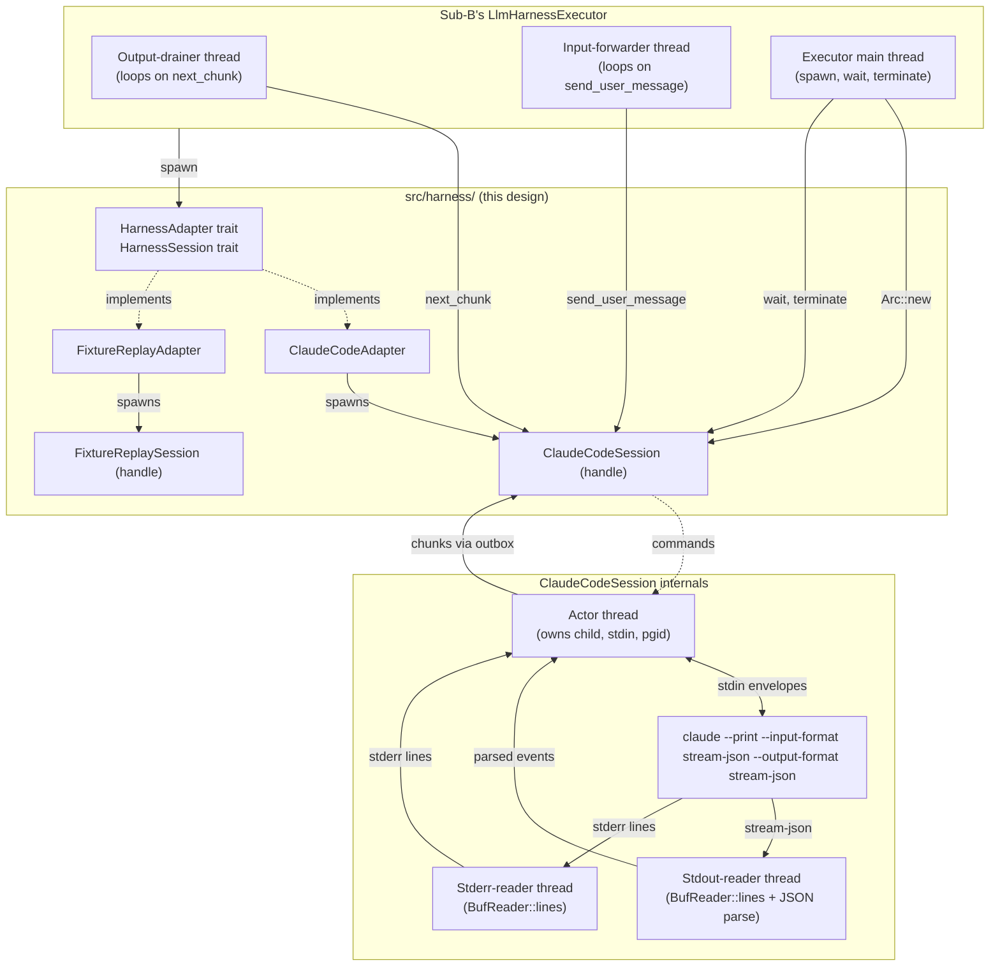

## Overview

This document specifies the design of Mnemosyne's harness adapter layer, the abstraction that lets Mnemosyne (the orchestrator) spawn, control, observe, and terminate LLM coding harnesses (Claude Code in v1, future Codex / Pi adapters in v1.5+) as managed child processes. It is the implementation contract for sub-project C in the Mnemosyne orchestrator merge plan.

The trait *shape* of `HarnessAdapter` and `HarnessSession` was specified by sub-project B's design (`docs/superpowers/specs/2026-04-12-sub-B-phase-cycle-design.md` §4.1). C owns the trait *declaration*, fills in the implementations, and — based on this brainstorm — proposes four additive amendments to B's draft trait plus one executor-level requirement that B's implementation phase will absorb (see §11.1).

C is on the critical path for B's v1 dogfood acceptance test: B's `LlmHarnessExecutor` currently holds a stub adapter; landing C's real `ClaudeCodeAdapter` is the swap that unblocks the orchestrator's first end-to-end run.

## Table of Contents

1. [Scope and Goals](#1-scope-and-goals)
2. [Architecture](#2-architecture)
3. [The §4.1 trait surface (with C's amendments)](#3-the-41-trait-surface-with-cs-amendments)
4. [`ClaudeCodeAdapter`](#4-claudecodeadapter)
5. [`FixtureReplayAdapter`](#5-fixturereplayadapter)
6. [Tool profile enforcement](#6-tool-profile-enforcement)
7. [Cold-spawn budget and v1.5 warm-pool](#7-cold-spawn-budget-and-v15-warm-pool)
8. [Testing strategy](#8-testing-strategy)
9. [Risks](#9-risks)
10. [Open implementation questions](#10-open-implementation-questions)
11. [Cross-sub-project requirements](#11-cross-sub-project-requirements)
12. [Appendix A — Decision Trail](#appendix-a--decision-trail)

---

## 1. Scope and Goals

### 1.1 In scope

- A `HarnessAdapter` trait abstraction over LLM coding harnesses (Claude Code, Codex, Pi, future).
- Two concrete v1 implementors: `ClaudeCodeAdapter` and `FixtureReplayAdapter`.
- Process spawn, prompt passing, output streaming, user-message input, lifecycle, and termination semantics for the Claude Code adapter.
- Tool profile enforcement at spawn time and via stream-side defence-in-depth.
- A JSON Lines fixture format for deterministic test replay.
- A dev-only fixture recording subcommand (`mnemosyne dev record-fixture`).
- Latency instrumentation as a v1 acceptance gate signal.
- Process-group termination as a v1 correctness requirement.
- A new top-level `src/harness/` Rust module under Mnemosyne's existing single binary crate.
- Four additive amendments to B's draft `HarnessAdapter` / `HarnessSession` / `OutputChunkKind` surface (see §11.1).
- One executor-level cross-sub-project requirement back to B: prompt-driven sentinel detection in `LlmHarnessExecutor`'s output-drainer thread for task-level completion signalling (see §11.1).

### 1.2 Deliberately out of scope

- **Codex and Pi adapters** — v1 ships Claude Code only. The trait abstraction exists in v1 but with two implementors, not three or more.
- **Warm-pool reuse / process pooling** — deferred to v1.5, conditional on a measurable acceptance gate (see §7).
- **PTY-based interactive harness control** — explicitly rejected in favour of bidirectional stream-json (see §4.1, Appendix A Q1).
- **Mid-session tool profile swap** — would require a future `ActorCmd::SwapProfile` variant; not v1 work.
- **Structured logging / metrics framework** — see §11.5; this is the proposed future Sub-M (Observability), not C's concern.
- **A harness-to-Mnemosyne callback channel** — forbidden by the "no slash commands inside the harness" architectural decision; output flows are one-way (harness → adapter → executor).
- **Adapter behaviour on Windows** — Mnemosyne v1 targets macOS and Linux only; the `process_group(0)` and `killpg` mechanisms are POSIX-specific.
- **Authentication / API key management** — Claude Code owns its own credential storage; the adapter neither reads nor writes API keys, only spawns the binary.

### 1.3 Goals, in priority order

1. **B's v1 dogfood acceptance test must work.** C's `ClaudeCodeAdapter` is the swap target for B's stub. Anything that delays this test delays the entire orchestrator merge.
2. **Hard errors by default.** Unexpected conditions, schema drift, malformed events, profile violations all fail loud and fast with clear diagnostics. No silent degradation.
3. **Threading correctness via single-owner-per-state actor architecture.** No mutexes guarding fields except where unavoidable (one `Mutex<Option<JoinHandle>>` consumed by `wait()`). All session state lives in one actor thread; all interactions are typed messages on typed channels.
4. **Bidirectional interactive sessions.** The user must be able to interact with a running session in real time (read streaming output, type follow-up messages, see tool uses as they happen, interrupt) without leaving Mnemosyne's TUI.
5. **Process-group termination from v1.** No leaked subprocess children; no orphaned MCP server processes; no port leaks after `terminate()`.
6. **Defence-in-depth tool enforcement.** Spawn-time CLI flags + stream-side runtime check. Trust the flag, verify the stream.
7. **Deterministic test replay.** A `FixtureReplayAdapter` that mirrors the live adapter's actor architecture, so threading bugs surface in CI without requiring a real `claude` binary.
8. **Minimal dependency footprint.** Three new crates (`which`, `nix`, `crossbeam-channel`) and no others. Each new dep has a written justification under the integration-over-reinvention principle.

### 1.4 Non-goals

- **Performance optimisation beyond the cold-spawn gate.** The spec acknowledges measurable latency targets (5s p95 cold-spawn) but does not optimise beyond them in v1.
- **General-purpose process management library.** C's adapter is purpose-built for LLM harness session management; it does not aspire to be a re-usable subprocess wrapper.
- **Cross-platform parity beyond macOS + Linux.** Windows is not a v1 target.
- **Replacing or extending Claude Code's authentication model.** Adapter spawns the binary, trusts the binary's own credential handling.
- **Async / Tokio runtime adoption.** v1 is sync code on dedicated OS threads. B's executor model assumes blocking reads on dedicated threads; the actor architecture composes cleanly with that assumption.

---

## 2. Architecture

### 2.1 High-level diagram



### 2.2 Module layout

```
src/harness/
├── mod.rs              // pub use of the §3 trait surface; module-level docs
├── trait_def.rs        // HarnessAdapter, HarnessSession, ToolProfile, OutputChunk,
│                       //   OutputChunkKind, HarnessKind, SessionExitStatus, AdapterError
├── claude_code/
│   ├── mod.rs          // ClaudeCodeAdapter struct + impl HarnessAdapter
│   ├── session.rs      // ClaudeCodeSession handle + impl HarnessSession
│   ├── actor.rs        // The actor thread loop and ActorState / ActorCmd / ActorInbox types
│   ├── stream_json.rs  // Serde structs for Claude Code's stream-json events;
│   │                   //   StreamJsonEvent → OutputChunk mapping; the parser
│   ├── spawn.rs        // Spawn-flag construction from ToolProfile + working_dir;
│   │                   //   binary discovery via `which`; preflight checks
│   └── input.rs        // User-message envelope serialisation
└── fixture_replay/
    ├── mod.rs          // FixtureReplayAdapter struct + impl HarnessAdapter
    ├── session.rs      // FixtureReplaySession handle + impl HarnessSession
    ├── actor.rs        // The replay actor loop
    └── format.rs       // FixtureRecord enum, OutputChunkOnDisk, SessionExitStatusOnDisk
```

Plus, in `src/commands/`:

```
src/commands/
└── dev_record_fixture.rs   // `mnemosyne dev record-fixture --output <path> [...]`
```

The `dev` subcommand namespace is new. Dev commands are visible in `--help` but tagged "dev-only — not for end users". Future dev tools (e.g., `mnemosyne dev replay-fixture`) live under the same namespace.

### 2.3 Cargo.toml dep additions

| Dep | Status | Used for | Justification |
|---|---|---|---|
| `serde_json` | already added by B | parsing Claude Code stream-json events; serialising user-message envelopes; `FixtureRecord` ser/de | already a B-blessed dep |
| `serde` (with derive) | already in Cargo.toml | serde structs for stream-json events and fixture records | pre-existing |
| `thiserror` | already in Cargo.toml | `AdapterError` derive | pre-existing |
| `chrono` | already in Cargo.toml | `OutputChunk.at` timestamp field | pre-existing |
| **`which`** | **NEW** | Locating the `claude` binary on PATH for preflight + spawn | Canonical Rust binary-discovery utility (~200 lines, zero non-stdlib deps). Hand-rolling would re-implement Windows extension lookup and other edge cases for negligible savings. |
| **`nix`** | **NEW** | `killpg` for process-group termination | Process-group termination is a v1 correctness requirement (§4.4). `nix` is the canonical Rust syscall wrapper for `killpg` and `Pid`; the alternative is `unsafe { libc::killpg(...) }` which introduces unsafe code to the codebase for no real saving. Used only in `src/harness/claude_code/`. |
| **`crossbeam-channel`** | **NEW** | Actor inbox + session channels (`Sender`/`Receiver` are `Sync`) | Eliminates `Mutex` wrappers on the hot path. The closest stdlib-style fit for BEAM-style mailbox patterns; provides `select!` for future actor extensions. ~2k lines, well-maintained, zero non-stdlib deps. |

Three new crates total. Each justified individually under the integration-over-reinvention principle. **No** PTY crate, **no** tokio, **no** signal-hook, **no** async runtime.

---

## 3. The §4.1 trait surface (with C's amendments)

B's design doc §4.1 specifies the trait shape verbatim. C declares the trait in `src/harness/trait_def.rs` and implements it. Three additive amendments arose during C's brainstorm — they are forced by the bidirectional stream-json process model decision (Q1, Appendix A) which post-dates B's brainstorm.

### 3.1 Trait declarations (final shape, including C's amendments)

```rust
pub trait HarnessAdapter: Send + Sync {
    fn kind(&self) -> HarnessKind;

    fn spawn(
        &self,
        prompt: &str,
        working_dir: &Path,
        tool_profile: ToolProfile,
        session_name: &str,
    ) -> Result<Box<dyn HarnessSession>, AdapterError>;
}

pub trait HarnessSession: Send + Sync {                                   // [AMENDED] +Sync
    fn next_chunk(&self) -> Result<Option<OutputChunk>, AdapterError>;    // [AMENDED] &self
    fn send_user_message(&self, text: &str) -> Result<(), AdapterError>;  // [NEW]
    fn terminate(&self);                                                  // [AMENDED] &self
    fn wait(&self) -> Result<SessionExitStatus, AdapterError>;            // [AMENDED] &self
    fn session_id(&self) -> &str;
}

pub enum HarnessKind {
    ClaudeCode,
    FixtureReplay,
}

#[derive(Clone, Copy, Debug, PartialEq, Eq)]
pub enum ToolProfile {
    ResearchBroad,      // full tools: read/write/shell/web/knowledge-query
    IngestionMinimal,   // no tools (sub-E's Stage 3/4 sessions)
}

pub struct OutputChunk {
    pub text: String,
    pub kind: OutputChunkKind,
    pub at: DateTime<Utc>,
}

#[derive(Clone, Copy, Debug, PartialEq, Eq)]
pub enum OutputChunkKind {
    Stdout,
    Stderr,
    ToolUse,
    InternalMessage,
    SessionLifecycle, // [AMENDMENT 4] surfaces protocol-level harness state transitions
                      //                (ready / turn_complete / exited) to consumers
                      //                — see §4.3.2 for documented stable text formats
}

#[derive(Clone, Copy, Debug)]
pub enum SessionExitStatus {
    CleanExit { exit_code: i32 },
    Terminated { signal: Option<i32> },
    CrashedBeforeReady,
}

#[derive(thiserror::Error, Debug)]
pub enum AdapterError {
    #[error("harness binary not found on PATH: {0}")]
    HarnessNotFound(String),
    #[error("harness spawn failed: {0}")]
    SpawnFailed(String),
    #[error("tool profile {profile:?} not supported by harness {harness:?}")]
    UnsupportedToolProfile { profile: ToolProfile, harness: HarnessKind },
    #[error("session terminated abnormally: {0}")]
    AbnormalTermination(String),
    #[error("harness adapter I/O error: {0}")]
    Io(#[from] std::io::Error),
}
```

### 3.2 Four amendments to B's §4.1, summarised

1. **`HarnessSession::send_user_message(&self, text: &str)`** — new method. Implementations: serialise into Claude Code stream-json user-message envelope and write to child stdin (`ClaudeCodeSession`); send `FixtureCmd::UserMessage` to the replay actor (`FixtureReplaySession`).
2. **`HarnessSession` method receivers change from `&mut self` to `&self`** with `Send + Sync` bound. Required because B's `LlmHarnessExecutor` now needs to share the session between an output-drainer thread and an input-forwarder thread; `&mut self` would force a single-thread serialisation that defeats the bidirectional model.
3. **`LlmHarnessExecutor` storage shape changes from `Box<dyn HarnessSession>` to `Arc<dyn HarnessSession>`.** Cosmetic from C's POV, visible in B's executor implementation. B's executor also gains a TUI-facing `user_input_sender() -> mpsc::Sender<String>` method that the TUI uses to forward typed text to the input-forwarder thread.
4. **`OutputChunkKind` gains a `SessionLifecycle` variant.** Used by adapters to surface protocol-level harness state transitions (ready / turn complete / exited) as structured chunks in the existing output stream. Documented stable text formats listed in §4.3.2. Distinct from *task-level* completion signalling, which is owned by B's executor (see §11.1 fifth requirement) — `SessionLifecycle` is "the harness's protocol state changed", not "the LLM thinks it has finished the work".

Amendments 1-4 are trait-level changes. A fifth cross-sub-project requirement (sentinel-driven task-level completion detection in B's executor) is described in §11.1 as a B implementation requirement rather than a trait amendment.

These amendments are recorded in §11.1 as cross-sub-project requirements going back to B. B is in "brainstorm done, implementation not started" status, so the amendments land in B's implementation phase, not as a B re-brainstorm.

### 3.3 Contract requirements C honours from B's §4.1

C's implementations honour these B contracts verbatim:

1. **`spawn()` cold-start latency target: < 3 seconds per session.** Warm-pool reuse is C's implementation strategy (§7).
2. **Tool profile enforcement is C's responsibility.** A harness that attempts a disallowed tool fails the session at the adapter level, not via prompt suggestion.
3. **`terminate()` is non-blocking and idempotent.** Returns within microseconds. Actual termination completes asynchronously and is observed via `next_chunk()` returning `Ok(None)`.
4. **`next_chunk()` is a blocking streaming read.** Not async, not polled. B runs each executor on its own thread.
5. **`HarnessKind::FixtureReplay` is a first-class variant.** The fixture-replay adapter is a real `HarnessAdapter` implementation, not a mock.
6. **Working directory on spawn is the staging root.** Set via `Command::current_dir` at spawn time.
7. **Session name is passed through to the harness's session-tracking ID.** Claude Code: `--session-id <name>` (verify exact flag name during impl).
8. **No *control* channel from harness to Mnemosyne.** The harness cannot call into Mnemosyne to invoke actions, trigger phase transitions, or otherwise control the orchestrator. This is the "no callback channel" contract from B's §4.1, and it is the architectural rule from `mnemosyne-orchestrator/memory.md`'s "no slash commands inside the harness" decision applied to the programmatic side. **Observation of harness state by Mnemosyne is NOT restricted** — Mnemosyne reads the entire stream-json output stream, parses it, and reacts on its own side. The `SessionLifecycle` chunk variant (§4.3.2) is the explicit mechanism for surfacing protocol-level harness state transitions to consumers; sentinel-driven task-level completion detection in B's executor (§11.1) is the mechanism for surfacing the LLM's own judgment about task completion. Both are observation channels, not control channels — the harness produces signals, Mnemosyne consumes them.

---

## 4. `ClaudeCodeAdapter`

### 4.1 Process model — bidirectional stream-json

The Claude Code adapter spawns `claude` as a child process via `std::process::Command` with the `--print --input-format stream-json --output-format stream-json` flag combination. This is **not a PTY-wrapped interactive session** — it is a structured JSON-Lines protocol on stdin/stdout, the same mechanism Anthropic exposes for headless integration with Claude Code, but with bidirectional input enabled so user-typed messages can be forwarded mid-session.

The decision rationale, alternatives considered (PTY-wrapped, headless one-shot), and tradeoffs are recorded in Appendix A Q1.

#### 4.1.1 Spawn command

```
claude --print --verbose \
       --input-format stream-json --output-format stream-json \
       --session-id "<session_name from B>" \
       <profile-derived flags from §6> \
       [<initial prompt as CLI arg, if accepted>]
```

Working directory: the staging root supplied by B's `StagingDirectory` (B contract #6).
Stdin: piped (for sending user messages).
Stdout: piped (for receiving stream-json events).
Stderr: piped (for diagnostic capture and `Stderr` chunk emission).

If `claude --print "<prompt>" --input-format stream-json` rejects the prompt arg (because stream-json input mode expects all input over stdin), the initial prompt is delivered as the first stream-json user-message envelope on stdin immediately after spawn. Both paths are valid; the implementer picks the one the pinned `claude` version accepts (see §10 Q3).

#### 4.1.2 The user-message envelope (stream-json input format)

```json
{"type":"user","message":{"role":"user","content":[{"type":"text","text":"<message text>"}]}}
```

One envelope per line on stdin. The adapter writes the envelope, a newline, and flushes. Claude Code processes the message as a mid-turn or new-turn user input depending on conversation state.

### 4.2 Threading model — actor architecture

`ClaudeCodeSession` uses a single-owner-per-state actor architecture inspired by Erlang/Elixir mailboxes. All mutable session state lives inside one **actor thread** that owns the child process handle, the stdin pipe, the process group ID, and the parser state. The session struct exposed to B's executor holds only channel endpoints and an atomic flag — no mutable state, no field-level locking.

#### 4.2.1 The three threads per session

| Thread | Responsibility |
|---|---|
| **Actor thread** | Owns `Child`, `ChildStdin`, `pgid`, `terminated` local flag, `chunks_emitted` counter, `spawned_at` instant, `stderr_buffer` ring. Receives `ActorInbox` messages from one inbox (cmd projection + stdout-reader + stderr-reader). Dispatches to: chunk emission (via `chunk_tx`), stdin writes, child kill, child wait. |
| **Stdout-reader thread** | Owns `ChildStdout`. Loops on `BufReader::lines()`. For each line: parses as `StreamJsonEvent`, sends `ActorInbox::StdoutEvent(event)` to the actor inbox. On EOF, sends `ActorInbox::StdoutEof` and exits. On parse error, sends `ActorInbox::StreamParseError(err)` and continues. |
| **Stderr-reader thread** | Owns `ChildStderr`. Loops on `BufReader::lines()`. For each line: sends `ActorInbox::StderrLine(line)` to the actor inbox. On EOF, exits silently (stderr EOF is not load-bearing for session lifecycle). |

Three threads per live session. Cheap on Linux/macOS (each is a kernel thread; the JVM-style "thread is expensive" intuition does not apply).

#### 4.2.2 The `ClaudeCodeSession` handle

```rust
pub struct ClaudeCodeSession {
    session_id: String,
    cmd_tx: crossbeam_channel::Sender<ActorCmd>,
    chunk_rx: crossbeam_channel::Receiver<ChunkOrEnd>,
    terminated: AtomicBool,
    actor_handle: Mutex<Option<JoinHandle<()>>>,
}
```

- `cmd_tx`: external command channel into the actor (projection wraps each `ActorCmd` into `ActorInbox::Cmd(cmd)`).
- `chunk_rx`: outbox channel out of the actor; drained by `next_chunk()`.
- `terminated`: local idempotency guard for `terminate()`. Atomic to allow uncoordinated reads from any thread.
- `actor_handle`: joined by `wait()`. The lone `Mutex` in the design — exists only because `JoinHandle::join()` consumes the handle.

`crossbeam_channel::Sender` and `Receiver` are `Send + Sync`, so no `Mutex` wraps them. The session is `Send + Sync` overall.

#### 4.2.3 Internal types

```rust
enum ActorCmd {
    SendUserMessage(String),
    Terminate,
    Wait(crossbeam_channel::Sender<Result<SessionExitStatus, AdapterError>>),
}

enum ActorInbox {
    Cmd(ActorCmd),
    StdoutEvent(StreamJsonEvent),
    StdoutEof,
    StderrLine(String),
    StreamParseError(serde_json::Error),
}

enum ChunkOrEnd {
    Chunk(OutputChunk),
    End(Result<(), AdapterError>),
}
```

The actor inbox is a single `crossbeam_channel::Receiver<ActorInbox>`. The stdout-reader, stderr-reader, and external command projection each hold a `Sender` clone into it.

#### 4.2.4 Actor loop sketch

```rust
fn actor_loop(
    inbox: Receiver<ActorInbox>,
    chunk_tx: Sender<ChunkOrEnd>,
    mut state: ActorState,
) {
    while let Ok(msg) = inbox.recv() {
        match msg {
            ActorInbox::Cmd(ActorCmd::SendUserMessage(text)) => {
                if let Err(e) = state.write_user_message(&text) {
                    let _ = chunk_tx.send(ChunkOrEnd::End(Err(e)));
                    state.terminate();
                }
            }
            ActorInbox::Cmd(ActorCmd::Terminate) => {
                state.terminate();
            }
            ActorInbox::Cmd(ActorCmd::Wait(reply)) => {
                let result = state.wait_for_exit();
                let _ = reply.send(result);
                break; // wait is terminal
            }
            ActorInbox::StdoutEvent(event) => {
                if let Err(violation) = state.check_tool_profile(&event) {
                    let _ = chunk_tx.send(ChunkOrEnd::End(Err(violation)));
                    state.terminate();
                    continue;
                }
                for chunk in state.event_to_chunks(event) {
                    if chunk_tx.send(ChunkOrEnd::Chunk(chunk)).is_err() {
                        state.terminate();
                        break;
                    }
                }
            }
            ActorInbox::StdoutEof => {
                let _ = chunk_tx.send(ChunkOrEnd::End(Ok(())));
            }
            ActorInbox::StderrLine(line) => {
                state.record_stderr(&line);
                let _ = chunk_tx.send(ChunkOrEnd::Chunk(OutputChunk {
                    text: line,
                    kind: OutputChunkKind::Stderr,
                    at: Utc::now(),
                }));
            }
            ActorInbox::StreamParseError(err) => {
                let _ = chunk_tx.send(ChunkOrEnd::End(Err(
                    AdapterError::AbnormalTermination(format!("malformed stream-json: {err}"))
                )));
                state.terminate();
            }
        }
    }
}
```

The actor blocks on `inbox.recv()` between messages. The only point where the actor itself blocks on a syscall is inside `state.wait_for_exit()` (which calls `child.wait()`); by the time `Wait` is processed, B's executor has already exited its drain loop after seeing `End(Ok)` so no further events arrive. The actor is single-threaded internally — no locks, no shared mutable state, all transitions visible in one switch.

#### 4.2.5 Trait method bodies

```rust
impl HarnessSession for ClaudeCodeSession {
    fn next_chunk(&self) -> Result<Option<OutputChunk>, AdapterError> {
        match self.chunk_rx.recv() {
            Ok(ChunkOrEnd::Chunk(c))     => Ok(Some(c)),
            Ok(ChunkOrEnd::End(Ok(())))  => Ok(None),
            Ok(ChunkOrEnd::End(Err(e)))  => Err(e),
            Err(_)                       => Ok(None),
        }
    }

    fn send_user_message(&self, text: &str) -> Result<(), AdapterError> {
        if self.terminated.load(Ordering::Relaxed) {
            return Err(AdapterError::AbnormalTermination("session terminated".into()));
        }
        self.cmd_tx
            .send(ActorCmd::SendUserMessage(text.to_owned()))
            .map_err(|_| AdapterError::AbnormalTermination("actor exited".into()))
    }

    fn terminate(&self) {
        if self.terminated.swap(true, Ordering::Relaxed) {
            return; // idempotent
        }
        let _ = self.cmd_tx.send(ActorCmd::Terminate);
    }

    fn wait(&self) -> Result<SessionExitStatus, AdapterError> {
        let (reply_tx, reply_rx) = crossbeam_channel::bounded(1);
        self.cmd_tx.send(ActorCmd::Wait(reply_tx))
            .map_err(|_| AdapterError::AbnormalTermination("actor exited before wait".into()))?;
        let result = reply_rx.recv()
            .map_err(|_| AdapterError::AbnormalTermination("actor dropped wait reply".into()))??;
        if let Ok(mut h) = self.actor_handle.lock() {
            if let Some(handle) = h.take() {
                let _ = handle.join();
            }
        }
        Ok(result)
    }

    fn session_id(&self) -> &str { &self.session_id }
}
```

### 4.3 Stream-json parser (`stream_json.rs`)

#### 4.3.1 Event type definitions (draft — verify exact field names against pinned `claude` version)

```rust
#[derive(Deserialize)]
#[serde(tag = "type")]
pub enum StreamJsonEvent {
    #[serde(rename = "system")]
    System {
        subtype: String,            // "init", "tool_use", "tool_result", etc.
        #[serde(flatten)]
        rest: serde_json::Value,
    },
    #[serde(rename = "assistant")]
    Assistant { message: AssistantMessage },
    #[serde(rename = "user")]
    User { message: UserMessage },  // echo of what we sent
    #[serde(rename = "result")]
    Result {
        subtype: String,            // "success", "error_max_turns", etc.
        is_error: bool,
        result: Option<String>,
        #[serde(flatten)]
        rest: serde_json::Value,
    },
}

#[derive(Deserialize)]
pub struct AssistantMessage {
    pub content: Vec<ContentBlock>,
    #[serde(flatten)]
    pub rest: serde_json::Value,
}

#[derive(Deserialize)]
#[serde(tag = "type")]
pub enum ContentBlock {
    #[serde(rename = "text")]
    Text { text: String },
    #[serde(rename = "tool_use")]
    ToolUse {
        id: String,
        name: String,
        input: serde_json::Value,
    },
    #[serde(rename = "tool_result")]
    ToolResult {
        tool_use_id: String,
        content: serde_json::Value,
        is_error: Option<bool>,
    },
}
```

The `serde(flatten)` rest-fields give forward-compat for additive schema changes: new top-level fields land in `rest` rather than failing to deserialise. This is the primary v1 mitigation against Risk 1 (schema drift).

#### 4.3.2 Event → `OutputChunk` mapping

| Stream-json event | `OutputChunkKind` | `OutputChunk.text` |
|---|---|---|
| `system` (init) | `SessionLifecycle` | `"ready"` (documented stable identifier; protocol-level signal that Claude Code is initialised and ready to accept input) |
| `system` (other subtype) | `InternalMessage` | JSON-serialised event |
| `assistant` `Text` block | `Stdout` | the text content |
| `assistant` `ToolUse` block | `ToolUse` | formatted as `<tool_name>(<input json>)` for human-readable rendering |
| `assistant` `ToolResult` block | `InternalMessage` | formatted as `<tool result>` |
| `user` (echo) | `InternalMessage` | echoed text (for verification rendering only) |
| `result` (turn boundary) | `SessionLifecycle` | `"turn_complete:<subtype>"` where `<subtype>` is carried verbatim from Claude Code's event (e.g., `"turn_complete:success"`, `"turn_complete:error_max_turns"`); also recorded into `state.last_result` for `wait()` consumption |
| stdout EOF (process about to exit) | `SessionLifecycle` | `"exited:<exit_code>"` for clean exits, `"exited:terminated"` for signal-killed processes; emitted just before `End(Ok)` is sent on the chunk channel |
| stderr line (non-JSON) | `Stderr` | the raw line text |

A single assistant message may contain multiple content blocks; the parser emits one `OutputChunk` per block, in order, all sharing the `at` timestamp from when the event was parsed.

#### 4.3.3 `SessionLifecycle` semantics — protocol-level vs task-level

`SessionLifecycle` chunks are **protocol-level** state transitions surfaced by the adapter. They tell consumers "the harness's protocol state has changed in a structured way" — the harness is ready, a turn has ended, the process has exited. The text format is documented and stable per the table above; consumers may safely string-match on the documented identifiers.

These are explicitly **NOT task-level "the LLM thinks it has completed the assigned work" signals.** Protocol-level "turn over" tells you the model stopped emitting tokens for this round; it does *not* tell you whether the model judged the task complete or just paused to ask a clarifying question, request more input, or hit max_tokens mid-thought. The two are different concerns:

| Concept | Source | Mechanism | Detection layer |
|---|---|---|---|
| Protocol-level turn boundary | Claude Code's `result` event | Structured stream-json event | C's adapter (this section) |
| Task-level "I am done with the work" | The LLM's own judgment | Prompt-instructed sentinel string in `Stdout` text | B's executor (§11.1 fifth requirement) |

A consumer that wants to know "the LLM has finished its job" must listen for **sentinel matches in `Stdout` chunks** via B's executor-level detection, not for `turn_complete` lifecycle events from C. Conflating the two would cause Mnemosyne to transition phases the moment Claude Code finished a single turn, even when the LLM was mid-task.

C's adapter has no knowledge of sentinel strings, phase semantics, or task completion criteria — it only surfaces what Claude Code's protocol tells it. Sentinel detection lives in B because sentinel strings are coupled to phase prompts (which B owns) and because the mechanism is harness-agnostic (every harness produces text output regardless of structured-event support, so a future Codex / Pi / bare-LLM adapter gets sentinel detection for free without C-side changes).

### 4.4 Process-group termination

A v1 correctness requirement, not a v1.5 deferral.

#### 4.4.1 Spawn-side: child as process-group leader

```rust
use std::os::unix::process::CommandExt;

let mut cmd = Command::new(claude_path);
cmd.arg("--print")
   .arg("--verbose")
   /* ... other args ... */
   .current_dir(working_dir)
   .stdin(Stdio::piped())
   .stdout(Stdio::piped())
   .stderr(Stdio::piped())
   .process_group(0); // child = its own pgrp leader; PGID == PID

let child = cmd.spawn()?;
let pgid = nix::unistd::Pid::from_raw(child.id() as i32);
```

`std::os::unix::process::CommandExt::process_group(0)` is stable since Rust 1.64. Setting the PGID to `0` makes the child its own process group leader; subprocesses Claude Code spawns (tool subprocesses, MCP servers) inherit the same PGID and can be targeted with one `killpg` call.

No new dep for the spawn side — entirely stdlib.

#### 4.4.2 Terminate-side: two-phase SIGTERM → SIGKILL on the group

```rust
fn terminate(&mut self) {  // ActorState method, called from actor thread
    if self.terminated { return; }
    self.terminated = true;

    // Phase 1: SIGTERM the entire process group
    let _ = nix::sys::signal::killpg(self.pgid, nix::sys::signal::Signal::SIGTERM);

    // Drop stdin to signal EOF (some harness configs respond to stdin close as a clean exit signal)
    self.stdin.take();

    // Phase 2: spawn a non-blocking timer thread that SIGKILLs the group if still alive after 500ms
    let pgid = self.pgid;
    let alive = Arc::clone(&self.child_alive_flag);
    thread::spawn(move || {
        thread::sleep(Duration::from_millis(500));
        if alive.load(Ordering::Relaxed) {
            let _ = nix::sys::signal::killpg(pgid, nix::sys::signal::Signal::SIGKILL);
        }
    });
}
```

The 500ms grace period gives Claude Code (and any tool subprocess in its group) a chance to flush state and exit cleanly under SIGTERM. The `child_alive_flag` `Arc<AtomicBool>` is set to `false` by the stdout-reader thread when it observes EOF (which means the child is dead) — so if Claude Code exits cleanly within 500ms, the SIGKILL is skipped.

Convention: the 500ms grace matches `systemd-stop`'s default `TimeoutStopSec` tier and Docker `stop`'s default grace, which makes it a defensible "I am following industry convention" choice.

#### 4.4.3 What this fixes

- Tool subprocesses no longer become orphans on terminate.
- MCP server children no longer leak ports.
- `pgrep -f claude` after a clean shutdown shows zero residual processes.

### 4.5 Lifecycle and error handling

#### 4.5.1 `CrashedBeforeReady` heuristic

A session is `CrashedBeforeReady` if:
- The child exited within **2 seconds** of `spawn()`, AND
- Zero output chunks were emitted, AND
- The exit status is non-success.

Detected in `wait()`:

```rust
let elapsed = state.spawned_at.elapsed();
let chunks = state.chunks_emitted;
let status = child.wait()?;

if elapsed < Duration::from_millis(2000) && chunks == 0 && !status.success() {
    return Ok(SessionExitStatus::CrashedBeforeReady);
}
```

Catches: missing API key, invalid model name, bad config file, OOM at startup, missing dependencies. The 2s threshold is a v1 default tunable in code; rationale is "a healthy Claude Code spawn emits its system init event within ~1s, and we want a margin to avoid false positives on slow machines".

#### 4.5.2 Error variant mapping

| Failure mode | Variant | Detection point |
|---|---|---|
| `claude` not on PATH | `HarnessNotFound("claude")` | `which::which()` in `spawn()` |
| `Command::spawn` fails | `SpawnFailed(reason)` | `spawn()` |
| Tool profile mismatch in stream | `UnsupportedToolProfile { profile, harness }` | actor's defence-in-depth check |
| Process exited fast with no output | `SessionExitStatus::CrashedBeforeReady` (variant of `SessionExitStatus`, not `AdapterError`) | actor's `wait_for_exit()` |
| Process killed by signal | `SessionExitStatus::Terminated { signal }` | actor's `wait_for_exit()` |
| Stdin write failed (broken pipe) | `Io(io::Error)` (broken pipe) | actor's `write_user_message()` |
| Stdout JSON parse error | `AbnormalTermination("malformed stream-json: <err>")` | stdout-reader thread; surfaced via the next `next_chunk()` call |
| Calling `wait()` after the actor exited | `AbnormalTermination("actor exited before wait")` | `wait()` method |
| Calling `send_user_message()` after termination | `AbnormalTermination("session terminated")` | `send_user_message()` method |

---

## 5. `FixtureReplayAdapter`

### 5.1 Purpose and design parity

The fixture-replay adapter is a first-class `HarnessAdapter` implementation, not a mock. It exists so that:

- **Sub-B's end-to-end tests** can exercise the full executor + phase + staging pipeline without a live `claude` process.
- **Sub-E's pipeline tests** can exercise the ingestion stages 3/4 without spawning real LLM sessions.
- **Sub-C's own integration tests** can exercise the actor architecture and threading invariants deterministically.

To maximise the value of the third use case, `FixtureReplaySession` mirrors `ClaudeCodeSession`'s actor architecture exactly — same field shape, same `crossbeam-channel`-based command/event flow, same single-owner-per-state discipline. **Rationale**: tests that exercise B's executor against `FixtureReplayAdapter` should hit the same concurrency patterns as the live `ClaudeCodeAdapter`, so threading bugs in the executor's two-thread model surface in CI instead of only in live integration tests.

The replay actor is ~80 lines vs the live actor's ~150; the duplication is shallow and the structural symmetry is load-bearing.

### 5.2 Fixture file format

```rust
#[derive(Serialize, Deserialize)]
#[serde(tag = "t", rename_all = "snake_case")]
pub enum FixtureRecord {
    /// Emit an OutputChunk to the consumer via next_chunk().
    Output { chunk: OutputChunkOnDisk },

    /// Pause the replay actor for `ms` milliseconds before processing the
    /// next record. Simulates streaming pacing for UI-rendering tests.
    /// Interruptible by Terminate.
    Delay { ms: u64 },

    /// Block the replay actor until send_user_message() is called.
    /// The text content of the user message is *not* validated — fixtures
    /// are output-only contracts. Tests asserting on user-input contents
    /// do so independently.
    ExpectUserInput,

    /// Terminal record: replay ends, wait() returns this status.
    Exit { status: SessionExitStatusOnDisk },
}

#[derive(Serialize, Deserialize)]
pub struct OutputChunkOnDisk {
    pub text: String,
    pub kind: OutputChunkKind,
    pub at: DateTime<Utc>,
}

#[derive(Serialize, Deserialize)]
#[serde(tag = "kind")]
pub enum SessionExitStatusOnDisk {
    CleanExit { exit_code: i32 },
    Terminated { signal: Option<i32> },
    CrashedBeforeReady,
}
```

`OutputChunkOnDisk` and `SessionExitStatusOnDisk` are structurally identical to the runtime types defined in `trait_def.rs`. They exist as separate types because the runtime types do not carry `Serialize`/`Deserialize` derives (B's draft did not require them and C does not unilaterally extend B's surface). `From`/`Into` impls between the two pairs keep them interconvertible. A unit test round-trips one through the other to catch drift.

### 5.3 Fixture file layout and ownership

```
tests/fixtures/harness/                        # owned by Sub-C
├── replay_clean_linear.jsonl
├── replay_multi_turn.jsonl
├── replay_terminated.jsonl
├── replay_tool_violation.jsonl
└── replay_crashed_before_ready.jsonl

tests/fixtures/sub-B/harness/                  # owned by Sub-B
├── work_phase_clean_exit.jsonl
├── reflect_phase_with_interjection.jsonl
└── triage_phase_terminated_mid_stream.jsonl

tests/fixtures/sub-E/harness/                  # owned by Sub-E
├── ingestion_stage3_section_classification.jsonl
└── ingestion_stage4_cross_section_synthesis.jsonl
```

C owns `tests/fixtures/harness/` (fixtures exercising the adapter in isolation). B and E own their respective subtrees. Each owning sub-project commits and maintains its own fixtures; C's `format.rs` is the single source of truth for the schema.

### 5.4 `FixtureReplaySession` handle and types

```rust
pub struct FixtureReplaySession {
    session_id: String,
    cmd_tx: crossbeam_channel::Sender<FixtureCmd>,
    chunk_rx: crossbeam_channel::Receiver<ChunkOrEnd>,
    terminated: AtomicBool,
    actor_handle: Mutex<Option<JoinHandle<()>>>,
}

enum FixtureCmd {
    UserMessage,
    Terminate,
    Wait(crossbeam_channel::Sender<Result<SessionExitStatus, AdapterError>>),
}
```

The session struct shape is identical to `ClaudeCodeSession` modulo the `FixtureCmd` vs `ActorCmd` enum.

### 5.5 Replay actor loop

```rust
fn fixture_actor_loop(
    cmd_rx: Receiver<FixtureCmd>,
    chunk_tx: Sender<ChunkOrEnd>,
    records: Vec<FixtureRecord>,
) {
    let mut iter = records.into_iter();
    let mut final_status = SessionExitStatus::CleanExit { exit_code: 0 };

    'replay: while let Some(record) = iter.next() {
        match record {
            FixtureRecord::Output { chunk } => {
                if chunk_tx.send(ChunkOrEnd::Chunk(chunk.into())).is_err() {
                    break 'replay;
                }
            }
            FixtureRecord::Delay { ms } => {
                crossbeam_channel::select! {
                    recv(cmd_rx) -> cmd => {
                        if matches!(cmd, Ok(FixtureCmd::Terminate)) {
                            final_status = SessionExitStatus::Terminated { signal: None };
                            break 'replay;
                        }
                    }
                    default(Duration::from_millis(ms)) => {}
                }
            }
            FixtureRecord::ExpectUserInput => {
                loop {
                    match cmd_rx.recv() {
                        Ok(FixtureCmd::UserMessage) => break,
                        Ok(FixtureCmd::Terminate) => {
                            final_status = SessionExitStatus::Terminated { signal: None };
                            break 'replay;
                        }
                        Ok(FixtureCmd::Wait(reply)) => {
                            // Wait arrived while paused; treat as graceful early exit
                            let _ = chunk_tx.send(ChunkOrEnd::End(Ok(())));
                            let _ = reply.send(Ok(final_status));
                            return;
                        }
                        Err(_) => break 'replay,
                    }
                }
            }
            FixtureRecord::Exit { status } => {
                final_status = status.into();
                break 'replay;
            }
        }
    }

    let _ = chunk_tx.send(ChunkOrEnd::End(Ok(())));

    // Tail loop: wait for a Wait command before exiting the actor thread.
    while let Ok(cmd) = cmd_rx.recv() {
        match cmd {
            FixtureCmd::Wait(reply) => {
                let _ = reply.send(Ok(final_status));
                return;
            }
            FixtureCmd::Terminate => {} // already done
            FixtureCmd::UserMessage => {} // ignored; replay finished
        }
    }
}
```

### 5.6 Fixture recording: `mnemosyne dev record-fixture`

A new dev-only subcommand at `src/commands/dev_record_fixture.rs`:

```
mnemosyne dev record-fixture --output <path> [--prompt <prompt>]
                                              [--profile research-broad|ingestion-minimal]
                                              [--max-delay-ms <ms>]
                                              [--interactive]
```

Implementation: spawns a real `ClaudeCodeAdapter` against the user's `claude` binary, drives it with the given prompt and profile, captures every `OutputChunk` into a `FixtureRecord::Output` and every wall-clock gap into a `FixtureRecord::Delay { ms }` (capped at `--max-delay-ms`, default 500ms), terminates with the captured `SessionExitStatus` as `FixtureRecord::Exit`. Writes JSON Lines to `<path>`.

`--interactive` mode: surfaces Claude Code's output to the user's terminal in real time, accepts user-typed lines on stdin, forwards them to the live adapter via `send_user_message`, records both directions (output as `Output`, user inputs as `ExpectUserInput`). Recording terminates when Claude Code exits or the user types `:done`.

Recording is **the only canonical way fixtures get into `tests/fixtures/`**. Hand-editing is allowed but discouraged; recorded fixtures stay aligned with whatever the real `claude` binary actually emits, eliminating fixture-vs-reality drift.

---

## 6. Tool profile enforcement

### 6.1 Profile → CLI flag mapping

| `ToolProfile` | `--allowed-tools` flag | `--permission-mode` flag | Stream-side defence-in-depth |
|---|---|---|---|
| `IngestionMinimal` | `--allowed-tools ""` (empty) | `--permission-mode default` | Reject any `ToolUse` content block in stream → `UnsupportedToolProfile` + terminate |
| `ResearchBroad` | (omit flag — all tools allowed) | `--permission-mode acceptEdits` | No rejection: all tools allowed by definition |

```rust
fn tool_profile_to_args(profile: ToolProfile) -> Vec<String> {
    match profile {
        ToolProfile::IngestionMinimal => vec![
            "--allowed-tools".into(),
            "".into(),
            "--permission-mode".into(),
            "default".into(),
        ],
        ToolProfile::ResearchBroad => vec![
            "--permission-mode".into(),
            "acceptEdits".into(),
        ],
    }
}
```

### 6.2 Stream-side defence-in-depth check

In the actor's event-handling path, before mapping an event to chunks:

```rust
fn check_tool_profile(&self, event: &StreamJsonEvent) -> Result<(), AdapterError> {
    if !matches!(self.tool_profile, ToolProfile::IngestionMinimal) {
        return Ok(());
    }
    if let StreamJsonEvent::Assistant { message } = event {
        for block in &message.content {
            if let ContentBlock::ToolUse { .. } = block {
                return Err(AdapterError::UnsupportedToolProfile {
                    profile: self.tool_profile,
                    harness: HarnessKind::ClaudeCode,
                });
            }
        }
    }
    Ok(())
}
```

When this returns `Err`, the actor sends `ChunkOrEnd::End(Err(violation))` to the consumer and immediately issues `Terminate` to kill the child.

### 6.3 Why both layers (spawn-time flag + stream-side check)

Three failure modes the flag alone does not cover:

1. **Future Claude Code regression.** A new Claude Code release could change the meaning of `--allowed-tools ""` (e.g., interpret empty string as "default tools" rather than "no tools"). The stream-side check catches the regression on first run.
2. **Profile mismatch bug.** If a future C code change mis-routes a profile, the stream-side check is the canary that fires loudest.
3. **Adversarial prompt injection.** A malicious upstream knowledge entry could try to convince Claude to "use the Bash tool to help debug this" — even with `--allowed-tools ""`, if Claude attempts the call (and Claude Code's enforcement layer fails for any reason), the adapter catches it. Defence-in-depth against the precise scenario the tool profile is designed to prevent.

### 6.4 Future profile additions

The two-profile minimum set is v1's commitment. Likely v1.5 additions:

- `ResearchReadOnly` — file/web read but no write/shell. Useful for sub-E research sessions that need to consult the web without risking edits.
- `WriteContained` — read + write but only inside the staging directory; no shell, no web. Useful for internal reasoning sessions that produce structured output files.

Both fit the existing trait surface as new `ToolProfile` enum variants and new rows in the mapping table. No architectural changes required.

---

## 7. Cold-spawn budget and v1.5 warm-pool

### 7.1 v1 ships cold-spawn only

`ClaudeCodeAdapter::spawn` calls `Command::spawn` directly. No pool, no reuse, no manager. Every session is a fresh `claude` process; every `wait()` reaps it. Justified by:

- B's contract is satisfied either way (B explicitly designed for either).
- Cold-spawn cost is unmeasured on the user's primary dev machine until the dogfood acceptance test runs.
- Speculative pooling would add ~600 lines of pool-management code that may turn out to be unnecessary.
- The project's preference is hard-errors + minimal-deps + integration-over-reinvention, all of which favour the smallest possible v1 surface.

### 7.2 Latency instrumentation (always on)

```rust
pub struct SpawnLatencyReport {
    pub spawned_at: DateTime<Utc>,           // time Command::spawn returned
    pub first_chunk_at: DateTime<Utc>,       // time stdout-reader emitted first event
    pub init_event_at: DateTime<Utc>,        // time the system/init stream-json event arrived
    pub adapter_kind: HarnessKind,
    pub tool_profile: ToolProfile,
    pub session_id: String,
}
```

Three derived metrics:

| Metric | Definition | What it measures |
|---|---|---|
| **Cold-spawn latency** | `init_event_at − spawned_at` | Time from `Command::spawn` returning to Claude Code being "ready" |
| **First-chunk latency** | `first_chunk_at − spawned_at` | Time to first observable output |
| **First-output latency** | time from `init_event_at` to first non-system chunk | Pure model-time, isolating Claude Code startup from inference time |

The report is emitted as an `InternalMessage`-kind chunk immediately after the first real chunk and **also written** to `<staging>/spawn-latency.json` alongside other staging artifacts. Always-on, no debug flag.

This instrumentation is a **tactical seed**, not the start of a metrics framework. The proposed Sub-M (Observability — see §11.5) owns the broader logging/metrics design and may migrate this report onto whatever structured event bus M ships.

### 7.3 The C-1 dogfood acceptance gate

> **C-1 acceptance gate.** v1 of `ClaudeCodeAdapter` is accepted when the dogfood orchestrator plan completes a full work → reflect → triage cycle, executed N≥10 times against the real adapter on the user's primary dev machine, and the cold-spawn latency distribution measured across all sessions in those cycles satisfies **p95 < 5 seconds**. If p95 ≥ 5s, the warm-pool reset spike (§7.4) is unblocked and becomes a v1 task; if p95 < 5s, the warm-pool work is deferred to v1.5 and the spike is recorded as a v1.5 candidate task only.

The 5-second threshold is higher than B's 3-second cold-spawn target by design: B's target is the goal under warm-pool reuse; C-1's gate is the threshold under which warm-pool isn't *worth building*. Setting the gate at exactly 3s would force warm-pool work in v1 even at 3.2s and cost v1's schedule for marginal user-perceptible improvement. 5s is the threshold where "phase startup feels sluggish" becomes likely enough that the optimisation pays for itself.

### 7.4 The warm-pool reset spike (conditional, ≈½ day)

Triggered if and only if C-1 trips. Independent of any Mnemosyne code changes — runs against the real `claude` binary in a tmpdir.

#### 7.4.1 Three-check protocol

Executed in order; stops at the first check that succeeds.

**Check 1 — Structured stream-json reset envelope.** Inspect `claude --help` and a recorded session output for any control envelope along the lines of `{"type":"control","action":"reset"}` or `{"type":"clear"}`. If documented or observed, write a 30-line test that spawns a `claude` process, sends a user message, sends the reset envelope, sends a second user message, and verifies the second message is processed in a fresh-context conversation. **If this works, this is the chosen reset path** — strictly better than Check 2 because it is a documented protocol contract.

**Check 2 — `/clear` injected as user-message text.** If Check 1 turns up nothing, send `/clear` as the text content of a user-message envelope and verify the same fresh-context property. **If this works, this is the chosen reset path** — with a written caveat that it depends on Claude Code's slash-command interceptor running in stream-json input mode, which is not a documented contract and could change in a future version.

**Check 3 — Pre-spawned single-use degradation.** If neither Check 1 nor Check 2 works, the warm-pool implementation falls back to "pre-spawn N processes per profile, hand each one out exactly once, replace asynchronously after handoff". Saves cold-spawn time on the *first* use of each pool entry but not on subsequent uses — meaningful but smaller savings than true reset-and-reuse.

#### 7.4.2 Spike output

A short markdown report at `tests/fixtures/sub-C-warm-pool-spike/results/spike-report.md` containing:
- Which check passed
- The exact reset envelope or text used
- Recorded session output verifying the reset behaviour
- A recommendation: either "implement true reset-and-reuse pool with mechanism X" or "implement single-use pre-spawn pool only"

If any check involves the interactive Claude Code TUI, the recording follows the canonical guivision + OCR evidence pattern from `mnemosyne-orchestrator/memory.md` (the pattern established by Session 5's symlink spike).

### 7.5 v1.5 warm-pool design sketch (for the implementation plan, not v1 code)

If the gate trips and the spike returns "Check 1 or Check 2 works":

```rust
pub struct WarmPoolClaudeCodeAdapter {
    binary_path: PathBuf,
    pool_research_broad: PoolHalf,
    pool_ingestion_minimal: PoolHalf,
    target_depth: usize,  // configured pool size per profile (default: 2)
}

struct PoolHalf {
    available: crossbeam_channel::Receiver<PrewarmedSession>,
    return_to_pool: crossbeam_channel::Sender<PrewarmedSession>,
    spawner: JoinHandle<()>,  // background thread maintaining target_depth
}
```

Spawn-side: `spawn()` pulls a `PrewarmedSession` from the available channel of the right profile, sends a reset envelope (or `/clear`) to clear leftover state, then sends the actual prompt as the next user-message envelope. If the channel is empty, falls back to a fresh `Command::spawn`. Wait-side: on session exit, the session goes back into the pool via `return_to_pool` — but only if it exited cleanly *and* the spike-verified reset path is available.

Pool depth per profile: `IngestionMinimal` typically wants depth 3-4 (E's pipeline fires N≥3 ingestion sessions per cycle); `ResearchBroad` wants depth 1-2 (user-facing phases fire one at a time). Both configurable with sensible defaults.

**This entire section 7.5 is sketch-only.** None of it lands in v1 code. It exists in the spec doc so that *if* the gate trips, the v1.5 implementation plan starts from a concrete design instead of a re-brainstorm. If the gate doesn't trip, it lives in the spec as a deferred-work record for future maintainers.

---

## 8. Testing strategy

Three test layers, each covering a distinct concern.

### 8.1 Layer 1 — Unit tests for parsers and serde

Pure-function tests with no process spawning, no threads, no fixtures.

| Test target | What it asserts |
|---|---|
| `stream_json::StreamJsonEvent` deserialisation | Each known event type round-trips from a hand-written JSON sample to the enum and back |
| `stream_json::event_to_chunk` mapping | Each event type maps to the documented `OutputChunkKind` and produces the documented `text` content; edge cases (empty content blocks, mixed text/tool_use blocks, missing optional fields) |
| `format::FixtureRecord` round-trip | Every variant serialises to JSON Lines and deserialises back to the same value |
| `format::OutputChunkOnDisk ↔ OutputChunk` conversions | Round-trip identity; tests that the runtime/disk type pairs stay in lockstep |

Run in milliseconds, in CI, on every commit. No external deps.

### 8.2 Layer 2 — Integration tests using `FixtureReplayAdapter`

Exercise the full adapter surface (spawn → next_chunk loop → user input → terminate → wait) without spawning a real `claude` process. These are the tests that catch threading bugs in B's executor and in C's actor architecture.

| Test scenario | Fixture | Asserts |
|---|---|---|
| Clean linear session | `replay_clean_linear.jsonl` | spawn → drain N chunks → exit → `CleanExit { 0 }` |
| Multi-turn with user interjection | `replay_multi_turn.jsonl` | Driver thread sends `send_user_message` after `ExpectUserInput`; replay continues |
| Mid-stream termination | `replay_terminated.jsonl` | Driver calls `terminate()` mid-stream; next `next_chunk()` returns `Ok(None)`, `wait()` returns `Terminated` |
| Tool-profile violation | `replay_tool_violation.jsonl` | Fixture emits a `ToolUse` chunk under `IngestionMinimal`; defence-in-depth fires; `next_chunk()` returns `UnsupportedToolProfile` |
| Crashed-before-ready | `replay_crashed_before_ready.jsonl` | Fixture emits zero chunks then `Exit { CleanExit { 1 } }` within 100ms; `wait()` returns `CrashedBeforeReady` (note: this requires the replay actor to honour the same heuristic) |
| Concurrent input + output drain | (no fixture — programmatic) | Two threads hammer `send_user_message` and `next_chunk` against a long-running fixture; assert no deadlocks, no panics, all chunks delivered in order |

These use the production code paths: `FixtureReplayAdapter` is the only production use of the actor architecture without a real subprocess underneath, so threading correctness is exercised on every CI run.

### 8.3 Layer 3 — Integration tests against the real `claude` binary

Gated behind an `MNEMOSYNE_TEST_LIVE_HARNESS=1` environment variable. Not run in normal CI; run locally during development and as part of the dogfood acceptance test.

| Test scenario | Asserts |
|---|---|
| Smoke test: spawn + first chunk | A simple `-p "say hi"` session spawns successfully and emits at least one `Stdout` chunk |
| Tool profile enforcement (`IngestionMinimal`) | A prompt that explicitly asks for `Read` tool use under `IngestionMinimal` returns either zero `ToolUse` chunks or `UnsupportedToolProfile` |
| Tool profile enforcement (`ResearchBroad`) | A prompt that asks for file reading under `ResearchBroad` produces one or more `ToolUse` chunks containing `Read` |
| Multi-turn live | Spawn → first turn → `send_user_message` → second turn → assert the second turn references content from the first |
| Cold-spawn latency baseline | Run 10 spawn cycles, record `SpawnLatencyReport`, assert p95 < 10s (the *test gate*; the *acceptance gate* is 5s and tighter) |
| Process group cleanup | Spawn, immediately `terminate()`, assert that no `claude` processes remain after a 1-second wait via `pgrep -f claude --session-id <test-id>` |
| `CrashedBeforeReady` against missing API key | Set an invalid API key in env, spawn, assert `wait()` returns `CrashedBeforeReady` within 5s |

Layer 3 is the canary that catches Claude Code version drift — when the stream-json schema changes or a flag gets renamed, Layer 3 fails first.

### 8.4 What is NOT in v1's test scope

- **Codex / Pi adapter tests** — no Codex / Pi adapters in v1.
- **Performance tests beyond the 10-cycle latency baseline** — performance work is gated by C-1's acceptance gate. Profiling under load is v1.5+ work tied to the warm-pool spike.
- **Concurrency stress tests with N>2 sessions** — single-instance Mnemosyne is the v1 model; multi-instance is Sub-D's territory.
- **Failure injection** — explicit v1.5 work; v1 catches obvious crash modes via `CrashedBeforeReady` and `AbnormalTermination`.

---

## 9. Risks

### Risk 1 — Claude Code stream-json schema drift across versions
*MEDIUM impact, MEDIUM likelihood.*

The stream-json schema is not a versioned contract. A future `claude` release could rename `assistant`/`message`/`content` fields, add new event types, or change `tool_use` block shape. C's parser would silently mis-decode (best case: fields default; worst case: chunks are dropped or mislabeled).

**Mitigation**: (1) the dogfood acceptance test pins a specific Claude Code version in the README + a check-script that runs `claude --version` at startup and warns on mismatch; (2) Layer 3 integration tests fail fast on schema drift; (3) `serde(flatten)` rest-fields in `StreamJsonEvent` give forward-compat for additive schema changes.

### Risk 2 — Cold-spawn latency exceeds the 5s p95 gate
*MEDIUM impact, MEDIUM likelihood.*

If the dogfood test trips C-1, warm-pool work moves into v1 mid-stream, expanding scope by ~600 lines plus the spike. Schedule risk for the broader orchestrator merge.

**Mitigation**: (1) the spike is small (~½ day) and runs in parallel with other v1 work; (2) the v1.5 design is sketched in §7.5 so the implementation plan exists if needed; (3) the gate is published and measurable so the decision is uncontroversial when it fires.

### Risk 3 — `nix` dep behaving differently on macOS vs Linux
*LOW impact, LOW likelihood.*

`process_group(0)` and `killpg` semantics are POSIX-standard but historical drift exists; macOS BSD-flavoured signals could behave subtly differently from Linux.

**Mitigation**: Layer 3's "process group cleanup" test runs on both target platforms during the dogfood test. The `guivision-golden-{macos-tahoe,linux-24.04}` golden images established by Session 5's symlink spike provide the cross-platform coverage.

### Risk 4 — `--input-format stream-json` does not accept the initial prompt as a CLI arg
*LOW impact, LOW likelihood.*

If `claude --print "<prompt>" --input-format stream-json` rejects the prompt arg, C's spawn flow has to deliver the initial prompt as the first stdin envelope. Trivial to handle; just noting it as a possible day-1 surprise.

**Mitigation**: implementer verifies on day 1 with a behavioural test and picks the working path.

### Risk 5 (accepted) — v1 ships with diagnostic-poor failure modes
*LOW impact, MEDIUM likelihood.*

When a session fails in a way the actor doesn't anticipate, the user sees the message but no rich context (no recent output buffer, no token / cost summary, no per-thread state dump). v1 has no structured logging.

**Acceptance**: the proposed Sub-M (Observability — §11.5) is the right place to address this. v1 ships with the latency-report instrumentation as the only structured signal; everything else is `eprintln!`-style adhoc logging that gets replaced when M lands. Recorded as an accepted v1 limitation rather than a bug.

---

## 10. Open implementation questions

Five questions, all flagged in earlier sections, consolidated for the implementer.

| # | Question | Resolution method | Resolution timing |
|---|---|---|---|
| 1 | Exact spelling of empty-tool-list value for `--allowed-tools` | `claude --help` + behavioural test (spawn under `IngestionMinimal`, prompt for `Read`, verify denial) | Day 1 of v1 implementation |
| 2 | Right `--permission-mode` for fully-headless operation | Behavioural test against tmpdir file edits under each candidate mode | Day 1 of v1 implementation |
| 3 | Whether `--print "<prompt>"` accepts a prompt arg alongside `--input-format stream-json` | Behavioural test with both shapes | Day 1 of v1 implementation |
| 4 | Exact stream-json field names (`type`, `subtype`, `content`, `tool_use`, `is_error`) | Inspect captured JSON from a real session against the pinned `claude` version | Day 1-2 of v1 implementation |
| 5 | Warm-pool reset mechanism (structured envelope vs `/clear` text vs degraded single-use) | Three-check spike protocol (§7.4) | Only if C-1 gate trips |

Questions 1-4 are "verify on day one against the real binary" tasks. Question 5 is conditional and only fires if the dogfood acceptance gate trips.

---

## 11. Cross-sub-project requirements

### 11.1 Back to Sub-B — four trait amendments + one executor requirement

Amendments 1-3 are forced by Q1 (bidirectional stream-json). Amendment 4 and the executor requirement are forced by the post-write user clarification (see Appendix A) about observation channels and task-level vs protocol-level completion. All five post-date B's brainstorm and land in B's implementation phase, not as a B re-brainstorm.

#### Trait amendments

1. **`HarnessSession::send_user_message(&self, text: &str) -> Result<(), AdapterError>`** — new method.
2. **`HarnessSession` trait method receivers change from `&mut self` to `&self`** with `Send + Sync` bound on the trait.
3. **`LlmHarnessExecutor` storage shape changes from `Box<dyn HarnessSession>` to `Arc<dyn HarnessSession>`.** B's executor also gains a TUI-facing `user_input_sender() -> mpsc::Sender<String>` method, and spawns two threads instead of one (output-drainer + input-forwarder).
4. **`OutputChunkKind` gains a `SessionLifecycle` variant.** Used by adapters to surface protocol-level harness state transitions (ready / turn complete / exited) as structured chunks. Documented stable text formats: `"ready"`, `"turn_complete:<subtype>"`, `"exited:<exit_code>"` (see §4.3.2). Consumers may string-match on these identifiers; the spec commits to keeping them stable.

#### Executor requirement: prompt-driven sentinel detection for task-level completion

5. **`LlmHarnessExecutor` runs incoming `Stdout` chunks through a configurable completion-sentinel matcher** to detect task-level "the LLM has decided the work is done" signals. Sentinels are per-phase, defined in the phase prompt files (`prompt-work.md`, `prompt-reflect.md`, `prompt-triage.md`) alongside the prompt instruction that tells the LLM to emit them. When the matcher fires, the executor emits a `PhaseCompletionDetected` event on its own internal channel, which B's phase state machine consumes as the trigger to wind down the session and transition phases.

   **Sentinel format example** (a phase prompt would end with text like this):

   > When you have completed the task above, emit exactly this string on its own line and stop:
   >
   > ```
   > READY FOR REFLECT
   > ```

   B's executor, configured at construction with the expected sentinel for the current phase, watches the Stdout chunk stream for that exact line.

   **Sliding-buffer matching is required.** A naive `chunk.text.contains(&sentinel)` check is unsafe: Claude Code's stream-json emits assistant text in content blocks that *can* (in pathological cases) split a multi-token sentinel across two chunks. The matcher must accumulate the last N characters of `Stdout` text into a rolling buffer (sized to ≥ longest expected sentinel + slack, e.g., 256 bytes) and match against the buffer. This is a 10-line addition; well-known pattern.

   **Why this lives in B and not C:**
   - **Coupling**: sentinels are coupled to phase prompts, which B owns. C should not know about phase semantics.
   - **Harness-agnosticism**: the sentinel mechanism works against any harness that produces text output, including future bare-LLM / Codex / Pi adapters that don't expose stream-json structured events. Putting detection in B's executor means future adapters get task-level completion detection for free.
   - **Layering**: C is the wire layer (process spawn, stream parse, lifecycle); B is the policy layer (phase semantics, prompt content, completion conditions). Sentinel detection is policy.
   - **Per-phase variation**: different phases use different sentinel strings; C would need per-spawn configuration to support that, expanding C's API surface for no architectural benefit.

   **Why this is consistent with "no callback channel from harness to Mnemosyne":** the harness is not calling Mnemosyne. The harness emits a documented string in its normal output stream as part of fulfilling its prompt. Mnemosyne reads its own output stream and detects the string. The flow is harness → output → Mnemosyne reads, exactly the same shape as every other piece of stream observation. The harness has no idea Mnemosyne is matching against it.

### 11.2 To Sub-E — already covered

- E's Stage 3/4 reasoning sessions spawn with `ToolProfile::IngestionMinimal`. Already specified in E's design doc.
- E's Stage 5 store-write lock is acquired by E, not by C. C is unaware of locking.

### 11.3 To Sub-D — no new requirements

C does not touch the locking model. D's per-plan and store-level locks are independent of C's adapter layer.

### 11.4 To Sub-G — migration note

The existing `<project>/adapters/claude-code/` directory is the **legacy v0.1.0 Claude Code plugin** (markdown skills consumed by Claude Code itself), not a Rust adapter. C does not touch it; G's migration plan owns retiring or renaming it. No Rust code in C depends on its presence or absence.

### 11.5 Forward pointer to proposed Sub-M (Observability)

Surfaced during C's brainstorm as a new candidate sub-project. Scope: structured logging strategy, event bus design, metrics aggregation, querying interface, dashboards, integration with the Obsidian explorer, the relationship to E's ingestion event stream which is also a kind of metrics stream.

C's `SpawnLatencyReport` (§7.2) is **a tactical instrumentation specific to the C-1 acceptance gate**, not the start of a metrics framework. When Sub-M lands:

- The latency report should be migrated onto whatever structured logging / event bus M designs, replacing the `InternalMessage`-chunk delivery mechanism.
- C's design **does not commit** to a structured logging crate (`tracing`, `slog`, `log`, etc.), an event-bus shape, a metrics aggregation library, or a storage format. M owns those choices.
- C's actor architecture and error variants are **observability-friendly** — every state transition is a typed message, every error is a typed variant — so retrofitting structured logging onto C will be additive (`tracing::instrument` annotations on actor handlers, `tracing::event!` on error paths) rather than requiring redesign.

Sub-M will be added to `mnemosyne-orchestrator/backlog.md` as a new brainstorm candidate alongside C's task results.

---

## Appendix A — Decision Trail

This appendix records the five major decisions reached during the brainstorm session that produced this spec, including the alternatives considered and the rationale for the chosen path. Recorded so future maintainers and sub-project amendments can see the reasoning, not just the conclusions.

### Q1 — Process model: how the v1 Claude Code adapter talks to the `claude` binary

**Options considered:**

- **A — Headless `--output-format stream-json` (one-shot).** Simple, tiny dep tree, perfect match for B's chunk model, but no mid-session user interaction.
- **B — PTY-wrapped interactive session.** Full interactivity but requires terminal escape parsing, brittle against TUI version drift, much more complex.
- **C — Bidirectional `--input-format stream-json` + `--output-format stream-json`.** Multi-turn interactive over a structured JSON channel on stdin/stdout. No PTY, no terminal escape parsing, supports user interjection mid-session.

**Chosen: Option C.** The user's concern about live interaction with a running session ruled out Option A, but Option B's complexity and brittleness made it the wrong way to satisfy that concern. Option C achieves bidirectional interactivity using Claude Code's own structured I/O, requires only one additive method on B's `HarnessSession` trait (`send_user_message`), and preserves all the architectural decisions in `memory.md` ("no slash commands inside the harness", "Mnemosyne is the only thing the user types at"). Slash commands like `/memory`, `/cost`, `/clear` are deliberately not exposed to the user — they become Mnemosyne TUI actions per Sub-H — but natural-language conversation flows freely.

### Q2 — Where the adapter code lives in the source tree

**Options considered:**

- **A — Module under `src/harness/`.** Slots into the existing flat-module convention.
- **B — Workspace crate `harness/`.** Dep isolation, faster incremental builds.
- **C — Top-level `src/harness.rs` single file.** Smallest possible footprint.

**Chosen: Option A.** Workspace conversion would create cross-cutting friction for every other in-flight sub-project. The dep-isolation benefit is near-zero because Option C's adapter only needs `serde_json` (already a B-blessed dep) plus three new small crates. A module structure matches existing `src/commands/`, `src/knowledge/`, etc. and keeps refactors local.

### Q3 — Warm-pool reuse in v1, or punt to v1.5/v2

**Options considered:**

- **A — Punt to v1.5, ship cold-spawn-only in v1.** Simplest possible adapter; latency measured during dogfood; warm-pool work triggered only if measurements show real pain.
- **B — Build a minimal pool in v1.** Hides cold-spawn latency on the hot path but adds significant complexity for a problem not yet measured.
- **C — Build a pool only for `IngestionMinimal` profile sessions.** Targets E's pipeline cost concentration.

**Chosen: Option A, with an amendment.** The amendment came from a user observation that `/clear` could potentially reset a pre-existing pool entry, which would change the v1.5 warm-pool implementation strategy from "spawn fresh processes" to "reset and reuse existing processes" — a much more efficient model. The amendment recorded:

- v1 still ships cold-spawn only (Option A unchanged).
- The v1.5 warm-pool task description now specifies a precursor spike (`§7.4`) that validates either a structured stream-json reset envelope (preferred) or `/clear`-as-user-message-text (fallback) before committing to an implementation strategy.
- The architectural tension with "no slash commands inside the harness" is resolved by noting that the rule's spirit is "the user never types slash commands"; Mnemosyne internally using `/clear` as an adapter implementation detail is consistent with that spirit because the channel is internal-only and never reaches user UX.

### Q4 — Fixture format

Resolved with no significant pushback. The JSON Lines tagged-enum format (`Output` / `Delay` / `ExpectUserInput` / `Exit` records) was accepted as proposed. Per-sub-project fixture file ownership under `tests/fixtures/<owning-sub>/harness/` was accepted as proposed. The `mnemosyne dev record-fixture` subcommand as the canonical fixture creation path was accepted.

### Q5 — Tool profile → CLI flag mapping

Resolved with no significant pushback. The two-profile mapping (`IngestionMinimal` → `--allowed-tools ""`, `ResearchBroad` → omit flag + `--permission-mode acceptEdits`) was accepted as proposed, with two verification IOUs (the exact empty-tool-list value spelling and the right `--permission-mode` for fully-headless operation) deferred to day 1 of implementation. Defence-in-depth stream-side enforcement was accepted as the second-layer safeguard. The user accepted that adding more profiles (e.g., `ResearchReadOnly`) is a v1.5 additive change and v1 ships with the minimum two.

### Section 2 revision — Actor architecture and process-group termination

After the design presentation began, the user pushed back on two elements of Section 2:

1. **Threading model.** Stated preference for Erlang/Elixir-style message passing through channels rather than interior mutability with Mutexes. On reflection, the actor architecture turned out to be genuinely cleaner here: defence-in-depth tool enforcement has a natural home in the actor's event-handling switch, no shared mutable state simplifies reasoning, and the maintenance story matches the user's stated mental model. Section 2 was redesigned around the actor architecture (single-owner-per-state, three threads per session, typed messages on typed channels).

2. **Process-group termination.** Stated preference for doing this correctly in v1 rather than deferring. On reflection, this was the right call: the cost of doing it right once is much smaller than the cost of chasing an orphan-subprocess bug after shipping. Section 2 was revised to use `std::os::unix::process::CommandExt::process_group(0)` at spawn time + `nix::sys::signal::killpg` at terminate time + a 500ms SIGTERM→SIGKILL escalation. The `nix` dep was added with a written justification.

### Section 2 micro-revision — `crossbeam-channel` adopted for v1

After the redesigned Section 2, the user expressed preference for `crossbeam-channel` over `std::sync::mpsc + Mutex`. Adopted: replaces `Mutex<Sender<...>>` and `Mutex<Receiver<...>>` wrappers with bare `crossbeam_channel::Sender<...>` / `Receiver<...>` (which are `Send + Sync`), eliminating two `Mutex`es from the session struct and removing lock acquisitions from the hot path of `next_chunk` and `send_user_message`. `crossbeam_channel::select!` is now available for future actor extensions (priority inboxes, ticker channels, etc.). The `crossbeam-channel` dep was added with a written justification.

### Post-write user clarification — observation channel and sentinel-driven completion

After the spec was first written and committed, the user pushed back on the framing of the "no callback channel from harness to Mnemosyne" rule with two distinct points:

1. **Disambiguation between control and observation.** The user noted that "a harness to Mnemosyne channel would be very useful, not least because we want to know when the harness has reached a stopping point" and asked whether the rule was meant to forbid that, or only to forbid harness-side slash commands controlling Mnemosyne. The clarification: the rule forbids *control* flowing from harness to Mnemosyne (slash commands, programmatic callbacks, the LLM invoking Mnemosyne actions via tool use), not *observation* of harness state by Mnemosyne. Mnemosyne reading the harness's structured output and reacting to state transitions on its own side is exactly what the bidirectional stream-json design enables and is fully consistent with the architectural intent. The previous spec phrasing collapsed the two concepts and was sloppy. Resolved by adding §3.3 contract #8's clarifying note, by adding the `SessionLifecycle` chunk variant (amendment 4) for surfacing protocol-level harness state transitions, and by updating §4.3.2's mapping table to expose `system/init`, `result`, and stdout EOF as structured `SessionLifecycle` chunks rather than burying them in `InternalMessage` text or in actor-internal state.

2. **Task-level vs protocol-level completion semantics.** The user further noted that what they actually want to know is "when the LLM has finished" — which the user proposed should be detected via a prompt-instructed sentinel string ("when you are finished say 'READY FOR THE NEXT PHASE'") that Mnemosyne watches for. This is genuinely better than relying on Claude Code's `result` event for completion detection because: (a) `result` is a *protocol-level* signal that fires whenever the model stops emitting tokens, which can happen mid-task (clarifying questions, max_tokens, partial answers); the sentinel is a *task-level* signal driven by the LLM's own judgment; (b) the sentinel mechanism is harness-agnostic — works against future bare-LLM / Codex / Pi adapters that don't expose structured turn events; (c) sentinel strings are coupled to phase prompts, so they belong with B (which owns the prompts) rather than with C (which owns harness mechanics). Resolved by recording sentinel detection as the fifth cross-sub-project requirement back to B (§11.1), with sliding-buffer matching to handle the chunk-boundary edge case, and by clarifying in §4.3.3 that `SessionLifecycle` chunks are protocol-level signals while sentinel matches are task-level signals, with both being valid observation channels and neither being a harness → Mnemosyne control channel.

The two clarifications taken together do not overturn any earlier decision; they tighten the framing of the "no callback channel" rule and add a fourth trait amendment plus a fifth executor-level requirement back to B. The C v1 surface area grows by exactly one enum variant (`OutputChunkKind::SessionLifecycle`) and three documented stable text formats (`"ready"`, `"turn_complete:<subtype>"`, `"exited:<status>"`). B's executor surface grows by a sentinel matcher with a sliding buffer.

---

## Appendix B — Cargo.toml diff (anticipated final shape)

```toml
[dependencies]
anyhow = "1"
chrono = { version = "0.4", features = ["serde"] }
clap = { version = "4", features = ["derive"] }
colored = "3"
crossbeam-channel = "0.5"        # NEW (sub-C)
dirs = "6"
ignore = "0.4"
nix = { version = "0.29", default-features = false, features = ["signal"] }  # NEW (sub-C)
serde = { version = "1", features = ["derive"] }
serde_json = "1"                 # promoted (was added by sub-B)
serde_yaml = "0.9"
thiserror = "2"
which = "7"                      # NEW (sub-C)

# (Other deps added by sub-B: gray_matter, regex, same-file, etc.)
```

The `nix` dep is feature-gated to `signal` only, keeping the compiled surface narrow.

---

## Appendix C — Glossary

| Term | Definition |
|---|---|
| **Actor thread** | The single thread inside a `ClaudeCodeSession` or `FixtureReplaySession` that owns all mutable session state. All interactions with the session go through messages sent to this thread. |
| **C-1 gate** | The dogfood acceptance criterion that gates whether warm-pool work happens in v1 or is deferred to v1.5. Defined in §7.3. |
| **Cold-spawn latency** | Time from `Command::spawn` returning to Claude Code's `system/init` event being observed in the stream. |
| **Defence-in-depth tool enforcement** | The two-layer tool profile enforcement strategy: spawn-time CLI flags + stream-side runtime check. |
| **`HarnessAdapter`** | The trait that abstracts an LLM coding harness. Implementors: `ClaudeCodeAdapter`, `FixtureReplayAdapter`. |
| **`HarnessSession`** | The trait that represents a live session against a harness. Returned by `HarnessAdapter::spawn`. |
| **Stream-json** | Claude Code's structured JSON-Lines protocol on stdin/stdout, enabled by `--input-format stream-json --output-format stream-json`. |
| **Tool profile** | A bundle of tool-access permissions applied to a session at spawn time. v1 profiles: `IngestionMinimal`, `ResearchBroad`. |
| **Warm-pool** | A pool of pre-spawned `claude` processes maintained by the adapter to amortise cold-spawn latency. v1.5+ work, conditional on the C-1 gate. |
