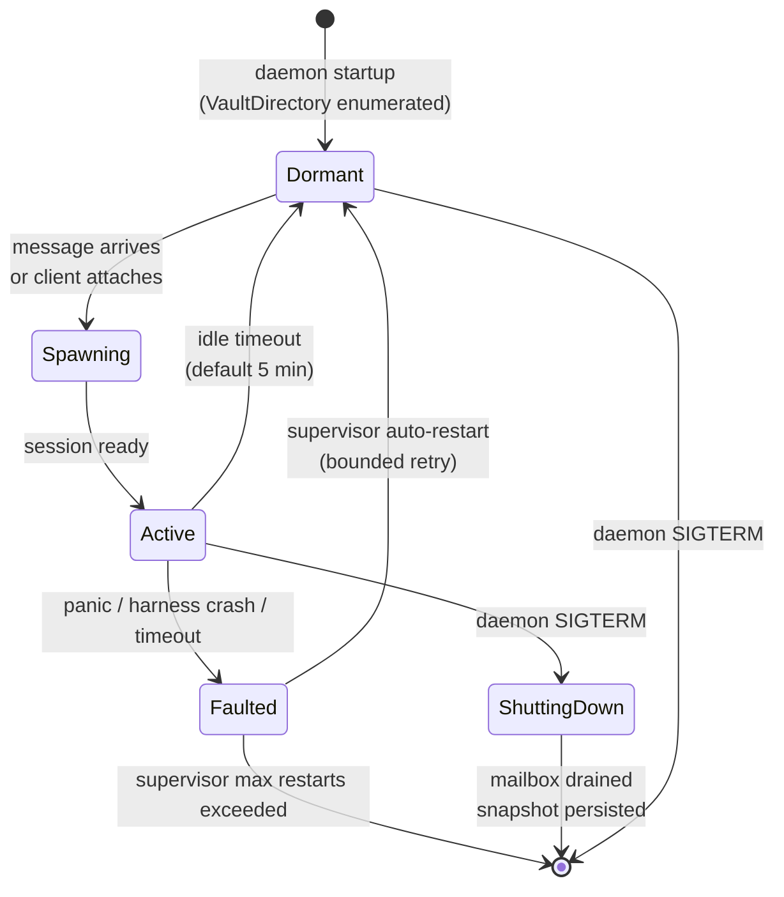

# Sub-project F — Plan Hierarchy, Actor Model, Inter-Actor Dispatch

**Status:** Design complete. Implementation plan deferred pending a BEAM spike
to validate sub-C's PTY approach.

**Brainstormed:** 2026-04-14 (Session 9 of the mnemosyne-orchestrator plan).

**Committed runtime:** Elixir on BEAM. Rust TUI client over a local Unix-socket
NDJSON protocol.

**Supersedes:** the earlier F scope "Plan hierarchy + root plan" from the
orchestrator backlog. F now additionally owns the actor model, the daemon
process architecture, inter-actor message passing, and declarative routing.

---

## Summary

F specifies three intertwined commitments that together define Mnemosyne's
v1 architecture:

1. **Plan hierarchy as a filesystem tree** with a reserved `project-root`
   directory per project, `plan-state.md` as the sole plan marker, path-based
   qualified plan IDs, and unbounded nesting.
2. **Actor-per-plan orchestration** in a single persistent BEAM daemon, with
   two sealed actor types (`PlanActor` for progressive work and `ExpertActor`
   for consultative knowledge), two message types (`Dispatch` for fire-and-forget
   task delivery and `Query` for request-response reasoning), and a
   user-visible declarative routing layer that falls back to fresh-context
   reasoning when rules don't decide.
3. **A client-daemon split** where the daemon hosts all actor state and
   reasoning, and clients (Rust TUI, future Obsidian plugin, future web UI)
   attach over a local Unix socket speaking NDJSON. The TUI owns no state;
   the daemon owns no rendering.

These three commitments are the product of Session 9's brainstorm. They are
the load-bearing decisions that every sibling sub-project must now absorb.
See §8 for the cross-sub-project impact and the amendment tasks F's triage
will land on the orchestrator backlog.

---

## Scope and non-goals

### In scope for F

- Plan hierarchy semantics: `project-root` location, nesting rules, descent
  invariant, marker file, discovery and enumeration, qualified-ID resolution.
- The actor model: sealed `Actor` trait, two actor types, lifecycle states,
  mailbox format, supervision strategy.
- Daemon process architecture: startup, shutdown, OTP supervision tree,
  signal handling, crash recovery from the filesystem substrate.
- Inter-actor message passing: `Dispatch` and `Query` semantics, target
  variants, same-project vs cross-project asymmetry, audit trail conventions.
- Declarative routing: routing module format, hot reload, fact extraction,
  Level 2 fallback, rule suggestion learning loop.
- Client-daemon protocol: Unix socket location, NDJSON command set, forward
  compatibility discipline, multi-client attach semantics.
- Vault catalog: the LLM-facing enumeration of plans and experts, used as
  the `{{VAULT_CATALOG}}` placeholder substitution in phase prompts.
- The cross-sub-project impact table and amendment tasks to be dispatched
  to sibling plans.

### Out of scope for F

- `ExpertActor` internals — persona format, retrieval strategies, default
  expert set, knowledge curation mechanics. Owned by **sub-N (domain experts)**,
  a new sub-project that brainstorms after F's sibling plan lands.
- Multi-adapter / per-actor model selection. `harnesses:` config section is
  reserved in daemon.toml but only Claude Code ships in v1. Owned by
  **sub-O (mixture of models)**, reserved for v1.5+.
- Network transport for remote actor dispatch. `peers:` config section is
  reserved and `<peer>@<qualified-id>` syntax is parsed-but-rejected. Owned
  by **sub-P (team mode)**, reserved for v2+.
- Client implementations — Rust TUI and Obsidian plugin are both separate
  sub-projects (B owns the TUI, K owns the Obsidian plugin). F specifies
  the protocol they both attach to.
- LLM harness spawning primitives — owned by sub-C.
- Phase cycle mechanics (prompt substitution, `StagingDirectory`,
  `plan-state.md` frontmatter, phase-boundary hooks) — owned by sub-B. F
  specifies how the phase cycle embeds inside a PlanActor; B owns the cycle
  itself.
- Knowledge store layout and ingestion pipeline — owned by sub-A and sub-E.

---

## Architectural commitments

Twelve stable decisions F locks in. Each becomes an entry in the orchestrator
plan's `memory.md`.

### F-1. Mnemosyne is a persistent actor daemon

The user-facing entry point is `mnemosyne daemon`, a long-running BEAM
application (OTP). All plan state, actor mailboxes, supervision, message
routing, and knowledge curation live in this process. Individual CLI
invocations of the previous v0.1.0 shape are replaced by a daemon plus
clients that attach to it.

**Rationale.** The alternative — spawning one Mnemosyne process per plan
and multiplexing via the user's terminal — forces Mnemosyne to hand-roll
cross-process coordination, advisory locking, and state-transfer primitives
that OTP gives for free. Once we committed to the actor model as the unit
of orchestration, the daemon became inevitable.

### F-2. Two sealed actor types: PlanActor and ExpertActor

Both implement a shared `Actor` behavior. The actor-type set is **sealed
for v1** — adding a third type requires a code change, not a plugin
mechanism. Extensibility to a third type is a v3+ discussion.

- **PlanActor** — progresses toward a goal. Has backlog, memory, session
  log, phase cycle, mailbox. One per plan directory in the vault.
- **ExpertActor** — consults on a domain. Has persona, knowledge scope,
  retrieval strategy, mailbox. One per expert declaration file in
  `<vault>/experts/`. Details owned by sub-N.

### F-3. Two message types: Dispatch and Query

Both types are first-class primitives. The actor model supports both and
validates them uniformly at the daemon's message router.

- **Dispatch** — fire-and-forget task delivery. Lands in the target's
  `backlog.md` `## Received` section. Target's next phase cycle processes.
- **Query** — request-response reasoning. Target spawns a fresh-context
  session, answers, response routes back to the originating session through
  the harness tool-call boundary (in-session response, not a file).

### F-4. Plan hierarchy via `project-root` convention

Every project adopted by Mnemosyne has exactly one root plan at
`<project>/mnemosyne/project-root/`. The name `project-root` is reserved.
Plans nest arbitrarily under it. A directory is a plan iff it contains
`plan-state.md` (B's invariant, F inherits).

**Collapsed `plans/`.** The earlier layout `<project>/mnemosyne/plans/`
had exactly one child (always the project-root plan), which was pure
redundancy. F removes the `plans/` container. The root plan lives
directly at `<project>/mnemosyne/project-root/`.

### F-5. Path-based qualified plan IDs

A plan's qualified ID is a pure function of its filesystem path:

```
qualified_id = strip_prefix(plan_path, vault.projects_dir)
```

Examples:

- `Mnemosyne/project-root`
- `Mnemosyne/project-root/sub-F-hierarchy`
- `APIAnyware-MacOS/project-root/sub-ffi-callbacks/sub-ffi-callbacks-gc-protect`

The qualified ID is **never stored** in `plan-state.md` frontmatter. Storing
it would be a duplicate source of truth that could drift. The filesystem is
authoritative; the qualified ID is computed at read time.

### F-6. Dispatch target resolution is asymmetric

Dispatches name their target with different shapes depending on scope:

- **Same-project dispatch** — origin names the specific plan directly:
  `target-plan: <qualified-id>`. Mnemosyne writes to that plan's backlog
  mechanically, no LLM in the loop. Origin has enough local context to pick
  the right target.
- **Cross-project dispatch** — origin names only the target *project*:
  `target-project: <name>`. Mnemosyne spawns a **Level 2 routing agent** —
  a fresh-context session scoped to the target project's vault subtree,
  with read access to plan descriptions and source code. The routing agent
  decides which specific plan should receive the dispatch, or rejects with
  reasoning. Origin may optionally include a `suggested-target-plan:` hint
  but the routing agent has the final call.

**Rationale.** Same-project targeting is cheap and accurate because the
origin is already reasoning inside the project's context. Cross-project
targeting would be wasteful if flattened into the origin's context (every
project's plans visible everywhere) — and would violate fresh-context
discipline. The Level 2 agent gives cross-project reasoning the context it
needs (target project's code and memory) without polluting the origin's
context.

### F-7. Vault catalog as the LLM-facing enumeration

A single cached file at `<vault>/plan-catalog.md`, auto-regenerated on every
plan mutation and every phase-prompt render, lists every plan in the vault:
qualified ID + 120-character description. Plus every expert. Plus dispatch
rules text.

This file is substituted into phase prompts via the `{{VAULT_CATALOG}}`
placeholder, replacing the earlier `{{RELATED_PLANS}}` mechanism (which F
deletes as a coordination point with sub-B). A realistic vault's catalog is
~20 plans × 120 characters ≈ 2.5KB, negligible for context budget.

### F-8. Description discipline: 120-character hard cap

Every plan and expert declares a `description:` field in its frontmatter,
capped at 120 characters, keyword-dense and noun-phrase-led. The cap is
enforced at every load — overflow is a hard error with an actionable
diagnostic. The short cap is load-bearing: it forces LLM-skimmable rhythm
in the catalog and prevents drift into verbose framings that defeat the
catalog's purpose.

### F-9. Declarative routing with LLM-fallback learning loop

Routing is user-visible and user-editable. Users edit an Elixir routing
module that uses pattern-matched `defp route/2` clauses. Hot code reload
makes edits live without daemon restart. When rules don't fire (or fire
ambiguously), the Level 2 routing agent is the fallback — and its decisions
can propose new rules the user accepts into the routing module, closing a
learning loop.

Rule engine choice: **start with pattern-matched Elixir dispatch**, defer
Erlog / embedded Prolog to later if expressiveness pressure arises. Facts
are extracted by a small cheap LLM pass (sub-O ideal consumer when it
lands; v1 uses the Claude Code adapter with Haiku).

### F-10. Runtime: Elixir on BEAM

The daemon is an Elixir application (OTP supervision, GenServer actors,
message passing, hot code reload). The sunk-cost analysis strongly favors
BEAM: the entire actor model, supervision, message passing, team-mode
transport, and hot reload are OTP primitives we would otherwise hand-roll.

**Gleam reserved as a migration target.** Gleam is a statically typed BEAM
language that better fits the invariant-heavy design discipline. Its
ecosystem is smaller and younger; Elixir is chosen for v1 maturity and
sub-C PTY-library concerns. New sub-projects can be written in Gleam later
without disrupting the Elixir daemon core — BEAM interop is clean.

### F-11. TUI stays in Rust, runs as a separate client binary

The daemon and the TUI are two separate binaries. The TUI (Rust + ratatui)
connects to the daemon over a local Unix socket and speaks NDJSON. The TUI
owns rendering, keybindings, and input handling. The daemon owns actor
state, routing, reasoning. The socket is the integration boundary — no
Rustler, no NIFs, no ABI coupling.

**Benefits.** Multi-client is free: same protocol supports Rust TUI, Obsidian
plugin, future web UI, headless scripting client. Independent deployment:
TUI can be rebuilt and restarted without touching the daemon. No BEAM-Rust
version coupling.

### F-12. Reserved extensibility hooks

F v1 parses-but-rejects the following, preserving schema space for later
sub-projects:

- `harnesses:` multi-adapter config → sub-O (mixture of models)
- `model:` per-actor override → sub-O
- `peers:` daemon peer list → sub-P (team mode)
- `<peer>@<qualified-id>` syntax → sub-P
- `permissions:` per-actor access control → v2+

Every reservation is a schema/parse-level decision. No behavior is wired in
v1.

---

## §1 Data model

### §1.1 Filesystem layout

```
<dev-root>/
├── Mnemosyne-vault/                           # sub-A owns; F references
│   ├── .git/
│   ├── .obsidian/                             # shipped template
│   ├── mnemosyne.toml                         # vault identity marker
│   ├── daemon.toml                            # F's daemon config
│   ├── routing.ex                             # F's declarative routing module
│   ├── plan-catalog.md                        # F's auto-generated catalog
│   ├── knowledge/                             # Tier 2 global knowledge
│   │   ├── languages/
│   │   ├── domains/
│   │   ├── tools/
│   │   ├── techniques/
│   │   └── projects/
│   ├── experts/                               # sub-N expert declarations
│   │   ├── rust-expert.md
│   │   ├── research-expert.md
│   │   └── ...
│   ├── projects/                              # symlinks to adopted projects
│   │   ├── Mnemosyne -> /dev/Mnemosyne/mnemosyne/
│   │   └── APIAnyware-MacOS -> /dev/APIAnyware-MacOS/mnemosyne/
│   └── runtime/                               # ephemeral, gitignored
│       ├── daemon.sock                        # F's client socket
│       ├── mailboxes/<qualified-id>.jsonl     # F's mailbox files
│       ├── mailboxes/<qualified-id>.cursor    # F's processing cursor
│       ├── staging/<qualified-id>/            # sub-B staging dirs
│       ├── interrupted/<qualified-id>/        # sub-B crash forensics
│       └── ingestion-events/*.jsonl           # sub-E events
└── <project>/
    ├── .git/
    └── mnemosyne/                             # per-project mnemosyne directory
        ├── knowledge/                         # Tier 1 per-project
        └── project-root/                      # F's root plan
            ├── plan-state.md                  # required marker
            ├── backlog.md
            ├── memory.md
            ├── session-log.md
            ├── dispatches.yaml                # transient, cleared by F after processing
            ├── queries.yaml                   # transient, cleared by F after processing
            ├── prompt-reflect.md              # optional phase override
            ├── prompt-triage.md               # optional phase override
            ├── prompt-compact.md              # optional phase override
            ├── pre-work.sh                    # optional executable hook
            └── sub-F-hierarchy/               # nested child plan
                ├── plan-state.md
                ├── backlog.md
                └── ...
```

### §1.2 The `project-root` plan

Reserved directory name. Exactly one per project. Created during project
adoption by sub-A's `adopt-project` command. The single filesystem check
"project is adopted" becomes:

```
<project>/mnemosyne/project-root/plan-state.md exists
```

**Why not collapse further** (make `<project>/mnemosyne/` itself the root
plan)? Because `<project>/mnemosyne/knowledge/` would then be under the plan's
rendering scope, and B's `StagingDirectory::render` would copy Tier 1
knowledge into staging. That violates B's descent invariant ("plan membership
is purely `plan-state.md`"). Keeping the root plan in its own directory
preserves the invariant cleanly — `knowledge/` is a sibling of
`project-root/`, never inside it.

### §1.3 `plan-state.md` frontmatter schema

Frontmatter holds only fields that are not derivable from the filesystem.
F proposes the following schema — this is a **coordination point with
sub-B** (B's current design has `plan-id`, `host-project`, `dev-root` fields
that are derivable and should be removed):

```yaml
---
schema-version: 1
description: Plan hierarchy, actor model, inter-plan dispatch, declarative routing.
current-phase: reflect
started-at: 2026-04-14T11:48:52Z
harness-session-id: reflect-sub-F-hierarchy-Mnemosyne
daemon-pid: 48291
interrupted: false
tags:
  - mnemosyne-plan
  - phase-reflect
last-exit:
  phase: work
  exited-at: 2026-04-14T11:30:14Z
  clean-exit: true
  ingestion-fired: false
---

# Plan state for [[sub-F-hierarchy]]

Auto-managed by Mnemosyne. Do not edit directly except for crash recovery.
```

**Removed** from B's earlier schema (F's coordination amendment to B):

- `plan-id` — computable from path
- `host-project` — computable from path
- `dev-root` — computable from host project's parent

**Added** by F:

- `description` — required, ≤120 characters, non-placeholder

**Unchanged** from B:

- `schema-version`, `current-phase`, `started-at`, `harness-session-id`,
  `interrupted`, `tags`, `last-exit`
- `mnemosyne-pid` renamed to `daemon-pid` to reflect the new runtime

### §1.4 Description discipline

Every plan's description must:

1. Be exactly one sentence.
2. Be ≤120 characters (hard cap, enforced at load).
3. Be keyword-dense, noun-phrase-led.
4. Describe the plan's **scope**, not its current phase or in-flight work.
5. Not use self-reference (`this plan`, `we are`, `I`).
6. Not be a placeholder (`TODO`, `FIXME`, `...`, `tbd`).

Descriptions are written at plan creation (brainstorm exit criterion) and
may be updated during reflect phases if scope has drifted. Never written
during work or compact phases.

**Style guide examples:**

| Bad (prose-y, >120c, vague) | Good (keyword-dense, ≤120c) |
|---|---|
| This plan is designing the adapter layer for harnesses like Claude Code. | Harness adapter layer — spawn, PTY lifecycle, stream-json, Claude Code adapter. |
| Working on how to store knowledge in the vault and discover it. | Vault discovery, identity marker, init/adopt commands, Tier 2 layout. |
| Plans for the phase cycle moved from run-plan.sh into Rust. | Four-phase cycle in Rust — PhaseRunner, StagingDirectory, embedded prompts. |

### §1.5 Invariants

Every invariant below is checked at vault load via `verify_vault` (sub-A's
existing entry point). Any violation is a hard error with an actionable
diagnostic naming the offending plan by qualified ID.

| # | Invariant |
|---|---|
| 1 | **Marker invariant**: a directory is a plan iff it contains `plan-state.md`. No plan without marker; no marker without plan. |
| 2 | **Descent invariant**: `StagingDirectory::render` refuses descent into subdirectories containing `plan-state.md`. (Inherited from sub-B.) |
| 3 | **Root invariant**: every adopted project has exactly one `project-root/` directory as a direct child of `<project>/mnemosyne/`, containing `plan-state.md`. |
| 4 | **Reserved name invariant**: no plan directory at any depth is named `project-root` except the root plan itself. |
| 5 | **Single-host invariant**: every plan has exactly one host project (the first path segment after `<vault>/projects/`). Multi-project plans are a v2 concern if they ever become real. |
| 6 | **Knowledge isolation invariant**: `<project>/mnemosyne/knowledge/` is never a plan and never contains `plan-state.md`. |
| 7 | **Description invariant**: every plan has a non-empty, non-placeholder `description:` field of ≤120 characters. |
| 8 | **No-nested-roots invariant**: the string `project-root` does not appear as a plan directory name anywhere in the tree except at the single reserved location. |

---

## §2 Inter-actor messages

### §2.1 Two message types

| | Dispatch | Query |
|---|---|---|
| **Semantics** | Fire-and-forget task delivery | Request-response question |
| **Durable form** | `<origin>/dispatches.yaml` | `<origin>/queries.yaml` |
| **Target lands at** | Target's `backlog.md` `## Received` | Target actor spawns fresh session |
| **Response** | None (Ack only) | Answer routes back to origin session |
| **Response substrate** | n/a | Harness tool-call boundary (in-session) |
| **Common usage** | PlanActor → PlanActor | PlanActor → ExpertActor |

Both types share target resolution, declarative routing, Level 2 fallback,
and audit trail conventions. They differ only in what the target actor does
on receipt.

### §2.2 Target variants

Three target fields. Exactly one per message entry. Validated at parse time.

| Variant | Used when | Constraint |
|---|---|---|
| `target-plan: <qualified-id>` | Same-project targeting — origin names the specific plan | Must be in origin's project |
| `target-project: <project-name>` | Cross-project targeting — origin names the project only | Must differ from origin's project; Level 2 agent picks the specific plan |
| `target-expert: <expert-id>` | Consulting an expert (almost always a Query) | Resolves to a local `ExpertActor` |

Optional `suggested-target-plan:` may accompany a `target-project:` entry —
an LLM-supplied hint the Level 2 agent uses as a starting point but may
override.

### §2.3 Same-project direct dispatch

Origin's phase writes to `dispatches.yaml`:

```yaml
dispatches:
  - target-plan: Mnemosyne/project-root/sub-A-global-store
    reason: Lock directory pinning question belongs to sub-A's scope.
    body: |
      The D concurrency brainstorm needs to know whether the lock
      directory is at vault-runtime or per-project scope. A already
      pinned it at <vault>/runtime/locks/. Confirm this is final so
      D can proceed.
```

F's post-phase processor (see §5.2) parses, validates, and appends to the
target plan's `backlog.md`:

```markdown
## Received

- source: Mnemosyne/project-root/sub-F-hierarchy
  dispatched-at: 2026-04-14T10:04:11Z
  reason: Lock directory pinning question belongs to sub-A's scope.
  body: |
    The D concurrency brainstorm needs to know whether the lock
    directory is at vault-runtime or per-project scope. A already
    pinned it at <vault>/runtime/locks/. Confirm this is final so
    D can proceed.
  ---
```

And mirrors in origin's `backlog.md`:

```markdown
## Dispatched

- target: Mnemosyne/project-root/sub-A-global-store
  dispatched-at: 2026-04-14T10:04:11Z
  reason: Lock directory pinning question belongs to sub-A's scope.
  body: (same as above)
  routing-outcome: accepted
  ---
```

No Level 2 agent, no LLM in the loop for same-project dispatch. The decision
was made at phase time.

### §2.4 Cross-project routed dispatch

Origin's phase writes:

```yaml
dispatches:
  - target-project: APIAnyware-MacOS
    suggested-target-plan: APIAnyware-MacOS/project-root/sub-ffi-callbacks
    reason: Description in the vault catalog matches this concern exactly.
    body: |
      Investigate whether gc-protect wrappers need to be applied to
      all callback registration sites in the FFI layer, not just the
      ones surfaced by the immediate crash reproducer.
```

F's processor spawns a fresh Claude Code session via sub-C's adapter with
the Level 2 routing prompt, scoped to the target project's vault subtree:

```
You are a dispatch routing agent for the project APIAnyware-MacOS.

A plan in Mnemosyne/project-root/sub-F-hierarchy generated a putative
cross-project dispatch. Your job: decide whether this concern belongs in
APIAnyware-MacOS, and if so, which specific plan should receive it.

Putative dispatch:
  Origin: Mnemosyne/project-root/sub-F-hierarchy
  Reason: Description in the vault catalog matches this concern exactly.
  Suggested target plan: APIAnyware-MacOS/project-root/sub-ffi-callbacks
  Task body:
    Investigate whether gc-protect wrappers need to be applied to
    all callback registration sites in the FFI layer, not just the
    ones surfaced by the immediate crash reproducer.

Tools available:
  - Read files under <vault>/projects/APIAnyware-MacOS/
  - Read project source under that path
  - Read plan descriptions in <vault>/plan-catalog.md
  - Append to exactly one target plan's backlog.md Received section

Your response (YAML):
  accept:
    target-plan: <qualified-id>
    justification: <1-2 sentences>
    suggested-rule: |
      <optional routing rule for F to propose to the user>
  reject:
    reason: <1-2 sentences>
    suggested-retarget: <project-name-or-none>

Read whatever you need to verify. Be willing to read actual source code —
that's why you're here. Prefer accepting at a specific plan over rejecting
when the concern is valid but routing is uncertain.
```

The agent reads code and plans as needed, returns a decision, and F's
processor writes the outcome to the origin's `Dispatched` section and
(on accept) to the target's `Received` section.

**Timeout.** 5 minutes per Level 2 invocation. Exceeded = treated as
rejection with `routing-response: "timeout"`.

### §2.5 Query semantics and response routing

Query flow differs from Dispatch in that the **originating session** is
still active and expecting an in-context answer.

1. Origin's phase prompt instructs the LLM: "If you need to ask a domain
   expert a question, invoke the `ask_expert` harness tool with target and
   question."
2. The LLM invokes the tool mid-session. C's adapter intercepts.
3. C forwards the tool invocation as a Query message to F's router.
4. F validates, routes, and delivers to the target actor's mailbox.
5. Target actor (usually an ExpertActor) spawns its own fresh-context session
   with persona + retrieved knowledge + question. Answers.
6. Answer flows back through F's router to C's adapter as a tool-call
   response.
7. The originating LLM receives the answer as a tool result inline, and
   continues its session.

Key property: **the originating session never loads the expert's knowledge
into its own context**. The expert reads, reasons, and returns prose. Fresh
context is preserved at both ends.

**Queries are strictly in-session for v1.** Cross-session Query ("ask
yesterday and see the answer today") is a v1.5+ feature. V1 Queries always
complete during the calling session or timeout.

### §2.6 Backlog sections

Every `backlog.md` may contain two F-owned sections, both optional:

```markdown
## Dispatched

Tasks this plan has routed elsewhere. Audit trail only — the live copy
lives in the target plan's Received section (for accepted dispatches) or
was never written (for rejected cross-project dispatches).

- ...

## Received

Tasks dispatched to this plan from elsewhere. Live items, tracked through
to completion like any other backlog item. The next triage phase may
elevate a Received entry into the plan's main task list, complete it, or
re-dispatch it.

- ...
```

Both sections are chronologically ordered, newest last. Created
idempotently the first time F's processor needs to write to them.

### §2.7 Audit trail

- **Dispatch**: dual audit (`Dispatched` in origin + `Received` in target).
- **Query**: ephemeral. The originating session sees the answer in-context
  and chooses whether to record it in its own `memory.md` or `session-log.md`.
  No separate audit file.

### §2.8 Non-features

F's dispatch mechanism deliberately does NOT support:

- **Deduplication.** Duplicate dispatches land as duplicates. Humans dedupe
  during triage. Semantic comparison would be unreliable.
- **Priority or urgency flags.** The `reason:` field carries human-readable
  context. No structured priority.
- **Rollback or undo.** Once written, dispatch records are permanent. The
  receiving plan's triage can reject or re-dispatch but cannot erase.
- **Cross-vault dispatch.** Single vault only. Cross-vault coordination is
  a future team-mode concern.
- **Scheduled or deferred delivery.** Dispatches process synchronously at
  phase exit.

---

## §3 Discovery and enumeration

### §3.1 Vault walk algorithm

F's walker is invoked once per daemon startup and on every `mnemosyne
rescan` command. It produces a `VaultDirectory` struct cached in process
memory for the daemon's lifetime.

```
WalkAlgorithm:

1. Enumerate <vault>/projects/ — every entry must be a symlink.
   Non-symlink entries are a hard error.

2. For each project symlink, resolve and verify the target ends in
   /mnemosyne/. Broken symlinks and wrong-shape targets are hard errors.

3. For each resolved project, verify:
     <project>/mnemosyne/knowledge/        exists, not a plan
     <project>/mnemosyne/project-root/     exists, is a plan
   Hard error on missing or extra top-level entries.

4. Walk <project>/mnemosyne/project-root/ recursively:
     - At each directory, check for plan-state.md.
       Present: add to the plan map, parse frontmatter, validate, then
         RECURSE regardless of marker presence (discovery walks
         everything; the descent invariant applies only to
         StagingDirectory::render).
       Absent: recurse. Directory is pure organization.

5. Enumerate <vault>/experts/*.md as ExpertActor declarations. (Details
   owned by sub-N; F calls the enumerator as a stub.)

6. Synthesize parent/child relationships by sorting plans by qualified_id
   and assigning each plan's parent to its nearest ancestor in the
   qualified_id path.

7. Run all §1.5 invariant checks against the assembled map.
   Hard error on any violation with an actionable diagnostic.

8. Return VaultDirectory { plans, experts }.
```

### §3.2 Plan catalog synthesis

The vault catalog is rendered from `VaultDirectory` by F's `CatalogRenderer`
module. Two rendering variants:

- **Phase catalog** (`render_phase_catalog(current)`) — highlights the
  current plan with `[YOU ARE HERE]`, groups plans by project with the
  current project listed first, appends dispatch-rule instructions. This
  is what `{{VAULT_CATALOG}}` substitution produces.

- **Cached catalog** (`render_cached_catalog()`) — neutral reference document
  committed to `<vault>/plan-catalog.md`, human-readable, groupings
  alphabetical, no highlights or instructions. Visible in Obsidian as a
  "what's in my vault" dashboard.

Both variants use the same underlying walk — they differ only in the
per-entry formatting.

### §3.3 Catalog regeneration triggers

`<vault>/plan-catalog.md` is regenerated on:

1. Daemon startup (part of `verify_vault`).
2. Every `mnemosyne rescan` command.
3. Every plan creation or deletion (the daemon's plan-management code is
   the forcing function).
4. Every `plan-state.md` write from within the daemon (frontmatter changes
   may have updated a description).
5. Every phase-prompt render (sanity check — the phase runner walks the
   filesystem, re-renders the catalog, and diffs against the cached form.
   If they differ, the cached form was stale — log a warning, trust the
   fresh walk).

Writes are via write-to-temp-then-atomic-rename. No locks needed (all
daemon-internal writes are serialized through the daemon's single process;
only external tools contend with the daemon for this file, and the atomic
rename handles that).

### §3.4 Symlink hygiene

- `<vault>/projects/<name>` is the only expected symlink on the plan walk
  path. Any other symlink inside a project tree is a hard error.
- Broken top-level project symlinks are surfaced by name:
  `"project symlink <vault>/projects/Foo points at /path/that/does/not/exist"`.
- Symlink targets are canonicalized once on walk entry; subsequent path
  work uses the canonical form.
- Loop detection isn't needed because only one layer of symlinks is
  followed (the `projects/` symlinks). Everything below is walked as a
  plain directory tree.

---

## §4 Actor model (Elixir/OTP mapping)

### §4.1 Actor as GenServer behavior

Each actor type is an Elixir module implementing a `Mnemosyne.Actor` behavior
on top of `GenServer`. The behavior requires the following callbacks:

```elixir
defmodule Mnemosyne.Actor do
  @type message ::
    {:dispatch, DispatchMessage.t()} |
    {:query, QueryMessage.t()}

  @type response ::
    :ack |
    {:answer, QueryAnswer.t()} |
    {:rejected, RejectionReason.t()}

  @callback actor_id(state :: term()) :: ActorId.t()
  @callback actor_type(state :: term()) :: :plan | :expert
  @callback handle_actor_message(msg :: message(), state :: term()) ::
    {:reply, response(), new_state :: term()} |
    {:noreply, new_state :: term()}
  @callback snapshot(state :: term()) :: ActorSnapshot.t()
  @callback restore(snapshot :: ActorSnapshot.t()) :: {:ok, state :: term()}
end
```

The two implementors (`Mnemosyne.PlanActor` and `Mnemosyne.ExpertActor`)
each provide their own `handle_actor_message/2` with appropriate
pattern-matched clauses. PlanActor's handler integrates sub-B's phase
cycle; ExpertActor's handler (owned by sub-N) spawns retrieval+reasoning.

### §4.2 PlanActor

Behavior highlights (full design in F's implementation plan, deferred):

- **State**: qualified ID, loaded `plan-state.md`, mailbox pointer, current
  phase, active harness session (if any), client attachment list.
- **On Dispatch receipt**: append to `backlog.md` `## Received` section via
  an atomic write.
- **On Query receipt**: spawn a fresh harness session via sub-C's adapter,
  deliver the question, wait for the answer, return as `{:answer, ...}`.
  Timeout configurable per daemon config (default 5 min).
- **Phase cycle integration**: sub-B's `PhaseRunner` runs inside the
  PlanActor, driven by messages (`{:run_phase, :work}`) from attached
  clients. Between phases, the actor is Dormant unless a message arrives.

### §4.3 ExpertActor as type hole

F declares the module exists and conforms to the `Mnemosyne.Actor` behavior.
Concrete implementation (persona handling, retrieval strategy, knowledge
scope walking) is sub-N's scope.

F's v1 code ships an ExpertActor stub that returns
`{:rejected, :not_yet_implemented, "see sub-N-domain-experts"}` for all
messages. The daemon starts, routes to the stub, and reports the stub's
rejection cleanly in Dispatched sections. This lets F ship without blocking
on sub-N, and the stub disappears when sub-N lands its implementation.

### §4.4 Actor lifecycle

Five states plus transitions:



- **Dormant**: minimal memory (KBs), no Erlang process. Messages queued
  on disk in the mailbox file.
- **Spawning**: supervisor is starting the actor's GenServer and its
  harness session. Transient state.
- **Active**: GenServer is running, processing messages. Attached clients
  see events in real time.
- **Faulted**: GenServer panicked, harness session crashed, or query
  timed out. Supervisor applies its restart strategy.
- **ShuttingDown**: daemon is terminating. Actor drains its mailbox, calls
  `snapshot/1`, persists the snapshot, and exits cleanly.

### §4.5 Supervision tree

F uses standard OTP supervision with simple strategies — no custom
supervisor logic.

```
Mnemosyne.Application
└── Mnemosyne.Supervisor (:one_for_one)
    ├── Mnemosyne.VaultDirectory.Server    (gen_server, singleton, holds VaultDirectory cache)
    ├── Mnemosyne.Router.Server            (gen_server, singleton, routes messages)
    ├── Mnemosyne.ClientListener           (task, accepts Unix socket connections)
    ├── Mnemosyne.ClientConnection.Supervisor (dynamic_supervisor)
    │   └── (one task per connected client)
    ├── Mnemosyne.ActorSupervisor          (dynamic_supervisor, restart: :transient)
    │   ├── PlanActor(qualified-id-1)      (:transient — 3 crashes in 60s → permanent stop)
    │   ├── PlanActor(qualified-id-2)
    │   └── ExpertActor(expert-id-1)       (stub in F v1)
    └── Mnemosyne.FactExtractor.Server     (gen_server, singleton, LLM fact-extraction for routing)
```

- **`:one_for_one`** at the top level — if any singleton dies, only it
  restarts. No cascade.
- **`:transient`** for actors — an actor that panics 3 times in 60
  seconds gets stopped permanently (user intervention required). Short
  crashes are auto-recovered.
- **`dynamic_supervisor`** for actors because they come and go as plans
  are created and deleted.

### §4.6 Daemon startup and shutdown

**Startup** (`mnemosyne daemon` entry point):

1. Parse `<vault>/daemon.toml` (or default locations per sub-A).
2. Acquire a **vault-wide singleton lock** via a flock on
   `<vault>/runtime/daemon.lock`. Refuse to start if another daemon holds
   the lock. (This replaces sub-D's per-plan locks with a single
   daemon-level guard — see §8.)
3. `VaultDirectory.Server` starts, runs `verify_vault`, walks the vault,
   caches the result.
4. `Router.Server` starts empty.
5. `FactExtractor.Server` starts with the configured cheap model.
6. `ActorSupervisor` starts. For each plan/expert in `VaultDirectory`,
   register a dormant child spec (actor not yet started — will start on
   first message).
7. `ClientListener` binds `<vault>/runtime/daemon.sock`.
8. Scan `<vault>/runtime/mailboxes/*.jsonl` for persisted messages. For
   each file with unprocessed entries, re-queue the entries to their
   target actor (which spawns it out of Dormant).
9. Daemon enters its main loop.

**Graceful shutdown** (SIGTERM):

1. `ClientListener` stops accepting new connections.
2. `Router` broadcasts `{:daemon_shutdown, reason}` to all client
   connections; clients detach cleanly.
3. `ActorSupervisor` sends `:shutdown` to each active actor.
4. Each actor drains its mailbox (completing in-flight message processing),
   calls `snapshot/1`, persists to `<vault>/runtime/snapshots/<qualified-id>.bin`
   via atomic write.
5. Mailbox files are flushed and fsynced.
6. Vault-wide singleton lock is released.
7. Daemon exits.

**SIGKILL or crash**: unrecoverable state in flight. On next startup, the
mailbox-recovery path picks up persisted messages and actors reload from
their last snapshots (or rebuild from `plan-state.md` + `backlog.md` if
no snapshot exists — the filesystem is the durable source of truth).

### §4.7 Message routing

```mermaid
sequenceDiagram
    participant Client as Client (TUI)
    participant Listener as ClientListener
    participant Conn as ClientConnection
    participant Router as Router.Server
    participant Fact as FactExtractor
    participant Actor as Target Actor
    participant Mailbox as Mailbox File

    Client->>Listener: connect Unix socket
    Listener->>Conn: accept, spawn task
    Client->>Conn: send {attach, qualified-id}
    Conn->>Router: attach_request
    Router->>Actor: ensure started, register client
    Router-->>Conn: attached ack
    Conn-->>Client: attached ack

    Client->>Conn: send {send, actor_id, dispatch, body}
    Conn->>Router: dispatch(actor_id, body)
    Router->>Fact: extract_facts(body)
    Fact-->>Router: [concerns(...), ...]
    Router->>Router: apply routing rules
    alt Rule fires unambiguously
        Router->>Mailbox: append NDJSON entry
        Mailbox-->>Router: fsync ack
        Router->>Actor: {:dispatch, msg}
        Actor->>Actor: handle_actor_message
        Actor->>Actor: write Received section
        Actor-->>Router: :ack
    else Rule ambiguous or missing
        Router->>Actor: spawn_level_2_agent
        Actor-->>Router: routing decision
        Router->>Mailbox: append NDJSON entry
        Router->>Actor: {:dispatch, msg}
    end
    Router-->>Conn: ack / result
    Conn-->>Client: response
```

Key property: **durable write precedes delivery**. The mailbox file is
appended and fsynced before the in-process `GenServer.cast` fires. This
gives at-most-once semantics — a crash between fsync and cast replays
cleanly on restart, and a crash between cast and processing replays via
the mailbox cursor (§4.8).

### §4.8 Mailbox persistence

Each actor has a mailbox file at `<vault>/runtime/mailboxes/<qualified-id>.jsonl`.
Format: one JSON object per line (NDJSON).

```json
{"id":"01HZ...","type":"dispatch","from":"Mnemosyne/project-root/sub-F","to":"Mnemosyne/project-root/sub-A","ts":"2026-04-14T10:04:11Z","body":{...}}
{"id":"01J0...","type":"query","from":"Mnemosyne/project-root/sub-F","to":"expert:rust-expert","ts":"2026-04-14T10:12:45Z","question":"..."}
```

Each mailbox has a **cursor file** at
`<vault>/runtime/mailboxes/<qualified-id>.cursor` containing the zero-based
index of the last successfully processed message. Cursor is updated
**after** `handle_actor_message/2` returns success.

**Crash recovery**:

- On daemon start, for each mailbox, read the cursor and replay entries
  from index `cursor+1` onward.
- A crash between durable-write and processing replays the entry.
- A crash between processing-success and cursor-update replays the entry
  (at-most-once honored because receivers are idempotent — appending the
  same Received entry twice is reconcilable during triage, not a system
  failure).

**Compaction**: when the cursor lags far behind the end of the mailbox
file (threshold configurable, default 1000 entries), the daemon rewrites
the file keeping only entries at index `cursor+1` onward and resets the
cursor to 0. Rewrites use atomic-rename.

### §4.9 Hot code reload

BEAM's native hot code reload is used for two specific things in v1:

1. **`routing.ex`** — user edits the routing module. The daemon detects
   the file change (or the user runs `mnemosyne rescan`), recompiles
   the module via `Code.compile_file/1`, and the new rules take effect
   immediately with no actor restart.
2. **Experts** (sub-N's scope, but F reserves the hook) — adding or
   editing a new expert declaration file causes the daemon to reload
   the expert module.

Full hot-reload of PlanActor internals is **not** supported in v1 —
changes to actor behavior require a daemon restart. This is a deliberate
scope limit; v1 hot reload is user-code-only.

### §4.10 Reserved extensibility hooks

- `daemon.toml` `[harnesses]` section accepts multiple entries, v1 only
  populates `[harnesses.claude-code]`. Schema ready for sub-O.
- Actor declarations accept an optional `model:` field. v1 ignores it
  (all actors use the default model). Schema ready for sub-O.
- `daemon.toml` `[peers]` section accepts entries, v1 errors out if
  non-empty. Schema ready for sub-P.
- Qualified ID parser accepts `<peer>@<id>` syntax, v1 errors out if
  peer is non-empty. Syntax ready for sub-P.
- Actor declarations accept an optional `permissions:` field. v1 ignores
  it. Reserved for v2+ access control.

---

## §5 Phase cycle integration

### §5.1 Phase cycle inside PlanActor

Sub-B's `PhaseRunner` was originally designed as a standalone process
main loop. F's actor commitment moves it inside a PlanActor:

- The PlanActor holds a reference to its `PhaseRunner` state machine.
- Phase transitions are driven by messages: a client sends
  `{:run_phase, :work}`, the actor invokes `PhaseRunner.start(:work)`
  which runs the full phase (staging, prompt render, harness spawn,
  streaming output, exit detection, staging copy-back, `plan-state.md`
  update).
- The actor supervises the phase run. If the phase crashes (harness
  crash, user interrupt), the actor transitions to Faulted.
- When the phase completes, the actor runs F's dispatch/query processors
  (§5.2) before returning to Idle or auto-advancing to the next phase.

This is a **coordination point with sub-B** — B's design doc needs an
amendment describing the actor-hosted phase cycle. F's triage writes an
amendment task to the orchestrator backlog.

### §5.2 Dispatch/Query file processing at phase exit

After every work, reflect, or triage phase (not compact — compact is
strictly lossless memory rewriting), the PlanActor runs two processors
in sequence:

1. **`DispatchProcessor`** — reads `<plan>/dispatches.yaml` if present,
   parses, validates, processes each entry (same-project direct or
   cross-project via Level 2), writes outcomes to both sides' backlog
   sections, deletes `dispatches.yaml` on full success.

2. **`QueryProcessor`** — reads `<plan>/queries.yaml` if present. Note
   that Queries are typically handled in-session via C's adapter tool-call
   boundary, so `queries.yaml` contains only **deferred** queries that
   the phase chose not to execute in-session. Each is routed the same
   way as a dispatch, with the response appended to the phase's
   `session-log.md` as a "deferred query answer" entry.

Both processors have identical crash-recovery protocols (marker files
at `.processing`, cursor-based resume on restart — see §9.4).

### §5.3 Query responses delivered mid-session

The in-session Query path is the common case:

1. Phase prompt equips the LLM with an `ask_expert` tool (or
   `ask_plan` for peer-plan queries).
2. LLM invokes the tool during reasoning.
3. C's adapter intercepts the tool call, wraps it as a Query message,
   sends to F's router.
4. F routes to the target actor. Target spawns fresh session, reasons,
   answers.
5. F delivers the answer back to C's adapter as the tool-call result.
6. C's adapter yields the result to the originating LLM session inline.
7. LLM continues its reasoning with the answer available.

No file is written for in-session Queries. The answer flows through the
tool-call boundary and is only durable if the originating session
chooses to record it (in its own `memory.md`, `session-log.md`, or
embedded in a dispatch).

**Timeout behavior**: if a Query exceeds its timeout (default 5 min), F's
router returns a `{:rejected, :timeout, ...}` result. The originating
session sees this as a tool-call error and can retry, reroute, or
proceed without the answer. No state is lost.

---

## §6 Declarative routing

### §6.1 Routing module (pattern-matched Elixir)

`<vault>/routing.ex` is a user-editable Elixir module with a well-defined
shape:

```elixir
defmodule Mnemosyne.UserRouting do
  @moduledoc """
  User-editable routing rules. Mnemosyne hot-reloads this module on
  save, so edits take effect without daemon restart.

  Each `route/2` clause takes:
    - message type (`:dispatch` | `:query`)
    - a list of `concerns(topic)` facts extracted from the message body
  and returns:
    - `{:target_plan, qualified_id}` for same-project targeting
    - `{:target_project, project_name}` for cross-project
    - `{:target_expert, expert_id}` for expert consultation
    - `:no_route` to fall through to the Level 2 agent
  """

  @behaviour Mnemosyne.Routing.UserRoutes

  # Rust-related concerns → rust expert
  def route(:query, facts) do
    cond do
      "rust" in facts or "cargo" in facts ->
        {:target_expert, "rust-expert"}

      "ffi" in facts and "callback_registration" in facts ->
        {:target_project, "APIAnyware-MacOS"}

      "obsidian" in facts or "dataview" in facts ->
        {:target_expert, "obsidian-expert"}

      true ->
        :no_route
    end
  end

  def route(:dispatch, facts) do
    cond do
      "migration" in facts or "rename" in facts ->
        {:target_plan, "Mnemosyne/project-root/sub-G-migration"}

      "ffi" in facts ->
        {:target_project, "APIAnyware-MacOS"}

      true ->
        :no_route
    end
  end
end
```

The module is plain Elixir — the "DSL" is just pattern matching on
lists. Users get full Elixir expressiveness (guards, conditionals,
helper functions) without a separate rule language.

### §6.2 Hot reload for rules

The daemon watches `<vault>/routing.ex` for changes (via BEAM's
`FileSystem` library or equivalent). On detection:

1. Recompile via `Code.compile_file/1`.
2. On success: the new module is active; subsequent routing decisions
   use it.
3. On failure (parse error, compile error): log the error, keep the
   previous module loaded, surface the failure in the TUI.

Users can also trigger a reload manually via `mnemosyne rescan` or a
TUI command.

### §6.3 Fact extraction LLM pass

Before `route/2` is called, the daemon runs a fact-extraction pass on
the message body via a cheap LLM session:

```
Prompt template:
  "Read this <dispatch|query>. List 1-5 concrete topics it concerns,
   as short lowercase keywords. Output one line per topic in the form:
     concerns('<topic>').

Body:
  {body or question}"

Output (parsed by F):
  concerns('ffi').
  concerns('callback_registration').
  concerns('memory_management').
```

The fact list `["ffi", "callback_registration", "memory_management"]` is
passed to `route/2` as the `facts` argument.

**Model choice**: the daemon config specifies which harness + model to
use for fact extraction. V1 default: the Claude Code adapter with
`claude-haiku-4-5`. Users can override via `daemon.toml`:

```toml
[fact_extraction]
harness = "claude-code"
model = "claude-haiku-4-5"
max_topics = 5
timeout_ms = 5000
```

Sub-O (mixture of models) will make this more powerful by allowing
fact extraction to use a local model, keeping routing inference free
of API cost.

### §6.4 Level 2 fallback

When `route/2` returns `:no_route` (or ambiguously returns multiple
targets — F's router deduplicates first), the daemon spawns a Level 2
routing agent per the prompt in §2.4. The agent has fresh context, reads
the target project's plans and source code, and makes a decision.

### §6.5 Rule suggestion learning loop

The Level 2 agent's response prompt asks for an optional `suggested-rule:`
field proposing a new `route/2` clause the user could add:

```yaml
accept:
  target-plan: APIAnyware-MacOS/project-root/sub-ffi-callbacks
  justification: Matches this plan's FFI callback GC-protection scope exactly.
  suggested-rule: |
    def route(:dispatch, facts) do
      if "gc_protect" in facts and "callback_registration" in facts do
        {:target_plan, "APIAnyware-MacOS/project-root/sub-ffi-callbacks"}
      else
        super(:dispatch, facts)
      end
    end
```

F captures suggestions and surfaces them in the TUI as "Rule suggestion
pending review." The user reviews, optionally edits, and accepts → the
suggestion is appended to `routing.ex` and committed to vault git. Level
2 only runs for novel cases; its decisions train the deterministic path.

### §6.6 Future: Erlog if pattern matching becomes insufficient

If users hit expressiveness limits with pattern-matched Elixir routing,
Erlog (embedded Prolog) is the drop-in upgrade path. The rule module
interface stays the same — it would just run Prolog queries internally
instead of pattern matching. Users who want Prolog-style rules can edit
a `routing.pl` file instead of `routing.ex`.

This is **not shipped in v1**. Pattern-matched Elixir is the v1 starting
point. Erlog integration is a v1.5+ decision based on actual user
experience.

---

## §7 Client-daemon protocol

### §7.1 Unix socket

Location: `<vault>/runtime/daemon.sock` (gitignored; per-machine).

Unix socket over stream-oriented NDJSON. Both reads and writes are
newline-delimited UTF-8 JSON. One JSON object per line. Empty lines and
whitespace-only lines are ignored.

### §7.2 NDJSON command set

V1 command set, deliberately minimal. All commands carry a `request_id`
for correlation. Unknown fields are ignored by both ends (forward
compatibility). Extension fields use the `x-` prefix.

**Client → Daemon**:

```json
{"cmd": "attach", "actor_id": "Mnemosyne/project-root/sub-F-hierarchy", "request_id": "r-1"}
{"cmd": "detach", "actor_id": "Mnemosyne/project-root/sub-F-hierarchy", "request_id": "r-2"}
{"cmd": "send", "actor_id": "...", "message": {"type": "dispatch", ...}, "request_id": "r-3"}
{"cmd": "list", "filter": {"actor_type": "plan"}, "request_id": "r-4"}
{"cmd": "status", "actor_id": "...", "request_id": "r-5"}
{"cmd": "run_phase", "actor_id": "...", "phase": "work", "request_id": "r-6"}
{"cmd": "rescan", "request_id": "r-7"}
{"cmd": "shutdown", "request_id": "r-8"}
```

**Daemon → Client**:

```json
{"type": "attached", "actor_id": "...", "snapshot": {...}, "request_id": "r-1"}
{"type": "detached", "actor_id": "...", "request_id": "r-2"}
{"type": "response", "request_id": "r-3", "body": {"result": "ok"}}
{"type": "event", "actor_id": "...", "event": {"type": "phase_transition", "from": "work", "to": "reflect"}}
{"type": "message", "from": "...", "body": {...}}
{"type": "error", "code": "unknown_actor", "message": "...", "request_id": "r-3"}
```

Event types (non-exhaustive, extensible):

- `phase_transition` — actor moved from one phase to another
- `mailbox_received` — actor received a new message
- `harness_output` — streaming output from the actor's harness session
- `dispatch_processed` — a dispatch was routed and written
- `query_answered` — a query returned a response
- `rule_fired` — declarative routing matched
- `rule_suggestion` — Level 2 proposed a new rule
- `actor_state_change` — Dormant/Spawning/Active/Faulted transition

### §7.3 Forward compatibility

- Unknown JSON fields are silently ignored.
- Unknown commands return `{"type": "error", "code": "unknown_command", ...}`.
- Unknown event types are passed through to clients; clients may ignore
  what they don't recognize.
- Wire format version is negotiated via an initial `hello` exchange
  (reserved for v2 — v1 assumes protocol v1).
- Extension fields use the `x-` prefix. Non-prefixed new fields are
  reserved for future versioned protocol extensions.

### §7.4 Multi-client semantics

- Multiple clients can attach to different actors simultaneously.
- Multiple clients can attach to the **same** actor simultaneously (e.g.,
  Rust TUI + Obsidian plugin both showing live view of sub-F).
- Events broadcast to all attached clients fan-out via the daemon's
  `Router.Server`.
- Detach is client-initiated; daemon cleans up on socket close.
- `shutdown` command is honored only from the first connected client in
  v1 (crude authentication). Proper per-client auth is v2+.

---

## §8 Coordination with other sub-projects

### §8.1 Impact table

| Sub-project | Impact | Action |
|---|---|---|
| **A (vault store)** | minimal | A's implementation absorbs the daemon caller; vault discovery unchanged |
| **B (phase cycle)** | **major** — `PhaseRunner` runs inside a PlanActor, `{{RELATED_PLANS}}` → `{{VAULT_CATALOG}}`, `plan-state.md` schema pruning | **Amendment task**: re-cast B's design doc with actor-hosted phase cycle section and schema changes |
| **C (harness adapters)** | **significant** — BEAM PTY story (erlexec); multi-adapter support for sub-O; tool-call boundary for in-session Queries | **Amendment task + BEAM spike** to validate PTY approach |
| **D (locking)** | **major collapse** — daemon model replaces per-plan locks with OTP mailbox serialization; file locks only for external tools | **Amendment task**: D's scope shrinks dramatically |
| **E (ingestion)** | **meaningful** — Stage 5 becomes dispatch-to-experts | **Amendment task** on E's backlog |
| **F (this)** | absorbed | n/a |
| **G (migration)** | marginal — migration gains a "start the daemon" step | **Amendment task** |
| **H (skill fold)** | minimal reframing — skills become attached-client TUI actions | **Amendment task** |
| **I (Obsidian coverage)** | reframing — Obsidian as daemon client, not just file viewer | **Amendment task** |
| **K (Obsidian plugin)** | candidacy — daemon-as-client makes K more attractive; re-evaluate at v1 scope-cut | no immediate change |
| **L (terminal spike)** | unchanged | no change |
| **M (observability)** | minimal architectural; significant implementation — `tracing` → `:telemetry`, typed Rust enum → typed Elixir struct events | **Amendment task** |
| **N (domain experts)** (new) | new sub-project | **New brainstorm** after F's sibling plan lands |
| **O (mixture of models)** (new) | new sub-project | **New brainstorm** at v1.5 milestone |
| **P (team mode)** (new) | new sub-project | **New brainstorm** at v2 milestone |

### §8.2 Schema changes F proposes to sub-B

Three coordination points:

1. **`plan-state.md` frontmatter pruning** — remove `plan-id`, `host-project`,
   `dev-root` (all derivable from filesystem path). Add `description:`
   (required, ≤120c).
2. **`{{RELATED_PLANS}}` → `{{VAULT_CATALOG}}`** — rename the placeholder,
   change the substitution content from "list of sibling paths" to "full
   vault catalog with descriptions and dispatch rules."
3. **Delete `related-plans.md`** — the file concept is obsolete; the catalog
   supersedes it. Phase prompts no longer reference it.

### §8.3 Amendment tasks landed by F's triage

F's triage phase will execute its own dispatch mechanism (the first real
use of F's own dispatch primitives — the brainstorm literally exercises
the mechanism it specifies) to write amendment tasks onto the orchestrator
plan's backlog:

- `sub-A amendment — daemon caller integration`
- `sub-B amendment — actor-hosted phase cycle, schema pruning, placeholder rename`
- `sub-C amendment — BEAM PTY story (plus BEAM spike)`
- `sub-D amendment — collapse locking to daemon singleton + external-tool coordination`
- `sub-E amendment — expert-dispatched knowledge curation (Stage 5)`
- `sub-G amendment — daemon invocation pattern in migration flow`
- `sub-H amendment — skills as attached-client TUI actions`
- `sub-I amendment — Obsidian as daemon client coverage`
- `sub-M amendment — :telemetry + typed Elixir struct events`
- `sub-N brainstorm — domain expert actors` (new)
- `sub-O brainstorm — mixture of models, multi-adapter, local-model support` (new, reserved for v1.5)
- `sub-P brainstorm — team mode via multi-daemon transport` (new, reserved for v2)
- `BEAM spike — validate sub-C PTY approach in Elixir with erlexec or similar`

---

## §9 Edge cases and error handling

### §9.1 Dispatch and Query edge cases

| Scenario | Resolution |
|---|---|
| Empty `dispatches.yaml` / `queries.yaml` | Valid no-op. File deleted. |
| `target-plan` equals origin's qualified ID | Validation rejection: "cannot target self." |
| `target-plan` resolves to a plan in a different project | Validation rejection: "cross-project targeting must use `target-project`." |
| `target-project` equals origin's project | Validation rejection: "same-project targeting must use `target-plan`." |
| `suggested-target-plan` not in named `target-project` | Validation rejection at parse time. |
| Target plan deleted between LLM dispatch and processing | Hard error; file left in place; user re-runs phase after fresh catalog rebuild. |
| Level 2 agent chooses a deleted target plan | Treated as rejection; response recorded in origin's Dispatched section. |
| Level 2 agent times out (>5 min) | Treated as rejection, `routing-response: "timeout"`. |
| Level 2 agent returns malformed YAML | Treated as rejection, raw response captured. |
| Target actor holds its mailbox channel but crashes mid-processing | OTP supervisor restart per §4.5; message replayed from mailbox file. |
| Multiple clients dispatch to same target simultaneously | Serialized through the target's GenServer mailbox; arrival order preserved. |
| Query response exceeds timeout | Tool-call error returned to originating session; session may retry or continue without the answer. |

### §9.2 Plan lifecycle edge cases

| Scenario | Resolution |
|---|---|
| Plan directory renamed while actor is dormant | Allowed. Next `verify_vault` picks up the new qualified ID. Existing Dispatched references in other plans become dangling; F surfaces them as warnings during rescan but does NOT auto-rewrite (audit trail preservation > consistency). |
| Plan directory renamed while actor is active | Hard error. OTP supervisor sees the GenServer crash when its file handles fail, transitions to Faulted. User fixes manually. |
| Plan deleted with messages still in its Received section | Allowed. Received items are lost. Originating plans' Dispatched sections remain as audit trail. Dispatch is best-effort delivery, not a durable queue. |
| `project-root` deleted while child plans exist | Hard error on next `verify_vault`. User must restore or delete children. |
| Plan moved between projects | Not supported. User must delete and recreate. |
| Plan with missing description | Hard error at walk time. |
| Plan description >120 chars | Hard error at walk time. |
| Plan description is a placeholder (`TODO`, `FIXME`, `...`, `tbd`) | Hard error at walk time. |

### §9.3 Vault-level edge cases

| Scenario | Resolution |
|---|---|
| Two daemons try to start on same vault | Second fails via singleton lock with actionable diagnostic naming the first daemon's PID. |
| `<vault>/projects/<name>` symlink broken | Hard error on startup. Named in diagnostic. |
| `<vault>/routing.ex` has compile error on startup | Hard error with line number. Daemon refuses to start. |
| `<vault>/routing.ex` has compile error during hot reload | Warning logged. Previous module stays loaded. Surfaced in TUI. |
| `<vault>/daemon.toml` has unknown `[harnesses.foo]` section | Parsed and ignored with a warning. Forward compatibility discipline. |
| `<vault>/daemon.toml` has `peers: []` but non-empty | Hard error: "team mode not supported in v1." |
| Manual edit to `<vault>/plan-catalog.md` | Overwritten on next regeneration. File has a "machine-owned" warning header. |

### §9.4 Crash recovery

Three recovery windows exist:

1. **Between `dispatches.yaml` parse and first write** — safe to retry;
   no state has changed. The file is re-read on next phase run.

2. **Between first write and `dispatches.yaml` delete** — the dangerous
   window. F uses a marker file `dispatches.yaml.processing` containing
   the zero-based index of the last successfully processed entry. On
   phase startup:

   ```
   if dispatches.yaml.processing exists:
       read last-processed index N
       re-run dispatches.yaml from index N+1
       delete marker and dispatches.yaml on success

   elif dispatches.yaml exists:
       run from index 0
       (previous phase never started processing)

   else:
       nothing to recover
   ```

3. **After `dispatches.yaml` delete** — clean exit, nothing to recover.

This gives at-most-once semantics for writes to target plans. Entries
before the marker are known-completed and never re-executed.

`queries.yaml` uses an identical recovery protocol.

Mailbox files (`<vault>/runtime/mailboxes/*.jsonl`) use the cursor file
for the same purpose — the crash-recovery logic is shared.

---

## §10 Testing strategy

### §10.1 Unit tests (Elixir)

- **Qualified ID ↔ path round-trip.** Property test.
- **Frontmatter parsing.** Fixture files covering valid minimal, valid
  full, missing description, oversize description, unknown extra fields
  (tolerated), schema-version mismatch, malformed YAML, placeholder
  descriptions.
- **Invariant checks.** Each §1.5 invariant gets a pair of tests: one
  minimal passing fixture and one minimal violating fixture.
- **Catalog rendering.** Snapshot tests: fixture vault → expected
  rendered catalog string.
- **Routing module.** Test clauses against generated fact sets.

### §10.2 Integration tests — fixture vaults

Four fixture vault directories under `test/fixtures/vaults/`:

- **`single-project-flat`** — one project, `project-root` plus three flat
  sub-plans. Smoke test.
- **`single-project-deep`** — one project, `project-root` with 3-level-deep
  nested plans. Tests recursive walk and parent/child inference.
- **`multi-project`** — three projects, each with 2–3 plans. Tests vault
  symlink resolution and cross-project catalog sectioning.
- **`broken`** — deliberately invalid: missing descriptions, duplicate
  `project-root` names, `plan-state.md` inside a `knowledge/` directory,
  broken symlink. Each violation has an expected error assertion.

### §10.3 Dispatch and Query processor tests

- **Mock harness spawner** returning scripted Level 2 responses (accept,
  reject, reject-with-retarget, timeout, malformed-yaml).
- **Crash recovery test**: seed `.processing` marker at various indices,
  assert resume.
- **Validation matrix**: every row of §9.1 rejection table → test.
- **Mailbox cursor semantics**: append, process, update cursor, crash,
  replay, verify at-most-once.

### §10.4 End-to-end test (optional for v1)

One e2e test that runs a real Claude Code session through C's adapter
with a seeded `dispatches.yaml`, spawns a real Level 2 agent, asserts
full round-trip. Gated behind `--only e2e` flag because slow and
requires credentials.

### §10.5 Invariant coverage table

Every §1.5 invariant maps to a test in the broken-fixture suite:

| Invariant | Test |
|---|---|
| 1 Marker | `fixture_broken::no_marker` |
| 2 Descent | (sub-B's scope; F asserts coexistence only) |
| 3 Root | `fixture_broken::missing_project_root` |
| 4 Reserved name | `fixture_broken::nested_project_root` |
| 5 Single host | `fixture_broken::host_mismatch` |
| 6 Knowledge isolation | `fixture_broken::plan_state_in_knowledge` |
| 7 Description | `fixture_broken::missing_description`, `::oversize_description`, `::placeholder_description` |
| 8 No nested roots | (covered by invariant 4) |

---

## §11 Implementation plan outline

F's sibling plan (to be scaffolded after the BEAM spike validates sub-C)
will contain roughly the following tasks. The actual ordering and
dependency wiring is the `writing-plans` skill's job at that later phase.

### §11.1 Elixir scaffolding

1. `Mnemosyne.VaultDirectory` — walk + frontmatter parse + invariant checks.
2. `Mnemosyne.Actor` behavior definition.
3. `Mnemosyne.PlanActor` implementation wrapping sub-B's `PhaseRunner`.
4. `Mnemosyne.ExpertActor` stub returning `:not_yet_implemented`.
5. `Mnemosyne.ActorSupervisor` with `:transient` restart strategy.
6. `Mnemosyne.Router.Server` + mailbox NDJSON format + cursor.
7. `Mnemosyne.DispatchProcessor` and `Mnemosyne.QueryProcessor` modules.
8. `Mnemosyne.CatalogRenderer` for `{{VAULT_CATALOG}}` substitution.

### §11.2 Daemon binary

9. `mnemosyne daemon` mix task / escript: startup sequence, OTP
   application, signal handlers, shutdown path.
10. `Mnemosyne.ClientListener` and `Mnemosyne.ClientConnection` for Unix
    socket + NDJSON protocol.
11. Daemon-level singleton lock via flock on
    `<vault>/runtime/daemon.lock`.
12. `daemon.toml` parser with reserved sections for sub-O and sub-P.

### §11.3 Declarative routing

13. `Mnemosyne.UserRouting` behavior and loading logic.
14. `Mnemosyne.FactExtractor.Server` with cheap-model invocation via
    sub-C's adapter.
15. Hot code reload watcher on `<vault>/routing.ex`.
16. Rule validation (typecheck against known predicate shape) and
    actionable error reporting.

### §11.4 Level 2 routing agent

17. Level 2 prompt template + spawn path via sub-C.
18. Rejection + retarget feedback flow to origin's Dispatched section.
19. Rule suggestion extraction from Level 2 output.
20. TUI event emission for pending rule suggestions.

### §11.5 Integration

21. Hook `Mnemosyne.VaultDirectory.load` into sub-A's `verify_vault`.
22. Hook `DispatchProcessor` and `QueryProcessor` into sub-B's phase
    exit (B absorbs this via its amendment task).
23. Emit `:telemetry` events for actor state changes, message routing,
    rule firings via sub-M's framework.

### §11.6 Rust TUI client (a separate implementation plan, sub-B's scope)

24. `mnemosyne-tui` binary with ratatui rendering, tokio socket client,
    NDJSON protocol.
25. Attach-detach UI, phase-run commands, live harness streaming.
26. Rule suggestion review pane.

### §11.7 Tests

27. Unit + integration + dispatch processor tests per §10.
28. Fixture vaults committed to `test/fixtures/vaults/`.
29. Optional e2e test gated behind `--only e2e`.

### §11.8 Cross-plan landings (F's triage exit)

30. Dispatch amendment tasks for A, B, C, D, E, G, H, I, M per §8.3.
31. Dispatch new brainstorm tasks for N, O, P per §8.3.
32. Dispatch BEAM spike task for sub-C PTY validation.
33. Write orchestrator `memory.md` additions per §8.
34. Write F-adoption stub to sub-M per M's coordination discipline.

---

## §12 Future directions

### §12.1 Mixture of experts + mixture of models (sub-O, v1.5+)

Different actors use different LLMs. Rust expert on a local 14B, research
expert on Claude Opus, fact extraction on Haiku or a tiny local model.
Economic win: spend API dollars only where capability genuinely matters;
run local for routine queries. F's `harnesses:` config reservation and
per-actor `model:` field make this additive — sub-O lands without
disrupting any v1 code.

### §12.2 Team mode via multi-daemon transport (sub-P, v2+)

Multiple Mnemosyne daemons on different machines communicate via BEAM's
built-in distribution (`Node.connect/1`) or a custom TCP transport. Actors
address each other with qualified IDs, possibly prefixed by peer name.
Cross-daemon dispatch is a transport change, not an architectural change —
the message routing, actor model, and semantics are unchanged. F reserves
`peers:` and `<peer>@<id>` syntax for sub-P's landing.

### §12.3 Gleam as a future migration target

Gleam's static type system would catch invariant violations at compile
time that Elixir+Dialyzer can only catch at runtime or via tests. New
sub-projects could be written in Gleam alongside the Elixir daemon core,
since BEAM interop is clean. A full Gleam rewrite is a v3 consideration
if Elixir's dynamic typing proves painful for Mnemosyne's invariant-heavy
design.

### §12.4 Joint brainstorm sessions

Current Queries are one-shot: plan asks expert, expert answers. A future
capability is a **joint reasoning session** where two actors share a
single LLM context for collaborative thinking. Use case: "help me
brainstorm how to refactor this, with context from both sub-B and sub-C."
This needs its own design — multiple plans' memory visible in a single
session with attribution. Reserved for v1.5+.

### §12.5 Knowledge ingestion through experts

E's Stage 5 becomes dispatch-to-experts (already in the impact table).
This opens a more ambitious direction: experts actively curate their
domain knowledge, reject inconsistent entries, and maintain coherence.
The ingestion pipeline then becomes expert-mediated curation rather than
a unilateral write path. Sub-N's brainstorm will decide how deep this
goes.

---

## §13 Open questions

These do not block implementation but should be resolved during sub-F's
work or during sub-N's follow-up brainstorm.

### Q1 — BEAM PTY story for sub-C

Can `erlexec` cleanly spawn Claude Code under a PTY, capture bidirectional
stream-json, detect sentinel strings, and SIGTERM+SIGKILL the process
group? This is the one real ecosystem unknown — a few hours of spike
work will answer it. If erlexec fails, the fallback is a small Rust
PTY-wrapper binary invoked as an Erlang Port, communicating over a
simple line protocol.

**Owner:** sub-C's amendment task includes the spike.

### Q2 — Pattern-matched Elixir routing vs Erlog

Will pattern-matched `defp route/2` clauses be expressive enough for
users, or will they hit limits that force Erlog adoption? Unknown until
real users write real rules. V1 ships with pattern matching; Erlog is
v1.5+ if the need arises.

### Q3 — Default expert set

Which experts ship by default? Sub-N decides. Initial candidates per
earlier brainstorm: `rust-expert`, `research-expert`,
`distributed-systems-expert`, `software-architect`, `obsidian-expert`,
`ffi-expert`. Expand or prune per sub-N.

### Q4 — Rust TUI cross-platform PTY / terminal handling

Rust's ratatui and crossterm are well-tested on macOS and Linux, mostly
OK on Windows. For Mnemosyne's target users (solo developers on
macOS/Linux), this is fine for v1.

### Q5 — Knowledge actor granularity

One actor per expert? One per knowledge cluster (sub-topic)? One per
entry? Sub-N's decision. F assumes one actor per expert declaration
file, which maps to "one actor per curated domain" naturally.

### Q6 — Rule suggestion acceptance workflow

How should pending rule suggestions surface in the TUI? As a
notification? A modal? A background pane? This is a TUI-design
decision, probably landing in sub-B's TUI implementation plan, not
F itself.

---

## Appendix A — Glossary

- **Actor**: a long-lived unit of orchestration with its own state,
  mailbox, and message handler. Implements `Mnemosyne.Actor` behavior.
- **PlanActor**: an actor that progresses through phases of work toward
  a goal. Backed by a `<qualified-id>/` directory in a project's vault
  subtree.
- **ExpertActor**: an actor that consults on a domain using curated
  knowledge and a persona. Backed by a declaration file in
  `<vault>/experts/`.
- **Qualified ID**: a path-derived stable identifier for an actor, of
  the form `<project>/project-root/<nested-path>` for plans or
  `expert:<id>` for experts.
- **Dispatch**: a fire-and-forget task delivery message from one actor
  to another.
- **Query**: a request-response question message from one actor to
  another, handled in the target's fresh context.
- **Mailbox**: an actor's durable message queue, persisted as NDJSON at
  `<vault>/runtime/mailboxes/<qualified-id>.jsonl`.
- **Vault catalog**: the auto-generated listing of every plan and expert
  in the vault, substituted into phase prompts as `{{VAULT_CATALOG}}`.
- **Level 2 routing agent**: a fresh-context LLM session spawned by F's
  router when declarative rules don't decide a cross-project dispatch.
  Reads target project's plans and source code to make a routing
  decision.
- **Daemon**: the persistent BEAM process that hosts all actors and
  routes messages. One per vault per machine.
- **Client**: a process that connects to the daemon over the Unix socket
  protocol to observe or drive actors. Examples: Rust TUI, Obsidian
  plugin (future), web UI (future).
- **Routing module**: the user-editable Elixir module at
  `<vault>/routing.ex` containing pattern-matched dispatch rules.
- **Facts**: concern keywords extracted from a message body by the
  fact-extraction LLM pass, passed as input to routing rules.

---

## Appendix B — Coordination points summary

F's brainstorm produces the following coordination points that other
sub-projects must absorb. Each is a short amendment, not a full
re-brainstorm.

| # | Coordination point | Owner |
|---|---|---|
| 1 | `plan-state.md` schema pruning: remove `plan-id`, `host-project`, `dev-root`; add `description:` | sub-B |
| 2 | `{{RELATED_PLANS}}` → `{{VAULT_CATALOG}}` placeholder rename | sub-B |
| 3 | Delete `related-plans.md` as a concept; catalog supersedes | sub-B |
| 4 | Phase cycle runs inside PlanActor (not standalone) | sub-B |
| 5 | Dispatch/Query processors run at phase exit | sub-B |
| 6 | `StagingDirectory::render` still respects descent invariant | sub-B (unchanged) |
| 7 | BEAM PTY via erlexec (spike required) | sub-C |
| 8 | Multi-adapter support reserved for sub-O | sub-C |
| 9 | In-session Query tool-call boundary | sub-C |
| 10 | Daemon singleton lock replaces per-plan advisory locks; external-tool coordination still needed | sub-D |
| 11 | Ingestion Stage 5 → dispatch-to-experts | sub-E |
| 12 | `verify_vault` extended with F's invariants | sub-A |
| 13 | `:telemetry` + typed Elixir struct events replace `tracing` + typed Rust enum | sub-M |
| 14 | Skills folded into attached-client TUI actions | sub-H |
| 15 | Obsidian as daemon client, not just file viewer | sub-I |

---

*End of sub-F design document.*
